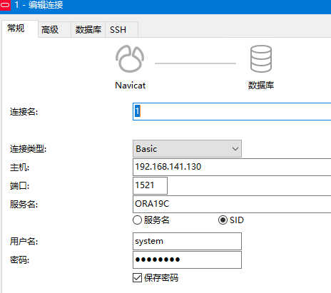
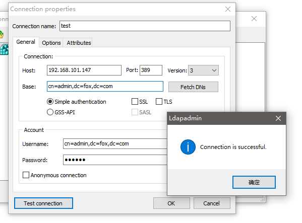

```
 ███████                                           ██       ██
░██░░░░██                                         ░██      ░░
░██   ░██  ██████  ███     ██  █████  ██████      ░██       ██ ███████  ██   ██ ██   ██
░███████  ██░░░░██░░██  █ ░██ ██░░░██░░██░░█ █████░██      ░██░░██░░░██░██  ░██░░██ ██
░██░░░░  ░██   ░██ ░██ ███░██░███████ ░██ ░ ░░░░░ ░██      ░██ ░██  ░██░██  ░██ ░░███
░██      ░██   ░██ ░████░████░██░░░░  ░██         ░██      ░██ ░██  ░██░██  ░██  ██░██
░██      ░░██████  ███░ ░░░██░░██████░███         ░████████░██ ███  ░██░░██████ ██ ░░██
░░        ░░░░░░  ░░░    ░░░  ░░░░░░ ░░░          ░░░░░░░░ ░░ ░░░   ░░  ░░░░░░ ░░   ░░
```

<p align="center">
    <a href="https://www.pixiv.net/en/artworks/77495663"></a>
</p>

<p align="center">
    <a href="https://github.com/ellerbrock/open-source-badges/"></a>
    <a href="https://github.com/ellerbrock/open-source-badges/"></a>
</p>

- `Linux 下各种常见服务的搭建/配置指南`
- `大部分环境在 Centos7,少部分 Ubuntu`
- `主要以安装搭建为主,更深一步的配置请自行研究`
- `如果你的服务器不在国外,请你一定要学习一下给服务器加速的方法🤣😂🤣`

---

# 大纲

* **[🥩 常见服务](#常见服务)**
  * [Lvm](#lvm)
  * [Net](#net)
  * [RAID](#raid)
  * [Vim](#vim)

* **[🍜 网络服务](#网络服务)**
  * [AdguardTeam](#adguardteam)
  * [Cacti](#cacti)
  * [Chrony](#chrony)
  * [cloud-torrent](#cloud-torrent)
  * [DHCP](#dhcp)
  * [DNS](#dns)
  * [frp](#frp)
  * [Kicktart](#kicktart)
  * [nps](#nps)
  * [OpenVPN](#openvpn)
  * [PowerDNS](#powerdns)
    * [PowerDNS-Admin](#powerdns-admin)
  * [proxychains-ng](#proxychains-ng)
  * [SSH](#ssh)
  * [ttyd](#ttyd)
  * [vnc4server](#vnc4server)

* **[🍦 web服务-中间件](#web服务-中间件)**
  * [ActiveMQ](#activemq)
  * [Apache](#apache)
  * [Caddy](#caddy)
  * [npm & Node](#npmnode)
  * [Nexus](#nexus)
  * [Nginx](#nginx)
  * [phpMyAdmin](#phpmyadmin)
  * [RabbitMQ](#rabbitmq)
  * [searx](#searx)
  * [Tomcat](#tomcat)
  * [Wordpress](#wordpress)
  * [Mijisou](#mijisou)

* **[🍉 数据库](#数据库)**
  * [Relational](#relational)
    * [Oracle](#oracle)
    * [Mariadb](#mariadb)
    * [MySQL](#mysql)
    * [Postgresql](#postgresql)
  * [Document](#document)
    * [MongoDB](#mongodb)
  * [Key-value](#key-value)
    * [Redis](#redis)
    * [Memcached](#Memcached)
  * [图形](#图形)
    * [Neo4j](#neo4j)

* **[🍣 文件服务](#文件服务)**
  * [filebrowser](#filebrowser)
  * [NFS](#nfs)
  * [Samba](#samba)
  * [Vsftp](#vsftp)

* **[🍗 编程语言](#编程语言)**
  * [C](#c)
  * [Go](#go)
  * [JDK](#jdk)
  * [Python3](#python3)
    * [pip](#pip)
    * [jupyterlab](#jupyterlab)
  * [Ruby](#ruby)

* **[🍞 系统监管](#系统监管)**
  * [BaoTa](#baota)
  * [Jenkins](#jenkins)
  * [JumpServer](#jumpserver)
  * [Loganalyzer](#loganalyzer)
  * [Supervisor](#supervisor)
  * [Webmin](#webmin)
  * [Zabbix](#zabbix)

* **[🌭 虚拟化](#虚拟化)**
  * [Docker](#docker)
    * [Docker-Compose](#docker-compose)
  * [QEMU](#qemu)

* **[🥕 分布式](#分布式)**
  * [ZooKeeper](#zookeeper)

* **[🍯 安全服务](#安全服务)**
  * [ClamAV](#clamav)
  * [Fail2Ban](#fail2ban)
  * [OpenLDAP](#openldap)
    * [PhpLdapAdmin](#phpldapadmin)
  * [Snort](#snort)
  * [Suricata](#suricata)

* **[🍥 各种依赖](#各种依赖)**
  * [LuaJIT](#luajit)

---

# 常见服务
## Lvm

> LVM 是 Logical Volume Manager 的缩写，中文一般翻译为 "逻辑卷管理"，它是 Linux 下对磁盘分区进行管理的一种机制。LVM 是建立在磁盘分区和文件系统之间的一个逻辑层，系统管理员可以利用 LVM 在不重新对磁盘分区的情况下动态的调整分区的大小。如果系统新增了一块硬盘，通过 LVM 就可以将新增的硬盘空间直接扩展到原来的磁盘分区上。

```bash
fdisk -l		        # 查看磁盘情况
fdisk /dev/sdb	    # 创建系统分区
	n
	p
	1
	后面都是默认,直接回车

	t	  # 转换分区格式
	8e

	w   # 写入分区表
```

**卷组**

创建一个名为 datastore 的卷组,卷组的 PE 尺寸为 16MB;
```bash
pvcreate /dev/sdb1	                  # 初始化物理卷
vgcreate -s 16M datastore /dev/sdb1   # 创建物理卷
```

**逻辑卷**

逻辑卷的名称为 database 所属卷组为 datastore,该逻辑卷由 50 个 PE 组成;
```bash
lvcreate -l 50 -n database datastore
```

逻辑卷的名称为 database 所属卷组为 datastore,该逻辑卷大小为 8GB;
```bash
lvcreate -L 8G -n database datastore
lvdisplay
```

**格式化**

将新建的逻辑卷格式化为 XFS 文件系统,要求在系统启动时能够自动挂在到 /mnt/database 目录.
```bash
mkfs.xfs /dev/datastore/database
mkdir /mnt/database
```
```vim
vim /etc/fstab
/dev/datastore/database /mnt/database/ xfs defaults 0 0
```

重启验证
```bash
shutdown -r now
mount | grep '^/dev'
```

**扩容**

将 database 逻辑卷扩容至 15GB 空间大小,以满足业务需求.
```bash
lvextend -L 15G /dev/datastore/database
lvs	    # 确认有足够空间
resize2fs /dev/datastore/database
lvdisplay
```

---

## Net

**centos 配置网卡**
```vim
vim /etc/sysconfig/network-scripts/ifcfg-eth0

DEVICE="enoXXXXXX"
BOOTPROTO=static  # 使用静态 IP,而不是由 DHCP 分配 IP
IPADDR=172.16.102.61
PREFIX=24
ONBOOT=yes
GATEWAY=172.16.102.254
HOSTNAME=dns1.abc.com
DNS1=223.5.5.5
```

**修改主机名**
```vim
vim /etc/hosts

127.0.0.1  test localhost # 修改 localhost.localdomain 为 test,shutdown -r now 重启使修改生效
```

**修改 DNS**
```vim
vim /etc/resolv.conf

nameserver 8.8.8.8
```
```bash
service network restart
```

---

## RAID

**安装**
```bash
yum remove mdadm # 建议先把原本的卸掉重装
yum install mdadm
```

**分区**
```bash
fdisk /dev/sdb
n 创建
p 主分区
接下来一路回车选默认值
w 写入

fdisk /dev/sdc
n 创建
p 主分区
接下来一路回车选默认值
w 写入
```

**创建阵列**
- RAID1

	```bash
  mdadm -Cv /dev/md0 -a yes -l1 -n2 /dev/sd[b,c]1
  - -Cv: 创建一个阵列并打印出详细信息.
	- /dev/md0: 阵列名称.
	- -a　: 同意创建设备,如不加此参数时必须先使用 mknod 命令来创建一个 RAID 设备,不过推荐使用 -a yes 参数一次性创建;
	- -l1 (l as in "level"): 指定阵列类型为 RAID-1 .
	- -n2: 指定我们将两个分区加入到阵列中去,分别为/dev/sdb1 和 /dev/sdc1
  ```

- RAID5

	```bash
  mdadm -Cv /dev/md0 -a yes -l5 -n3 /dev/sd[b,c,d]1
	cat /proc/mdstat    # 查看进度
	mdadm -D /dev/md0   # 获取阵列信息
  ```

**格式化为 xfs**

```bash
mkfs.xfs /dev/md0
```

**以 UUID 的形式开机自动挂载**
```bash
mkdir /data/ftp_data
blkid	/dev/md0    # 查 UUID 值
```
```vim
vim /etc/fstab
UUID=XXXXXXXXXXXXXXXXXXXXXXXXXX    /data/ftp_data  xfs defaults 0 0
```
```bash
shutdown -r now   # 重启验证
mount | grep '^/dev'
```

---

## Vim

<p align="center">
    
</p>

> VIM 是 Linux 系统上一款文本编辑器，它是操作文本的一款利器。

**常用操作**
```bash
Normal 模式下 i 进入 insert 模式
:wq                       # 存盘+退出
dd                        # 删除当前行,并存入剪切板
p                         # 粘贴
:q!                       # 强制退出
:wq!                      # 强制保存退出
:w !sudo tee %            # 无 root 权限,保存编辑的文件
:saveas <path/to/file>    # 另存为
按下 / 即可进入查找模式,输入要查找的字符串并按下回车. Vim 会跳转到第一个匹配.按下 n 查找下一个,按下 N 查找上一个.
:%s/foo/bar               # 代表替换 foo 为 bar
:%!xxd                    # 十六进制编辑模式, :%!xxd -r 切回去
insert 模式按 ESC 键,返回 Normal 模式
```

**常用配置**

`sudo vim /etc/vim/vimrc` 或 `sudo vim /etc/vimrc` 最后面直接添加你想添加的配置,下面是一些常用的 (不建议直接复制这个货网上的,要理解每个的含义及有什么用,根据自己需要来调整)
```bash
set number                # 显示行号
set nobackup              # 覆盖文件时不备份
set cursorline            # 突出显示当前行
set ruler                 # 在右下角显示光标位置的状态行
set shiftwidth=4          # 设定 > 命令移动时的宽度为 4
set softtabstop=4         # 使得按退格键时可以一次删掉 4 个空格
set tabstop=4             # 设定 tab 长度为 4(可以改)
set smartindent           # 开启新行时使用智能自动缩进
set ignorecase smartcase  # 搜索时忽略大小写,但在有一个或以上大写字母时仍 保持对大小写敏感

下面这个在代码多的时候会比较好
#set showmatch # 插入括号时,短暂地跳转到匹配的对应括号
#set matchtime=2 # 短暂跳转到匹配括号的时间
```

**使用 vim 对比文件**

```bash
vimdiff  FILE_LEFT  FILE_RIGHT
```

**解决 ssh 后 vim 中不能使用小键盘的问题**
- xshell

  更改的方法: 在终端设置中选择终端类型为 linux

- ubuntu
  ```bash
  sudo apt-get remove vim-common
  sudo apt-get install vim
  ```

**[SpaceVim](https://spacevim.org/cn/)** - 模块化的 Vim IDE

**[how-to-exit-vim](https://github.com/hakluke/how-to-exit-vim)** - 退出 vim 的多种方式

---

# 网络服务
## AdguardTeam

<p align="center">
    
</p>

> 一个 DNS 去广告、去跟踪的服务

**项目地址**
- https://github.com/AdguardTeam/AdGuardHome

**安装**
```bash
mkdir -p /opt/adguard && cd /opt/adguard
wget https://github.com/AdguardTeam/AdGuardHome/releases/download/v0.95-hotfix/AdGuardHome_v0.95-hotfix_linux_amd64.tar.gz
tar -xzvf AdGuardHome_v0.95-hotfix_linux_amd64.tar.gz
cd AdGuardHome
./AdGuardHome -s install

systemctl stop firewalld
```

**其他管理命令**
```bash
./AdGuardHome -s uninstall
./AdGuardHome -s start
./AdGuardHome -s stop
./AdGuardHome -s restart
./AdGuardHome -s status
```
无误的话访问服务器 IP:3000 就可以看到管理页面了

---

## butterfly

> 基于 websocket 和 tornado 的 web 终端

**项目地址**
- https://github.com/paradoxxxzero/butterfly

**安装**
```bash
pip install butterfly
```

**使用**
```bash
# 走 http,使用系统认证
butterfly.server.py --host=192.168.1.1 --port=57575 --login --unsecure
```

访问 IP:57575 , 在 web 页面中 Alt+s 可以切换主题样式

---

## Cacti

<p align="center">
    
</p>

> Cacti 是一套基于 PHP,MySQL,SNMP 及 RRDTool 开发的网络流量监测图形分析工具。它的主要功能是用 snmp 服务获取数据，然后用 rrdtool 储存和更新数据，当用户需要查看数据的时候用 rrdtool 生成图表呈现给用户。

**官网**
- https://www.cacti.net/

**什么是 RRDtools**

RRDtool 是指 Round Robin Database 工具（环状数据库）。Round robin 是一种处理定量数据、以及当前元素指针的技术。想象一个周边标有点的圆环－－这些点就是时间存储的位置。从圆心画一条到圆周的某个点的箭头－－这就是指针。就像我们在一个圆环上一样，没有起点和终点，你可以一直往下走下去。过来一段时间，所有可用的位置都会被用过，该循环过程会自动重用原来的位置。这样，数据集不会增大，并且不需要维护。RRDtool 处理 RRD 数据库。它用向 RRD 数据库存储数据、从 RRD 数据库中提取数据。

**搭建 lamp**

```bash
yum install yum-utils
wget https://repo.mysql.com//mysql80-community-release-el7-1.noarch.rpm
rpm -ivh mysql80-community-release-el7-1.noarch.rpm
yum-config-manager --disable mysql80-community
yum-config-manager --enable mysql57-community
yum install mysql-community-server mysql-community-devel httpd php php-mysql php-gd libjpeg* php-ldap php-odbc php-pear php-xml php-xmlrpc php-mbstring php-bcmath php-mhash libxml2-devel libevent-devel curl-devel net-snmp* php-snmp php-fpm

systemctl enable mysqld && systemctl enable httpd
```

初始化 mysql
```bash
/usr/bin/mysqld –initialize –basedir=/usr/share/mysql –datadir=/var/lib/mysql/data/
# 或
/usr/bin/mysql –initialize –basedir=/usr/share/mysql –datadir=/var/lib/mysql/data/
```
```bash
systemctl start mysqld

vim /etc/my.cnf

# 在末尾添加一行规则
skip-grant-tables
```
```bash
systemctl restart mysqld
mysql -uroot -p

use mysql;
update user set authentication_string=password('123456') where user='root';
exit
```

> 注意 : 此处只是为了方便演示,生产环境下请不要使用类似 123456 这类弱口令

修改 php.ini 配置文件
```
vim /etc/php.ini

date.timezone = "Asia/Shanghai"
```
```bash
systemctl start httpd
echo "<?php phpinfo(); ?>" > /var/www/html/phpinfo.php
service firewalld stop
```

然后在浏览器上访问 `ip/phpinfo.php` 能看到 phpinfo 信息就没问题

**安装配置 cacti**

编辑 `my.cnf` 配置文件
```bash
vim /etc/my.cn

[mysqld]
character-set-server=utf8mb4
collation-server=utf8mb4_unicode_ci
```
```bash
systemctl restart mysqld

mysql -uroot -p123456

create database cacti character set utf8 ;
ALTER DATABASE cacti CHARACTER SET utf8mb4 COLLATE utf8mb4_unicode_ci;
exit
```
```bash
vim /etc/my.cnf

# 删除末尾规则
skip-grant-tables


systemctl restart mysqld
mysql -uroot -p123456

set global validate_password_policy=LOW;
set global validate_password_length=6;
alter user 'root'@'localhost' identified by '123456';
grant all privileges on cacti.* to cacti@localhost identified by '1qaz@WSX';
GRANT SELECT ON mysql.time_zone_name TO cacti@localhost IDENTIFIED BY '1qaz@WSX';
flush privileges ;
mysql_tzinfo_to_sql /usr/share/zoneinfo
exit;

systemctl restart mysqld
```

导入 cacti 数据库脚本
```bash
cd /usr/local/src/
wget https://www.cacti.net/downloads/cacti-1.2.8.zip
unzip cacti-1.2.8.zip


mysql -uroot -p123456
use cacti ;
source /usr/local/src/cacti-1.2.8/cacti.sql ;
exit
```

```bash
cd /var/www/html
mkdir cacti
cp -r /usr/local/src/cacti-1.2.8/* /var/www/html/cacti
```
```bash
vim /var/www/html/cacti/include/config.php

# 把原来的配置信息修改成以下信息：
$database_type = 'mysql';
$database_default = 'cacti';
$database_hostname = 'localhost';
$database_username = 'cacti';
$database_password = '1qaz@WSX';
$database_port = '3306';
$database_ssl = false;
```

```bash
useradd -s /sbin/nologin cacti
mkdir /var/www/html/cacti/rra/log
chown -R cacti /var/www/html/cacti/rra/log/
```

配置定时任务
```bash
crontab -e

*/5 * * * * /usr/bin/php /var/www/html/cacti/poller.php > /dev/null 2>&1

crontab -l # 查看是否写正确
systemctl enable crond
systemctl start crond
```

**安装其他组件**
```bash
cd /tmp
wget https://oss.oetiker.ch/rrdtool/pub/rrdtool-1.7.0.tar.gz
wget https://www.cacti.net/downloads/spine/cacti-spine-1.2.1.tar.gz

yum install glib2-devel cairo-devel libxml2-devel pango pango-devel help2man
```

**安装 rrdtool 工具**
```bash
tar zxvf rrdtool-1.7.0.tar.gz
cd rrdtool-1.7.0
./configure --prefix=/usr/local/bin/rrdtool
make
make install
```

**安装 cacti-spine 工具**
```bash
cd ../
tar zxvf cacti-spine-1.2.1.tar.gz
cd cacti-spine-1.2.1
./configure --prefix=/usr/local/spine
make
make install
```
```bash
vim /usr/local/spine/etc/spine.conf

DB_Host localhost
DB_Database cacti
DB_User cacti
DB_Pass 1qaz@WSX
DB_Port 3306
```

```bash
setenforce 0

cd /var/www/html/cacti/log
ls
# 如果发现没有 cacti.log 文件时，可以执行一下命令：
touch cacti.log
chmod 777 cacti.log

chmod 777 /var/www/html/cacti/resource/snmp_queries/
chmod 777 /var/www/html/cacti/resource/script_server/
chmod 777 /var/www/html/cacti/resource/script_queries/
chmod 777 /var/www/html/cacti/scripts/
chmod 777 /var/www/html/cacti/log/
chmod 777 /var/www/html/cacti/cache/boost/
chmod 777 /var/www/html/cacti/cache/mibcache/
chmod 777 /var/www/html/cacti/cache/realtime/
chmod 777 /var/www/html/cacti/cache/spikekill/
```

**如果出现 csrf-secret.php not writable**
```bash
systemctl edit php-fpm.service

[Service]
ReadWritePaths = /usr/share/webapps/cacti/include/vendor/csrf

chmod 777 /var/www/html/cacti/include/vendor/csrf
systemctl restart php-fpm.service
```

在浏览器访问：`http://ip/cacti` 默认密码 admin/admin

---

## Chrony

> 一个时间同步软件,可用于搭建类 NTP 时间服务

**官网**
- https://chrony.tuxfamily.org/

**简介**

它由两个程序组成:chronyd 和 chronyc.

chronyd 是一个后台运行的守护进程,用于调整内核中运行的系统时钟和时钟服务器同步.它确定计算机增减时间的比率,并对此进行补偿.

chronyc 是用来监控 chronyd 性能和配置其参数程序

**安装**
```bash
yum install chrony
```

**配置文件**
```vim
vim /etc/chrony.conf

server time1.aliyun.com iburst
server time2.aliyun.com iburst
server time3.aliyun.com iburst
server time4.aliyun.com iburst
server time5.aliyun.com iburst
server time6.aliyun.com iburst
server time7.aliyun.com iburst
# 或
server time1.google.com iburst
server time2.google.com iburst
server time3.google.com iburst
server time4.google.com iburst
```

**启服务**
```bash
systemctl stop ntpd
systemctl disable ntpd

systemctl enable chronyd.service
systemctl start chronyd.service
```

**查看同步状态**
```bash
chronyc sourcestats # 检查 ntp 源服务器状态
chronyc sources -v  # 检查 ntp 详细同步状态

chronyc             # 进入交互模式
  activity
```

---

## cloud-torrent

> web torrent 下载服务

**项目地址**
- https://github.com/jpillora/cloud-torrent

**安装**
```
curl https://i.jpillora.com/cloud-torrent! | bash
```

**运行**
```
cloud-torrent -o
```

---

## DHCP

> DHCP 服务程序用于为客户端主机分配可用的 IP 地址

**安装**
```
yum install dhcp
```

**复制一份示例**
```
cp /usr/share/doc/dhcp-4*/dhcpd.conf.example /etc/dhcp/dhcpd.conf
```

**修改配置文件**
```vim
vim /etc/dhcp/dhcpd.conf

ddns-update-style interim;      # 设置 DNS 的动态更新方式为 interim
option domain-name-servers  8.8.8.8;           # 指定 DNS 服务器地址
default-lease-time  43200;                          # 指定默认租约的时间长度,单位为秒
max-lease-time  86400;  # 指定最大租约的时间长度

# 以下为某区域的 IP 地址范围

subnet 192.168.1.0 netmask 255.255.255.0 {         # 定义 DHCP 作用域
	range  192.168.1.20 192.168.1.100;                # 指定可分配的 IP 地址范围
	option routers  192.168.1.254;                       # 指定该网段的默认网关
}
```
```bash
dhcpd -t                          # 检测语法有无错误
service dhcpd start               # 开启 dhcp 服务

firewall-cmd --zone=public --add-service=dhcp --permanent
firewall-cmd --reload             # 记得防火墙放行

cat /var/lib/dhcpd/dhcpd.leases   # 查看租约文件,了解租用情况
```
---

## DNS

> DNS 用于将人类可读的域名(例如，www.google.com) 进行域名解析为机器可读的 IP 地址

**安装**
```
yum install bind-*
```

**主配置文件**
```vim
vim /etc/named.conf

options {
    listen-on port 53 { any; };
    listen-on-v6 port 53 { any; };
    allow-query     { any; };
}
```

**区域配置文件**
```vim
vim /etc/named.rfc1912.zones

zone "abc.com" IN {
        type master;
        file "abc.localhost";
};

zone "1.1.1.in-addr.arpa" IN {
        type master;
        file "abc.loopback";
};

zone "2.1.1.in-addr.arpa" IN {
        type master;
        file "www.loopback";
};
```

**创建区域数据文件**
```bash
cd /var/named/
cp named.localhost abc.localhost
cp named.loopback abc.loopback
cp named.loopback www.loopback

chown named abc.localhost
chown named abc.loopback
chown named www.loopback
```

**域名正向反向解析配置文件**
```vim
vim /var/named/abc.localhost

$TTL 1D
@      IN SOA  @ rname.invalid. (
                                      	0      ; serial
                                      	1D      ; refresh
                                      	1H      ; retry
                                      	1W      ; expire
                                      	3H )    ; minimum
      	NS     @
     		A      127.0.0.1
	    	AAAA   ::1
ftp    	A      1.1.1.1
www     A      1.1.2.1
```
```vim
vim /var/named/abc.loopback

$TTL 1D
@	IN SOA  @ rname.invalid. (
  	                                    0 ; serial
                                      	1D ; refresh
                                      	1H ; retry
                                      	1W ; expire
                                      	3H ) ; minimum
      	NS 		@
      	A 		127.0.0.1
      	AAAA	::1
      	PTR 	localhost.
1 PTR ftp.abc.com.
```
```vim
vim /var/named/www.loopback

$TTL 1D
@ 		IN SOA  @ rname.invalid. (
  	                                    0 ; serial
                                      	1D ; refresh
                                      	1H ; retry
                                      	1W ; expire
                                      	3H ) ; minimum
      	NS 		@
      	A 		127.0.0.1
      	AAAA	::1
      	PTR 	localhost.
1 PTR www.abc.com.
```

**启服务**
```bash
named-checkconf
named-checkzone abc.com abc.localhost
named-checkzone abc.com abc.loopback
named-checkzone abc.com www.loopback
service named restart

setenforce 0      # 关闭 selinux
firewall-cmd --zone=public --add-service=dns --permanent
firewall-cmd --reload
```

**更多配置案例**

见 [dns.md](./实验/dns.md)

---

## frp

> 快速反向代理，将本地服务器映射到公网。

**项目地址**
- https://github.com/fatedier/frp

**服务端安装**
```bash
wget https://github.com/fatedier/frp/releases/download/v0.32.0/frp_0.32.0_linux_amd64.tar.gz
tar -zxvf frp_0.32.0_linux_amd64.tar.gz
cd frp_0.32.0_linux_amd64
rm -rf frpc*
```

编辑 frps 配置文件
```bash
vim frps.ini

[common]
bind_port = 7000
dashboard_port = 7500
dashboard_user = admin
dashboard_pwd = admin
```

第1行为 frps 和 frpc 之间端口,第 2 行为监控页面 web 地址,第 3.4 行为监控页面账号密码

**服务端运行**

运行 frps,-c 参数用于指定配置文件,在同级目录下的话可以直接运行 frps
```bash
service firewalld stop  # 先关闭防火墙

./frps -c frps.ini
```

此时服务器已在运行,可以访问 服务器ip:7500 访问 web 监控界面

**客户端安装**
```bash
wget https://github.com/fatedier/frp/releases/download/v0.32.0/frp_0.32.0_linux_amd64.tar.gz
tar -zxvf frp_0.32.0_linux_amd64.tar.gz
cd frp_0.32.0_linux_amd64
rm -rf frps*
```

这里最后一句是 rm -rf frps* 与服务端操作的最后一句不相同。

编辑 frpc 配置文件
```bash
vim frpc.ini

[common]
server_addr = 1.1.1.1   # 填服务器IP
server_port = 7000      # 填服务器端口

# ssh的配置
[ssh]
type = tcp
local_ip = 127.0.0.1
local_port = 22
remote_port = 10000
use_compression = true

[DSM]
type = tcp
local_ip = 192.168.1.1 # 群晖 NAS 在局域网中的内网 IP
local_port = 5000
remote_port = 10002
```

这样就在本地上新增了“DSM”和“SSH”两个可供公网访问的服务了

**客户端运行**
```bash
./frpc -c frpc.ini
# -c 参数用于指定配置文件,在同级目录下的话 可以直接运行 .frpc
```

SSH 连接测试
```bash
ssh root@1.1.1.1 -p 10000
```
这个时候相当于在连接客户端的 SSH 服务

---

## Kicktart

> 是 Kicktart 不是 kickstarter,这玩意不能众筹,这是用于联网安装系统时给 PXE 服务提供应答文件的

- 调用服务:PXE + TFTP +FTP + DHCP + Kicktart
- 环境:VMWARE
- 1台无人值守系统——RHEL 7——192.168.10.10
- 1台客户端——未安装操作系统

注:vmware 中做实验需要在虚拟网络编辑器中将 dhcp 服务关闭

**配置 DHCP**

DHCP 服务程序用于为客户端主机分配可用的 IP 地址,而且这是服务器与客户端主机进行文件传输的基础

```bash
yum install -y dhcp
```

```vim
# 这里使用的配置文件有两个主要区别:允许了 BOOTP 引导程序协议,旨在让局域网内暂时没有操作系统的主机也能获取静态 IP 地址;在配置文件的最下面加载了引导驱动文件 pxelinux.0 (这个文件会在下面的步骤中创建) ,其目的是让客户端主机获取到 IP 地址后主动获取引导驱动文件,自行进入下一步的安装过程.
vim /etc/dhcp/dhcpd.conf

allow booting;
allow bootp;
ddns-update-style interim;
ignore client-updates;
subnet 192.168.0.0 netmask 255.255.255.0 {
        option subnet-mask 255.255.255.0;
        option domain-name-servers 192.168.10.10;
        range dynamic-bootp 192.168.10.100 192.168.10.200;
        default-lease-time 21600;
        max-lease-time 43200;
        next-server 192.168.10.10;
        filename "pxelinux.0";
}
```
```bash
systemctl restart dhcpd
systemctl enable dhcpd
```

**配置 TFTP 服务**

配置 TFTP 服务程序,为客户端主机提供引导及驱动文件.当客户端主机有了基本的驱动程序之后,再通过 vsftpd 服务程序将完整的光盘镜像文件传输过去.
```bash
yum install -y tftp-server xinetd
```
```vim
vim /etc/xinetd.d/tftp

service tftp
{
        socket_type = dgram
        protocol = udp
        wait = yes
        user = root
        server = /usr/sbin/in.tftpd
        server_args = -s /var/lib/tftpboot
        disable = no
        per_source = 11
        cps = 100 2
        flags = IPv4
}
```
```bash
systemctl restart xinetd
systemctl enable xinetd
firewall-cmd --permanent --add-port=69/udp    # 放行 tftp
firewall-cmd --reload
```

**配置 SYSLinux 服务**

SYSLinux 是一个用于提供引导加载的服务程序.与其说 SYSLinux 是一个服务程序,不如说更需要里面的引导文件,在安装好 SYSLinux 服务程序软件包后, `/usr/share/syslinux` 目录中会出现很多引导文件.
```bash
yum install -y syslinux

# 首先把 SYSLinux 提供的引导文件复制到 TFTP 服务程序的默认目录中,也就是 pxelinux.0,这样客户端主机就能够顺利地获取到引导文件.另外在 RHEL 7 系统光盘镜像中也有一些需要调取的引导文件.
cd /var/lib/tftpboot
cp /usr/share/syslinux/pxelinux.0 .
mkdir /media/cdrom
mount /dev/cdrom /media/cdrom
# 确认光盘镜像已经被挂载到 /media/cdrom 目录后,使用复制命令将光盘镜像中自带的一些引导文件也复制到 TFTP 服务程序的默认目录中.
cp /media/cdrom/images/pxeboot/{vmlinuz,initrd.img} .
cp /media/cdrom/isolinux/{vesamenu.c32,boot.msg} .

# 在 TFTP 服务程序的目录中新建 pxelinux.cfg 目录,虽然该目录的名字带有后缀,但依然也是目录,而非文件!将系统光盘中的开机选项菜单复制到该目录中,并命名为 default.这个 default 文件就是开机时的选项菜单.
mkdir pxelinux.cfg
cp /media/cdrom/isolinux/isolinux.cfg pxelinux.cfg/default
```
```vim
# 默认的开机菜单中有两个选项,要么是安装系统,要么是对安装介质进行检验.既然我们已经确定采用无人值守的方式安装系统,还需要为每台主机手动选择相应的选项,未免与我们的主旨 (无人值守安装) 相悖.现在我们编辑这个 default 文件,把第 1 行的 default 参数修改为 linux,这样系统在开机时就会默认执行那个名称为 linux 的选项了.对应的 linux 选项大约在 64 行,我们将默认的光盘镜像安装方式修改成 FTP 文件传输方式,并指定好光盘镜像的获取网址以及 Kickstart 应答文件的获取路径

# 修改第 1 行和第 64 行
vim pxelinux.cfg/default

1 default linux
64 append initrd=initrd.img inst.stage2=ftp://192.168.10.10 ks=ftp://192.168.10.10/pub/ks.cfg quiet
```

**配置 VSftpd 服务**
```bash
yum install -y vsftpd

systemctl restart vsftpd
systemctl enable vsftpd
ln -s '/usr/lib/systemd/system/vsftpd.service' '/etc/systemd/system/multi-user.target.wants/vsftpd.service'

cp -rvf /media/cdrom/* /var/ftp
firewall-cmd --permanent --add-service=ftp
firewall-cmd --reload
setsebool -P ftpd_connect_all_unreserved=on
```

**创建 KickStart 应答文件**
```bash
cp ~/anaconda-ks.cfg /var/ftp/pub/ks.cfg
chmod +r /var/ftp/pub/ks.cfg
```
```vim
# 修改第 7、27、35 行
vim /var/ftp/pub/ks.cfg

url --url=ftp://192.168.0.105
timezone Asia/Shanghai --isUtc
clearpart --all --initlabel
# 如果觉得系统默认自带的应答文件参数较少,不能满足生产环境的需求,则可以通过 Yum 软件仓库来安装 system-config-kickstart 软件包.这是一款图形化的 Kickstart 应答文件生成工具,可以根据自己的需求生成自定义的应答文件,然后将生成的文件放到 /var/ftp/pub 目录中并将名字修改为 ks.cfg 即可.
```

**Source & Reference**
- [第19章 使用 PXE+Kickstart 无人值守安装服务.](https://www.linuxprobe.com/chapter-19.html)

---

## nps

> 、一款轻量级、高性能、功能强大的内网穿透代理服务器。支持tcp、udp、socks5、http等几乎所有流量转发，可用来访问内网网站、本地支付接口调试、ssh访问、远程桌面，内网dns解析、内网socks5代理等等……，并带有功能强大的web管理端。

**项目地址**
- https://github.com/cnlh/nps

**服务端安装**
```bash
mkdir nps
cd nps
wget https://github.com/ehang-io/nps/releases/download/v0.26.7/linux_amd64_server.tar.gz
tar -zxvf linux_amd64_server.tar.gz
./nps install
nps start

# 关闭防火墙
systemctl stop firewalld
```

访问 <ip>:8080 ,默认用户名和密码 admin/123

**客户端安装**

在服务器端新增客户端,点击客户端列表前的+号，复制启动命令

执行启动命令，linux 直接执行即可，windows 将 ./npc 换成 npc.exe 用 cmd 执行

**使用示例**

- https://ehang-io.github.io/nps/#/example

---

## OpenVPN

<p align="center">
    
</p>

> OpenVPN 是一个用于创建虚拟专用网络加密通道的软件包

**官网**
- https://openvpn.net/

**docker 安装**
```bash
systemctl start docker
docker pull kylemanna/openvpn:2.4
mkdir -p /data/openvpn
docker run -v /data/openvpn:/etc/openvpn --rm kylemanna/openvpn:2.4 ovpn_genconfig -u udp://<你的IP>
```

**生成密钥文件**
```bash
docker run -v /data/openvpn:/etc/openvpn --rm -it kylemanna/openvpn:2.4 ovpn_initpki
输入私钥密码 (输入时是看不见的) :
Enter PEM pass phrase:12345678
再输入一遍
Verifying - Enter PEM pass phrase:12345678
输入一个 CA 名称 (我这里直接回车)
Common Name (eg: your user, host, or server name) [Easy-RSA CA]:
输入刚才设置的私钥密码 (输入完成后会再让输入一次)
Enter pass phrase for /etc/openvpn/pki/private/ca.key:12345678
```

> 注意 : 此处只是为了方便演示,生产环境下请不要使用类似 12345678 这类弱口令

**生成客户端证书 (这里的 user 改成你想要的名字)**
```bash
docker run -v /data/openvpn:/etc/openvpn --rm -it kylemanna/openvpn:2.4 easyrsa build-client-full user nopass

输入刚才设置的密码
Enter pass phrase for /etc/openvpn/pki/private/ca.key:12345678
```

**导出客户端配置**
```bash
mkdir -p /data/openvpn/conf
docker run -v /data/openvpn:/etc/openvpn --rm kylemanna/openvpn:2.4 ovpn_getclient user > /data/openvpn/conf/user.ovpn
```

**启动 OpenVPN 服务**
```bash
docker run --name openvpn -v /data/openvpn:/etc/openvpn -d -p 1194:1194/udp --cap-add=NET_ADMIN kylemanna/openvpn:2.4

service firewalld stop
```

**将登录的证书下载到本地**
```bash
yum install lrzsz -y
sz /data/openvpn/conf/whsir.ovpn
```

在 openvpn 的安装目录下,有个 config 目录,将服务器上的 user.ovpn,放在该目录下,运行 OpenVPN GUI,右键 whsir 连接 connect

**Source & Reference**
- [通过 docker 搭建 openvpn](https://blog.whsir.com/post-2809.html)

---

## PowerDNS

<p align="center">
    
</p>

> 一种 DNS 服务器, 优点, 支持 PHP 网页管理, 支持直接在数据库中添加 DNS 地址记录, 比较灵活, 方便

**项目地址**
- https://github.com/PowerDNS/pdns

**安装**

以 Ubuntu16.04 为例

先配置好 mysql
```bash
apt -y install mariadb-server mariadb-client
service mariadb start
mysql_secure_installation   # 初始化下 Mysql,此时配置密码,这里举例为 123456
```

为 PowerDNS 创建一个数据库,并创建一个数据库用户 powerdns,密码 123456
```sql
mysql -u root -p

CREATE DATABASE powerdns;
GRANT ALL ON powerdns.* TO 'powerdns'@'localhost' IDENTIFIED BY '123456';
GRANT ALL ON powerdns.* TO 'powerdns'@'localhost.localdomain' IDENTIFIED BY '123456';
FLUSH PRIVILEGES;
```

> 注意 : 此处只是为了方便演示,生产环境下请不要使用类似 123456 这类弱口令

创建 PowerDNS 所需的表
```sql
CREATE DATABASE IF NOT EXISTS powerdns;
USE powerdns;

CREATE TABLE domains (
  id                    INT AUTO_INCREMENT,
  name                  VARCHAR(255) NOT NULL,
  master                VARCHAR(128) DEFAULT NULL,
  last_check            INT DEFAULT NULL,
  type                  VARCHAR(6) NOT NULL,
  notified_serial       INT DEFAULT NULL,
  account               VARCHAR(40) CHARACTER SET 'utf8' DEFAULT NULL,
  PRIMARY KEY (id)
) Engine=InnoDB CHARACTER SET 'latin1';

CREATE UNIQUE INDEX name_index ON domains(name);


CREATE TABLE records (
  id                    BIGINT AUTO_INCREMENT,
  domain_id             INT DEFAULT NULL,
  name                  VARCHAR(255) DEFAULT NULL,
  type                  VARCHAR(10) DEFAULT NULL,
  content               VARCHAR(64000) DEFAULT NULL,
  ttl                   INT DEFAULT NULL,
  prio                  INT DEFAULT NULL,
  change_date           INT DEFAULT NULL,
  disabled              TINYINT(1) DEFAULT 0,
  ordername             VARCHAR(255) BINARY DEFAULT NULL,
  auth                  TINYINT(1) DEFAULT 1,
  PRIMARY KEY (id)
) Engine=InnoDB CHARACTER SET 'latin1';

CREATE INDEX nametype_index ON records(name,type);
CREATE INDEX domain_id ON records(domain_id);
CREATE INDEX ordername ON records (ordername);


CREATE TABLE supermasters (
  ip                    VARCHAR(64) NOT NULL,
  nameserver            VARCHAR(255) NOT NULL,
  account               VARCHAR(40) CHARACTER SET 'utf8' NOT NULL,
  PRIMARY KEY (ip, nameserver)
) Engine=InnoDB CHARACTER SET 'latin1';


CREATE TABLE comments (
  id                    INT AUTO_INCREMENT,
  domain_id             INT NOT NULL,
  name                  VARCHAR(255) NOT NULL,
  type                  VARCHAR(10) NOT NULL,
  modified_at           INT NOT NULL,
  account               VARCHAR(40) CHARACTER SET 'utf8' DEFAULT NULL,
  comment               TEXT CHARACTER SET 'utf8' NOT NULL,
  PRIMARY KEY (id)
) Engine=InnoDB CHARACTER SET 'latin1';

CREATE INDEX comments_name_type_idx ON comments (name, type);
CREATE INDEX comments_order_idx ON comments (domain_id, modified_at);


CREATE TABLE domainmetadata (
  id                    INT AUTO_INCREMENT,
  domain_id             INT NOT NULL,
  kind                  VARCHAR(32),
  content               TEXT,
  PRIMARY KEY (id)
) Engine=InnoDB CHARACTER SET 'latin1';

CREATE INDEX domainmetadata_idx ON domainmetadata (domain_id, kind);


CREATE TABLE cryptokeys (
  id                    INT AUTO_INCREMENT,
  domain_id             INT NOT NULL,
  flags                 INT NOT NULL,
  active                BOOL,
  content               TEXT,
  PRIMARY KEY(id)
) Engine=InnoDB CHARACTER SET 'latin1';

CREATE INDEX domainidindex ON cryptokeys(domain_id);


CREATE TABLE tsigkeys (
  id                    INT AUTO_INCREMENT,
  name                  VARCHAR(255),
  algorithm             VARCHAR(50),
  secret                VARCHAR(255),
  PRIMARY KEY (id)
) Engine=InnoDB CHARACTER SET 'latin1';

CREATE UNIQUE INDEX namealgoindex ON tsigkeys(name, algorithm);
exit;
```

安装 PowerDNS
```bash
apt install -y pdns-recursor pdns-server pdns-backend-mysql
```

Ubuntu 18.04 附带 systemd-resolve，你需要禁用它，并删除 resolv.conf 文件，因为它绑定到端口 53 ，这将与 PowerDNS 端口冲突。
```bash
systemctl disable systemd-resolved
systemctl stop systemd-resolved
rm /etc/resolv.conf
```

```vim
vim /etc/powerdns/pdns.d/pdns.local.gmysql.conf

launch=gmysql

gmysql-host=localhost
gmysql-dbname=powerdns      # 改成之前创建的数据库
gmysql-user=powerdns        # 改成之前创建的用户
gmysql-password=123456      # 改成之前创建的密码
```

```
sed -i "s|# local-port=.*|local-port=5300|" /etc/powerdns/pdns.conf
sed -i "s|# config-dir=.*|config-dir=/etc/powerdns|" /etc/powerdns/pdns.conf
sed -i "s|# daemon=.*|daemon=yes|" /etc/powerdns/pdns.conf
sed -i "s|# guardian=.*|guardian=yes|" /etc/powerdns/pdns.conf
sed -i "s|# master=.*|master=yes|" /etc/powerdns/pdns.conf
sed -i "s|# max-tcp-connections=.*|max-tcp-connections=20|" /etc/powerdns/pdns.conf

service pdns restart
```

此时记得将 /etc/resolv.conf 中的 nameserver 改为 127.0.0.1
```bash
cat /etc/resolv.conf
# Generated by NetworkManager
search localdomain
nameserver 127.0.0.1
```

测试
```
dig @127.0.0.1
dig www.baidu.com
pdnsutil create-zone test-zone-1
pdnsutil list-zone test-zone-1
```

### PowerDNS-Admin

> PowerDNS-Admin 是一个具有以下高级功能的 PowerDNS Web 界面

**项目地址**
- https://github.com/ngoduykhanh/PowerDNS-Admin

**安装**

设置数据库
```sql
mysql -u root -p
CREATE DATABASE powerdnsadmin;
GRANT ALL PRIVILEGES ON powerdnsadmin.* TO 'pdnsadminuser'@'%' IDENTIFIED BY '123456';
FLUSH PRIVILEGES;
quit
```
> 注意 : 此处只是为了方便演示,生产环境下请不要使用类似 123456 这类弱口令

```bash
# Install Python 3 devevelopment package
apt install -y python3-dev
# Install required packages for building python libraries from requirements.txt file
apt install -y libmysqlclient-dev libsasl2-dev libldap2-dev libssl-dev libxml2-dev libxslt1-dev libxmlsec1-dev libffi-dev pkg-config apt-transport-https virtualenv build-essential

# Install NodeJs
curl -sL https://deb.nodesource.com/setup_10.x | bash -
apt install -y nodejs

# Install yarn to build asset files
curl -sS https://dl.yarnpkg.com/debian/pubkey.gpg | apt-key add -
echo "deb https://dl.yarnpkg.com/debian/ stable main" > /etc/apt/sources.list.d/yarn.list
apt update -y
apt install -y yarn

# Checkout source code and create virtualenv
git clone https://github.com/ngoduykhanh/PowerDNS-Admin.git /opt/web/powerdns-admin
cd /opt/web/powerdns-admin
virtualenv -p python3 flask

# Activate your python3 environment and install libraries
source ./flask/bin/activate
pip install -r requirements.txt
```

Running PowerDNS-Admin

```vim
vim configs/development.py

SQLA_DB_USER = 'powerdns'   # 改成之前创建的数据库
SQLA_DB_PASSWORD = '123456' # 改成之前创建的用户
SQLA_DB_HOST = '127.0.0.1'  # 改成之前创建的密码
SQLA_DB_NAME = 'powerdns'
```

```bash
export FLASK_CONF=../configs/development.py
export FLASK_APP=powerdnsadmin/__init__.py
flask db upgrade

# generate asset files
yarn install --pure-lockfile
flask assets build

# run PowerDNS-Admin by command
./run.py
```

现在访问 <ip>:9191

> 注: 这对于测试环境很有效，但是对于生产环境，应该使用 gunicorn 或 uwsgi

---

## proxychains-ng

> 通过 DLL 注入,使目标程序走代理

**项目地址**
- https://github.com/rofl0r/proxychains-ng

**安装**
```bash
git clone https://github.com/rofl0r/proxychains-ng.git
cd proxychains-ng
./configure
make && make install
cp ./src/proxychains.conf /etc/proxychains.conf
cd .. && rm -rf proxychains-ng
```

**编辑配置**
```bash
vim /etc/proxychains.conf

socks5 127.0.0.1 1080   # 改成你懂的
```

**使用**

在需要代理的命令前加上 proxychains4 ,如 : `proxychains4 wget https://www.google.com/`

---

## SSH

> Secure Shell 是一種加密的網路傳輸協定，可在不安全的網路中為網路服務提供安全的傳輸環境。

**官网**
- https://www.ssh.com

一般主机安装完毕后 SSH 是默认开启的,使用 `/etc/init.d/ssh status` 查看主机 SSH 状态

> 注: ssh_config 为客户端连接到服务端的配置文件；sshd_config 为服务端的配置。

**Kali/Manjaro**

安装完毕后会自动启动,但是没有配置配置文件会无法登陆,修改下配置文件
```vim
echo "PermitRootLogin yes" >> /etc/ssh/sshd_config
echo "PasswordAuthentication yes" >> /etc/ssh/sshd_config
```
```bash
systemctl start ssh     # 启动ssh
systemctl enable ssh    # 设置为开机自启

# 或

/etc/init.d/ssh start   # 启动ssh
update-rc.d ssh enable  # 设置为开机自启
```
若在使用工具登录时,当输完用户名密码后提示 SSH 服务器拒绝了密码,就再试一遍.

这时不要着急,只需要在 Kali 控制端口重新生成两个秘钥即可.
```bash
ssh-keygen -t dsa -f /etc/ssh/ssh_host_dsa_key
ssh-keygen -t dsa -f /etc/ssh/ssh_host_rsa_key
```

**Ubuntu**

如果没有就装一下,如果你只是想登陆别的机器的 SSH 只需要安装 openssh-client (ubuntu 有默认安装,如果没有则 `sudo apt install openssh-client`) ,如果要使本机开放 SSH 服务就需要安装 openssh-server
```bash
apt install openssh-client=1:7.2p2-4ubuntu2.8
apt install openssh-server=1:7.2p2-4ubuntu2.8
apt install ssh
```
```bash
service ssh restart     # 启动ssh
systemctl enable ssh    # 设置为开机自启
```

配置允许 root 远程登录
```vim
echo "PermitRootLogin yes" >> /etc/ssh/sshd_config
echo "PasswordAuthentication yes" >> /etc/ssh/sshd_config
```

**Debian**
```
apt install openssh-client=1:7.9p1-10+deb10u1
apt install openssh-server=1:7.9p1-10+deb10u1
apt install ssh
```
```bash
service ssh restart
systemctl enable ssh
```

配置允许 root 远程登录
```vim
echo "PermitRootLogin yes" >> /etc/ssh/sshd_config
echo "PasswordAuthentication yes" >> /etc/ssh/sshd_config
```

**加固**

本部分内容移步[Secure-Linux](./Secure-Linux#SSH) SSH 部分

**排错**

0. 先排查是不是客户端(自己)的问题,再排查是不是服务端(对面)的问题,最后在排查是不是传输中(中间)的问题.
1. ping 试试,如果网络层可通,那么大概率是应用层的问题,检查 SSH 配置,是否有白名单限制,或者你他娘的意大利防火墙或 selinux 就没放行
2. 假设这么一种情况,应用层配置正常,主机一切正常,但路由器/交换机在 ACL 上禁用了 SSH 的流量,这样就是传输层的问题了.内网 IPS/IDS 阻断同理.
4. 麻烦你看下账号密码是不是写错了谢谢.或者是不是限制只使用密钥登陆的.
5. 注意下是不是配置文件或服务看错了是 sshd 不是 ssh

**motd**
- [Mithrilwoodrat/FBI-WARNING-in-console](https://github.com/Mithrilwoodrat/FBI-WARNING-in-console)
- [abcfy2/motd](https://github.com/abcfy2/motd)
- `vim /etc/motd`

```
                   _ooOoo_
                  o8888888o
                  88" . "88
                  (| -_- |)
                  O\  =  /O
               ____/`---'\____
             .'  \\|     |//  `.
            /  \\|||  :  |||//  \
           /  _||||| -:- |||||-  \
           |   | \\\  -  /// |   |
           | \_|  ''\---/''  |   |
           \  .-\__  `-`  ___/-. /
         ___`. .'  /--.--\  `. . __
      ."" '<  `.___\_<|>_/___.'  >'"".
     | | :  `- \`.;`\ _ /`;.`/ - ` : | |
     \  \ `-.   \_ __\ /__ _/   .-` /  /
======`-.____`-.___\_____/___.-`____.-'======
                   `=---='

^^^^^^^^^^^^^^^^^^^^^^^^^^^^^^^^^^^^^^^^^^^^^
           佛祖保佑       永不死机
           心外无法       法外无心
```
```
  _      `-._     `-.     `.   \      :      /   .'     .-'     _.-'      _
   `--._     `-._    `-.    `.  `.    :    .'  .'    .-'    _.-'     _.--'
        `--._    `-._   `-.   `.  \   :   /  .'   .-'   _.-'    _.--'
  `--.__     `--._   `-._  `-.  `. `. : .' .'  .-'  _.-'   _.--'     __.--'
  __    `--.__    `--._  `-._ `-. `. \:/ .' .-' _.-'  _.--'    __.--'    __
    `--..__   `--.__   `--._ `-._`-.`_=_'.-'_.-' _.--'   __.--'   __..--'
  --..__   `--..__  `--.__  `--._`-q(-_-)p-'_.--'  __.--'  __..--'   __..--
        ``--..__  `--..__ `--.__ `-'_) (_`-' __.--' __..--'  __..--''
  ...___        ``--..__ `--..__`--/__/  \--'__..--' __..--''        ___...
        ```---...___    ``--..__`_(<_   _/)_'__..--''    ___...---'''
  ```-----....._____```---...___(__\_\_|_)/__)___...---'''_____.....-----'''
```
```
         .-.                     .-.
      .--' /                     \ '--.
      '--. \       _______       / .--'
          \ \   .-"       "-.   / /
           \ \ /             \ / /
            \ /               \ /
             \|   .--. .--.   |/
              | )/   | |   \( |
              |/ \__/   \__/ \|
              /      /^\      \
              \__    '='    __/
                |\         /|
                |\'"VUUUV"'/|
                \ `"""""""` /
                 `-._____.-'
                   / / \ \
                  / /   \ \
                 / /     \ \
              ,-' (       ) `-.
              `-'._)     (__._.)
```

---

## ttyd

> 用于在 web 上访问终端

**项目地址**
- https://github.com/tsl0922/ttyd

**安装**
```bash
sudo apt-get install cmake g++ pkg-config git vim-common libwebsockets-dev libjson-c-dev libssl-dev
git clone https://github.com/tsl0922/ttyd.git
cd ttyd && mkdir build && cd build
cmake ..
make && make install
```

**运行**
```bash
ttyd -p 8080 bash -x
```

现在访问 http://localhost:8080 即可

---

## vnc4server

> 为主机提供 VNC 服务

**安装**
```bash
apt-get install vnc4server

vncpasswd                                 # 设置vncserver密码
vncserver :1 -geometry 1024x768 -depth 24 # 设置vnc连接时窗口的大小
netstat -tnl | grep 5901                  # 查看vnc激活状态
```

windows 使用 tightVNC 测试连接,连接地址:<IP>:5901

---

# web服务-中间件
## ActiveMQ

<p align="center">
    
</p>

> Apache ActiveMQ 是 Apache 软件基金会所研发的开放源代码消息中间件;由于 ActiveMQ 是一个纯 Java 程序,因此只需要操作系统支持 Java 虚拟机,ActiveMQ 便可执行.

**官网**
- http://activemq.apache.org/

**安装**

安装依赖 JDK
```bash
cd /
tar xzf jdk-8u212-linux-x64.tar.gz
```
```vim
vim /etc/profile

export JAVA_HOME=/root/jdk1.8.0_212
export PATH=$PATH:$JAVA_HOME/bin
```
```bash
source /etc/profile
java -version
```

下载 activemq 压缩包,这里以 5.14.5 为例
```
wget http://archive.apache.org/dist/activemq/5.14.5/apache-activemq-5.14.5-bin.tar.gz
tar -zxvf apache-activemq-5.14.5-bin.tar.gz
mv apache-activemq-5.14.5 activemq
cd activemq/bin/
./activemq start
ps -ef| grep activemq
```
```
firewall-cmd --zone=public --add-port=8161/tcp --permanent
firewall-cmd --reload
```

访问 127.0.0.1:8161   用户名:admin 密码:admin

修改用户信息编辑 conf/jetty-realm.properties 即可

---

## Apache

<p align="center">
    
</p>

> Apache HTTP Server 是 Apache 軟體基金會的一個開放原始碼的網頁伺服器軟體，可以在大多數電腦作業系統中運行。由於其跨平台和安全性，被廣泛使用，是最流行的 Web 伺服器軟體之一。

**官网**
- https://www.apache.org/

**安装**
```bash
yum install httpd
yum install mod_ssl openssl
```

**简单配置**
```vim
vim /etc/httpd/conf/httpd.conf

DocumentRoot "/var/www/html"
ServerName  xx.xx.xx.xx:80
# 设置 Web 服务器的主机名和监听端口
```

启服务
```vim
vim var/www/html/index.html

Hello World!
```
```bash
service httpd restart
firewall-cmd --zone=public --add-service=http --permanent
firewall-cmd --reload
```

此时可以访问 ip/index.html

**虚拟主机**

配置虚拟主机文件
```vim
vim /etc/httpd/conf.d/virthost.conf

<VirtualHost 192.168.1xx.22:80>
	ServerName  www.abc.com
  # 设置 Web 服务器的主机名和监听端口
	DocumentRoot "/data/web_data"
	<Directory "/data/web_data">
		Require all granted
	</Directory>
</VirtualHost>

Listen 192.168.1XX.33:443
<VirtualHost 192.168.1xx.22:443>
	ServerName  www.abc.com
  # 设置 Web 服务器的主机名和监听端口
	DocumentRoot "/data/web_data"

	SSLEngine on
	SSLCertificateFile /etc/httpd/ssl/httpd.crt
	SSLCertificateKeyFile /etc/httpd/ssl/httpd.key

	<Directory "/data/web_data">
		Require all granted
	</Directory>
</VirtualHost>
```
```bash
mkdir -p /data/web_data
echo 'Hello World!' >/data/web_data/index.html

service httpd restart
firewall-cmd --zone=public --add-service=http --permanent
firewall-cmd --reload
```

**ab**

> ab 是 apache 的压力测试工具

安装
```bash
sudo apt install apache2-utils
yum install httpd-tools
```

**更多配置案例**

见 [apache.md](./实验/apache.md)

---

## Caddy

<p align="center">
    
</p>

> Caddy 伺服器是一個開源的，使用 Golang 編寫，支持 HTTP/2 的 Web 服務端。

**官网**
- https://caddyserver.com/

**安装 Caddy**
```bash
wget -N --no-check-certificate https://raw.githubusercontent.com/ToyoDAdoubiBackup/doubi/master/caddy_install.sh && chmod +x caddy_install.sh && bash caddy_install.sh
```

**配置文件**
```bash
chown -R root:www-data /usr/local/bin   # 设置目录数据权限
touch /usr/local/caddy/Caddyfile

echo -e ":80 {
	gzip
	root /usr/local/caddy/www/
}" > /usr/local/caddy/Caddyfile

mkdir /usr/local/caddy/www
echo "<h1>first</h1>" >> /usr/local/caddy/www/index.html

/etc/init.d/caddy start
# 如果启动失败可以看 Caddy 日志: tail -f /tmp/caddy.log
```

**反向代理**

做一个 ip 跳转
```bash
echo ":80 {
	gzip
	proxy / http://www.baidu.com
}" > /usr/local/caddy/Caddyfile

/etc/init.d/caddy start
```

**HTTPS**

为已经绑定域名的服务器自动从 Let’s Encrypt 生成和下载 HTTPS 证书,支持 HTTPS 协议访问,你只需要将绑定的 IP 换成 域名 即可
```bash
echo -e "xxx.com {
	gzip
    root /usr/local/bin/www
	tls xxxx@xxx.com  #你的邮箱
}" > /usr/local/caddy/Caddyfile

/etc/init.d/caddy start
```

---

## npm&Node

<p align="center">
    
</p>

> npm 是 Node.js 預設的、以 JavaScript 編寫的軟體套件管理系統。

> Node.js 是能夠在伺服器端運行 JavaScript 的開放原始碼、跨平台 JavaScript 執行環境。

**官网**
- https://www.npmjs.com/
- https://nodejs.org

**包管理器方式**
- apt
  ```bash
  curl -sL https://deb.nodesource.com/setup_10.x | sudo bash -  # 添加 Node.js PPA
  apt-get install nodejs npm
  ```

- yum
  ```bash
  yum install epel-release
  yum install nodejs npm
  ```

**源文件方式安装**

首先下载 NodeJS 的二进制文件,http://nodejs.org/download/ .在 Linux Binaries (.tar.gz) 行处根据自己系统的位数选择
```bash
# 解压到当前文件夹下运行
tar xvJf node-v12.17.0-linux-x64.tar

进入解压后的目录 bin 目录下,执行 ls 会看到两个文件 node,npm. 然后执行 ./node -v ,如果显示出 版本号说明我们下载的程序包是没有问题的.依次运行如下三条命令
cd node-v12.17.0-linux-x64/bin
ls
./node -v
```
因为 /home/node-v12.17.0-linux-x64/bin 这个目录是不在环境变量中的,所以只能到该目录下才能 node 的程序.如果在其他的目录下执行 node 命令的话 ,必须通过绝对路径访问才可以的

如果要在任意目录可以访问的话,需要将 node 所在的目录,添加 PATH 环境变量里面,或者通过软连接的形式将 node 和 npm 链接到系统默认的 PATH 目录下的一个
在终端执行 echo $PATH 可以获取 PATH 变量包含的内容,系统默认的 PATH 环境变量包括 /usr/local/bin:/usr/bin:/bin:/usr/local/sbin:/usr/sbin:/sbin: ,冒号为分隔符.所以我们可以将 node 和 npm 链接到 /usr/local/bin 目录下如下执行
```bash
ln -s /home/node-v12.17.0-linux-x64/bin/node /usr/local/bin/node
ln -s /home/node-v12.17.0-linux-x64/bin/npm /usr/local/bin/npm
```

**加速**
- [node&js](../../Plan/Misc-Plan.md#node&js)

**强制安装**
```bash
npm install --unsafe-perm=true --allow-root
```

**forever**

> forever 是一个简单的命令式 nodejs 的守护进程，能够启动，停止，重启 App 应用。forever 完全基于命令行操作，在forever进程之下，创建 node 的子进程，通过 monitor 监控 node 子进程的运行情况，一旦文件更新或进程挂掉，forever 会自动重启 node 服务器，确保应用正常运行。

```bash
npm install forever -g    # 全局安装
forever start app.js      # 启动
forever stop app.js       # 关闭
forever start -l forever.log -o out.log -e err.log app.js # 输出日志和错误
forever -w app.js         # 自动监控文件变化，文件修改保存之后自动重启app.js
forever -h                # 查看帮助
```

---

## Nexus

<p align="center">
    
</p>

> Nexus 是一种 Maven 仓库管理软件用于搭建私服,私服是架设在局域网的一种特殊的远程仓库，目的是代理远程仓库及部署第三方构件。有了私服之后，当 Maven 需要下载构件时，直接请求私服，私服上存在则下载到本地仓库；否则，私服请求外部的远程仓库，将构件下载到私服，再提供给本地仓库下载。

**官网**
- https://www.sonatype.com/nexus-repository-oss

**安装**
- **JDK**
    ```bash
    tar xzf jdk-8u212-linux-x64.tar.gz
    ```
    ```vim
    vim /etc/profile

    export JAVA_HOME=/root/jdk1.8.0_212
    export PATH=$PATH:$JAVA_HOME/bin
    ```
    ```bash
    source /etc/profile
    java -version
    ```

- **Maven**
    ```bash
    tar xzf apache-maven-3.6.2-bin.tar.gz
    ```
    ```vim
    vim /etc/profile

    export MAVEN_HOME=/root/apache-maven-3.6.2
    export PATH=$PATH:$MAVEN_HOME/bin
    ```
    ```bash
    source /etc/profile
    mvn -version
    ```

- **Nexus**
    - 在官网下载 UNIX 安装包,上传至服务器,这里以 https://help.sonatype.com/repomanager2/download#Download-NexusRepositoryManager2OSS 2.14.14-01 为例

    ```bash
    tar -xf nexus-2.14.14-01-bundle.tar.gz -C /usr/local
    cd /usr/local/nexus-2.14.14-01/bin/
    export RUN_AS_USER=root

    ./nexus start
    firewall-cmd --add-port=8081/tcp --permanent
    firewall-cmd --reload
    ```
    ```bash
    curl http://127.0.0.1:8081/nexus/
    ```
    默认登录账号/密码为: admin/admin123

---

## Nginx

<p align="center">
    
</p>

> Nginx 是非同步框架的網頁伺服器，也可以用作反向代理、負載平衡器和 HTTP 缓存。

**官网**
- https://nginx.org/

**安装**
- **yum 安装**
  ```bash
  yum install nginx
  systemctl start nginx.service
  ```

- **Debian & Ubuntu 安装**
  ```bash
  apt update
  apt-get -y install nginx
  ```

- **源代码编译安装**

  自己下载好包 https://nginx.org/en/download.html,传到服务器上,这里以1.14.2 举例

  ```bash
  tar -zxvf nginx-1.14.2.tar.gz
  cd nginx-1.14.2/
  ./configure
  make
  make install
  cd /usr/local/nginx/sbin
  ./nginx
  ```

  注:源代码安装你的默认目录在 /usr/local/nginx 下,配置文件在 conf/ 中,不要搞错了

**虚拟主机**

在 /etc/nginx/conf.d/ 目录下新建一个站点的配置文件,列如:test.com.conf
```vim
vim /etc/nginx/conf.d/test.com.conf

server {
        listen 80;
        server_name www.test.com test.com;
        root /usr/share/nginx/test.com;
        index index.html;

        location / {
        }
}
```
`nginx -t ` 检测文件是否有误

```bash
mkdir /usr/share/nginx/test.com
echo "hello world!" > /usr/share/nginx/test.com/index.html
firewall-cmd --permanent --zone=public --add-service=http
firewall-cmd --reload
systemctl start nginx.service
```

如果服务器网址没有注册,那么可以在本机电脑的 /etc/hosts 添加设置: `192.168.1.112   www.test.com test.com`

本地 curl 访问测试 `curl www.test.com`

**查看报错**
```
less /var/log/nginx/error.log
```

**更多配置案例**

见 [Nginx.md](./实验/Nginx.md)

---

## phpMyAdmin

<p align="center">
    
</p>

**官网**
- https://www.phpmyadmin.net/

`建议搭配上面的 nginx+php 扩展笔记`

**创建数据库和一个用户**
```bash
yum install mariadb mariadb-server
systemctl start mariadb
systemctl enable mariadb
mysql_secure_installation

mysql -u root -p

# 创建一个专给 WordPress 存数据的数据库
MariaDB [(none)]> create database idiota_info;  # 最后的"idiota_info"为数据库名

# 创建用于 WordPress 对应用户
MariaDB [(none)]> create user idiota@localhost identified by 'password';  # "idiota"对应创建的用户,"password"内填写用户的密码

# 分别配置本地登录和远程登录权限
MariaDB [(none)]> grant all privileges on idiota_info.* to idiota@'localhost' identified by 'password';
MariaDB [(none)]> grant all privileges on idiota_info.* to idiota@'%' identified by 'password';

# 刷新权限
MariaDB [(none)]> flush privileges;
```

**下载**
```bash
wget https://files.phpmyadmin.net/phpMyAdmin/4.8.5/phpMyAdmin-4.8.5-all-languages.zip
unzip phpMyAdmin-4.8.5-all-languages.zip
mv phpMyAdmin-4.8.5-all-languages phpMyAdmin
cp phpMyAdmin /usr/share/nginx/test.com/
cd /usr/share/nginx/test.com/phpMyAdmin

cp config.sample.inc.php config.inc.php

systemctl restart nginx
```

访问 `https://www.test.com/phpMyAdmin/index.php`

---

## RabbitMQ

<p align="center">
    
</p>

> RabbitMQ 是流行的开源消息队列系统,是 AMQP(Advanced Message Queuing Protocol 高级消息队列协议)的标准实现,用 erlang 语言开发.RabbitMQ 据说具有良好的性能和时效性,同时还能够非常好的支持集群和负载部署,非常适合在较大规模的分布式系统中使用.

**官网**
- https://www.rabbitmq.com/

**安装**

必须要有 Erlang 环境支持,下载 erlang 软件包,这里以 erlang-19.0.4 为例
```bash
wget http://www.rabbitmq.com/releases/erlang/erlang-19.0.4-1.el7.centos.x86_64.rpm
rpm -ivh erlang-19.0.4-1.el7.centos.x86_64.rpm
```
安装完后输入 erl 测试

安装 rabbitmq,这里以 v3.6.10 为例
```bash
yum install -y socat
wget  http://www.rabbitmq.com/releases/rabbitmq-server/v3.6.10/rabbitmq-server-3.6.10-1.el7.noarch.rpm
rpm -ivh rabbitmq-server-3.6.10-1.el7.noarch.rpm
```

`注意:如果是重装请记得删除 /var/lib/rabbitmq 目录和 /etc/rabbitmq 目录,否则可能服务会起不来`

```bash
systemctl start rabbitmq-server
或
rabbitmq-server -detached   # 启动rabbitmq,-detached 代表后台守护进程方式启动

rabbitmqctl status
```

**配置网页插件**
```bash
# 首先创建目录,否则可能报错:
mkdir /etc/rabbitmq

# 然后启用插件:
rabbitmq-plugins enable rabbitmq_management

# 配置防火墙
firewall-cmd --permanent --add-port=15672/tcp
firewall-cmd --permanent --add-port=5672/tcp
firewall-cmd --reload
```

访问: 127.0.0.1:15672,这个时候是没有账号密码的!

**配置 web 端访问账号密码和权限**

默认网页是不允许访问的,需要增加一个用户修改一下权限,代码如下:
```bash
## 添加用户,后面两个参数分别是用户名和密码
rabbitmqctl add_user <账号> <密码>
rabbitmqctl set_permissions -p / <账号> ".*" ".*" ".*"  # 添加权限
rabbitmqctl set_user_tags <账号> administrator          # 修改用户角色
```

**开启用户远程访问**

默认情况下,RabbitMQ 的默认的 guest 用户只允许本机访问, 如果想让 guest 用户能够远程访问的话,只需要将配置文件中的 loopback_users 列表置为空即可,
如下:
```
{loopback_users, []}
```

另外关于新添加的用户,直接就可以从远程访问的,如果想让新添加的用户只能本地访问,可以将用户名添加到上面的列表, 如只允许 admin 用户本机访问.
```
{loopback_users, ["admin"]}
```

---


## searx

<p align="center">
    
</p>

> 尊重隐私,可控的元搜索引擎.

**项目地址**
- https://github.com/asciimoo/searx

**安装搭建**

注:本次在 Debian/Ubuntu 下搭建,centos 下基本一致,请参考 [官方教程](https://github.com/asciimoo/searx/wiki/Installation-on-RHEL-7---CentOS-7)

加源,安装依赖
```
sudo add-apt-repository universe
sudo apt-get update

sudo apt-get install git build-essential libxslt-dev python-dev python-virtualenv python-babel zlib1g-dev libffi-dev libssl-dev vim lrzsz unzip
```

安装 searx
```bash
cd /usr/local
sudo git clone https://github.com/asciimoo/searx.git
sudo useradd searx -d /usr/local/searx
sudo chown searx:searx -R /usr/local/searx
```

测试 python 虚拟环境
```bash
sudo -u searx -i
cd /usr/local/searx
virtualenv searx-ve
. ./searx-ve/bin/activate
./manage.sh update_packages
```

一些安全性配置
```bash
sed -i -e "s/ultrasecretkey/`openssl rand -hex 16`/g" searx/settings.yml
sed -i -e "s/debug : True/debug : False/g" searx/settings.yml
```

```bash
sudo apt-get install -y uwsgi uwsgi-plugin-python
```
```vim
vim /etc/uwsgi/apps-available/searx.ini

[uwsgi]
# Who will run the code
uid = searx
gid = searx

# disable logging for privacy
disable-logging = true

# Number of workers (usually CPU count)
workers = 4

# The right granted on the created socket
chmod-socket = 666

# Plugin to use and interpretor config
single-interpreter = true
master = true
plugin = python
lazy-apps = true
enable-threads = true

# Module to import
module = searx.webapp

# Virtualenv and python path
virtualenv = /usr/local/searx/searx-ve/
pythonpath = /usr/local/searx/
chdir = /usr/local/searx/searx/
```
```bash
cd /etc/uwsgi/apps-enabled
ln -s ../apps-available/searx.ini
/etc/init.d/uwsgi restart
```

配置 nginx 代理
```bash
sudo apt-get install -y nginx
```
```vim
vim /etc/nginx/sites-available/searx

server {
    listen 80;
    server_name www.你的域名.com;
    root /usr/local/searx;

    location / {
            include uwsgi_params;
            uwsgi_pass unix:/run/uwsgi/app/searx/socket;
    }
}
```
```bash
sudo ln -s /etc/nginx/sites-available/searx /etc/nginx/sites-enabled/searx
sudo service nginx restart
sudo service uwsgi restart
```

现在访问 www.你的域名.com 查看你的搜索引擎服务把~

**Tips**

搜索引擎设置在 settings_et_dev.yml 文件中

建议删除或不使用的搜索接口(由于对请求速度的影响实在太大,并且经常抽风报错)
- archive is
- wikipedia
- wikidata
- faroo
- library genesis
- reddit
- startpage
- mymemory translated

搜索结果定向,不适合日常使用
- etymonline
- gigablast
- duden
- seznam
- erowid

---

## Tomcat

<p align="center">
    
</p>

> Tomcat 类似与一个 apache 的扩展型,属于 apache 软件基金会的核心项目,属于开源的轻量级 Web 应用服务器,是开发和调试 JSP 程序的首选,主要针对 Jave 语言开发的网页代码进行解析,Tomcat 虽然和 Apache 或者 Nginx 这些 Web 服务器一样,具有处理 HTML 页面的功能,然而由于其处理静态 HTML 的能力远不及 Apache 或者 Nginx,所以 Tomcat 通常做为一个 Servlet 和 JSP 容器单独运行在后端.可以这样认为,当配置正确时,Apache 为 HTML 页面服务,而 Tomcat 实际上运行 JSP 页面和 Servlet.比如 apache 可以通过 cgi 接口直接调取 Tomcat 中的程序.

**官网**
- https://tomcat.apache.org

**Tomcat 角色划分**
- manager-gui：允许访问 Manager APP 页面和 Server Status
- manager-script：允许访问纯文本接口和 Server Status
- manager-jmx：允许访问 JMX 代理接口和 Server Status
- manager-status：仅允许访问 Server Status 页面(即 URL 路径为 /manager/status/*)
- admin-gui： 允许访问 Host Manager，GUI 界面(即 URL 路径为 /host-manager/html)
- admin-script：允许访问 Host Manager，文本接口，(即 URL 路径为 /host-manager/text)

**Tomcat manager 接口**
- Server Status : 查看服务器状态，包括中间件及操作系统相关信息
- Manager App : 管理服务器上部署的应用(Application),如将 WAR file 文件部署到 tomcat 中，还可以启用或停止项目
- Host Manager : 管理物理主机和虚拟主机，可增加、删除虚拟主机，默认未安装，要访问 host manager 需要在安装页面勾选

**部分文件介绍**
- content.xml：Tomcat 默认的数据源在这里配置，一般存放连接数据库的信息；
- server.xml：Tomcat 访问端口、域名绑定和数据源在这里配置；
- web.xml：Tomcat 项目初始化会去调用的文件；

**安装**

Tomcat 依赖 JDK,在安装 Tomcat 之前需要先安装 Java JDK.输入命令 java -version,如果显示 JDK 版本,证明已经安装了 JDK

JDK 安装过程 见 [如下](##JDK)

下载 Tomcat 安装包 https://tomcat.apache.org/download-80.cgi 将安装包上传至服务器,我这里以 8.5.46 为例
```bash
tar -zvxf apache-tomcat-8.5.46.tar.gz
cd apache-tomcat-8.5.46
cd bin
./startup.sh
```

如果访问 http://ip:8080/ 失败,查看防火墙开放端口
```bash
firewall-cmd --permanent --zone=public --add-port=8080/tcp
firewall-cmd --reload
```

**设置 tomcat 的服务器启动和关闭**

```vim
vim /etc/rc.d/init.d/tomcat

#!/bin/bash
# /etc/rc.d/init.d/tomcat
# init script for tomcat precesses
# processname: tomcat
# description: tomcat is a j2se server
# chkconfig: 2345 86 16
# description: Start up the Tomcat servlet engine.

if [ -f /etc/init.d/functions ]; then
. /etc/init.d/functions
elif [ -f /etc/rc.d/init.d/functions ]; then
. /etc/rc.d/init.d/functions
else
echo -e "\atomcat: unable to locate functions lib. Cannot continue."
exit -1
fi
RETVAL=$?
CATALINA_HOME="/usr/local/root/tomcat"  # tomcat 安装目录,你安装在什么目录下就复制什么目录
case "$1" in
start)
if [ -f $CATALINA_HOME/bin/startup.sh ];
then
echo $"Starting Tomcat"
$CATALINA_HOME/bin/startup.sh
fi
;;
stop)
if [ -f $CATALINA_HOME/bin/shutdown.sh ];
then
echo $"Stopping Tomcat"
$CATALINA_HOME/bin/shutdown.sh
fi
;;
*)
echo $"Usage: $0 {start|stop}"
exit 1
;;
esac
exit $RETVAL
```
```bash
chmod 755 /etc/rc.d/init.d/tomcat
chkconfig --add /etc/rc.d/init.d/tomcat
```

以上所有工作顺利进行并且没有报错,则配置完成,你可以输入命令 `service tomcat start` 和 `service tomcat stop` 进行验证

**修改端口号**

进入 tomcat 的 conf 目录下,修改 server.xml 文件,可以修改端口,默认 8080

**设置用户名和密码登录**

修改 conf 目录下 tomcat-users.xml (部分版本是tomcat-user.xml)
```vim
<role rolename="admin-gui"/>
<role rolename="manager-gui"/>
<role rolename="manager-jmx"/>
<role rolename="manager-script"/>
<role rolename="manager-status"/>
<user username="admin" password="admin" roles="admin-gui,manager-gui,manager-jmx,manager-script,manager-status"/>
```

```bash
service tomcat stop
service tomcat start
```

如果爆 403 错误,就注释掉 Tomcat/webapps/manager/META-INF/context.xml 文件中内容
```xml
<!-- <Valve className="org.apache.catalina.valves.RemoteAddrValve"
         allow="127\.\d+\.\d+\.\d+|::1|0:0:0:0:0:0:0:1" />-->
```

自行重启服务

**发布测试**

tomcat 默认的发布 web 项目的目录是:webapps

将导出的 war 包直接上传到 webapps 根目录下,随着 tomcat 的启动,war 包可以自动被解析.

然后调用路径查询是否安装成功

---

## Wordpress

<p align="center">
    
</p>

> WordPress 是一个开源的内容管理系统(CMS),允许用户构建动态网站和博客.

**官网**
- https://wordpress.org/

**安装**

下载 WordPress 安装包并解压
```bash
wget https://wordpress.org/latest.tar.gz

tar -xzvf latest.tar.gz
```

创建 WordPress 数据库和一个用户
```bash
yum install mariadb mariadb-server
systemctl start mariadb
systemctl enable mariadb
mysql_secure_installation

mysql -u root -p

# 创建一个专给 WordPress 存数据的数据库
MariaDB [(none)]> create database idiota_info; # 最后的"idiota_info"为数据库名

# 创建用于 WordPress 对应用户
MariaDB [(none)]> create user idiota@localhost identified by 'password';   # "idiota"对应创建的用户,"password"内填写用户的密码

# 分别配置本地登录和远程登录权限
MariaDB [(none)]> grant all privileges on idiota_info.* to idiota@'localhost' identified by 'password';
MariaDB [(none)]> grant all privileges on idiota_info.* to idiota@'%' identified by 'password';

# 刷新权限
MariaDB [(none)]> flush privileges;
```

配置 PHP
```bash
# 安装 PHP 源
rpm -ivh https://mirror.webtatic.com/yum/el7/epel-release.rpm
rpm -ivh https://mirror.webtatic.com/yum/el7/webtatic-release.rpm

# 安装 PHP7.0
yum install php70w
yum install php70w-mysql
yum install httpd

# 重启 Apache
systemctl restart httpd

# 查看 PHP 版本
php -v
```

设置 wp-config.php 文件
```bash
cd wordpress
vim wp-config-sample.php
```
在标有 `// ** MySQL settings - You can get this info from your web host ** //` 下输入你的数据库相关信息
```
DB_NAME
    在第二步中为 WordPress 创建的数据库名称
DB_USER
    在第二步中创建的 WordPress 用户名
DB_PASSWORD
    第二步中为 WordPress 用户名设定的密码
DB_HOST
    第二步中设定的 hostname (通常是 localhost,但总有例外;参见编辑wp-config.php 文件中的"可能的 DB_HOST 值) .
DB_CHARSET
    数据库字符串,通常不可更改.
DB_COLLATE
    留为空白的数据库排序.
```

在标有 `* Authentication Unique Keys.` 的版块下输入密钥的值,保存 wp-config.php 文件,也可以不管这个

上传文件

接下来需要决定将博客放在网站的什么位置上:
- 网站根目录下 (如:http://example.com/)
- 网站子目录下 (如:http://example.com/blog/)

根目录

如果需要将文件上传到 web 服务器,可用 FTP 客户端将 wordpress 目录下所有内容 (无需上传目录本身) 上传至网站根目录

如果文件已经在 web 服务器中且希望通过 shell 访问来安装 wordpress,可将 wordpress 目录下所有内容 (无需转移目录本身) 转移到网站根目录

子目录

如果需要将文件上传到 web 服务器,需将 wordpress 目录重命名,之后用 FTP 客户端将重命名后的目录上传到网站根目录下某一位置

如果文件已经在 web 服务器中且希望通过shell访问来安装 wordpress,可将 wordpress 目录转移到网站根目录下某一位置,之后重命名 wordpress 目录

```bash
mv wordpress/* /var/www/html

setenforce 0    # 关闭 selinux
service httpd start
service firewalld stop
```

运行安装脚本

- 将 WordPress 文件放在根目录下的用户请访问:http://example.com/wp-admin/install.php
- 将 WordPress 文件放在子目录 (假设子目录名为 blog) 下的用户请访问:http://example.com/blog/wp-admin/install.php
- 访问 `http://xxx.xxx.xxx.xxx/wp-admin/setup-config.php` 下面就略了,自己照着页面上显示的来

---

## Mijisou

<p align="center">
    
</p>

> 基于开源项目 Searx 二次开发的操作引擎

> 2019-11-17:不在推荐该开源项目,建议直接使用源项目 [searx](##searx)

**项目地址**
- https://github.com/entropage/mijisou

**依赖**

自行安装 python3 pip redis

**安装**
```bash
systemctl start redis
systemctl enable redis
git clone https://github.com/entropage/mijisou.git
cd mijisou && pip install -r requirements.txt
```

**配置**
```yml
vim searx/settings_et_dev.yml

general:
    debug : False # Debug mode, only for development
    instance_name : "123搜索" # displayed name

search:
    safe_search : 0 # Filter results. 0: None, 1: Moderate, 2: Strict
    autocomplete : "" # Existing autocomplete backends: "baidu", "dbpedia", "duckduckgo", "google", "startpage", "wikipedia" - leave blank to turn it off by default
    language : "zh-CN"
    ban_time_on_fail : 5 # ban time in seconds after engine errors
    max_ban_time_on_fail : 120 # max ban time in seconds after engine errors

server:
    port : 8888
    bind_address : "0.0.0.0" # address to listen on
    secret_key : "123" # change this!
    base_url : False # Set custom base_url. Possible values: False or "https://your.custom.host/location/"
    image_proxy : False # Proxying image results through searx
    http_protocol_version : "1.0"  # 1.0 and 1.1 are supported

cache:
    cache_server : "127.0.0.1" # redis cache server ip address
    cache_port : 6379 # redis cache server port
    cache_time : 30 # cache 30 s
    cache_type : "redis" # cache type
    cache_db : 0 # we use db 0 in dev env

ui:
    static_path : "" # Custom static path - leave it blank if you didn't change
    templates_path : "" # Custom templates path - leave it blank if you didn't change
    default_theme : entropage # ui theme
    default_locale : "" # Default interface locale - leave blank to detect from browser information or use codes from the 'locales' config section
    theme_args :
        oscar_style : logicodev # default style of oscar

# searx supports result proxification using an external service: https://github.com/asciimoo/morty
# uncomment below section if you have running morty proxy
result_proxy:
    url : ""  #morty proxy service
    key : Your_result_proxy_key
    server_name : ""

outgoing: # communication with search engines
    request_timeout : 2.0 # seconds
    useragent_suffix : "" # suffix of searx_useragent, could contain informations like an email address to the administrator
    pool_connections : 100 # Number of different hosts
    pool_maxsize : 10 # Number of simultaneous requests by host
# uncomment below section if you want to use a proxy
# see http://docs.python-requests.org/en/latest/user/advanced/#proxies
# SOCKS proxies are also supported: see http://docs.python-requests.org/en/master/user/advanced/#socks
#    proxies :
#        http : http://192.168.199.5:24000
#        http : http://192.168.199.5:3128
#        https: http://127.0.0.1:8080
# uncomment below section only if you have more than one network interface
# which can be the source of outgoing search requests
#    source_ips:
#        - 1.1.1.1
#        - 1.1.1.2
    haipproxy_redis:
      #host: 192.168.199.5
      #port: 6379
      #password: kckdkkdkdkddk
      #db: 0

engines:
  - name : duckduckgo
    engine : duckduckgo
    shortcut : ddg

  - name : duckduckgo images
    engine : duckduckgo_images
    shortcut : ddi

  - name : twitter
    engine : twitter
    shortcut : tw

  - name : mojeek
    shortcut: mjk
    engine: xpath
    paging : True
    search_url : https://www.mojeek.com/search?q={query}&s={pageno}
    results_xpath: /html/body//div[@class="results"]/ul[@class="results-standard"]/li
    url_xpath : ./h2/a/@href
    title_xpath : ./h2
    content_xpath : ./p[@class="s"]
    suggestion_xpath : /html/body//div[@class="top-info"]/p[@class="top-info spell"]/a
    first_page_num : 1
    page_size : 10

  - name : torrentz
    engine : torrentz
    shortcut : tor
    url: https://torrentz2.eu/
    timeout : 3.0

  - name : startpage
    engine : startpage
    shortcut : sp
    timeout : 6.0

  - name : baidu
    engine : baidu
    shortcut : bd

  - name : baidu images
    engine : baidu_images
    shortcut : bdi

  - name : baidu videos
    engine : baidu_videos
    shortcut : bdv

  - name : sogou images
    engine : sogou_images
    shortcut : sgi

  - name : sogou videos
    engine : sogou_videos
    shortcut : sgv

  - name : 360 images
    engine : so_images
    shortcut : 360i

  - name : bing
    engine : bing
    shortcut : bi

  - name : bing images
    engine : bing_images
    shortcut : bii

  - name : bing videos
    engine : bing_videos
    shortcut : biv

  - name : bitbucket
    engine : xpath
    paging : True
    search_url : https://bitbucket.org/repo/all/{pageno}?name={query}
    url_xpath : //article[@class="repo-summary"]//a[@class="repo-link"]/@href
    title_xpath : //article[@class="repo-summary"]//a[@class="repo-link"]
    content_xpath : //article[@class="repo-summary"]/p
    categories : it
    timeout : 4.0
    shortcut : bb

  - name : free software directory
    engine : mediawiki
    shortcut : fsd
    categories : it
    base_url : https://directory.fsf.org/
    number_of_results : 5
    search_type : title
    timeout : 5.0

  - name : gentoo
    engine : gentoo
    shortcut : ge

  - name : gitlab
    engine : json_engine
    paging : True
    search_url : https://gitlab.com/api/v4/projects?search={query}&page={pageno}
    url_query : web_url
    title_query : name_with_namespace
    content_query : description
    page_size : 20
    categories : it
    shortcut : gl
    timeout : 10.0

  - name : github
    engine : github
    shortcut : gh

  - name : stackoverflow
    engine : stackoverflow
    shortcut : st

  - name : wikipedia
    engine : wikipedia
    shortcut : wp
    base_url : 'https://en.wikipedia.org/'

locales:
    en : English
    ar : العَرَبِيَّة (Arabic)
    bg : Български (Bulgarian)
    cs : Čeština (Czech)
    da : Dansk (Danish)
    de : Deutsch (German)
    el_GR : Ελληνικά (Greek_Greece)
    eo : Esperanto (Esperanto)
    es : Español (Spanish)
    fi : Suomi (Finnish)
    fil : Wikang Filipino (Filipino)
    fr : Français (French)
    he : עברית (Hebrew)
    hr : Hrvatski (Croatian)
    hu : Magyar (Hungarian)
    it : Italiano (Italian)
    ja : 日本語 (Japanese)
    nl : Nederlands (Dutch)
    pl : Polski (Polish)
    pt : Português (Portuguese)
    pt_BR : Português (Portuguese_Brazil)
    ro : Română (Romanian)
    ru : Русский (Russian)
    sk : Slovenčina (Slovak)
    sl : Slovenski (Slovene)
    sr : српски (Serbian)
    sv : Svenska (Swedish)
    tr : Türkçe (Turkish)
    uk : українська мова (Ukrainian)
    zh : 简体中文 (Chinese, Simplified)
    zh_TW : 繁體中文 (Chinese, Traditional)

doi_resolvers :
  oadoi.org : 'https://oadoi.org/'
  doi.org : 'https://doi.org/'
  doai.io  : 'http://doai.io/'
  sci-hub.tw : 'http://sci-hub.tw/'

default_doi_resolver : 'oadoi.org'

sentry:
  dsn: https://xkdkkdkdkdkdkdkdk@sentry.xxx.com/2
```

**运行+caddy 反代**
```bash
mv searx/settings_et_dev.yml searx/settings.yml
gunicorn searx.webapp:app -b 127.0.0.1:8888 -D  # 一定要在mijisou目录下运行

wget -N --no-check-certificate https://raw.githubusercontent.com/ToyoDAdoubiBackup/doubi/master/caddy_install.sh && chmod +x caddy_install.sh && bash caddy_install.sh

echo "www.你的域名.com {
 gzip
 tls xxxx@xxx.com
 proxy / 127.0.0.1:8888
}" >> /usr/local/caddy/Caddyfile

/etc/init.d/caddy start
# 如果启动失败可以看 Caddy 日志:tail -f /tmp/caddy.log
```

**opensearch**
```xml
vim /root/mijisou/searx/templates/__common__/opensearch.xml

<?xml version="1.0" encoding="utf-8"?>
<OpenSearchDescription xmlns="http://a9.com/-/spec/opensearch/1.1/">
  <ShortName>{{ instance_name }}</ShortName>
  <Description>a privacy-respecting, hackable metasearch engine</Description>
  <InputEncoding>UTF-8</InputEncoding>
  <Image>{{ urljoin(host, url_for('static', filename='img/favicon.png')) }}</Image>
   <LongName>searx metasearch</LongName>
  
     <Url type="text/html" method="get" template="https://www.你的域名.com/?q={searchTerms}"/>
  
  <Url type="application/x-suggestions+json" method="get" template="{{ host }}autocompleter">
      <Param name="format" value="x-suggestions" />
      <Param name="q" value="{searchTerms}" />
  </Url>
  
  
  <Url type="text/html" method="post" template="{{ host }}">
    <Param name="q" value="{searchTerms}" />
  </Url>
  
  <!-- TODO, POST REQUEST doesn't work -->
  <Url type="application/x-suggestions+json" method="get" template="{{ host }}autocompleter">
  <Param name="format" value="x-suggestions" />
  <Param name="q" value="{searchTerms}" />
  </Url>
  
  
</OpenSearchDescription>
```

**修改**

配置文件中改下名字 `mijisou/searx/static/themes/entropage/img` 中的 logo 图标自己换一下

**管理**
```bash
ps -aux
看一下哪个是 gunicorn 进程
kill 杀掉
gunicorn searx.webapp:app -b 127.0.0.1:8888 -D  # 再次强调,在 /mijisou 目录下运行
```

**配合 Cloudflare 的 CDN**
1. Cloudflare 创建 site
2. 域名商改 nameserver
3. 修改 Caddy 配置
  ```bash
  echo "www.你的域名.com:80 {
  gzip
  proxy / 127.0.0.1:8888
  }" >> /usr/local/caddy/Caddyfile
  ```

**磁盘占用**

服务运行一段时间后, `/var/lib/redis` 路径下会有一些缓存文件(貌似),直接删了就行

**redis 报错**

如果出现 "MISCONF Redis is configured to save RDB snapshots, but is currently not able to persist on disk. Commands that may modify the data set are disabled. Please check Redis logs for details about the error. Resque" 可以尝试以下命令

```bash
$ redis-cli
> config set stop-writes-on-bgsave-error no
```
或
```
vim /etc/redis.conf

stop-writes-on-bgsave-error no
```

- https://gist.github.com/kapkaev/4619127

---

# 数据库
## Relational
### Oracle

<p align="center">
    
</p>

- 机器物理内存应不少于 1GB,如果是 VMWARE 虚拟机建议不少于 1200MB.
- 对于64位的oracle11g数据库,若程序文件和数据文件安装在同一个分区,则该分区的硬盘空间要求分别为:企业版 5.65GB、标准版 5.38GB;除此以外,还应确保 `/tmp` 目录所在分区的空间不少于1GB,总的来说,建议为 oracle11g 准备至少 8GB 的硬盘空间

**RPM 方式安装**

下载需要的安装包
- http://yum.oracle.com/repo/OracleLinux/OL7/latest/x86_64/getPackage/oracle-database-preinstall-19c-1.0-1.el7.x86_64.rpm
- https://www.oracle.com/technetwork/database/enterprise-edition/downloads/index.html

这里以 Oracle19c 为例

```bash
yum localinstall -y oracle-database-preinstall-19c-1.0-1.el7.x86_64.rpm

yum localinstall -y oracle-database-ee-19c-1.0-1.x86_64.rpm
```

注意安装完成之后的配置 需要使用 root 用户.

修改字符集以及其他的配置:
```
vim /etc/init.d/oracledb_ORCLCDB-19c

export ORACLE_VERSION=19c
export ORACLE_SID=ORA19C
export TEMPLATE_NAME=General_Purpose.dbc
export CHARSET=ZHS16GBK
export PDB_NAME=ORA19CPDB
export CREATE_AS_CDB=true
```

复制参数文件
```bash
cd /etc/sysconfig/
cp oracledb_ORCLCDB-19c.conf  oracledb_ORA19C-19c.conf

/etc/init.d/oracledb_ORCLCDB-19c configure
# 等待 Oracle 数据库执行初始化操作即可
```

增加环境变量处理
```vim
vim /etc/profile.d/oracle19c.sh

export  ORACLE_HOME=/opt/oracle/product/19c/dbhome_1
export  PATH=$PATH:/opt/oracle/product/19c/dbhome_1/bin
export  ORACLE_SID=ORA19C
```
```
source /etc/profile.d/oracle19c.sh
```

```bash
# 修改 Oracle 用户的密码:
passwd oracle

# 使用 Oracle 登录进行相关的处理
su - oracle
sqlplus / as sysdba

# 查看 pdb 信息
show pdbs

# 修改密码
alter user system identified by Test1234;

# 启动
startup
exit

# 启动监听器
cd $ORACLE_HOME/bin
lsnrctl start
```
```
systemctl stop firewalld
systemctl disable firewalld
setenforce 0
```

使用 navicat 连接测试

默认 Oracle 数据库中的两个具有 DBA 权限的用户 Sys 和 System 的缺省密码是 manager。



`注:我在 oracle-database-ee-19c-1.0-1.x86_64 环境下,使用 Navicat Premium 12.1.18 安装 instantclient-basic-windows.x64-12.1.0.2.0 可以成功连接`

**注 : 报错 ORA-03135**

把本机防火墙关掉,顺便看下数据库服务器防火墙有没有放行

**注 : 报错 ORA-28547:connection to server failed, probable Oracle Net admin error**

`oci.dll` 版本不对.因为 Navicat 是通过 Oracle 客户端连接 Oracle 服务器的,Oracle 的客户端分为两种,一种是标准版,一种是简洁版,即 Oracle Install Client.而我们用 Navicat 时通常会在自己的安装路径下包含多个版本的 OCI,如果使用 Navicat 连接 Oracle 服务器出现 ORA-28547 错误时,多数是因为 Navicat 本地的 OCI 版本与 Oracle 服务器服务器不符造成的.

OCI 下载地址 : https://www.oracle.com/database/technologies/instant-client/downloads.html ,解压 instantclient-basic-win-x64

打开 navicat,一次选择:工具->选项->环境-->OCI 环境,选择刚才解压好的 instantclient-basic-win-x64 目录中的 oci.dll 文件即可,重启 navicat

**注 : 报错 oracle library is not loaded**

还是 oci.dll 版本不对,换个低版本的 Instant Client 🤣

**注 : 报错 ORA-28040: No matching authentication protocol**

这个还是 oci.dll 版本不对,再换个高版本的 Instant Client 😂

**创建用户**

oracle 内部有两个默认的用户：`system` 和 `sys`。用户可直接登录到 `system` 用户以创建其他用户，因为 `system` 具有创建别的用户的权限。 在安装 oracle 时，用户或系统管理员首先可以为自己建立一个用户。

```
语法[创建用户]： create user 用户名 identified by 口令[即密码]；
例子： create user test identified by test;

语法[更改用户]: alter user 用户名 identified by 口令[改变的口令];
例子： alter user test identified by 123456;
```

> 注意 : 此处只是为了方便演示,生产环境下请不要使用类似 123456 这类弱口令

创建用户的时候用户名以 `c##` 或者 `C##` 开头即可。
```
错误写法：create user test identified by oracle;
正确写法：create user c##test identified by oracle;
```

**关闭**
```
su - oracle
sqlplus / as sysdba
shutdown
```

整个启动和关闭的过程都会记录在 alert 日志文件中。

---

### Mariadb

<p align="center">
    
</p>

**官网**
- https://mariadb.org/

**安装**

- Centos下
  ```bash
  yum install -y mariadb mariadb-server
  ```

- Ubuntu下
  ```bash
  apt -y install mariadb-server mariadb-client
  ```

**数据库初始化**
```bash
systemctl start mariadb
mysql_secure_installation
```

|配置流程 	|说明 |操作|
|------------ | ------------- | ------------|
Enter current password for root (enter for none) |	输入 root 密码 	| 初次运行直接回车
Set root password? [Y/n] |	是设置 root 密码 |	可以 y 或者 回车
New password |	输入新密码
Re-enter new password |	再次输入新密码
Remove anonymous users? [Y/n] |	是否删除匿名用户 | 可以 y 或者回车 本次 y
Disallow root login remotely? [Y/n]  |	是否禁止 root 远程登录 |  可以 y 或者回车 本次 n
Remove test database and access to it? [Y/n]  |	是否删除 test 数据库 | y 或者回车 本次 y
Reload privilege tables now? [Y/n] | 是否重新加载权限表 | y 或者回车 本次 y

**配置远程访问**

Mariadb 数据库授权 root 用户能够远程访问

```bash
systemctl start mariadb
mysql -u root -p


select User, host from mysql.user;
GRANT ALL PRIVILEGES ON *.* TO 'root'@'%'IDENTIFIED BY 'toor' WITH GRANT OPTION;
# 这句话的意思 ，允许任何 IP 地址（上面的 % 就是这个意思）的电脑 用 root 帐户 和密码 toor 来访问这个数据库

FLUSH PRIVILEGES;
exit
```

> 注意 : 此处只是为了方便演示,生产环境下请不要使用类似 toor 这类弱口令

- Centos下
  ```bash
  firewall-cmd --permanent --add-service=mysql
  firewall-cmd --reload

  systemctl enable mariadb
  systemctl restart mariadb
  ```

- Ubuntu下
  ```bash
  vim /etc/mysql/mariadb.conf.d/50-server.cnf

  # 注释掉 bind-address = 127.0.0.1 这一行
  systemctl restart mariadb
  ```

**重置密码**

```bash
# 先关服务
systemctl stop mariadb

# 用以下命令在没有权限检查的情况下重新启动数据库
mysqld_safe --skip-grant-tables &

# 这里, --skip-grant-tables 选项让你在没有密码和所有权限的情况下进行连接.如果使用此选项启动服务器,它还会启用 --skip-networking 选项,这用于防止其他客户端连接到数据库服务器.并且,& 符号用于在后台运行命令,因此你可以在以下步骤中输入其他命令.请注意,上述命令很危险,并且你的数据库会变得不安全.你应该只在短时间内运行此命令以重置密码.

# 接下来,以 root 用户身份登录 MySQL/MariaDB 服务器:
mysql

# 在 mysql > 或 MariaDB [(none)] > 提示符下,运行以下命令重置 root 用户密码:
UPDATE mysql.user SET Password=PASSWORD('NEW-PASSWORD') WHERE User='root';

# 使用你自己的密码替换上述命令中的 NEW-PASSWORD.
# 然后,输入以下命令退出 mysql 控制台.

FLUSH PRIVILEGES;
exit

# 最后,关闭之前使用 --skip-grant-tables 选项运行的数据库.为此,运行:
mysqladmin -u root -p shutdown
# 系统将要求你输入在上一步中设置的 MySQL/MariaDB 用户密码.

systemctl start mariadb
mysql -u root -p  # 本地连接
```

**连接远程数据库**

`mysql -u 用户名 -p密码 -h 服务器IP地址 -P 服务器端口号 -D 数据库名`

- 服务器端口标志 -P 一定要大些以区别于用户 -p,如果直接连接数据库标志 -D 也要大写；
- 如果要直接输入密码 -p 后面不能留有空格如 -pmypassword;
- 命令结束段没有';'分号。

例如 : `mysql -u root -p123456 -h 192.168.1.1 -P 3306 -D test`

---

### MySQL

<p align="center">
    
</p>

**官网**
- https://www.mysql.com

**安装**

和 Mariadb 差不多,看 Mariadb 的就行了

- Ubuntu
  ```
  apt install mysql-server mysql-client
  ```

- Centos
  ```bash
  yum install yum-utils
  wget https://repo.mysql.com//mysql80-community-release-el7-1.noarch.rpm
  rpm -ivh mysql80-community-release-el7-1.noarch.rpm
  yum-config-manager --disable mysql80-community
  yum-config-manager --enable mysql57-community
  yum install mysql-community-server mysql-community-devel
  ```

**配置**
```bash
systemctl enable mysqld

# 初始化 mysql
/usr/bin/mysqld –initialize –basedir=/usr/share/mysql –datadir=/var/lib/mysql/data/
# 或
/usr/bin/mysql –initialize –basedir=/usr/share/mysql –datadir=/var/lib/mysql/data/
```
```bash
systemctl start mysqld
mysql -uroot -p

use mysql;
update user set authentication_string=password('123456') where user='root';
FLUSH PRIVILEGES;
exit
```

> 注意 : 此处只是为了方便演示,生产环境下请不要使用类似 123456 这类弱口令

**配置远程连接**
```bash
mysql -u root -p

select User, host from mysql.user;
GRANT ALL PRIVILEGES ON *.* TO 'root'@'%'IDENTIFIED BY '123456' WITH GRANT OPTION;
FLUSH PRIVILEGES;
exit
```

> 注意 : 此处只是为了方便演示,生产环境下请不要使用类似 123456 这类弱口令

```bash
firewall-cmd --permanent --add-service=mysql
firewall-cmd --reload
```

**远程访问报错 Table 'performance_schema.session_variables' doesn't exist**
```bash
mysql_upgrade -u root -p --force
systemctl restart mysqld
```

---

### Postgresql

<p align="center">
    
</p>

**官网**
- https://www.postgresql.org

**安装**
```bash
yum install postgresql-server
postgresql-setup initdb   # 初始化数据库
service postgresql start  # 启动服务
```

PostgreSQL 安装完成后,会建立一下 ‘postgres’ 用户,用于执行 PostgreSQL,数据库中也会建立一个 'postgres' 用户,默认密码为自动生成,需要在系统中改一下.

**修改用户密码**
```bash
sudo -u postgres psql postgres
\l                  # 查看当前的数据库列表
\password postgres  # 给 postgres 用户设置密码
\q                  # 退出数据库
```

**开启远程访问**
```vim
vim /var/lib/pgsql/data/postgresql.conf

listen_addresses='*'
```
```vim
vim /var/lib/pgsql/data/pg_hba.conf

# IPv4 local connections:
host    all             all             127.0.0.1/32            md5
host    all             all             0.0.0.0/0               md5

# 其中 0.0.0.0/0 表示运行任意 ip 地址访问.
# 若设置为 192.168.1.0/24 则表示允许来自 ip 为 192.168.1.0 ~ 192.168.1.255 之间的访问.
```

`service postgresql restart` 防火墙记得放行

---

## Document
### MongoDB

<p align="center">
    
</p>

**官网**
- https://www.mongodb.com/

**安装**
```vim
vim /etc/yum.repos.d/mongodb-org-4.0.repo

[mongodb-org-4.0]
name=MongoDB Repository
baseurl=https://repo.mongodb.org/yum/redhat/$releasever/mongodb-org/4.0/x86_64/
gpgcheck=1
enabled=1
gpgkey=https://www.mongodb.org/static/pgp/server-4.0.asc
```

```bash
yum install -y mongodb-org
```

**配置远程访问**
```vim
vim /etc/mongod.conf

# Listen to all ip address
bind_ip = 0.0.0.0
```
```bash
service mongod start
```

**创建管理员用户**
```sql
mongo
>use admin
 db.createUser(
  {
    user: "myUserAdmin",
    pwd: "abc123",
    roles: [ { role: "userAdminAnyDatabase", db: "admin" }, "readWriteAnyDatabase" ]
  }
 )

> show dbs;	    # 查看数据库
> db.version();	# 查看数据库版本
```

**启用权限管理**
```vim
vim /etc/mongod.conf

#security
security:
authorization: enabled
```

```bash
service mongod restart
```

---

## Key-value
### Redis

<p align="center">
    
</p>

**官网**
- https://redis.io/

**安装**
- **包管理器方式**

  在 CentOS 和 Red Hat 系统中,首先添加 EPEL 仓库,然后更新 yum 源:

  ```bash
  wget -O /etc/yum.repos.d/epel.repo http://mirrors.aliyun.com/repo/epel-7.repo
  yum clean all
  yum makecache
  yum install redis
  ```

  在 debian 中
  ```bash
  apt install redis-server
  systemctl start redis # 安装好后启动 Redis 服务即可
  ```

- **源代码编译方式安装**

  在官网下载 tar.gz 的安装包,或者通过 wget 的方式下载
  ```bash
  wget http://download.redis.io/releases/redis-5.0.5.tar.gz
  tar -zxvf redis-5.0.5.tar.gz
  cd redis-5.0.5
  make
  yum install tcl tcl-devel -y
  make test
  make MALLOC=libc
  make install
  ```
  ```bash
  ./usr/local/bin/redis-server
  ctrl+z
  bg
  redis-cli
  ```

使用 redis-cli 进入 Redis 命令行模式操作
```bash
redis-cli
127.0.0.1:6379> ping
PONG
127.0.0.1:6379> exit
```

**开启远程访问**

为了可以使 Redis 能被远程连接,需要修改配置文件,路径为 /etc/redis.conf
```vim
vim /etc/redis.conf

#bind 127.0.0.1
requirepass 密码	      # 设置 redis 密码
```
```bash
service redis restart   # 当然还要记得开防火墙
```

连接测试
```
redis-cli -h <ip> -p 6379 -a <PASSWORD>
```

**压测**

Redis-benchmark 是官方自带的 Redis 性能测试工具,可以有效的测试 Redis 服务的性能.
```bash
redis-benchmark -h 127.0.0.1 -p 6379 -c 100 -n 100000
# 100 个并发连接,100000 个请求,检测 host 为 localhost 端口为 6379 的 redis 服务器性能

redis-benchmark -h 127.0.0.1 -p 6379 -q -d 100
# 测试存取大小为100字节的数据包的性能

redis-benchmark -t set,lpush -n 100000 -q
# 只测试某些操作的性能

redis-benchmark -n 100000 -q script load "redis.call('set','foo','bar')"
# 只测试某些数值存取的性能
```

---

### Memcached

<p align="center">
    
</p>

**官网**
- https://memcached.org/

**安装**
- **软件包安装**
  ```bash
  yum install -y memcached
  cat /etc/sysconfig/memcached
  ```

- **源代码编译方式安装**

  在官网下载 tar.gz 的安装包,或者通过 wget 的方式下载
  ```bash
  wget http://memcached.org/latest
  tar -zxvf memcached-1.x.x.tar.gz
  cd memcached-1.x.x
  ./configure --prefix=/usr/local/memcached
  make && make test
  make install
  ```

**运行**
```bash
systemctl start memcached
systemctl enable memcached

firewall-cmd --add-port=11211/tcp --permanent
firewall-cmd --reload
```

---

## 图形
### Neo4j

<p align="center">
    
</p>

**官网**
- https://neo4j.com

**安装**

依赖 jdk,安装过程见 [JDK](#JDK)

下载 neo4j,这里以 2.3.9 为例
```bash
tar -zvxf neo4j-community-2.3.9-unix.tar.gz
cd neo4j-community-2.3.9/conf
```
```vim
vim neo4j-server.properties

org.neo4j.server.webserver.address=0.0.0.0
```
```bash
cd ../bin
firewall-cmd --permanent --zone=public --add-port=7474/tcp
firewall-cmd --reload
./neo4j start
```
访问 127.0.0.1:7474,初始账号密码 neo4j,进去后会要求你修改密码

---

# 文件服务
## filebrowser

<p align="center">
    
</p>

> 一个在线网盘服务,只能在线看图片,在线看视频是不支持的 ^w^

**项目地址**
- https://github.com/filebrowser/filebrowser

**安装**

```bash
curl -fsSL https://filebrowser.xyz/get.sh | bash
```

**使用**

```bash
filebrowser -a <你自己的IP> -r <文件夹路径>
```

默认账号密码 admin

---

## NFS

**服务端**

安装
```bash
yum install -y nfs-utils
```

修改配置文件
```vim
vim /etc/exports
/public 192.168.xxx.xxx(ro)
```

启服务
```bash
mkdir /public

vim /etc/selinux/config
	SELINUX=disabled

firewall-cmd --zone=public --add-service=rpc-bind --permanent
firewall-cmd --zone=public --add-service=mountd --permanent
firewall-cmd --zone=public --add-port=2049/tcp --permanent
firewall-cmd --zone=public --add-port=2049/udp --permanent
firewall-cmd --reload

service rpcbind start
service nfs start
```

**客户端**

安装,创建用户
```bash
yum install -y nfs-utils
mkdir /mnt/nfsfiles

useradd nfsuser1
passwd nfsuser1
```

验证共享是否成功
```bash
showmount -e 192.168.xxx.xxx
```

挂载共享目录
```vim
vim /etc/fstab

192.168.xxx.xxx:/public /mnt/nfsfiles/	nfs defaults 0 0
```
```
su -l nfsuser1
```

**验证**

服务器
```bash
cd /public/
echo "hello" > hello.txt
```

客户端
```bash
cd /mnt/nfsfiles/
cat hello.txt
```

**更多配置案例**

见 [nfs.md](./实验/nfs.md)

---

## Samba

**官网**
- https://www.samba.org

**服务端**

安装
```
yum install samba
```

修改配置文件
```vim
vim /etc/samba/smb.conf
[smbshare]
path = /smbshare	                # 共享目录
public = yes
writeable=yes
hosts allow = 192.168.1xx.33/32	  # 允许主机
hosts deny = all
create mask = 0770	              # 创建文件的权限为 0770;
```

```bash
testparm  # 验证配置文件有没有错误
```

**用户配置**
```bash
# 添加用户,设置密码
useradd smb1
smbpasswd -a smb1(密码:smb123456)

# 将用户添加到 samba 服务器中,并设置密码
pdbedit -a smb1(密码:smb123456)

# 查看 samba 数据库用户
pdbedit -L
```

创建共享目录,设置所有者和所属组
```bash
mkdir /smbshare
chown smb1:smb1 /smbshare
```

关闭 selinux (需要重启)
```vim
vim /etc/selinux/config
SELINUX=disabled
```
```bash
firewall-cmd --zone=public --add-service=samba --permanent
firewall-cmd --reload

systemctl restart smb
```

**客户端**
```bash
yum install samba

mkdir /data/web_data
mount -t cifs -o username=smb1,password='smb123456' //192.168.xx+1.xx/webdata
/data/web_data
```

**更多配置案例**

见 [Samba.md](./实验/Samba.md)

---

## Vsftp

**官网**
- https://security.appspot.com/vsftpd.html

**匿名访问**

|参数|作用|
| :------------- | :------------- |
|anonymous_enable=YES |	允许匿名访问模式 |
|anon_umask=022 |	匿名用户上传文件的umask值|
|anon_upload_enable=YES |	允许匿名用户上传文件|
|anon_mkdir_write_enable=YES |	允许匿名用户创建目录|
|anon_other_write_enable=YES |	允许匿名用户修改目录名称或删除目录|

```vim
vim /etc/vsftpd/vsftpd.conf

anonymous_enable=YES
anon_umask=022
anon_upload_enable=YES
anon_mkdir_write_enable=YES
anon_other_write_enable=YES
```
```bash
setenforce 0  # 关闭 selinux
firewall-cmd --permanent --zone=public --add-service=ftp
firewall-cmd --reload
systemctl restart vsftpd
systemctl enable vsftpd
```

现在就可以在客户端执行 ftp 命令连接到远程的 FTP 服务器了.
在 vsftpd 服务程序的匿名开放认证模式下,其账户统一为 anonymous,密码为空.而且在连接到 FTP 服务器后,默认访问的是 `/var/ftp` 目录.
我们可以切换到该目录下的 pub 目录中,然后尝试创建一个新的目录文件,以检验是否拥有写入权限:
```bash
[root@linuxprobe ~]# ftp 192.168.10.10
Connected to 192.168.10.10 (192.168.10.10).
220 (vsFTPd 3.0.2)
Name (192.168.10.10:root): anonymous
331 Please specify the password.
Password:此处敲击回车即可
230 Login successful.
Remote system type is UNIX.
Using binary mode to transfer files.

ftp> cd pub
250 Directory successfully changed.

ftp> mkdir files
257 "/pub/files" created

ftp> rename files database
350 Ready for RNTO.
250 Rename successful.

ftp> rmdir database
250 Remove directory operation successful.

ftp> exit
221 Goodbye.
```

---

**本地用户**

|参数 |	作用|
| :------------- | :------------- |
|anonymous_enable=NO 	|禁止匿名访问模式|
|local_enable=YES |	允许本地用户模式|
|write_enable=YES |	设置可写权限|
|local_umask=022 |	本地用户模式创建文件的umask值|
|userlist_deny=YES 	|启用"禁止用户名单",名单文件为 ftpusers 和 user_list|
|userlist_enable=YES |	开启用户作用名单文件功能|

```vim
vim /etc/vsftpd/vsftpd.conf

anonymous_enable=NO
local_enable=YES
write_enable=YES
local_umask=022
```
```bash
setenforce 0      # 关闭 selinux
firewall-cmd --permanent --zone=public --add-service=ftp
firewall-cmd --reload
systemctl restart vsftpd
systemctl enable vsftpd
```
按理来讲,现在已经完全可以本地用户的身份登录 FTP 服务器了.但是在使用 root 管理员登录后,系统提示如下的错误信息:
```bash
[root@linuxprobe ~]# ftp 192.168.10.10
Connected to 192.168.10.10 (192.168.10.10).
220 (vsFTPd 3.0.2)
Name (192.168.10.10:root): root
530 Permission denied.
Login failed.
ftp>
```
可见,在我们输入 root 管理员的密码之前,就已经被系统拒绝访问了.这是因为 vsftpd 服务程序所在的目录中默认存放着两个名为"用户名单"的文件 (ftpusers 和 user_list) .只要里面写有某位用户的名字,就不再允许这位用户登录到 FTP 服务器上.
```bash
[root@linuxprobe ~]# cat /etc/vsftpd/user_list

[root@linuxprobe ~]# cat /etc/vsftpd/ftpusers
```
如果你确认在生产环境中使用 root 管理员不会对系统安全产生影响,只需按照上面的提示删除掉 root 用户名即可.我们也可以选择 ftpusers 和 user_list 文件中没有的一个普通用户尝试登录 FTP 服务器
在采用本地用户模式登录FTP服务器后,默认访问的是该用户的家目录,也就是说,访问的是 `/home/username` 目录.而且该目录的默认所有者、所属组都是该用户自己,因此不存在写入权限不足的情况.

---

**虚拟用户**

安装
```bash
yum install vsftpd
```

认证

创建虚拟用户文件,把这些用户名和密码存放在一个文件中.该文件内容格式是:用户名占用一行,密码占一行.
```bash
cd /etc/vsftp
```
```vim
vim login.list

Ftpuser1
123456
Ftpuser2
123456
Ftpadmin
123456
```

使用 db_load 命令生成 db 口令 login 数据库文件
```bash
db_load -T -t hash -f login.list login.db
```
通过修改指定的配置文件,调整对该程序的认证方式
```vim
vim /etc/vsftpd/vsftpd.conf

pam_service_name=vsftpd.vu  # 设置 PAM 使用的名称,该名称就是 /etc/pam.d/ 目录下 vsfptd 文件的文件名
```
```bash
cp /etc/pam.d/vsftpd /etc/pam.d/vsftpd.vu
```
```vim
vim /etc/pam.d/vsftpd.vu

auth       required     pam_userdb.so db=/etc/vsftpd/login
account    required     pam_userdb.so db=/etc/vsftpd/login
# 注意:格式是 db=/etc/vsftpd/login 这样的,一定不要去掉源文件的 .db 后缀
```

配置文件
```vim
vim /etc/vsftpd/vsftpd.conf

anonymous_enable=NO
local_enable=YES
guest_enable=YES
guest_username=virtual
pam_service_name=vsftpd.vu
allow_writeable_chroot=YES
```

|参数 |	作用|
| :------------- | :------------- |
|anonymous_enable=NO 	|禁止匿名开放模式|
|local_enable=YES |	允许本地用户模式|
|guest_enable=YES |	开启虚拟用户模式|
|guest_username=virtual |	指定虚拟用户账户|
|pam_service_name=vsftpd.vu |	指定PAM文件|
|allow_writeable_chroot=YES |	允许对禁锢的FTP根目录执行写入操作,而且不拒绝用户的登录请求|

用户配置权限文件
所有用户主目录为 /home/ftp 宿主为 virtual 用户;
```bash
useradd -d /home/ftp -s /sbin/nologin virtual
chmod -Rf 755 /home/ftp/
cd /home/ftp/
touch testfile
```
```vim
vim /etc/vsftpd/vsftpd.conf

guest_enable=YES      # 表示是否开启 vsftpd 虚拟用户的功能,yes 表示开启,no 表示不开启.
guest_username=virtual       # 指定虚拟用户的宿主用户
user_config_dir=/etc/vsftpd/user_conf     # 设定虚拟用户个人 vsftpd 服务文件存放路径
allow_writeable_chroot=YES
```

编辑用户权限配置文件
```vim
vim Ftpadmin  # 创建 Ftpadmin 这个用户的配置文件

anon_upload_enable=YES
anon_mkdir_wirte_enable=YES
anon_other_wirte_enable=YES
anon_umask=022


# 要求虚拟用户具有写权限 (上传、下载、删除、重命名)

# umask = 022 时,新建的目录 权限是755,文件的权限是 644
# umask = 077 时,新建的目录 权限是700,文件的权限时 600
# vsftpd的local_umask和anon_umask借鉴了它
# 默认情况下vsftp上传之后文件的权限是600,目录权限是700
# 想要修改上传之后文件的权限,有两种情况
# 如果使用vsftp的是本地用户
# 则要修改配置文件中的 local_umask 的值
# 如果使用vsftp的是虚拟用户
# 则要修改配置文件中的 anon_umask 的值
```

**启服务**
```bash
setenforce 0    # 关闭 selinux
firewall-cmd --zone=public --add-service=ftp
firewall-cmd --reload
systemctl restart vsftpd
systemctl enable vsftpd
```

**Source & Reference**
- [第11章 使用Vsftpd服务传输文件.](https://www.linuxprobe.com/chapter-11.html)

**更多配置案例**

见 [Vsftp.md](./实验/Vsftp.md)

---

# 编程语言
## C

<p align="center">
    
</p>

```c
vim world.c

#include <stdio.h>
int main(void){
				printf("Hello World");
				return 0;
}
```
```bash
gcc helloworld.c -o execFile
./execFlie
```

---

## Go

<p align="center">
    
</p>

**官网**
- https://golang.org/

**安装**

访问 https://golang.org/dl/ 下载最新版本包,这里以 `go1.13.linux-amd64.tar.gz` 为例

```bash
tar -C /usr/local -xzf go1.13.linux-amd64.tar.gz

export PATH=$PATH:/usr/local/go/bin
export GOROOT=/usr/local/go
export GOPATH=$HOME/Applications/Go
source ~/.bash_profile
# $GOPATH 可以包含多个工作目录,取决于你的个人情况.如果你设置了多个工作目录,那么当你在之后使用 go get (远程包安装命令) 时远程包将会被安装在第一个目录下.
go version
```

**测试安装**
```bash
mkdir -p $HOME/Applications/Go
cd $HOME/Applications/Go
```
```vim
vim hello.go


package main

import "fmt"

func main() {
	fmt.Printf("hello, world\n")
}
```
```bash
go build
./hello
```

---

## JDK

<p align="center">
    
</p>

**rpm 包方式安装**

下载
https://www.oracle.com/technetwork/java/javase/downloads/
```bash
chmod +x jdk-****.rpm
yum localinstall jdk-****.rpm
也可以
rpm -ivh jdk-****.rpm
```

**使用 ppa/源方式安装**
1. 添加 ppa

    `sudo add-apt-repository ppa:webupd8team/java`

    `sudo apt-get update`

2. 安装 oracle-java-installer

	jdk7

	`sudo apt-get install oracle-java7-installer`

	jdk8

	`sudo apt-get install oracle-java8-installer`

**直接使用编译完成的**

自行下载 [oracle jdk](https://www.oracle.com/technetwork/java/javase/downloads/jdk8-downloads-2133151.html)

这里以 `jdk-8u212-linux-x64.tar.gz` 举例

```bash
tar -xzvf jdk-8u212-linux-x64.tar.gz

mkdir /usr/local/java/

mv jdk1.8.0_212/ /usr/local/java

export JAVA_HOME=/usr/local/java/jdk1.8.0_212
export JRE_HOME=${JAVA_HOME}/jre
export CLASSPATH=.:${JAVA_HOME}/lib:${JRE_HOME}/lib
export PATH=${JAVA_HOME}/bin:$PATH

source /etc/profile

ln -s /usr/local/java/jdk1.8.0_212/bin/java /usr/bin/java
```

**测试**
```bash
java
javac
```

---

## Python3

<p align="center">
    
</p>

**官网**
- https://www.python.org/

**yum 安装**
```bash
yum install epel-release
或
wget -O /etc/yum.repos.d/epel.repo http://mirrors.aliyun.com/repo/epel-7.repo
yum install -y python36 python36-devel
```

**源代码编译方式安装**

安装依赖环境
```bash
yum install -y zlib-devel bzip2-devel openssl-devel ncurses-devel sqlite-devel readline-devel tk-devel gdbm-devel db4-devel libpcap-devel xz-devel
```

下载Python3
```bash
wget https://www.python.org/ftp/python/3.6.1/Python-3.6.1.tgz
```

安装python3
```bash
mkdir -p /usr/local/python3
tar zxvf Python-3.6.1.tgz
cd Python-3.6.1
./configure --prefix=/usr/local/python3
make
make install 或者 make && make install
```

添加到环境变量
```bash
ln -s /usr/local/python3/bin/python3 /usr/bin/python3
```
```vim
vim ~/.bash_profile # 永久修改变量

PATH=$PATH:/usr/local/python3/bin/
```
```bash
source ~/.bash_profile
```
检查 Python3 及 pip3 是否正常可用
```bash
python3 -V
pip3 -V
```

### pip

```bash
wget https://bootstrap.pypa.io/get-pip.py
python3 get-pip.py
```

debian 系可以直接用 apt 装

```bash
apt-get install python-pip
```

**加速**
- [pip](../../Plan/Misc-Plan.md#pip)

**pip 指定版本安装**

检查一遍 pip 和 pip3 分别指向的 Python
```bash
pip -V
pip3 -V
```

在 linux 安装了多版本 python 时(例如 python2.6 和 2.7),pip 安装的包不一定是用户想要的位置,此时可以用 -t 选项来指定位置
```bash
pip install -t /usr/local/lib/python2.7/site-packages/ docker
```

### jupyterlab

**安装运行**
```bash
pip3 install jupyterlab

jupyter lab --ip=0.0.0.0 --allow-root         # 运行
# 或
jupyter lab --ip=* --allow-root               # 允许所有IP访问
```

**管理**
```bash
jupyter-notebook list                         # 查看令牌
jupyter-labextension list                     # 列出已安装扩展
jupyter-labextension uninstall my-extension   # 卸载已安装扩展
```

---

## Ruby

<p align="center">
    
</p>

**官网**
- https://www.ruby-lang.org

**安装**

下载 ruby 安装包,并进行编译安装
```bash
wget https://cache.ruby-lang.org/pub/ruby/2.6/ruby-2.6.2.tar.gz
tar xvfvz ruby-2.6.2.tar.gz
cd ruby-2.6.2
./configure
make
make install
```

将 ruby 添加到环境变量,ruby 安装在/usr/local/bin/目录下,因此编辑 ~/.bash_profile文件,添加一下内容:
```bash
vim ~/.bash_profile

export PATH=$PATH:/usr/local/bin/
```
```bash
source ~/.bash_profile  # 不要忘了生效一下
```

---

## Rust

<p align="center">
    
</p>

**官网**
- https://www.rust-lang.org

**安装**
```bash
curl https://sh.rustup.rs -sSf | sh

或

dnf install rust cargo
```

**测试安装**
```bash
rustc --version
cargo --version

tee hello.rs <<-'EOF'
fn main() {
    println!("Hello, world!");
}
EOF
rustc hello.rs    # 编译程序
./hello           # 运行
```

**使用 Cargo 构建程序**
```bash
cargo new helloworld      # 创建一个新的包
cd helloworld/
cargo build               # 构建包
./target/debug/helloworld # 直接运行二进制文件

cargo run                 # 编译和运行

cargo check               # 查看对目录进行了哪些更改
cargo clean               # 清理目录
```

---

# 系统监管
## BaoTa

**官网**
- https://www.bt.cn/
- https://github.com/aaPanel/BaoTa

**安装**
- **Centos**

  ```bash
  yum install -y wget && wget -O install.sh http://download.bt.cn/install/install_6.0.sh && sh install.sh
  ```

- **Ubuntu/Debian**

  ```bash
  wget -O install.sh http://download.bt.cn/install/install-ubuntu_6.0.sh && sudo bash install.sh
  ```

**使用**

- web: 安装完后会随机生成8位的管理路径,账号和密码,访问即可
- shell: 使用 `bt` 命令

---

## Jenkins

<p align="center">
    
</p>

**官网**
- https://jenkins.io/

`注,Jenkins 需要 jdk 环境,请先行安装`

**rpm 包方式安装**

添加 Jenkins 源:
```bash
sudo wget -O /etc/yum.repos.d/jenkins.repo http://jenkins-ci.org/redhat/jenkins.repo
sudo rpm --import http://pkg.jenkins-ci.org/redhat/jenkins-ci.org.key
```

使用 yum 命令安装 Jenkins:
```bash
yum install jenkins
```

**使用 ppa/源方式安装**
```bash
wget -q -O - https://pkg.jenkins.io/debian/jenkins.io.key | sudo apt-key add -

sed -i "1ideb https://pkg.jenkins.io/debian binary/" /etc/apt/sources.list

sudo apt-get update
sudo apt-get install jenkins
```

安装后默认服务是启动的,默认是 8080 端口,在浏览器输入 : http://127.0.0.1:8080/即可打开主页

查看密码
```
cat /var/lib/jenkins/secrets/initialAdminPassword
```

---

## JumpServer

<p align="center">
    
</p>

**官网**
- http://www.jumpserver.org/

**安装**

> 以下部分内容来自 <sup>[[官方文档](https://docs.jumpserver.org/zh/master/install/docker_install/)]</sup> 在此只记录重点

`注:鉴于国内环境,下面步骤运行中还是会出现 docker pull 镜像超时的问题,你懂的,不要问我怎么解决`

```bash
curl -sSL https://github.com/jumpserver/jumpserver/releases/download/2.0.1/quick_start.sh | sh
```

---

## Loganalyzer

<p align="center">
    
</p>

> 日志收集系统

**安装**

这里以 LAMP 环境为例
```bash
yum install -y httpd mariadb mariadb-server php php-mysql mysql-devel
systemctl start mariadb
systemctl restart httpd
firewall-cmd --zone=public --add-service=http --permanent
firewall-cmd --reload
```
```vim
vim /etc/httpd/conf/httpd.conf

<IfModule dir_module>
    DirectoryIndex index.php index.html
</IfModule>
```
```bash
yum install -y rsyslog-mysql
cd /usr/share/doc/rsyslog-8.24.0/
mysql -uroot -p < mysql-createDB.sql

systemctl restart rsyslog

mysql -uroot -p
GRANT ALL ON Syslog.* TO 'Syslog'@'localhost' identified BY 'Syslog';
FLUSH PRIVILEGES;
```

> 注意 : 此处只是为了方便演示,生产环境下请不要使用类似 Syslog 这类弱口令

```vim
vim /etc/rsyslog.conf

$ModLoad immark

$ModLoad imudp
$UDPServerRun 514

$ModLoad imtcp

$ModLoad ommysql
*.* :ommysql:localhost,Syslog,rsyslog,Syslog
```

`注:同样,这里数据库账号链接的密码自己也记得改一下`

```bash
wget -c http://download.adiscon.com/loganalyzer/loganalyzer-4.1.7.tar.gz
tar xf loganalyzer-4.1.7.tar.gz -C /tmp/
cd /tmp/loganalyzer-4.1.7/

# !!注: 我这里有个删除 /var/www/html/ 下文件的操作,看清楚再执行!!
rm -rf /var/www/html/*
cp -a src/* /var/www/html/
cp -a contrib/* /var/www/html/
chmod +x /var/www/html/*.sh
cd /var/www/html
./configure.sh
```

```bash
echo 1 > /var/log/syslog
```

然后访问 127.0.0.1 即可看到初始化安装界面,在 step3 记得选择 `Enable User Database`

- Database Host:localhost
- Database Port:3306
- Database Name:Syslog
- Table prefix:logcon_
- Database User:Syslog
- Database Password:Syslog  `注: 密码自己记得改`

---

## Supervisor

**官网**
- http://supervisord.org/

**安装**

因为 Supervisor 是 Python 开发的,安装前先检查一下系统否安装了 Python2.4 以上版本.
```bash
pip install supervisor
```

安装完成后,我们使用 echo_supervisord_conf 命令创建一个 Supervisor 配置文件
```bash
echo_supervisord_conf > /etc/supervisord.conf
```

**配置**

接着在 /etc/supervisord.conf 文件最下方加入目标程序的启动项目
```conf
vim /etc/supervisord.conf

; [program:xx]是被管理的进程配置参数,xx是进程的名称
[program:xx]
command=/opt/apache-tomcat-8.0.35/bin/catalina.sh run  ; 程序启动命令
autostart=true       ; 在 supervisord 启动的时候也自动启动
startsecs=10         ; 启动10秒后没有异常退出,就表示进程正常启动了,默认为1秒
autorestart=true     ; 程序退出后自动重启,可选值:[unexpected,true,false],默认为 unexpected,表示进程意外杀死后才重启
startretries=3       ; 启动失败自动重试次数,默认是3
user=tomcat          ; 用哪个用户启动进程,默认是root
priority=999         ; 进程启动优先级,默认999,值小的优先启动
redirect_stderr=true ; 把 stderr 重定向到 stdout,默认 false
stdout_logfile_maxbytes=20MB  ; stdout 日志文件大小,默认 50MB s
tdout_logfile_backups = 20   ; stdout 日志文件备份数,默认是10
; stdout 日志文件,需要注意当指定目录不存在时无法正常启动,所以需要手动创建目录 (supervisord 会自动创建日志文件)
stdout_logfile=/opt/apache-tomcat-8.0.35/logs/catalina.out
stopasgroup=false     ;默认为 false,进程被杀死时,是否向这个进程组发送 stop 信号,包括子进程
killasgroup=false     ;默认为 false,向进程组发送 kill 信号,包括子进程
```

注意修改 user = tomcat

接着直接运行 Supervisor 即可让目标程序保持后台运行,运行服务时,需要指定 supervisor 配置文件
```bash
supervisord -c /etc/supervisord.conf
```

```bash
supervisorctl status
supervisorctl stop tomcat
supervisorctl start tomcat
supervisorctl restart tomcat
supervisorctl reread
supervisorctl update
```

**Source & Reference**
- [Supervisor 安装与配置 (Linux/Unix 进程管理工具) ](https://blog.csdn.net/xyang81/article/details/51555473)

---

## Webmin

<p align="center">
    
</p>

**官网**
- http://www.webmin.com/index.html

**安装**

在官网下载 RPM 包,上传至服务器,这里以 1.930-1 为例
```bash
yum install -y perl-Net-SSLeay
yum install -y perl-Encode-Detect
yum install -y perl-Data-Dumper
rpm -Uvh webmin-1.930-1.noarch.rpm

firewall-cmd --permanent --zone=public --add-port=10000/tcp
firewall-cmd --reload
```
安装完直接启动,访问 https://127.0.0.1:10000 注意,带 HTTPS

默认账号 root,密码与服务器一致

**修改密码**

```bash
/usr/libexec/webmin/changepass.pl /etc/webmin/ root 1234qwer
```

---

## Zabbix

<p align="center">
    
</p>

> zabbix 是一款服务器监控软件,其由 server、agent、web 等模块组成,其中 web 模块由 PHP 编写,用来显示数据库中的结果.

**官网**
- https://www.zabbix.com/

**安装依赖**
```bash
yum install mysql
yum install httpd
yum install php
yum install php-mysqlnd php-gd libjpeg* php-snmp php-ldap php-odbc php-pear php-xml php-xmlrpc php-mbstring php-bcmath php-mhash php-common php-ctype php-xml php-xmlreader php-xmlwriter php-session php-mbstring php-gettext php-ldap php-mysqli --skip-broken
yum install wget telnet net-tools python-paramiko gcc gcc-c++ dejavu-sans-fonts python-setuptools python-devel sendmail mailx net-snmp net-snmp-devel net-snmp-utils freetype-devel libpng-devel perl unbound libtasn1-devel p11-kit-devel OpenIPMI unixODBC
```

**设置 mysql**
```vim
vim /etc/my.cnf

innodb_file_per_table = 1
innodb_status_file = 1
innodb_buffer_pool_size = 6G
innodb_flush_log_at_trx_commit = 2
innodb_log_buffer_size = 16M
innodb_log_file_size = 64M
innodb_support_xa = 0
default-storage-engine = innodb
bulk_insert_buffer_size = 8M
join_buffer_size = 16M
max_heap_table_size = 32M
tmp_table_size = 32M
max_tmp_tables = 48
read_buffer_size = 32M
read_rnd_buffer_size = 16M
key_buffer_size = 32M
thread_cache_size = 32
innodb_thread_concurrency = 8
innodb_flush_method = O_DIRECT
innodb_rollback_on_timeout = 1
query_cache_size = 16M
query_cache_limit = 16M
collation_server = utf8_bin
character_set_server = utf8
```
原则上 innodb_buffer_pool_size 需要设置为主机内存的 80%,如果主机内存不是 8GB,以上参数可依据相应比例进行调整,例如主机内存为 16GB,则 innodb_buffer_pool_size 建议设置为 12GB,innodb_log_buffer_size 建议设置为 32M,innodb_log_file_size 建议设置为 128M,以此类推.请注意 innodb_buffer_pool_size 的值必须是整数,例如主机内存是4G,那么 innodb_buffer_pool_size 可以设置为 3G,而不能设置为 3.2G
```bash
systemctl enable mysqld && systemctl start mysqld
grep 'temporary password' /var/log/mysqld.log   # 获取 MySQL 的 root 初始密码
mysql_secure_installation                       # 初始化,改下密码
systemctl restart mysqld
mysql -u root -p
  create database zabbix character set utf8;
  exit;
mysql_upgrade -u root -p
mysql -u root -p
  create user zabbix@'%' identified by '{mysql_zabbix_password}';
  grant all privileges on zabbix.* to zabbix@'%';
  flush privileges;
  exit;
```

**安装 zabbix**
```bash
rpm -ivh https://repo.zabbix.com/zabbix/4.2/rhel/7/x86_64/zabbix-release-4.2-1.el7.noarch.rpm
yum install -y zabbix-server-mysql zabbix-web-mysql zabbix-java-gateway zabbix-web
cd /usr/share/doc/zabbix-server-mysql-4.2.1
zcat create.sql.gz | mysql -uroot zabbix -p
```

- 配置 zabbix 参数
  ```vim
  vim /etc/zabbix/zabbix_server.conf

  DBPassword={mysql_zabbix_password}
  CacheSize=512M
  HistoryCacheSize=128M
  HistoryIndexCacheSize=128M
  TrendCacheSize=128M
  ValueCacheSize=256M
  Timeout=30
  ```
  如果需要监控 VMware 虚拟机,则还需要设置以下选项参数:
  ```vim
  StartVMwareCollectors=2
  VMwareCacheSize=256M
  VMwareTimeout=300
  ```

**配置 Apache 中的 PHP 参数**
```vim
vim /etc/httpd/conf.d/zabbix.conf

php_value max_execution_time 600
php_value memory_limit 256M
php_value post_max_size 32M
php_value upload_max_filesize 32M
php_value max_input_time 600
php_value always_populate_raw_post_data -1
date.timezone Asia/Shanghai
```

**配置 PHP 参数**
```vim
vim /etc/php.ini

php_value post_max_size 32M
max_execution_time 300
max_input_time 300
date.timezone Asia/Shanghai
```

**重启&起服务**
```bash
systemctl stop mysqld && reboot
systemctl start httpd && systemctl start zabbix-server
systemctl stop firewalld
setenforce 0    # 关闭 selinux
```
访问 `http://ip地址/zabbix/setup.php`

**Source & Reference**
- [CentOS 7安装Zabbix 3.4](https://www.centos.bz/2017/11/centos-7%E5%AE%89%E8%A3%85zabbix-3-4/)

---

# 虚拟化
## Docker

<p align="center">
    
</p>

**官网**
- https://www.docker.com

**版本区别**
最早的时候docker就是一个开源项目，主要由docker公司维护.

- 2017年年初，docker 公司将原先的 docker 项目改名为 moby，并创建了docker-ce 和 docker-ee.
- docker-ce 是社区版本，适用于刚刚开始 docker 和开发基于 docker 研发的应用开发者或者小型团队.
- docker-ee 是企业版，适用于企业级开发，同样也适用于开发、分发和运行商务级别的应用的 IT 团队.
- docker-io, docker-engin 是以前早期的版本.

**安装**

- **centos 下安装**
  ```bash
  yum install -y yum-utils device-mapper-persistent-data lvm2
  wget -O /etc/yum.repos.d/docker-ce.repo https://download.docker.com/linux/centos/docker-ce.repo
  sed -i 's+download.docker.com+mirrors.tuna.tsinghua.edu.cn/docker-ce+' /etc/yum.repos.d/docker-ce.repo
  yum makecache fast
  yum install -y docker
  sudo systemctl start docker
  ```

- **debian 下安装**
  ```bash
  apt remove docker docker-engine docker.io
  sudo apt-get install -y \
    apt-transport-https \
    ca-certificates \
    curl \
    software-properties-common \
    gnupg
  curl -fsSL https://mirrors.ustc.edu.cn/docker-ce/linux/ubuntu/gpg | sudo apt-key add -
  echo 'deb https://download.docker.com/linux/debian stretch stable'> /etc/apt/sources.list.d/
  apt update
  apt install docker-ce
  docker version
  sudo systemctl start docker
  docker login  # 讲道理,按官方文档说法并不需要账户并且登录,但有时候还是需要你登陆
  ```

**使用**

默认情况下,只有管理员权限能够运行 docker 命令.考虑到安全问题,你不会想用 root 用户或使用 sudo 来运行 Docker 的.要解决这个问题,你需要将自己的用户加入到 docker 组中.
```bash
sudo usermod -a -G docker $USER
```

完成操作后,登出系统然后再重新登录,应该就搞定了.不过若你的平台是 Fedora,则添加用户到 docker 组时会发现这个组是不存在的.那该怎么办呢？你需要首先创建这个组.命令如下:
```bash
sudo groupadd docker && sudo gpasswd -a ${USER} docker && sudo systemctl restart docker
newgrp docker
```

启动,暂停以及启用 Docker
```
sudo systemctl start docker
sudo systemctl enable docker
sudo systemctl stop docker
sudo systemctl restart docker
```

拉取镜像
```bash
docker images                   # 检查一下系统中已经有了哪些镜像
docker pull nginx               # 拉取一个镜像
docker search nginx             # 搜索 Docker Hub 中的所有 Nginx 镜像
docker pull jwilder/nginx-proxy # 从非官方源拉取镜像
```

常用命令
```bash
docker run -it <docker_id> bash             # 运行一个容器实例
docker stop <docker_name/docker_id>         # 停止容器
docker exec -it <docker_id> bash            # 获取容器的shell
docker kill                                 # 杀死容器
docker commit <docker_id> <docker_image_id> # 提交并保存容器状态
docker rm <docker_name/docker_id>           # 删除容器
docker ps                                   # 查看当前运行的 docker 容器的进程信息
  docker ps -a                              # 查看当前容器
docker stats                                # 统计信息

docker search <keyword>                     # 搜索镜像
docker image ls                             # 查看已下载的镜像列表
docker image rm <docker_image_id>           # 删除本地的 docker 镜像
docker rmi -f <docker_image_id>             # 删除本地的 docker 镜像
```

**加速**
- [Docker 镜像加速](../../Plan/Misc-Plan.md#Docker)

**扩展项目**
- [instantbox](https://github.com/instantbox/instantbox) - 脚本实现的一个 docker 虚拟化平台,快速获得开箱即用的热乎乎的虚拟机😁

### Docker-Compose

<p align="center">
    
</p>

> Docker-Compose 是一个部署多个容器的简单但是非常必要的工具.

**项目地址**
- https://github.com/docker/compose

**安装**

下载二进制包 https://github.com/docker/compose/releases

然后将文件上传到 `/usr/local/bin/` 文件夹下,然后将其重命名为 docker-compose,修改此文件的权限,增加可执行权限

```bash
wget https://github.com/docker/compose/releases/download/1.25.5/docker-compose-Linux-x86_64
mv docker-compose-Linux-x86_64 /usr/local/bin/docker-compose
sudo chmod +x /usr/local/bin/docker-compose
```

```bash
docker-compose build
docker-compose up -d
docker-compose stop
```

```bash
docker-compose ps     # 查看当前的使用 docker-compose up -d 开启的容器进程信息
docker-compose up -d  # 使用本地的 docker-compose.yml 开启相关的容器
docker-compose down   # 终止当前的使用 docker-compose up -d 开启的容器
docker-compose exec <service> sh  # 进入容器内
```

### Docker-Portainer

<p align="center">
    
</p>

> Portainer 是 Docker 一款可视化管理用具，部署简单，推荐。

**官网**
- https://www.portainer.io/

**部署**
```bash
docker pull portainer/portainer # 拉取镜像
docker volume create portainer_data
docker run -d -p 9000:9000 --name portainer --restart always -v /var/run/docker.sock:/var/run/docker.sock -v portainer_data:/data portainer/portainer   # 部署
```
访问 <ip>:9000 进入到设置密码界面.

---

## QEMU

<p align="center">
    
</p>

> QEMU 是一款开源的模拟器及虚拟机监管器。QEMU 主要提供两种功能给用户使用。一是作为用户态模拟器，利用动态代码翻译机制来执行不同于主机架构的代码。二是作为虚拟机监管器，模拟全系统，利用其他VMM(Xen, KVM, etc)来使用硬件提供的虚拟化支持，创建接近于主机性能的虚拟机。

**官网**
- https://www.qemu.org/

**项目地址**
- https://github.com/qemu/QEMU

**安装**
- Centos下
  ```bash
  yum install -y qemu
  ```

- Ubuntu下
  ```bash
  apt-get install -y qemu
  ```

---

# 分布式
## ZooKeeper

<p align="center">
    
    <p align="center">这个Logo是什么鬼啊🤣🤣🤣,笑死我了
</p>

**官网**
- https://zookeeper.apache.org/

**安装**

依赖 jdk,安装过程见 [JDK](#jdk)

zookeeper 支持两种运行模式:独立模式(standalone)和复制模式(replicated).

真正用于生产环境的 Zookeeper 肯定都是使用复制模式的,这样做可以避免单点问题.想要使用复制模式,但由于没有富余的机器能够使用,所以可以在单台机器上通过配置来使用复制模式,从而模拟真实的集群环境.

由于 Zookeeper 集群是通过多数选举的方式产生 leader 的,因此,集群需要奇数个 Zookeeper 实例组成,也就是说至少需要3台(1台不能算"群").

这里配置的为 `独立模式`

```bash
wget https://mirrors.tuna.tsinghua.edu.cn/apache/zookeeper/zookeeper-3.4.14/zookeeper-3.4.14.tar.gz
mkdir /usr/local/zookeeper
tar -zxvf zookeeper-3.4.14.tar.gz -C /usr/local/zookeeper/

cd /usr/local/zookeeper/zookeeper-3.4.14/conf/
cp zoo_sample.cfg zoo.cfg
```

创建数据存储目录与日志目录
```bash
mkdir /usr/local/zookeeper/zookeeper-3.4.14/dataDir
mkdir /usr/local/zookeeper/zookeeper-3.4.14/dataLogDir
```

修改数据存储和日志目录
```vim
vim /usr/local/zookeeper/zookeeper-3.4.14/conf/zoo.cfg

dataDir=/usr/local/zookeeper/zookeeper-3.4.14/dataDir
dataLogDir=/usr/local/zookeeper/zookeeper-3.4.14/dataLogDir
```
```bash
# 启动
/usr/local/zookeeper/zookeeper-3.4.14/bin/zkServer.sh start

# 连接
/usr/local/zookeeper/zookeeper-3.4.14/bin/zkCli.sh
```

---

# 安全服务
## ClamAV

<p align="center">
    
</p>

> 一个开源防病毒引擎,用于检测木马,病毒,恶意软件和其他恶意威胁.

**官网**
- https://www.clamav.net

**编译安装**

推荐编译安装,时间长点,起码步骤不繁琐

安装
```bash
yum -y install gcc-c++ pcre-devel zlib-devel openssl-devel llvm-devel libxml2 libxml2-devel libcurl-devel libcurl

wget https://www.clamav.net/downloads/production/clamav-0.102.2.tar.gz
tar -zxvf clamav-0.102.2.tar.gz
cd clamav-0.102.2
./configure --prefix=/opt/clamav --disable-clamonacc    # 忽略libcurl库的更新问题
make && make install
```
```bash
# 添加用户组clamav和组成员clamav
groupadd clamav
useradd -g clamav -s /bin/false clamav

# 创建目录
mkdir /opt/clamav/logs
mkdir /opt/clamav/updata

# 创建文件
touch /opt/clamav/logs/freshclam.log
touch /opt/clamav/logs/clamd.log

# 初始化配置文件
cp /opt/clamav/etc/clamd.conf.sample /opt/clamav/etc/clamd.conf
cp /opt/clamav/etc/freshclam.conf.sample /opt/clamav/etc/freshclam.conf
```

编辑配置文件
```vim
vim /opt/clamav/etc/clamd.conf

# Example 注释掉这一行
增加以下内容
LogFile /opt/clamav/logs/clamd.log
PidFile /opt/clamav/updata/clamd.pid
DatabaseDirectory /opt/clamav/updata
```
```vim
vim /opt/clamav/etc/freshclam.conf

# Example 注释掉这一行
```

升级病毒库
```bash
mkdir -p /opt/clamav/share/clamav
chown clamav:clamav /opt/clamav/share/clamav
/opt/clamav/bin/freshclam
```

使用
```bash
/opt/clamav/bin/clamscan -h                 # 查看相应的帮助信息
/opt/clamav/bin/clamscan -r /               # 扫描计算机上的所有文件并且显示所有的文件的扫描结果
/opt/clamav/bin/clamscan -r --bell -i /.    # 扫描计算机上的所有文件并且显示有问题的文件的扫描结果
/opt/clamav/bin/clamscan -r /home           # 扫描所有用户的主目录
```

**yum 安装**

以下部分内容来自 <sup>[[Centos7安装和使用ClamAV杀毒软件](https://blog.51cto.com/11199460/2083697)]</sup> 在此仅作排版调整

```bash
yum install -y epel-release
yum install -y clamav-server clamav-data clamav-update clamav-filesystem clamav clamav-scanner-systemd clamav-devel clamav-lib clamav-server-systemd

# 在两个配置文件 /etc/freshclam.conf 和 /etc/clamd.d/scan.conf 中移除"Example"字符
cp /etc/freshclam.conf /etc/freshclam.conf.bak
sed -i -e "s/^Example/#Example/" /etc/freshclam.conf

cp /etc/clamd.d/scan.conf /etc/clamd.d/scan.conf.bak
sed -i -e "s/^Example/#Example/" /etc/clamd.d/scan.conf
```

关闭自动更新
freshclam 命令通过文件 /etc/cron.d/clamav-update 来自动运行

但默认情况下是禁止了自动更新功能,需要移除文件 /etc/sysconfig/freshclam 最后一行的配置才能启用
```vim
vim /etc/sysconfig/freshclam

# FRESHCLAM_DELAY=
```

定义服务器类型 (本地或者 TCP) ,在这里定义为使用本地 socket,将文件 /etc/clam.d/scan.conf 中的这一行前面的注释符号去掉:
```vim
vim /etc/clamd.d/scan.conf

LocalSocket /var/run/clamd.scan/clamd.sock
```

下载病毒库 https://www.clamav.net/downloads 将 main.cvd\daily.cvd\bytecode.cvd 三个文件下载后上传到 /var/lib/clamav 目录下
```bash
wget http://database.clamav.net/main.cvd
wget http://database.clamav.net/daily.cvd
wget http://database.clamav.net/bytecode.cvd

mv main.cvd /var/lib/clamav -f
mv daily.cvd /var/lib/clamav -f
mv bytecode.cvd /var/lib/clamav -f
```
```vim
vim /etc/freshclam.conf

DatabaseDirectory /var/lib/clamav
```
```bash
systemctl enable clamd@scan.service
ln -s '/usr/lib/systemd/system/clamd@scan.service' '/etc/systemd/system/multi-user.target.wants/clamd@scan.service'
```

更新病毒库
```bash
vim /usr/lib/systemd/system/clam-freshclam.service

# Run the freshclam as daemon
[Unit]
Description = freshclam scanner
After = network.target

[Service]
Type = forking
ExecStart = /usr/bin/freshclam -d -c 4
Restart = on-failure
PrivateTmp = true

[Install]
WantedBy=multi-user.target
```
```bash
systemctl start clam-freshclam.service
systemctl status clam-freshclam.service
freshclam
systemctl enable clam-freshclam.service
cp /usr/share/clamav/template/clamd.conf /etc/clamd.conf
```
```vim
vim /etc/clamd.conf

TCPSocket 3310
TCPAddr 127.0.0.1
```
```bash
/usr/sbin/clamd restart
clamdscan -V

systemctl start clamd@scan.service
systemctl status clamd@scan.service
```

查杀病毒
```bash
clamscan -r /home       # 扫描所有用户的主目录就使用
clamscan -r --bell -i / # 扫描所有文件并且显示有问题的文件的扫描结果
clamscan -r --remove    # 查杀当前目录并删除感染的文件
```

---

## Fail2Ban

<p align="center">
    
</p>

> 禁止导致多次身份验证错误的主机

**项目地址**
- https://github.com/fail2ban/fail2ban

以下部分内容来自 <sup>[[如何使用 fail2ban 防御 SSH 服务器的暴力破解攻击](https://linux.cn/article-5067-1.html)]</sup> 在此仅作排版调整

**安装**

RHEL: `yum install fail2ban`

Debian: `apt install fail2ban`

**编辑配置文件**
```vim
vim /etc/fail2ban/jail.conf

[DEFAULT]
# 以空格分隔的列表,可以是 IP 地址、CIDR 前缀或者 DNS 主机名
# 用于指定哪些地址可以忽略 fail2ban 防御
ignoreip = 127.0.0.1 172.31.0.0/24 10.10.0.0/24 192.168.0.0/24

# 客户端主机被禁止的时长 (秒) ,-1代表永远
bantime = 10m

# 客户端主机被禁止前允许失败的次数
maxretry = 5

# 间隔时间 (秒) ,间隔时间内超过最大尝试次数即被封锁
findtime = 10m

mta = sendmail

[ssh-iptables]
enabled = true
filter = sshd
action = iptables[name=SSH, port=ssh, protocol=tcp]
sendmail-whois[name=SSH, dest=your@email.com, sender=fail2ban@email.com]
# Debian 系的发行版
logpath = /var/log/auth.log
# Red Hat 系的发行版
logpath = /var/log/secure
# ssh 服务的最大尝试次数
maxretry = 3
```

根据上述配置,fail2ban 会自动禁止在最近 10 分钟内有超过 3 次访问尝试失败的任意 IP 地址.一旦被禁,这个 IP 地址将会在 24 小时内一直被禁止访问 SSH 服务.这个事件也会通过 sendemail 发送邮件通知.

**测试**
```bash
service fail2ban restart

# 为了验证 fail2ban 成功运行,使用参数'ping'来运行 fail2ban-client 命令. 如果 fail2ban 服务正常运行,你可以看到"pong (嘭) "作为响应.
fail2ban-client ping
```

为了测试 fail2ban 是否能正常工作,尝试通过使用错误的密码来用 SSH 连接到服务器模拟一个暴力破解攻击.与此同时,监控 `/var/log/fail2ban.log` ,该文件记录在 fail2ban 中发生的任何敏感事件.

```bash
tail -f /var/log/fail2ban.log
2019-07-24 23:33:34,369 fail2ban.jail           [14760]: INFO    Initiated 'pyinotify' backend
2019-07-24 23:33:34,370 fail2ban.filter         [14760]: INFO      maxLines: 1
2019-07-24 23:33:34,372 fail2ban.server         [14760]: INFO    Jail ssh-iptables is not a JournalFilter instance
2019-07-24 23:33:34,373 fail2ban.filter         [14760]: INFO    Added logfile: '/var/log/auth.log' (pos = 0, hash = de62b1aacfb0f9a9082c515fe3cdb77214101d93)
2019-07-24 23:33:34,377 fail2ban.filter         [14760]: INFO      encoding: UTF-8
2019-07-24 23:33:34,378 fail2ban.filter         [14760]: INFO      maxRetry: 3
2019-07-24 23:33:34,378 fail2ban.filter         [14760]: INFO      findtime: 600
2019-07-24 23:33:34,378 fail2ban.actions        [14760]: INFO      banTime: 600
2019-07-24 23:33:34,381 fail2ban.jail           [14760]: INFO    Jail 'sshd' started
2019-07-24 23:33:34,382 fail2ban.jail           [14760]: INFO    Jail 'ssh-iptables' started
2019-07-24 23:35:58,780 fail2ban.filter         [14760]: INFO    [ssh-iptables] Found 192.168.72.130 - 2019-07-24 23:35:58
2019-07-24 23:36:00,397 fail2ban.filter         [14760]: INFO    [ssh-iptables] Found 192.168.72.130 - 2019-07-24 23:36:00
2019-07-24 23:36:03,811 fail2ban.filter         [14760]: INFO    [sshd] Found 192.168.72.130 - 2019-07-24 23:35:58
2019-07-24 23:36:03,812 fail2ban.filter         [14760]: INFO    [sshd] Found 192.168.72.130 - 2019-07-24 23:36:00
2019-07-24 23:36:04,266 fail2ban.filter         [14760]: INFO    [sshd] Found 192.168.72.130 - 2019-07-24 23:36:04
2019-07-24 23:36:04,310 fail2ban.filter         [14760]: INFO    [ssh-iptables] Found 192.168.72.130 - 2019-07-24 23:36:04
2019-07-24 23:36:04,778 fail2ban.actions        [14760]: NOTICE  [ssh-iptables] Ban 192.168.72.130
```

根据上述的日志文件,Fail2ban 通过检测 IP 地址的多次失败登录尝试,禁止了一个 IP 地址 192.168.72.130

**解禁 IP**

由于 fail2ban 的"ssh-iptables"监狱使用 iptables 来阻塞问题 IP 地址,你可以通过以下方式来检测当前 iptables 来验证禁止规则.
```bash
iptables --list -n
iptables -D fail2ban-SSH -s 192.168.72.130 -j DROP
```
当然你可以使用上述的 iptables 命令手动地检验和管理 fail2ban 的 IP 阻塞列表,但实际上有一个适当的方法就是使用 fail2ban-client 命令行工具.这个命令不仅允许你对"ssh-iptables"监狱进行管理,同时也是一个标准的命令行接口,可以管理其他类型的 fail2ban 监狱.
```bash
fail2ban-client status                                  # 检验 fail2ban 状态

fail2ban-client status ssh-iptables                     # 检验一个特定监狱的状态

fail2ban-client set ssh-iptables unbanip 192.168.72.130 # 解锁特定的 IP 地址
```
注意,如果你停止了 Fail2ban 服务,那么所有的 IP 地址都会被解锁.当你重启 Fail2ban,它会从 `/etc/log/secure`(或 `/var/log/auth.log`)中找到异常的 IP 地址列表,如果这些异常地址的发生时间仍然在禁止时间内,那么 Fail2ban 会重新将这些 IP 地址禁止.

---

## OpenLDAP

<p align="center">
    
</p>

> OpenLDAP 是轻型目录访问协议（Lightweight Directory Access Protocol，LDAP）的自由和开源的实现，在其 OpenLDAP 许可证下发行，并已经被包含在众多流行的 Linux 发行版中。

以下部分内容来自 <sup>[[Centos7 搭建openldap完整详细教程](https://blog.csdn.net/weixin_41004350/article/details/89521170)]</sup> 仅作排版处理和部分内容处理

**安装**
```bash
yum install -y openldap openldap-clients openldap-servers

# 复制一个默认配置到指定目录下,并授权，这一步一定要做，然后再启动服务，不然生产密码时会报错
cp /usr/share/openldap-servers/DB_CONFIG.example /var/lib/ldap/DB_CONFIG

# 授权给 ldap 用户,此用户 yum 安装时便会自动创建
chown -R ldap. /var/lib/ldap/DB_CONFIG
```

```bash
systemctl start slapd   # 启动服务，先启动服务，配置后面再进行修改
systemctl enable slapd

systemctl status slapd  # 查看状态，正常启动则ok
```

**修改配置**

openldap2.4.23 版本开始，所有配置都保存在 `/etc/openldap/slapd.d` 目录下的 cn=config 文件夹内，不再使用 slapd.conf 作为配置文件。配置文件的后缀为 ldif，且每个配置文件都是通过命令自动生成的，任意打开一个配置文件，在开头都会有一行注释，说明此为自动生成的文件，请勿编辑，使用 ldapmodify 命令进行修改 `# AUTO-GENERATED FILE - DO NOT EDIT!! Use ldapmodify.`

安装 openldap 后，会有三个命令用于修改配置文件，分别为 ldapadd, ldapmodify, ldapdelete，顾名思义就是添加，修改和删除。而需要修改或增加配置时，则需要先写一个 ldif 后缀的配置文件，然后通过命令将写的配置更新到 `slapd.d` 目录下的配置文件中去

生成管理员密码
```bash
slappasswd -s 123456
{SSHA}qG8fxSKCrgt0KiN8cwQMzvymgQLJeh/k
```

新增修改密码文件,ldif 为后缀，文件名随意，不要在 /etc/openldap/slapd.d/ 目录下创建类似文件,生成的文件为需要通过命令去动态修改 ldap 现有配置，如下
```bash
cd ~
vim changepwd.ldif

dn: olcDatabase={0}config,cn=config
changetype: modify
add: olcRootPW
olcRootPW: {SSHA}qG8fxSKCrgt0KiN8cwQMzvymgQLJeh/k
```

- 第一行执行配置文件，这里就表示指定为 cn=config/olcDatabase={0}config 文件。你到 `/etc/openldap/slapd.d/` 目录下就能找到此文件
- 第二行 changetype 指定类型为修改
- 第三行 add 表示添加 olcRootPW 配置项
- 第四行指定 olcRootPW 配置项的值

在执行下面的命令前，你可以先查看原本的 olcDatabase={0}config 文件，里面是没有 olcRootPW 这个项的，执行命令后，你再看就会新增了 olcRootPW 项，而且内容是我们文件中指定的值加密后的字符串

执行命令，修改 ldap 配置，通过 -f 执行文件
```bash
ldapadd -Y EXTERNAL -H ldapi:/// -f changepwd.ldif
```

执行修改命令后，有类似如下输出则为正常
```
SASL/EXTERNAL authentication started
SASL username: gidNumber=0+uidNumber=0,cn=peercred,cn=external,cn=auth
SASL SSF: 0
modifying entry "olcDatabase={0}config,cn=config"
```

查看 olcDatabase={0}config 内容,应该会新增了一个 olcRootPW 项
```bash
cat /etc/openldap/slapd.d/cn\=config/olcDatabase\=\{0\}config.ldif
```

上面就是一个完整的修改配置的过程，切记不能直接修改 `/etc/openldap/slapd.d/` 目录下的配置。

我们需要向 LDAP 中导入一些基本的 Schema。这些 Schema 文件位于 `/etc/openldap/schema/` 目录中，schema 控制着条目拥有哪些对象类和属性，可以自行选择需要的进行导入，

依次执行下面的命令，导入基础的一些配置,我这里将所有的都导入一下，其中 core.ldif 是默认已经加载了的，不用导入
```bash
ldapadd -Y EXTERNAL -H ldapi:/// -f /etc/openldap/schema/cosine.ldif
ldapadd -Y EXTERNAL -H ldapi:/// -f /etc/openldap/schema/nis.ldif
ldapadd -Y EXTERNAL -H ldapi:/// -f /etc/openldap/schema/inetorgperson.ldif
ldapadd -Y EXTERNAL -H ldapi:/// -f /etc/openldap/schema/collective.ldif
ldapadd -Y EXTERNAL -H ldapi:/// -f /etc/openldap/schema/corba.ldif
ldapadd -Y EXTERNAL -H ldapi:/// -f /etc/openldap/schema/duaconf.ldif
ldapadd -Y EXTERNAL -H ldapi:/// -f /etc/openldap/schema/dyngroup.ldif
ldapadd -Y EXTERNAL -H ldapi:/// -f /etc/openldap/schema/java.ldif
ldapadd -Y EXTERNAL -H ldapi:/// -f /etc/openldap/schema/misc.ldif
ldapadd -Y EXTERNAL -H ldapi:/// -f /etc/openldap/schema/openldap.ldif
ldapadd -Y EXTERNAL -H ldapi:/// -f /etc/openldap/schema/pmi.ldif
ldapadd -Y EXTERNAL -H ldapi:/// -f /etc/openldap/schema/ppolicy.ldif
```

修改域名，新增 changedomain.ldif, 这里我自定义的域名为 fox.com，管理员用户账号为 admin。

如果要修改，则修改文件中相应的 dc=fox,dc=com 为自己的域名
```bash
vim changedomain.ldif

dn: olcDatabase={1}monitor,cn=config
changetype: modify
replace: olcAccess
olcAccess: {0}to * by dn.base="gidNumber=0+uidNumber=0,cn=peercred,cn=external,cn=auth" read by dn.base="cn=admin,dc=fox,dc=com" read by * none

dn: olcDatabase={2}hdb,cn=config
changetype: modify
replace: olcSuffix
olcSuffix: dc=fox,dc=com

dn: olcDatabase={2}hdb,cn=config
changetype: modify
replace: olcRootDN
olcRootDN: cn=admin,dc=fox,dc=com

dn: olcDatabase={2}hdb,cn=config
changetype: modify
replace: olcRootPW
olcRootPW: {SSHA}qG8fxSKCrgt0KiN8cwQMzvymgQLJeh/k

dn: olcDatabase={2}hdb,cn=config
changetype: modify
add: olcAccess
olcAccess: {0}to attrs=userPassword,shadowLastChange by dn="cn=admin,dc=fox,dc=com" write by anonymous auth by self write by * none
olcAccess: {1}to dn.base="" by * read
olcAccess: {2}to * by dn="cn=admin,dc=fox,dc=com" write by * read
```

执行命令，修改配置
```bash
ldapmodify -Y EXTERNAL -H ldapi:/// -f changedomain.ldif
```

然后，启用 memberof 功能,新增 add-memberof.ldif, 开启 memberof 支持并新增用户支持 memberof 配置
```bash
vim add-memberof.ldif

dn: cn=module{0},cn=config
cn: modulle{0}
objectClass: olcModuleList
objectclass: top
olcModuleload: memberof.la
olcModulePath: /usr/lib64/openldap

dn: olcOverlay={0}memberof,olcDatabase={2}hdb,cn=config
objectClass: olcConfig
objectClass: olcMemberOf
objectClass: olcOverlayConfig
objectClass: top
olcOverlay: memberof
olcMemberOfDangling: ignore
olcMemberOfRefInt: TRUE
olcMemberOfGroupOC: groupOfUniqueNames
olcMemberOfMemberAD: uniqueMember
olcMemberOfMemberOfAD: memberOf
```

新增 refint1.ldif 文件
```bash
vim refint1.ldif

dn: cn=module{0},cn=config
add: olcmoduleload
olcmoduleload: refint
```

新增refint2.ldif文件
```bash
vim refint2.ldif

dn: olcOverlay=refint,olcDatabase={2}hdb,cn=config
objectClass: olcConfig
objectClass: olcOverlayConfig
objectClass: olcRefintConfig
objectClass: top
olcOverlay: refint
olcRefintAttribute: memberof uniqueMember  manager owner
```

依次执行下面命令，加载配置，顺序不能错
```bash
ldapadd -Q -Y EXTERNAL -H ldapi:/// -f add-memberof.ldif
ldapmodify -Q -Y EXTERNAL -H ldapi:/// -f refint1.ldif
ldapadd -Q -Y EXTERNAL -H ldapi:/// -f refint2.ldif
```

到此，配置修改完了，在上述基础上，我们来创建一个叫做 fox company 的组织，并在其下创建一个 admin 的组织角色（该组织角色内的用户具有管理整个 LDAP 的权限）和 People 和 Group 两个组织单元,新增配置文件
```bash
vim base.ldif

dn: dc=fox,dc=com
objectClass: top
objectClass: dcObject
objectClass: organization
o: Fox Company
dc: fox

dn: cn=admin,dc=fox,dc=com
objectClass: organizationalRole
cn: admin

dn: ou=People,dc=fox,dc=com
objectClass: organizationalUnit
ou: People

dn: ou=Group,dc=fox,dc=com
objectClass: organizationalRole
cn: Group
```

执行命令，添加配置, 这里要注意修改域名为自己配置的域名，然后需要输入上面我们生成的密码
```bash
ldapadd -x -D cn=admin,dc=fox,dc=com -W -f base.ldif

# 这里是 123456
```

通过以上的所有步骤，我们就设置好了一个 LDAP 目录树：其中基准 dc=fox,dc=com 是该树的根节点，其下有一个管理域 cn=admin,dc=fox,dc=com 和两个组织单元 ou=People,dc=fox,dc=com 及 ou=Group,dc=fox,dc=com。

**测试连接**

这里先关一下防火墙
```
service firewalld stop
```

连接工具使用 LdapAdmin



### PhpLdapAdmin

<p align="center">
    
</p>

以下部分内容来自 <sup>[[LDAP安装和基本管理手记](https://neversec.top/20180329/LDAP安装和基本管理手记.html)]</sup> 仅作排版处理和部分内容处理

```bash
yum -y install epel-release
yum -y install httpd
yum -y install phpldapadmin
```
```vim
vim /etc/httpd/conf.d/phpldapadmin.conf

Alias /phpldapadmin /usr/share/phpldapadmin/htdocs
Alias /ldapadmin /usr/share/phpldapadmin/htdocs

<Directory /usr/share/phpldapadmin/htdocs>
  <IfModule mod_authz_core.c>
    # Apache 2.4
    Require all granted
    Allow from all
  </IfModule>
  <IfModule !mod_authz_core.c>
    # Apache 2.2
    Order Deny,Allow
    Allow from all
  </IfModule>
</Directory>
```
```vim
vim /etc/phpldapadmin/config.php
# 去掉注释 并注释原来的配置
$servers->setValue('login','attr','dn');
//$servers->setValue('login','attr','uid');
```
```bash
#重启服务
systemctl restart httpd
```

访问 `http://ip/ldapadmin`，点击登陆。CN 填写域信息`cn=admin,dc=fox,dc=com`，密码填写自己设置的密码。

---

## Snort

Snort 搭建与使用内容访问 [安防设施搭建使用](../../安全/实验/BlueTeam/安防设施搭建使用.md#snort) Snort 部分

---

## Suricata

Suricata 搭建与使用内容访问 [安防设施搭建使用](../../安全/实验/BlueTeam/安防设施搭建使用.md#suricata) Suricata 部分

---

# 各种依赖

**libboost-program-options1.58.0**
```bash
echo "deb http://cz.archive.ubuntu.com/ubuntu xenial main" >> /etc/apt/sources.list
apt update && apt install -y libboost-program-options1.58.0
```

**libsodium18**
```bash
wget https://download.opensuse.org/repositories/home:/nsec/xUbuntu_16.04/amd64/libsodium18_1.0.11-1_amd64.deb
dpkg -i libsodium18_1.0.11-1_amd64.deb
```

**ERROR: pkg-config binary 'pkg-config' not found**
```bash
apt-get install pkg-config
```

---

## LuaJIT

> LuaJIT 是采用 C 语言写的 Lua 代码的解释器，LuaJIT 试图保留 Lua 的精髓--轻量级,高效和可扩展。

**官网地址**
- https://luajit.org/

**安装**
```bash
wget https://luajit.org/download/LuaJIT-2.0.5.tar.gz
tar -zxf LuaJIT-2.0.5.tar.gz
cd LuaJIT-2.0.5/
sudo make && make install
```
