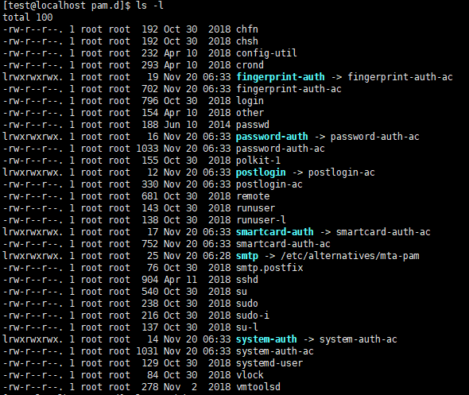
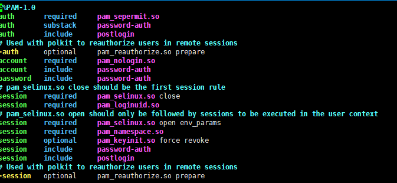

# 认证

<p align="center">
    <a href="http://turnoff.us/geek/the-depressed-developer-54/"></a>
</p>

---

# 用户信息

**/etc/passwd**

`/etc/passwd` 是用户数据库，其中的域给出了用户名、加密口令和用户的其他信息

`/etc/passwd` 文件中的每个用户都有一个对应的记录行，记录着这个用户的一下基本属性。`/etc/passwd` 只有系统管理员才可以修改的，该文件对所有用户可读。

- 存储条目格式

    ```
    name:coded-passwd:UID:GID:userinfo:homedirectory:shell

    例子
    root:x:0:0:root:/root:/usr/bin/bash
    |    | | |  |     |        |__登录 shell 程序的路径
    |    | | |  |     |__宿主目录
    |    | | |  |__用户全民
    |    | | |__所属基本组的 GID 号
    |    | |__用户账号的 UID 号
    |    |__密码字串或占位符 x
    |__用户账号的名称
    ```

    - 若用户 ID=0，则表示该用户拥有超级用户的权限
    - 检查是否有多个 ID=0
    - 禁用或删除多余的账号
    - 系统默认用户 系统程序使用，从不登录
    - 新建普通用户 uid 大于 500

在系统登陆时,最终以 passwd 中的密码为准,因为 linux 校验时先读取passwd中的密码,第二位为占位符 x 时,将读取 shadow 中的 hash，而在 passwd 中存在密码字串时，将不会读取 shadow 中 hash。

**/etc/shadow**

`/etc/shadow` 是在安装了影子(shadow)口令软件的系统上的影子口令文件

在linux中，口令文件在 `/etc/passwd` 中，早期的这个文件直接存放加密后的密码，前两位是"盐"值，是一个随机数，后面跟的是加密的密码。为了安全，现在的 linux 都提供了 `/etc/shadow` 这个影子文件，密码放在这个文件里面，并且是只有 root 可读的。

Unix 系统最初是用明文保存密码的，后来由于安全的考虑，采用 crypt() 算法加密密码并存放在 `/etc/passwd` 文件。现在，由 于计算机处理能力的提高，使密码破解变得越来越容易。`/etc/passwd` 文件是所有合法用户都可访问的，大家都可互相看到密码的加密字符串，这给系统 带来很大的安全威胁。现代的 Unix 系统使用影子密码系统，它把密码从 `/etc/passwd` 文件中分离出来，真正的密码保存在 `/etc/shadow` 文件中，shadow 文件只能由超级用户访问。这样入侵者就不能获得加密密码串，用于破 解。使用 shadow 密码文件后，`/etc/passwd` 文件中所有帐户的 password 域的内容为"x"，如果 password 域的内容为"*"，则 该帐号被停用。使用 passwd 这个程序可修改用户的密码。

- 存储条目格式

    ```
    name:passwd:lastchg:min:max:warn:inactive:expire:flag

    例子
    root:$6$pglAPwtWL....K6EMWC6sP8dqMh3TB2C21::0:99999:7:::
    |                       |                 | |   |   ||||__保留字段(未使用)
    |                       |                 | |   |   |||__账号失效时间,默认值未空
    |                       |                 | |   |   ||__密码过期后多少天禁用此用户账号
    |                       |                 | |   |   |__密码过期前的警告天数,默认7
    |                       |                 | |   |__密码的最长有效天数,默认99999
    |                       |                 | |__密码的最短有效天数,默认0
    |                       |                 |__上次修改密码的时间
    |                       |__加密后的密码字符串
    |__用户账号的名称
    ```

- “口令”字段存放的是加密后的用户口令字：
    - 如果为空，则对应用户没有口令，登录时不需要口令；
    - 星号代表帐号被锁定；
    - 双叹号表示这个密码已经过期了；
    - $6$ 开头的，表明是用 SHA-512 加密；
    - $1$ 表明是用 MD5 加密；
    - $2$ 是用 Blowfish 加密；
    - $5$ 是用 SHA-256 加密；

在 shadow 中直接添加用户是不可登录的,作为 passwd 的影子文件,其作用只是存放密码。

**用户管理**
```bash
id  								# 当前用户
whoami								# 当前用户
groups								# 当前组
cut -d: -f1 /etc/passwd				# 查看系统所有用户

useradd <username>					# 创建用户
useradd -d /home/<username> -s /sbin/nologin <username>		# 创建用户并指定家目录和 shell
passwd <username>					# 设置用户密码

addgroup <groupname>				# 创建组
addgroup <username> <groupname>		# 移动用户到组

newgrp <groupname>					# 创建组

usermod -g <groupname> <username>	# 修改用户的主组
usermod -G <附加组> <username>		# 修改用户的附加组
usermod -s /bin/bash <username>		# 修改用户登录的 Shell
usermod -L <username>  				# 锁定用户
usermod -U <username> 				# 解锁用户

userdel <username>					# 只删除用户不删除家目录
userdel -r <username>				# 同时删除家目录
userdel -f <username>				# 强制删除,即使用户还在登陆中
sudo passwd							# 配置 su 密码

chage		# 修改帐号和密码的有效期限
	chage -l <username>				# 查看一下用户密码状态
	chage -d <username>				# 把密码修改曰期归零了,这样用户一登录就要修改密码

passwd -l <username>  				# 锁定用户
passwd -u <username>  				# 解锁用户
```

---

# 组信息

**/etc/group**

`/ect/group` 文件是用户组配置文件，即用户组的所有信息都存放在此文件中。

此文件是记录组 ID（GID）和组名相对应的文件。

```bash
cat /etc/group
root:x:0:
daemon:x:1:
bin:x:2:
sys:x:3:
...
test:x:1000:
```

此文件中每一行各代表一个用户组。以 "：" 作为字段之间的分隔符，分为 4 个字段

每个字段对应的含义为：组名：密码：GID：该用户组中的用户列表

- 组名

    也就是是用户组的名称，有字母或数字构成。同 `/etc/passwd` 中的用户名一样，组名也不能重复。

- 组密码

    和 `/etc/passwd` 文件一样，这里的 "x" 仅仅是密码标识，真正加密后的组密码默认保存在 `/etc/gshadow` 文件中。

    不过，用户设置密码是为了验证用户的身份，那用户组设置密码是用来做什么的呢？用户组密码主要是用来指定组管理员的，由于系统中的账号可能会非常多，root 用户可能没有时间进行用户的组调整，这时可以给用户组指定组管理员，如果有用户需要加入或退出某用户组，可以由该组的组管理员替代 root 进行管理。但是这项功能目前很少使用，我们也很少设置组密码。如果需要赋予某用户调整某个用户组的权限，则可以使用 sudo 命令代替。

- 组ID (GID)

    就是群组的 ID 号，Linux 系统就是通过 GID 来区分用户组的，同用户名一样，组名也只是为了便于管理员记忆。

    这里的组 GID 与 `/etc/passwd` 文件中第 4 个字段的 GID 相对应，实际上，`/etc/passwd` 文件中使用 GID 对应的群组名，就是通过此文件对应得到的。

- 组中的用户

    此字段列出每个群组包含的所有用户。需要注意的是，如果该用户组是这个用户的初始组，则该用户不会写入这个字段，可以这么理解，该字段显示的用户都是这个用户组的附加用户。

    举个例子，lamp 组的组信息为 "lamp:x:502:"，可以看到，第四个字段没有写入 lamp 用户，因为 lamp 组是 lamp 用户的初始组。如果要查询这些用户的初始组，则需要先到 `/etc/passwd` 文件中查看 GID（第四个字段），然后到 `/etc/group` 文件中比对组名。

    每个用户都可以加入多个附加组，但是只能属于一个初始组。所以我们在实际工作中，如果需要把用户加入其他组，则需要以附加组的形式添加。例如，我们想让 lamp 也加入 root 这个群组，那么只需要在第一行的最后一个字段加入 lamp，即 root:x:0:lamp 就可以了。

    一般情况下，用户的初始组就是在建立用户的同时建立的和用户名相同的组。

**/etc/gshadow**

`/etc/passwd` 文件存储用户基本信息，同时考虑到账户的安全性，将用户的密码信息存放另一个文件 `/etc/shadow` 中。`/etc/gshadow` 文件也是如此，组用户信息存储在 `/etc/group` 文件中，而将组用户的密码信息存储在 `/etc/gshadow` 文件中。

```bash
root:*::
daemon:*::
bin:*::
sys:*::
...
test:!::
```

文件中，每行代表一个组用户的密码信息，各行信息用 ":" 作为分隔符分为 4 个字段

每个字段的含义如下：组名：加密密码：组管理员：组附加用户列表

- 组名

    同 `/etc/group` 文件中的组名相对应。

- 组密码

    对于大多数用户来说，通常不设置组密码，因此该字段常为空，但有时为 "!"，指的是该群组没有组密码，也不设有群组管理员。

- 组管理员

    从系统管理员的角度来说，该文件最大的功能就是创建群组管理员。那么，什么是群组管理员呢？

    考虑到 Linux 系统中账号太多，而超级管理员 root 可能比较忙碌，因此当有用户想要加入某群组时，root 或许不能及时作出回应。这种情况下，如果有群组管理员，那么他就能将用户加入自己管理的群组中，也就免去麻烦 root 了。

    不过，由于目前有 sudo 之类的工具，因此群组管理员的这个功能已经很少使用了。

- 组中的附加用户

    该字段显示这个用户组中有哪些附加用户，和 `/etc/group` 文件中附加组显示内容相同。

---

# PAM 模块

在 Linux 中执行有些程序时，这些程序在执行前首先要对启动它的用户进行认证，符合一定的要求之后才允许执行，例如 login, su 等。在 Linux 中进行身份或是状态的验证程序是由 PAM 来进行的，PAM（Pluggable Authentication Modules）可动态加载验证模块，因为可以按需要动态的对验证的内容进行变更，所以可以大大提高验证的灵活性。

Linux-PAM（即 linux 可插入认证模块）是一套共享库,使本地系统管理员可以随意选择程序的认证方式。换句话说，不用(重新编写)重新编译一个包含 PAM 功能的应用程序，就可以改变它使用的认证机制，这种方式下，就算升级本地认证机制,也不用修改程序。

PAM 使用配置 `/etc/pam.d/` 下的文件，来管理对程序的认证方式.应用程序 调用相应的配置文件，从而调用本地的认证模块.模块放置在 `/lib/security` 下，以加载动态库的形式进，像我们使用 su 命令时，系统会提示你输入 root 用户的密码.这就是 su 命令通过调用 PAM 模块实现的。



**PAM 的配置文件**

PAM 配置文件有两种写法:
- 一种是写在 `/etc/pam.conf` 文件中，但 centos6 之后的系统中，这个文件就没有了。
- 另一种写法是,将 PAM 配置文件放到 `/etc/pam.d/` 目录下,其规则内容都是不包含 service 部分的，即不包含服务名称，而 `/etc/pam.d` 目录下文件的名字就是服务名称。如: vsftpd,login 等.,只是少了最左边的服务名列.如: `/etc/pam.d/sshd`

查看 `/etc/pam.d/sshd`



由上图可以将配置文件分为四列，

- 第一列代表模块类型
- 第二列代表控制标记
- 第三列代表模块路径
- 第四列代表模块参数

**PAM 的模块类型**

Linux-PAM 有四种模块类型,分别代表四种不同的任务

它们是:认证管理(auth),账号管理(account),会话管理(session)和密码(password)管理,一个类型可能有多行,它们按顺序依次由 PAM 模块调用.

- *auth* :  用来对用户的身份进行识别.如:提示用户输入密码,或判断用户是否为 root 等.
- *account* : 对帐号的各项属性进行检查.如:是否允许登录,是否达到最大用户数,或是 root 用户是否允许在这个终端登录等.
- *session* : 这个模块用来定义用户登录前的,及用户退出后所要进行的操作.如:登录连接信息,用户数据的打开与关闭,挂载文件系统等.
- *password* : 使用用户信息来更新.如:修改用户密码.

**PAM 的控制标记**

PAM 使用控制标记来处理和判断各个模块的返回值

- *required* : 表示即使某个模块对用户的验证失败，也要等所有的模块都执行完毕后,PAM 才返回错误信息。这样做是为了不让用户知道被哪个模块拒绝。如果对用户验证成功，所有的模块都会返回成功信息。
- *requisite* : 与 required 相似,但是如果这个模块返回失败,则立刻向应用程序返回失败,表示此类型失败.不再进行同类型后面的操作.
- *sufficient* : 表示如果一个用户通过这个模块的验证，PAM 结构就立刻返回验证成功信息（即使前面有模块 fail 了，也会把 fail 结果忽略掉），把控制权交回应用程序。后面的层叠模块即使使用 requisite 或者 required 控制标志，也不再执行。如果验证失败，sufficient 的作用和 optional 相同
- *optional* : 表示即使本行指定的模块验证失败，也允许用户接受应用程序提供的服务，一般返回 PAM_IGNORE (忽略).

**模块路径**

模块路径.即要调用模块的位置. 如果是 64 位系统，一般保存在 `/lib64/security`,如: pam_unix.so

同一个模块,可以出现在不同的类型中.它在不同的类型中所执行的操作都不相同.这是由于每个模块

针对不同的模块类型,编制了不同的执行函数.

**模块参数**

模块参数,即传递给模块的参数.参数可以有多个,之间用空格分隔开,如:

```
password   required   pam_unix.so nullok obscure min=4 max=8 md5
```

**常用的 PAM 模块介绍**

pam_unix.so
- auth 提示用户输入密码,并与 `/etc/shadow` 文件相比对.匹配返回 0
- account 检查用户的账号信息(包括是否过期等).帐号可用时,返回 0.
- password 修改用户的密码. 将用户输入的密码,作为用户的新密码更新 shadow 文件

pam_shells.so
- 如果用户想登录系统，那么它的 shell 必须是在 `/etc/shells` 文件中之一的 shell

pam_deny.so
- 该模块可用于拒绝访问

pam_permit.so
- 模块任何时候都返回成功.

pam_securetty.so
- auth 如果用户要以 root 登录时,则登录的 tty 必须在 `/etc/securetty` 之中.

pam_listfile.so
- 访问应用程的控制开关

pam_cracklib.so
- password 这个模块可以插入到一个程序的密码栈中,用于检查密码的强度.

pam_limits.so
- session 定义使用系统资源的上限，root 用户也会受此限制，可以通过 `/etc/security/limits.conf` 或 `/etc/security/limits.d/*.conf` 来设定

---

# sudo

sudo 命令用来以其他身份来执行命令，预设的身份为 root。在 `/etc/sudoers` 中设置了可执行 sudo 指令的用户。若其未经授权的用户企图使用 sudo，则会发出警告的邮件给管理员。用户使用 sudo 时，必须先输入密码，之后有5分钟的有效期限，超过期限则必须重新输入密码。

```bash
sudo -v # 查看 sudo 信息
sudo -l # 查看当前权限
```

**执行原理**

普通用户执行命令 -> 检查 `/var/db/sudo/` 目录下是否有用户时间戳 -> 检查 `/etc/sudoers` 配置文件，用户是否有 sudo 权限 -> 执行 sudo 命令并反回结果 -> 退出 sudo 返回普通用户 shell 环境。

**配置 sudo**

配置 sudo 必须通过编辑 `/etc/sudoers` 文件，而且只有超级用户才可以修改它，还必须使用 visudo 编辑。之所以使用 visudo 有两个原因，一是它能够防止两个用户同时修改它；二是它也能进行有限的语法检查。所以，即使只有你一个超级用户，你也最好用 visudo 来检查一下语法。

visudo 默认的是在 vi 里打开配置文件，用 vi 来修改文件。我们可以在编译时修改这个默认项。visudo 不会擅自保存带有语法错误的配置文件，它会提示你出现的问题，并询问该如何处理，就像：
```
>>> sudoers file: syntax error, line 22 <<
```

此时我们有三种选择：键入“e”是重新编辑，键入“x”是不保存退出，键入“Q”是退出并保存。如果真选择 Q，那么 sudo 将不会再运行，直到错误被纠正。

---

从一个简单的例子开始：让用户 Foobar 可以通过 sudo 执行所有 root 可执行的命令。以 root 身份用 visudo 打开配置文件，可以看到类似下面几行：
```bash
# Runas alias specification
# User privilege specificationroot    ALL=(ALL)ALL
```

root 有所有权限，只要仿照现有 root 的例子就行，我们在下面加一行（最好用 tab 作为空白）
```
foobar ALL=(ALL)    ALL
```

保存退出后，切换到 foobar 用户，我们用它的身份执行命令：
```
[foobar@localhost ~]$ ls /root
ls: /root: 权限不够

[foobar@localhost ~]$ sudo ls /root
PassWord:
anaconda-ks.cfg Desktop install.log install.log.syslog
```

限制一下 foobar 的权利，不让他为所欲为。比如我们只想让他像 root 那样使用 ls 和 ifconfig，把那一行改为：
```
foobar localhost=    /sbin/ifconfig,   /bin/ls
```

再来执行命令
```
[foobar@localhost ~]$ sudo head -5 /etc/shadow
Password:
Sorry, user foobar is not allowed to execute '/usr/bin/head -5 /etc/shadow' as root on localhost.localdomain.

[foobar@localhost ~]$ sudo /sbin/ifconfigeth0      Linkencap:Ethernet HWaddr 00:14:85:EC:E9:9B...
```

现在让我们来看一下那三个 ALL 到底是什么意思。
- 第一个 ALL 指示允许从任何终端、机器访问 sudo,是指网络中的主机，我们后面把它改成了主机名，它指明 foobar 可以在此主机上执行后面的命令。
- 第二个 ALL 指示 sudo 命令被允许以任何用户身份执行,指目标用户，也就是以谁的身份去执行命令。
- 第三个 ALL 表示所有命令都可以作为 root 执行,指命令名。例如，我们想让 foobar 用户在 linux 主机上以 jimmy 或 rene 的身份执行 kill 命令，这样编写配置文件：
```
foobar    linux=(jimmy,rene)    /bin/kill
```

但这还有个问题，foobar 到底以 jimmy 还是 rene 的身份执行？这时我们应该想到了 `sudo -u` 了，它正是用在这种时候。 foobar 可以使用 `sudo -u jimmy kill PID` 或者 `sudo -u rene kill PID`，但这样挺麻烦，其实我们可以不必每次加 -u，把 rene 或 jimmy 设为默认的目标用户即可。再在上面加一行：
```
Defaults:foobar    runas_default=rene
```

Defaults 后面如果有冒号，是对后面用户的默认，如果没有，则是对所有用户的默认。就像配置文件中自带的一行：
```
Defaults    env_reset
```

另一个问题是，很多时候，我们本来就登录了，每次使用 sudo 还要输入密码就显得烦琐了。我们可不可以不再输入密码呢？当然可以，我们这样修改配置文件：
```
foobar localhost=NOPASSWD:     /bin/cat, /bin/ls
```

**日志与安全**

sudo 为安全考虑得很周到，不仅可以记录日志，还能在有必要时向系统管理员报告。但是，sudo 的日志功能不是自动的，必须由管理员开启。这样来做：
```bash
touch /var/log/sudo
vi /etc/syslog.conf
```

> 注: 内核为2.6.32以后 syslog 被命名为 rsyslog，所以配置文件名称也不一样

在 `syslog.conf` 最后面加一行（必须用 tab 分割开）并保存：
```
local2.debug                    /var/log/sudo
```

重启日志守候进程
```bash
ps aux grep syslogd
```

把得到的 syslogd 进程的 PID（输出的第二列是 PID）填入下面：
```bash
kill –HUP PID
```

这样，sudo 就可以写日志了

不过，有一个小小的“缺陷”，sudo 记录日志并不是很忠实：
```bash
sudo cat /etc/shadow > /dev/null
cat /var/log/sudo...Jul 28 23:10:24 localhost sudo:   foobar : TTY=pts/1 ;
PWD=/home/foobar ; USER=root ; COMMAND=/bin/cat /etc/shadow
```

重定向没有被记录在案！为什么？因为在命令运行之前，shell 把重定向的工作做完了，sudo 根本就没看到重定向。这也有个好处，下面的手段不会得逞：
```
[foobar@localhost ~]$ sudo ls /root > /etc/shadowbash: /etc/shadow: 权限不够
```

sudo 有自己的方式来保护安全。以 root 的身份执行 sudo -V，查看一下 sudo 的设置。因为考虑到安全问题，一部分环境变量并没有传递给 sudo 后面的命令，或者被检查后再传递的，比如：PATH，HOME，SHELL等。

> 注: 执行sudo的时候必须要有一个tty去运行sudo

---

# Capabilities

从前，要使被普通用户执行的某个程序有特殊权限，一般我们会给这个程序设置 suid，于是普通用户执行该程序时就会以 root 的身份来执行。比如，`/usr/bin/passwd` 这个可执行文件就带有 suid，普通用户执行它时会以 root 身份执行，所以 passwd 才能读取并修改 `/etc/shadow` 文件。

可以看到，使用 suid 有一个弊端，那就是以 root 身份执行的程序有了所有特权，这会带来安全风险。Kernel 从 2.2 版本开始，提供了 Capabilities 功能，它把特权划分成不同单元，可以只授权程序所需的权限，而非所有特权。

Capabilities 的主要思想在于分割 root 用户的特权，即将 root 的特权分割成不同的能力，每种能力代表一定的特权操作。例如：能力 CAP_SYS_MODULE 表示用户能够加载(或卸载)内核模块的特权操作，而 CAP_SETUID 表示用户能够修改进程用户身份的特权操作。在 Capbilities 中系统将根据进程拥有的能力来进行特权操作的访问控制。

举个例子 : 安装 Wireshark 的时候，有一步是给 dumpcap 读网卡的权限，使得普通用户也可以使用 Wireshark 进行抓包。
```bash
setcap 'CAP_NET_RAW+eip CAP_NET_ADMIN+eip' /usr/sbin/dumpcap
```

在 RHEL6 中，普通用户能执行 ping 命令是因为 `/bin/ping` 设置了 suid,将 `/bin/ping` 的 suid 去除，普通用户则无法执行 ping.
```bash
chmod 755 /bin/ping
ping www.baidu.com
```
在 root 用户下，用 setcap 命令给 `/bin/ping` 这个可执行文件加上 “cap_net_admin,cap_net_raw+ep” 权限，普通用户即可使用 ping.
```bash
setcap 'cap_net_admin,cap_net_raw+ep' /bin/ping
getcap  /bin/ping
ping www.baidu.com
```

setcap 一般用于二进制可执行文件。setcap 用于脚本文件时无效（比如以 `#!/bin/python` 开头的脚本文件）

在 Linux 中的 Capabilities 是通过 extended attributes 中的 security 命名空间实现的。主流的 Linux 文件系统都支持 Extended attributes，包括 Ext2, Ext3, Ext4, Btrfs, JFS, XFS 和 Reiserfs.
```bash
getfattr -d -m "security\\." /bin/ping
```

在 Capilities 中，只有进程和可执行文件才具有能力，每个进程拥有三组能力集，分别称为 cap_effective, cap_inheritable, cap_permitted(分别简记为:pE,pI,pP)，其中 cap_permitted 表示进程所拥有的最大能力集；cap_effective 表示进程当前可用的能力集，可以看做是 cap_permitted 的一个子集；而 cap_inheitable 则表示进程可以传递给其子进程的能力集。系统根据进程的 cap_effective 能力集进行访问控制，cap_effective 为 cap_permitted 的子集，进程可以通过取消 cap_effective 中的某些能力来放弃进程的一些特权。可执行文件也拥有三组能力集，对应于进程的三组能力集，分别称为 cap_effective, cap_allowed 和 cap_forced（分别简记为fE,fI,fP），其中，cap_allowed 表示程序运行时可从原进程的

---

**Source & Reference**
- [系统加固之Linux安全加固](https://mp.weixin.qq.com/s/cj2IpePACewH2wqXFgKTDw)
- [linux中pam模块](https://blog.51cto.com/essun/1391133)
- [sudo命令](https://man.linuxde.net/sudo)
- [对 Capabilities (libcap, getcap, setcap) 的基本了解](https://feichashao.com/capabilities_basic/)
