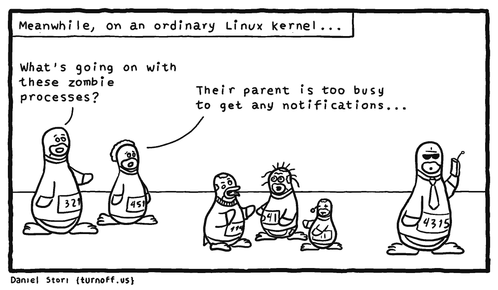

# 进程

<p align="center">
    <a href="http://turnoff.us/geek/zombie-processes/"></a>
</p>

---

# 基础

**线程和进程的关系**

在 Linux 系统中，进程和线程几乎没有区别。

编译好的那个可执行程序只是一个文件，不是进程，可执行文件必须要载入内存，包装成一个进程才能真正跑起来。进程是要依靠操作系统创建的，每个进程都有它的固有属性，比如进程号（PID）、进程状态、打开的文件等等，进程创建好之后，读入你的程序，你的程序才被系统执行。

对于操作系统，进程就是一个数据结构.

为什么说 Linux 中线程和进程基本没有区别呢，因为从 Linux 内核的角度来看，并没有把线程和进程区别对待。

我们知道系统调用 `fork()` 可以新建一个子进程，函数 `pthread()` 可以新建一个线程。但无论线程还是进程，都是用 task_struct 结构表示的，唯一的区别就是共享的数据区域不同。

换句话说，线程看起来跟进程没有区别，只是线程的某些数据区域和其父进程是共享的，而子进程是拷贝副本，而不是共享。

所以说，我们的多线程程序要利用锁机制，避免多个线程同时往同一区域写入数据，否则可能造成数据错乱。

那么你可能问，既然进程和线程差不多，而且多进程数据不共享，即不存在数据错乱的问题，为什么多线程的使用比多进程普遍得多呢？

因为现实中数据共享的并发更普遍呀，比如十个人同时从一个账户取十元，我们希望的是这个共享账户的余额正确减少一百元，而不是希望每人获得一个账户的拷贝，每个拷贝账户减少十元。

**孤儿进程**

一个父进程退出，而它的一个或多个子进程还在运行，那么这些子进程将成为孤儿进程。孤儿进程将被 init 进程（进程号为 1）所收养，并由 init 进程对它们完成状态收集工作。

由于孤儿进程会被 init 进程收养，所以孤儿进程不会对系统造成危害。

init 进程就好像是一个民政局，专门负责处理孤儿进程的善后工作。每当出现一个孤儿进程的时候，内核就把孤 儿进程的父进程设置为 init，而 init 进程会循环地 `wait()` 它的已经退出的子进程。这样，当一个孤儿进程凄凉地结束了其生命周期的时候，init 进程就会代表党和政府出面处理它的一切善后工作。因此孤儿进程并不会有什么危害。

任何一个子进程(init 除外)在 `exit()` 之后，并非马上就消失掉，而是留下一个称为僵尸进程(Zombie)的数据结构，等待父进程处理。这是每个 子进程在结束时都要经过的阶段。如果子进程在 `exit()` 之后，父进程没有来得及处理，这时用 ps 命令就能看到子进程的状态是“Z”。如果父进程能及时 处理，可能用 ps 命令就来不及看到子进程的僵尸状态，但这并不等于子进程不经过僵尸状态。  如果父进程在子进程结束之前退出，则子进程将由 init 接管。init 将会以父进程的身份对僵尸状态的子进程进行处理。

**僵尸进程**

一个子进程的进程描述符在子进程退出时不会释放，只有当父进程通过 `wait()` 或 `waitpid()` 获取了子进程信息后才会释放。如果子进程退出，而父进程并没有调用 `wait()` 或 `waitpid()`，那么子进程的进程描述符仍然保存在系统中，这种进程称之为僵死进程。

僵死进程通过 ps 命令显示出来的状态为 Z。

unix 提供了一种机制可以保证只要父进程想知道子进程结束时的状态信息， 就可以得到。这种机制就是: 在每个进程退出的时候,内核释放该进程所有的资源,包括打开的文件,占用的内存等。 但是仍然为其保留一定的信息(包括进程号 the process ID,退出状态 the termination status of the process,运行时间t he amount of CPU time taken by the process等)。直到父进程通过 wait / waitpid 来取时才释放。 但这样就导致了问题，如果进程不调用 wait / waitpid 的话， 那么保留的那段信息就不会释放，其进程号就会一直被占用，但是系统所能使用的进程号是有限的，如果大量的产生僵死进程，将因为没有可用的进程号而导致系统不能产生新的进程. 此即为僵尸进程的危害，应当避免。

要消灭系统中大量的僵死进程，只需要将其父进程杀死，此时所有的僵死进程就会变成孤儿进程，从而被 init 所收养，这样 init 就会释放所有的僵死进程所占有的资源，从而结束僵死进程。

**PID**

每一个进程都有唯一的 ID（PID），是在进程表中识别进程的标识


**PPID**

这个进程的父进程


父进程跟子进程:
Linux 下，进程的创建，采用的是 Fork（派生）：用一个程序创建一个新进程的方法 。比如我创建一个进程 `ping`，必须通过另外的一个进程来派生，另外的进程就叫做父进程。比如


`ping` 在控制台下运行，是 bash 派生的

fork-exec：先用 fork 生成一个子进程,然后利用 exec 函数族用新进程映像取代调用进程映像。这时候 shell 将等待 fork-exec 子进程执行完毕，并重新显示 shell 提示信息。

**EUID（effective user id）**

uid 和 euid 的区别：uid 就是你 login 的时候使用的 id，而 euid 则是你当前的有效 id。比如在 setuid 的程序里面去执行的时候会暂时性将 euid 变成文件所有者的 sid,但是 sid 没变

Linux 进程在运行时有三个 UID
- Real UID 执行该进程的用户实际的UID
- Effective UID 程序实际操作时生效的UID（比如写入文件时，系统会检查这个 UID 是否有权限）
- Saved UID 在高权限用户降权后，保留的其原本 UID

通常情况下 Effective UID 和 Real UID 相等，所以普通用户不能写入只有 UID=0 号才可写的 `/etc/passwd`；有suid 的程序启动时，Effective UID 就等于二进制文件的所有者，此时 Real UID 就可能和 Effective UID 不相等了。

**PID 1**

Linux 操作系统的启动首先从 BIOS 开始，然后由 Boot Loader 载入内核，并初始化内核。内核初始化的最后一步就是启动 init 进程。这个进程是系统的第一个进程，PID 为 1，又叫超级进程，也叫根进程。它负责产生其他所有用户进程。所有的进程都会被挂在这个进程下，如果这个进程退出了，那么所有的进程都被 kill 。如果一个子进程的父进程退了，那么这个子进程会被挂到 PID 1 下面。

**SysV Init**

PID 1 这个进程非常特殊，其主要就任务是把整个操作系统带入可操作的状态。比如：启动 UI – Shell 以便进行人机交互，或者进入 X 图形窗口。传统上，PID 1 和传统的 Unix System V 相兼容的，所以也叫 sysvinit，这是使用得最悠久的 init 实现。Unix System V 于1983年 release。

在 sysvint 下，有好几个运行模式，又叫 runlevel。比如：常见的 3 级别指定启动到多用户的字符命令行界面，5 级别指定启起到图形界面，0 表示关机，6 表示重启。其配置在 `/etc/inittab` 文件中。

与此配套的还有 `/etc/init.d/` 和 `/etc/rc[X].d`，前者存放各种进程的启停脚本（需要按照规范支持 start，stop 子命令），后者的 X 表示不同的 runlevel 下相应的后台进程服务，如：`/etc/rc3.d` 是 runlevel=3 的。 里面的文件主要是 link 到  `/etc/init.d/` 里的启停脚本。其中也有一定的命名规范：S 或 K 打头的，后面跟一个数字，然后再跟一个自定义的名字，如：S01rsyslog，S02ssh。S 表示启动，K表示停止，数字表示执行的顺序。

**UpStart**

Unix 和 Linux 在 sysvint 运作多年后，大约到了2006年的时候，Linux 内核进入2.6时代，Linux 有了很多更新。并且，Linux开始进入桌面系统，而桌面系统和服务器系统不一样的是，桌面系统面临频繁重启，而且，用户会非常频繁的使用硬件的热插拔技术。于是，这些新的场景，让 sysvint 受到了很多挑战。

比如，打印机需要 CUPS 等服务进程，但是如果用户没有打机印，启动这个服务完全是一种浪费，而如果不启动，如果要用打印机了，就无法使用，因为 sysvint 没有自动检测的机制，它只能一次性启动所有的服务。另外，还有网络盘挂载的问题。在 `/etc/fstab` 中，负责硬盘挂载，有时候还有网络硬盘（NFS 或 iSCSI）在其中，但是在桌面机上，有很可能开机的时候是没有网络的， 于是网络硬盘都不可以访问，也无法挂载，这会极大的影响启动速度。sysvinit 采用 netdev 的方式来解决这个问题，也就是说，需要用户自己在 `/etc/fstab` 中给相应的硬盘配置上 netdev 属性，于是 sysvint 启动时不会挂载它，只有在网络可用后，由专门的 netfs 服务进程来挂载。这种管理方式比较难以管理，也很容易让人掉坑。

所以，Ubuntu 开发人员在评估了当时几个可选的 init 系统后，决定重新设计这个系统，于是，这就是我们后面看到的 upstart 。 upstart 基于事件驱动的机制，把之前的完全串行的同步启动服务的方式改成了由事件驱动的异步的方式。比如：如果有U盘插入，udev 得到通知，upstart 感知到这个事件后触发相应的服务程序，比如挂载文件系统等等。因为使用一个事件驱动的玩法，所以，启动操作系统时，很多不必要的服务可以不用启动，而是等待通知，lazy 启动。而且事件驱动的好处是，可以并行启动服务，他们之间的依赖关系，由相应的事件通知完成。

upstart 有着很不错的设计，其中最重要的两个概念是 Job 和 Event。

Job 有一般的 Job，也有 service 的 Job，并且，upstart 管理了整个 Job 的生命周期，比如：Waiting, Starting, pre-Start, Spawned, post-Start, Running, pre-Stop, Stopping, Killed, post-Stop 等等，并维护着这个生命周期的状态机。

Event 分成三类，signal, method 和 hooks。signal 就是异步消息，method 是同步阻塞的。hooks 也是同步的，但介于前面两者之间，发出 hook 事件的进程必须等到事件完成，但不检查是否成功。

但是，upstart 的事件非常复杂，也非常纷乱，各种各样的事件（事件没有归好类）导致有点凌乱。不过因为整个事件驱动的设计比之前的 sysvinit 来说好太多，所以，也深得欢迎。

**Systemd**

直到2010的有一天，一个在 RedHat工作的工程师 Lennart Poettering 和 Kay Sievers ，开始引入了一个新的 init 系统—— systemd。这是一个非常非常有野心的项目，这个项目几乎改变了所有的东西，systemd 不但想取代已有的 init 系统，而且还想干更多的东西。

Lennart 同意 upstart 干的不错，代码质量很好，基于事件的设计也很好。但是他觉得 upstart 也有问题，其中最大的问题还是不够快，虽然 upstart 用事件可以达到一定的启动并行度，但是，本质上来说，这些事件还是会让启动过程串行在一起。

如：NetworkManager 在等 D-Bus 的启动事件，而 D-Bus 在等 syslog 的启动事件。

Lennart 认为，实现上来说，upstart 其实是在管理一个逻辑上的服务依赖树，但是这个服务依赖树在表现形式上比较简单，你只需要配置——“启动 B好了就启动A”或是“停止了A后就停止B”这样的规则。但是，Lennart 说，这种简单其实是有害的（this simplification is actually detrimental）。他认为，

- 从一个系统管理的角度出来，他一开始会设定好整个系统启动的服务依赖树，但是这个系统管理员要人肉的把这个本来就非常干净的服务依整树给翻译成计算机看的懂的 Event/Action 形式，而且 Event/Action 这种配置方式是运行时的，所以，你需要运行起来才知道是什么样的。

- Event 逻辑从头到脚到处都是，这个事件扩大了运维的复杂度，还不如之前的 sysvint。 也就是说，当用户配置了 “启动 D-Bus 后请启动 NetworkManager”， 这个 upstart 可以干，但是反过来，如果，用户启动 NetworkManager，我们应该先去启动他的前置依赖 D-Bus，然而你还要配置相应的反向 Event。本来，我只需要配置一条依赖的，结果现在我要配置很多很多情况下的Event。

- 最后，upstart 里的 Event 的并不标准，很混乱，没有良好的定义。比如：既有，进程启动，运行，停止的事件，也有USB设备插入、可用、拔出的事件，还有文件系统设备being mounted、 mounted 和 umounted 的事件，还有AC电源线连接和断开的事件。你会发现，这进程启停的、USB的、文件系统的、电源线的事件，看上去长得很像， 但是没有被标准化抽像出来掉，因为绝大多数的事件都是三元组：start, condition, stop 。这种概念设计模型并没有在 upstart 中出现。因为 upstart 被设计为单一的事件，而忽略了逻辑依赖。

当然，如果 systemd 只是解决 upstart 的问题，他就改造 upstart 就好了，但是 Lennart 的野心不只是想干个这样的事，他想干的更多。

首先，systemd 清醒的认识到了 init 进程的首要目标是要让用户快速的进入可以操作OS的环境，所以，这个速度一定要快，越快越好，所以，systemd 的设计理念就是两条：

- To start less.
- And to start more in parallel.

    And to start more in parallel.

也就是说，按需启动，能不启动就不启动，如果要启动，能并行启动就并行启动，包括你们之间有依赖，我也并行启动。按需启动还好理解，那么，有依赖关系的并行启动，它是怎么做到的？这里，systemd 借鉴了 MacOS 的 Launchd 的玩法

要解决这些依赖性，systemd 需要解决好三种底层依赖—— Socket， D-Bus ，文件系统。

- Socket 依赖。如果服务C依赖于服务S的 socket，那么就要先启动S，然后再启动C，因为如果C启动时找不到S的 Socket，那么C就会失败。systemd 可以帮你在S还没有启动好的时候，建立一个 socket，用来接收所有的C的请求和数据，并缓存之，一旦S全部启动完成，把 systemd 替换好的这个缓存的数据和 Socket 描述符替换过去。

- D-Bus 依赖。D-Bus 全称 Desktop Bus，是一个用来在进程间通信的服务。除了用于用户态进程和内核态进程通信，也用于用户态的进程之前。现在，很多的现在的服务进程都用 D-Bus 而不是Socket来通信。比如：NetworkManager 就是通过 D-Bus 和其它服务进程通讯的，也就是说，如果一个进程需要知道网络的状态，那么就必需要通过 D-Bus 通信。D-Bus 支持 “Bus Activation”的特性。也就是说，A要通过 D-Bus 服务和B通讯，但是B没有启动，那么 D-Bus 可以把B起来，在B启动的过程中，D-Bus 帮你缓存数据。systemd 可以帮你利用好这个特性来并行启动 A 和 B。

- 文件系统依赖。系统启动过程中，文件系统相关的活动是最耗时的，比如挂载文件系统，对文件系统进行磁盘检查（fsck），磁盘配额检查等都是非常耗时的操作。在等待这些工作完成的同时，系统处于空闲状态。那些想使用文件系统的服务似乎必须等待文件系统初始化完成才可以启动。systemd 参考了 autofs 的设计思路，使得依赖文件系统的服务和文件系统本身初始化两者可以并发工作。autofs 可以监测到某个文件系统挂载点真正被访问到的时候才触发挂载操作，这是通过内核 automounter 模块的支持而实现的。比如一个 `open()` 系统调用作用在某个文件系统上的时候，而这个文件系统尚未执行挂载，此时 `open()` 调用被内核挂起等待，等到挂载完成后，控制权返回给 `open()` 系统调用，并正常打开文件。这个过程和 autofs 是相似的。

除此之外，systemd 还在启动时管理好了一些下面的事。

用C语言取代传统的脚本式的启动。前面说过，sysvint 用 `/etc/rcX.d` 下的各种脚本启动。然而这些脚本中需要使用 awk, sed, grep, find, xargs 等等这些操作系统的命令，这些命令需要生成进程，生成进程的开销很大，关键是生成完这些进程后，这个进程就干了点屁大的事就退了。换句话说就是，我操作系统干了那么多事为你拉个进程起来，结果你就把个字串转成小写就退了，把我操作系统当什么了？

在正常的一个 sysvinit 的脚本里，可能会有成百上千个这样的命令。所以，慢死。因此，systemd 全面用 C 语言全部取代了。一般来说，sysvinit 下，操作系统启动完成后，用 echo $$ 可以看到，pid 被分配到了上千的样子，而 systemd 的系统只是上百。

另外，systemd 是真正一个可以管住服务进程的——可以跟踪上服务进程所 fork/exec 出来的所有进程。

我们知道， 传统 Unix/Linux 的 Daemon 服务进程的最佳实践基本上是这个样子的
- 进程启动时，关闭所有的打开的文件描述符（除了标准描述符0,1,2），然后重置所有的信号处理。
- 调用 `fork()` 创建子进程，在子进程中 `setsid()`，然后父进程退出（为了后台执行）
- 在子进程中，再调用一次 `fork()`，创建孙子进程，确定没有交互终端。然后子进程退出。
- 在孙子进程中，把标准输入标准输出标准错误都连到 `/dev/null` 上，还要创建 pid 文件，日志文件，处理相关信号 ……
- 最后才是真正开始提供服务。

在上面的这个过程中，服务进程除了两次 fork 外还会 fork 出很多很多的子进程（比如说一些Web服务进程，会根据用户的请求链接来 fork 子进程），这个进程树是相当难以管理的，因为，一旦父进程退出来了，子进程就会被挂到 PID 1下，所以，基本上来说，你无法通过服务进程自已给定的一个 pid 文件来找到所有的相关进程（这个对开发者的要求太高了），所以，在传统的方式下用脚本启停服务是相当相当的 Buggy 的，因为无法做对所有的服务生出来的子子孙孙做到监控。

为了解决这个问题，upstart 通过变态的 strace 来跟踪进程中的 `fork()` 和 `exec()` 或 `exit()` 等相关的系统调用。这种方法相当笨拙。 systemd 使用了一个非常有意思的玩法来 tracking 服务进程生出来的所有进程，那就是用 cgroup （我在 Docker 的基础技术“cgroup篇”中讲过这个东西）。cgroup主要是用来管理进程组资源配额的事，所以，无论服务如何启动新的子进程，所有的这些相关进程都会同属于一个 cgroup，所以，systemd 只需要简单的去遍历一下相应的 cgroup 的那个虚文件系统目录下的文件，就可以正确的找到所有的相关进程，并将他们一一停止。

另外，systemd 简化了整个 daemon 开发的过程：

- 不需要两次 `fork()`，只需要实现服务本身的主逻辑就可以了。
- 不需要 `setsid()`，systemd 会帮你干
- 不需要维护 pid 文件，systemd 会帮处理。
- 不需要管理日志文件或是使用 syslog，或是处理 HUP 的日志 reload 信号。把日志打到 stderr 上，systemd 帮你管理。
- 处理 SIGTERM 信号，这个信号就是正确退出当前服务，不要做其他的事。
- ……

除此之外，systemd 还能——

- 自动检测启动的服务间有没有环形依赖。
- 内建 autofs 自动挂载管理功能。
- 日志服务。systemd 改造了传统的 syslog 的问题，采用二进制格式保存日志，日志索引更快。
- 快照和恢复。对当前的系统运行的服务集合做快照，并可以恢复。
- ……

还有好多好多，他接管很多很多东西

---

# 监视进程

```bash
ps -aux	    # 查看进程
ps aux | grep root	# 查看 root 运行的程序
ps -ef | grep root	# 查看 root 运行的程序

jobs	    # 显示 Linux 中的任务列表及任务状态
	jobs -l		    # 显示进程号

pidof program	    # 找出 program 程序的进程 PID
pidof -x script     # 找出 shell 脚本 script 的进程 PID

top					# 实时动态地查看系统的整体运行情况
free-h				# 显示当前系统未使用的和已使用的内存数目
vmstat 1			# 显示虚拟内存状态
ps					# 报告当前系统的进程状态
	ps -aux			# 显示现在所有用户所有程序
	# 由于ps命令能够支持的系统类型相当的多,所以选项多的离谱,这里略
pidstat -u -p ALL	# 查看所有进程的 CPU 使用情况

watch <Command>		# 以周期性的方式执行给定的指令,指令输出以全屏方式显示.
	-n : 指定指令执行的间隔时间(秒);
	-d : 高亮显示指令输出信息不同之处;
	-t : 不显示标题.
```

---

# 管理进程

**优先级**

内核程序利用优先级大小来判断何时及如何安排进程。每个进程都有两个优先级值：*静态值* 和 *动态值*。
- 我们通常讨论的优先级是指静态优先级，因为我们无法控制动态优先级。
- 优先级值的范围从-20到20（实际上为19）。大部分优先级的值为0
- 优先级值小的进程具有更高的优先级。即减少 niceness 值（优先级值）就意味着进程能获得更多的 CPU 时间。
- 子进程会继承父进程的优先级。

`nice` 更改优先级
```bash
nice -19 tar(19 是 niceness)
# 把这个 tar 命令执行后的优先级调到最低
```

`renice` 改变运行中进程的优先级
```bash
renice 19 50 (19 为 niceness,50 为 pid)
# 第二个参数是 niceness，第三个参数是 pid
```

**杀进程**

`kill` 用于杀死(结束)进程
```bash
kill -s STOP <PID>						    # 删除执行中的程序或工作
	kill -l								    # 显示信号
	kill -HUP <pid>						    # 更改配置而不需停止并重新启动服务
	kill -9 <PID> && kill -KILL <pid> 	    # 信号(SIGKILL)无条件终止进程
killall <PID>
```

---

# 进程状态

Linux中进程的七种状态
- R 运行状态（runing）: 并不意味着进程一定在运行中，也可以在运行队列里；
- S 睡眠状态（sleeping）: 进程在等待事件完成；（浅度睡眠，可以被唤醒）
- D 磁盘睡眠状态（Disk sleep）: 不可中断睡眠（深度睡眠，不可以被唤醒，通常在磁盘写入时发生）
- T 停止状态（stopped）: 可以通过发送 SIGSTOP 信号给进程来停止进程，可以发送 SIGCONT 信号让进程继续运行
- Z 僵尸状态（zombie）: 子进程退出，父进程还在运行，但是父进程没有读到子进程的退出状态，子进程进入僵尸状态；
- X 死亡状态（dead）: 该状态是返回状态，在任务列表中看不到；
- t 追踪停止状态（trancing stop）

**R (TASK_RUNNING)，可执行状态**

只有在该状态的进程才可能在 CPU 上运行。而同一时刻可能有多个进程处于可执行状态，这些进程的 task_struct 结构（进程控制块）被放入对应 CPU 的可执行队列中（一个进程最多只能出现在一个 CPU 的可执行队列中）。进程调度器的任务就是从各个 CPU 的可执行队列中分别选择一个进程在该 CPU 上运行。

很多操作系统教科书将正在 CPU 上执行的进程定义为 RUNNING 状态、而将可执行但是尚未被调度执行的进程定义为 READY 状态，这两种状态在 linux 下统一为 TASK_RUNNING 状态。

**S (TASK_INTERRUPTIBLE)，可中断的睡眠状态**

处于这个状态的进程因为等待某某事件的发生（比如等待 socket 连接、等待信号量），而被挂起。这些进程的 task_struct 结构被放入对应事件的等待队列中。当这些事件发生时（由外部中断触发、或由其他进程触发），对应的等待队列中的一个或多个进程将被唤醒。

通过 ps 命令我们会看到，一般情况下，进程列表中的绝大多数进程都处于 TASK_INTERRUPTIBLE 状态（除非机器的负载很高）。毕竟 CPU 就这么一两个，进程动辄几十上百个，如果不是绝大多数进程都在睡眠，CPU 又怎么响应得过来。

**D (TASK_UNINTERRUPTIBLE)，不可中断的睡眠状态**

与 TASK_INTERRUPTIBLE 状态类似，进程处于睡眠状态，但是此刻进程是不可中断的。不可中断，指的并不是 CPU 不响应外部硬件的中断，而是指进程不响应异步信号。

绝大多数情况下，进程处在睡眠状态时，总是应该能够响应异步信号的。否则你将惊奇的发现，kill -9 竟然杀不死一个正在睡眠的进程了！于是我们也很好理解，为什么 ps 命令看到的进程几乎不会出现 TASK_UNINTERRUPTIBLE 状态，而总是 TASK_INTERRUPTIBLE 状态。

而 TASK_UNINTERRUPTIBLE 状态存在的意义就在于，内核的某些处理流程是不能被打断的。如果响应异步信号，程序的执行流程中就会被插入一段用于处理异步信号的流程（这个插入的流程可能只存在于内核态，也可能延伸到用户态），于是原有的流程就被中断了。

在进程对某些硬件进行操作时（比如进程调用 read 系统调用对某个设备文件进行读操作，而 read 系统调用最终执行到对应设备驱动的代码，并与对应的物理设备进行交互），可能需要使用TASK_UNINTERRUPTIBLE状态对进程进行保护，以避免进程与设备交互的过程被打断，造成设备陷入不可控的状态。这种情况下的TASK_UNINTERRUPTIBLE状态总是非常短暂的，通过ps命令基本上不可能捕捉到。

**T (TASK_STOPPED or TASK_TRACED)，暂停状态或跟踪状态**

向进程发送一个 SIGSTOP 信号，它就会因响应该信号而进入 TASK_STOPPED 状态（除非该进程本身处于TASK_UNINTERRUPTIBLE 状态而不响应信号）。（SIGSTOP 与 SIGKILL 信号一样，是非常强制的。不允许用户进程通过signal系列的系统调用重新设置对应的信号处理函数。）

向进程发送一个 SIGCONT 信号，可以让其从 TASK_STOPPED 状态恢复到 TASK_RUNNING 状态。

当进程正在被跟踪时，它处于 TASK_TRACED 这个特殊的状态。“正在被跟踪”指的是进程暂停下来，等待跟踪它的进程对它进行操作。比如在 gdb 中对被跟踪的进程下一个断点，进程在断点处停下来的时候就处于 TASK_TRACED 状态。而在其他时候，被跟踪的进程还是处于前面提到的那些状态。

对于进程本身来说，TASK_STOPPED 和 TASK_TRACED 状态很类似，都是表示进程暂停下来。
而 TASK_TRACED 状态相当于在 TASK_STOPPED 之上多了一层保护，处于 TASK_TRACED 状态的进程不能响应 SIGCONT 信号而被唤醒。只能等到调试进程通过 ptrace 系统调用执行 PTRACE_CONT、PTRACE_DETACH 等操作（通过 ptrace 系统调用的参数指定操作），或调试进程退出，被调试的进程才能恢复 TASK_RUNNING 状态。

**Z (TASK_DEAD - EXIT_ZOMBIE)，退出状态，进程成为僵尸进程**

进程在退出的过程中，处于 TASK_DEAD 状态。

在这个退出过程中，进程占有的所有资源将被回收，除了 task_struct 结构（以及少数资源）以外。于是进程就只剩下 task_struct 这么个空壳，故称为僵尸。

之所以保留 task_struct，是因为 task_struct 里面保存了进程的退出码、以及一些统计信息。而其父进程很可能会关心这些信息。比如在 shell 中，$? 变量就保存了最后一个退出的前台进程的退出码，而这个退出码往往被作为 if 语句的判断条件。

当然，内核也可以将这些信息保存在别的地方，而将 task_struct 结构释放掉，以节省一些空间。但是使用 task_struct 结构更为方便，因为在内核中已经建立了从 pid 到 task_struct 查找关系，还有进程间的父子关系。释放掉 task_struct，则需要建立一些新的数据结构，以便让父进程找到它的子进程的退出信息。

父进程可以通过 wait 系列的系统调用（如 wait4、waitid）来等待某个或某些子进程的退出，并获取它的退出信息。然后 wait 系列的系统调用会顺便将子进程的尸体（task_struct）也释放掉。

子进程在退出的过程中，内核会给其父进程发送一个信号，通知父进程来“收尸”。这个信号默认是 SIGCHLD，但是在通过 clone 系统调用创建子进程时，可以设置这个信号。

**X (TASK_DEAD - EXIT_DEAD)，退出状态，进程即将被销毁。**

而进程在退出过程中也可能不会保留它的 task_struct。比如这个进程是多线程程序中被 detach 过的进程。或者父进程通过设置 SIGCHLD 信号的 handler 为 SIG_IGN，显式的忽略了 SIGCHLD 信号。（这是 posix 的规定，尽管子进程的退出信号可以被设置为 SIGCHLD 以外的其他信号。）

此时，进程将被置于 EXIT_DEAD 退出状态，这意味着接下来的代码立即就会将该进程彻底释放。所以 EXIT_DEAD 状态是非常短暂的，几乎不可能通过 ps 命令捕捉到。

**进程的初始状态**

进程是通过 fork 系列的系统调用（fork、clone、vfork）来创建的，内核（或内核模块）也可以通过 kernel_thread 函数创建内核进程。这些创建子进程的函数本质上都完成了相同的功能——将调用进程复制一份，得到子进程。（可以通过选项参数来决定各种资源是共享、还是私有。）

那么既然调用进程处于 TASK_RUNNING 状态（否则，它若不是正在运行，又怎么进行调用？），则子进程默认也处于 TASK_RUNNING 状态。

另外，在系统调用调用 clone 和内核函数 kernel_thread 也接受 CLONE_STOPPED 选项，从而将子进程的初始状态置为 TASK_STOPPED。

**进程状态变迁**

进程自创建以后，状态可能发生一系列的变化，直到进程退出。而尽管进程状态有好几种，但是进程状态的变迁却只有两个方向——从 TASK_RUNNING 状态变为非 TASK_RUNNING 状态、或者从非 TASK_RUNNING 状态变为 TASK_RUNNING 状态。

也就是说，如果给一个 TASK_INTERRUPTIBLE 状态的进程发送 SIGKILL 信号，这个进程将先被唤醒（进入 TASK_RUNNING 状态），然后再响应 SIGKILL 信号而退出（变为 TASK_DEAD 状态）。并不会从 TASK_INTERRUPTIBLE 状态直接退出。

进程从非 TASK_RUNNING 状态变为 TASK_RUNNING 状态，是由别的进程（也可能是中断处理程序）执行唤醒操作来实现的。执行唤醒的进程设置被唤醒进程的状态为 TASK_RUNNING，然后将其 task_struct 结构加入到某个 CPU 的可执行队列中。于是被唤醒的进程将有机会被调度执行。

而进程从 TASK_RUNNING 状态变为非 TASK_RUNNING 状态，则有两种途径：
1. 响应信号而进入 TASK_STOPED 状态、或 TASK_DEAD 状态；
2. 执行系统调用主动进入 TASK_INTERRUPTIBLE 状态（如 nanosleep 系统调用）、或 TASK_DEAD 状态（如 exit 系统调用）；或由于执行系统调用需要的资源得不到满足，而进入 TASK_INTERRUPTIBLE 状态或 TASK_UNINTERRUPTIBLE 状态（如 select 系统调用）。

显然，这两种情况都只能发生在进程正在 CPU 上执行的情况下。

---

**Source & Reference**
- [Linux操作系统中进程的七种状态](https://blog.csdn.net/weixin_39294633/article/details/80231033)
- [Linux进程状态解析 之 R、S、D、T、Z、X (主要有三个状态)](https://blog.csdn.net/sdkdlwk/article/details/65938204)
- [Linux的进程、线程、文件描述符是什么](https://github.com/labuladong/fucking-algorithm/blob/master/%E6%8A%80%E6%9C%AF/linux%E8%BF%9B%E7%A8%8B.md)
- [Linux PID 1 和 Systemd](https://coolshell.cn/articles/17998.html)
- [孤儿进程与僵尸进程[总结]](https://www.cnblogs.com/Anker/p/3271773.html)
