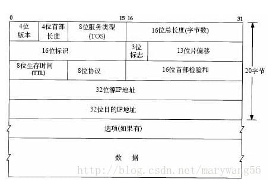

# 速查

---

# 各种帧、报文格式

<p align="center"><b>IP报文</b></p>
<p align="center">
    
</p>

<p align="center"><b>UDP报文格式</b></p>
<p align="center">
    
</p>

<p align="center"><b>TCP报文格式</b></p>
<p align="center">
    
</p>

<p align="center"><b>MAC帧格式</b></p>
<p align="center">
    
</p>

<p align="center"><b>PPP帧格式</b></p>
<p align="center">
    
</p>

<p align="center"><b>帧中继的帧格式</b></p>
<p align="center">
    
</p>

---

# IP、MAC、掩码
## MAC

```
1B = 8位(bits)
| I/G | G/L | 字节 | 由厂商分配 |
长 48 位(6B)采用 16 进制
|    24位OUI       |  24位    |
```

---

## ipv4

- 长 32 位,有 43 亿
- A 类:0~127
- B 类:128~191
- C 类:192~223
- D 类:224~239 用于组播地址
- E 类:240~255 用于科学用途

**私有 IP**

- A 类:10.0.0.0~10.255.255.255
- B 类:172.16.0.0~172.31.255.255
- C 类:192.168.0.0~192.168.255.255

**保留地址**

- A 类:127.0.0.0~127.255.255.255 私有地址,用做循环测试
- B 类:169.254.0.0~169.254.255.255 在 windows 上如果 IP 地址是 DHCP 方式获取,而在网络上又没有找到可用的 DHCP 服务器,这时将会从 169.254.0.1 到 169.254.255.254 中临时获得一个 IP 地址.
- D 类:224.0.0.0~244.0.0.255 只能用于局域网中,是协议保留地址,路由器不会转发
    ```
    224.0.0.1–在本地子网的所有系统
    224.0.0.2–在本地子网的所有路由器
    224.0.0.5–OSPF 路由器
    224.0.0.6–OSPF 指定路由器
    224.0.0.9–RIPv2 路由器
    224.0.0.10–IGRP 路由器
    224.0.0.13–PIMv2 路由器
    224.0.0.22–IGMPv3
    ```

127.0.0.1 环回地址,代表电脑本地.

---

## ipv6

IPv6 是互联网协议的最新版本,用于数据包交换互联网络的网络层协议,旨在解决 IPv4 地址枯竭问题.

- 128 位,3.4 X 1038 个地址
- ipv6 不使用广播,它使用组播、单播、任意播
- IPv6 二进位制下为 128 位长度,以 16 位为一组,每组以冒号 ":" 隔开,可以分为 8 组,每组以 4 位十六进制方式表示.
- IPv6 在某些条件下可以省略,
- 规则 1:每项数字前导的 0 可以省略,省略后前导数字仍是 0 则继续.
- 规则 2:可以用双冒号 "::" 表示一组 0 或多组连续的 0,但只能出现一次.

**特殊地址**
- 0:0:0:0:0:0:0:0 ——通常在使用有状态 DHCP 配置时用作主机的源地址
- 0:0:0:0:0:0:0:1 ——相当于 IPv4 地址 127.0.0.1
- 2000::/3 全局单播
- FC00::/3 唯一的本地单播地址范围
- FE80::/10 链路本地单播地址范围
- FF00 ::/8 组播地址范围
- 2002 ::/16 供 6to4 隧道使用

---

## 子网掩码

命令:ip subnet - zero 能在网络设计中使用第一个和最后一个子网

- A 类 /8~/15
- B 类 /8~/23
- C 类 /8~/30

```
255.0.0.0                /8
255.128.0.0            /9
255.192.0.0            /10
255.224.0.0            /11
255.240.0.0            /12
255.248.0.0            /13
255.252.0.0            /14
255.254.0.0            /15

255.255.0.0           /16
255.255.128.0       /17
255.255.192.0       /18
255.255.224.0       /19
255.255.240.0       /20
255.255.248.0       /21
255.255.252.0       /22
255.255.254.0       /23

255.255.255.0       /24
255.255.255.128   /25
255.255.255.192   /26
255.255.255.224   /27
255.255.255.240   /28
255.255.255.248   /29
255.255.255.252   /30
```

---

## 二进制

```
1=2
22=4
23=8
24=16
25=32
26=64
27=128
28=256
29=512
210=1024
211=2048
212=4096
213=8192
214=16384
215=32768
216=65536
217=131072
218=262144
219=524288
220=1048576
221=2097152
222=4194304
223=8388608
224=16777216
```

---

## 通配符掩码

又称反掩码

例如:块为 7,掩码为 8

```
172.16.16.0 —— 0.0.03.255 范围 172.16.16.0~172.16.19.255
172.16.16.0 —— 0.0.7.255 范围 172.16.16.0~172.16.23.255
172.16.64.0 —— 0.0.63.255 范围 172.16.64.0~172.16.127.255
```
起始位置必须为 0 或块大小的整数倍,例如块大小为 8,起始位置不能是 12,范围必须是 0~7、8~15、16~23

命令 any 与0.0.0.0 —— 255.255.255.255 等价
