# Windows 域搭建

---

# 域结构

创建域首先要创建 DC，DC 创建完成后，把所有的客户端加入到 DC，这样就形成了域环境。

DC 域控制器是由工作组计算机升级而成，通过 dcpromo 命令就可以完成升级。只有 Windows Server（WEB 版本除外）才可以提升为域控制器。在升级 DC 之前不需要安装 DNS 服务，域控制器上必须要有 NTFS 文件系统的分区。

---

# 安装域控

这里域为 ffffffff0x.com

## Windows Server 2008 R2 安装域控

首先，域控制器需要固定的 ip 地址以及 DNS 服务器为自己


WIN+R ，打开运行框，输入：dcpromo


一路下一步,选择 “在新林中新建域”

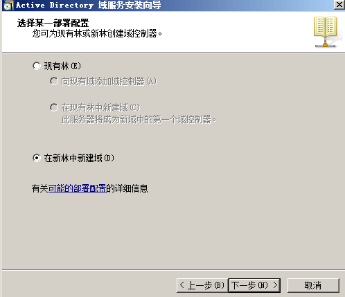

填写域名(FQDN)


设置林功能级别位 2008 R2


然后它会自动检查 DNS 的配置，需要会时间。

如果你主机原来没有安装 DNS 的话，它会自动帮你勾选上 DNS，然后你点击下一步就可以，这时会弹出无法创建 DNS 服务器的委派，无视，直接点击 “是” 即可。


安装位置默认即可，因为 SYSVOL 文件必须得在 NTFS 文件系统的磁盘上，所以域控服务器必须得有 NTFS 文件系统的分区。


然后填目录还原模式的 Administrator 密码，这里就填 Abcd1234，下一步


等待安装完毕,然后重启计算机以完成配置。

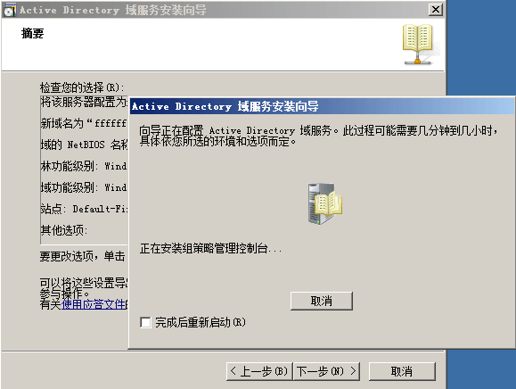

---

**配置检查**

重新启动后，第一次登陆需要修改密码,这里改成 Abcd12345 ,然后检查下面这些是否正确
- 检查活动目录是否正常安装
- 检查 DNS 服务域控制器注册的 SRV 记录

打开服务器管理器,查看角色


查看 DNS

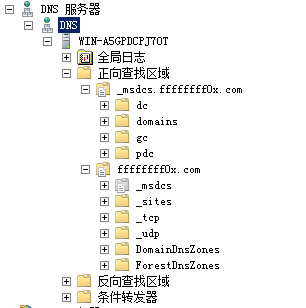

在计算机成为域控后，该主机上之前的账号将全部变为域账号，这些账号将不能以本地登录方式登录。成为域控之后新建的用户，必须满足密码规则。如果成为域控后新建的用户不属于 administrators 组，则这些用户可以登录除域控外的其他域内主机。域控只允许 administrators 组内的用户以域身份登录，域控不能以本地身份登录。

域控中 administrator 组内的用户都是域管理员！

---

## Windows Server 2019 安装域控

首先，和 2008 一样,域控制器需要固定的 ip 地址以及 DNS 服务器为自己,这里略

然后在服务器管理器中点击添加角色和功能

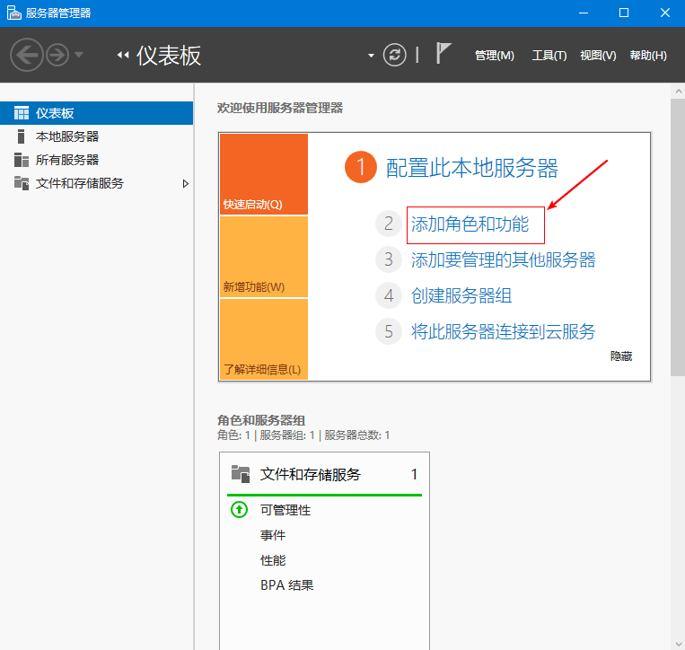

安装前的检查提示，直接下一步，默认选择基于角色或基于功能的安装，直接下一步


默认选择安装在当前的服务器上，直接下一步


选择 Active Directory 域服务

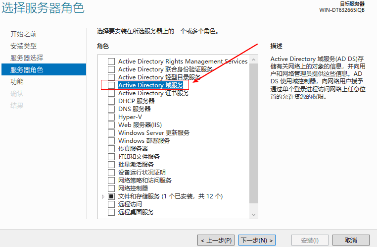

弹出提示，直接点击添加功能

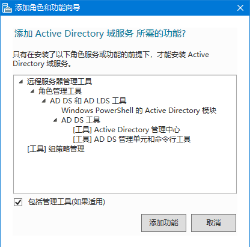

一路下一步,到安装，等待角色安装完成，点击将此服务器提升为域控制器

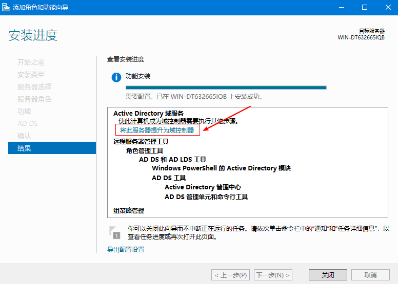

**将服务器提升为域控制器**

选择添加新林，输入根域名，点击下一步

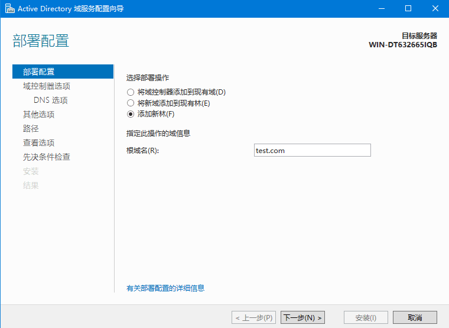

这里选择林和域的功能级别，还有密码

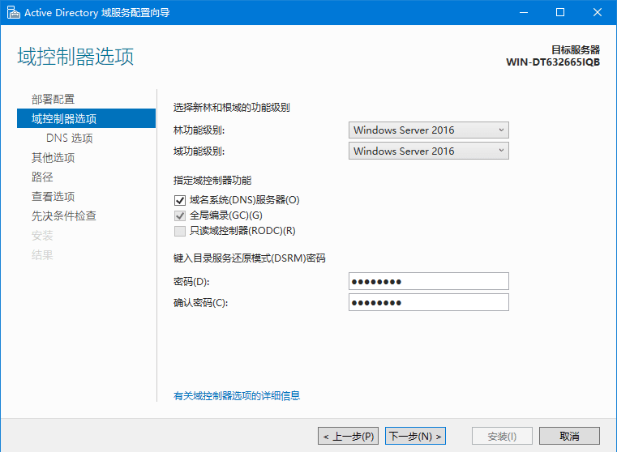

然后一路下一步,直到安装完成,安装完成后会自动重启

---

**检查**

重新启动后，第一次登陆需要修改密码,这里改成 Abcd12345 ,然后检查下面这些是否正确

打开管理工具中的 “Active Directory 用户和计算机”


DNS管理器


---

# 加入域

加入之前创建好的 ffffffff0x.com ,域控 IP 192.168.141.141

## 2008 加入域

首先将主机的 DNS 指向域控服务器的 ip，并且确保两者之间能通,这里略

计算机-属性-高级系统设置-计算机名，更改,然后将主机的域名修改为域对应的名字，确定


然后会叫你输入域内的用户名，administrator 和 域内普通用户名 都可。


- ffffffff0x\Administrator
- Abcd12345


然后重启

当计算机加入域后，系统会自动将域管理员组添加到本地系统管理员组中。

---

## Win7 加入域

过程和 2008 没什么区别,这里给 win7 单独在域控上创建一个用户


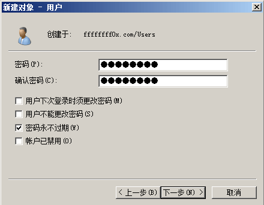

密码就填 Abcd1234 即可

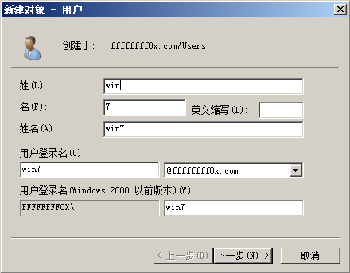

然后在 win7 中,首先将主机的 DNS 指向域控服务器的 ip，并且确保两者之间能通,这里略

打开计算机-属性-高级系统设置-计算机名，更改,然后将主机的域名修改为域对应的名字，确定


---

# 域中主机的登录

如果你是想以本地的用户登录，主机名\用户名 ，该方式是通过SAM来进行NTLM认证的。

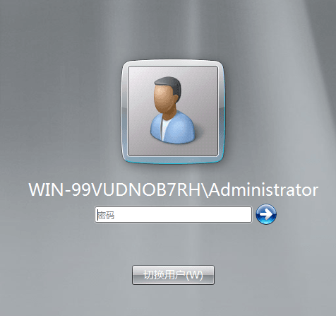

如果你是以域中的用户登录，域名\用户名 (域名部分不用加.com) 或者用户名@域名，该方式是通过Kerberos协议进行认证的


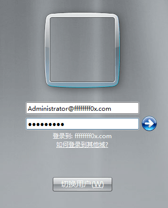

在域控上，使用 dsquery computer 命令可以查询域内所有的主机。


域控上的所有用户均可以登录域中的任意一台主机(域控除外，默认情况下域控只允许域内的 Administrator 用户才能登陆)，而域中的普通主机上的用户只能以本地身份登录该主机。

---

# 域中主机的退出

计算机要么是工作组计算机，要么是域中的计算机，不能同时属于域和工作组，如果将计算机加入到工作组，计算机将自动从域中退出。退出时需要输入域管理员账号和密码。


---

# 域用户管理

**添加域用户**

在域控上添加的用户都是域用户。如果想在其他域成员主机上添加域用户，需要在域成员主机上以域管理员权限登录，然后执行以下命令添加域用户
```
net user test Abcd1234 /add /domain                 添加域用户 test，密码为 Abcd1234
net group "domain admins" test /add /domain         将域用户 test 添加到域管理员组
```

**禁用域中的账户**

加入到域的计算机，如果不打算让使用者在该计算机上使用域用户登录，可以禁用计算机账户。但是这样只会禁止域控服务器在成为域控服务器之后创建的用户，之前创建的用户不受影响

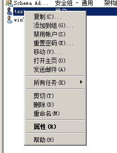

---

# SRV 出错及解决办法

由于某种原因，装完活动目录后发现 DNS 上正向区域的 SRV 记录不全或者没有，需要采取以下措施，强制让域控制器向 DNS 注册 SRV 记录。

删除 DNS 服务器上的正向解析。然后 管理工具→DNS→正向查找区域→右键，新建 _msdcs.ffffffff0x.com 和 ffffffff0x.com 的区域

然后重启 netlogon 服务 停止服务命令：net stop netlogon  启动服务命令：net start netlogon

**SRV 记录注册不成功的可能原因**

1. DNS 区域名称是否正确，是否允许安全更新
2. 确保域控制器全名已经包含了活动目录的名字
3. 确保域控制器的 TCP/IP 属性已经选中“在DNS中注册此链接的地址”

---

**Source & Reference**
- [内网渗透 | 搭建域环境](https://mp.weixin.qq.com/s/SUznjF43IPSigGnkvEve9g)
- [最快的方式搭建域环境](https://payloads.online/archivers/2019-04-13/1)
- [Windows Server 2019 安装DC域控](https://blog.51cto.com/12025450/2446545)
