# 认证

> 注 : 笔记中拓扑图 drawio 与 xmind 源文件在其图片目录下

---

<p align="center">
    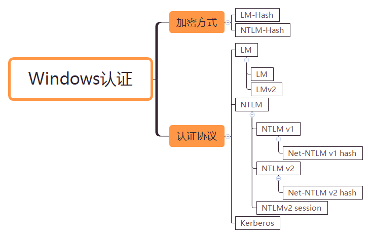
</p>

---

# 大纲

* **[本地认证](#本地认证)**
    * [LM-Hash](#lm-hash)
    * [NTLM-Hash](#ntlm-hash)
    * [本地认证流程](#本地认证流程)

* **[网络认证](#网络认证)**
    * [LM](#lm)
    * [NTLM](#ntlm)
        * [Challenge/Response](#challengeresponse)
        * [NTLMv2](#ntlmv2)
        * [Net-NTLM hash](#net-ntlm-hash)
    * [域环境中NTLM认证方式](#域环境中ntlm认证方式)
    * [SSP & SSPI](#ssp--sspi)

* **[域认证](#域认证)**
    * [Kerberos](#kerberos)
        * [简要概括认证过程](#简要概括认证过程)
        * [详细概括认证过程](#详细概括认证过程)
    * [PAC](#pac)
    * [SPN](#spn)
    * [委派](#委派)
        * [约束委派](#约束委派)
        * [基于资源的约束委派](#基于资源的约束委派)

---

# 本地认证

在 Windows 系统中本机的用户密码以 hash 形式存储在 `%SystemRoot%\system32\config\sam` 数据库文件中。sam 的简称是Security Account Manager，安全账户管理器。被保存的 hash 分为 `LM Hash` 和 `NTLM hash`；微软在 Windows NT 4.0 中引入 SYSKEY 对 `SAM` 文件加密。而域内用户的密码 Hash 是存在域控的 `NTDS.DIT` 文件里面。

这个 SAM 文件中保留了计算机本地所有用户的凭证信息，可以理解为是一个数据库。登录系统的时候,系统会自动地读取 `SAM` 文件中的密码与键入的密码进行比对，如果相同，则认证成功。

操作系统启动之后，`SAM` 文件将同时被锁定。这意味着操作系统运行之时，用户无法打开或复制 `SAM` 文件。除了锁定，整个 `SAM` 文件还经过加密，且不可见。

**哈希（hash）**

Windows 本身不保存明文密码，只保留密码的 Hash。为了保证存储的不是明文，从而采用 Hash，但是密码 Hash 也需要特定的生成算法以及表现形式。

Hash 就是使用一种加密函数进行计算后的结果。这个加密函数对一个任意长度的字符串数据进行一次数学加密函数运算，然后返回一个固定长度的字符串。现在已经有了更新的 NTLMv2 以及 Kerberos 验证体系。Windows 加密过的密码口令，我们称之为 hash，Windows 的系统密码 hash 默认情况下一般由两部分组成：第一部分是 LM-hash，第二部分是 NTLM-hash。

---

## LM-Hash

LAN Manager（LM）哈希是 Windows 系统所用的第一种密码哈希算法，是一种较古老的 Hash，在 LAN Manager 协议中使用，非常容易通过暴力破解获取明文凭据。它只有唯一一个版本且一直用到了 NT LAN Manager（NTLM）哈希的出现，在 Windows Vista/Windows 7/Windows Server 2008 以及后面的系统中，LM 哈希算法是默认关闭的，LM 算法是在 DES 基础上实现的，不区分字母大小写，由 IBM 设计。

**生成原理**
1. 用户的密码转换为大写，密码转换为16进制字符串，不足14字节将会用0来再后面补全。
2. 密码的16进制字符串被分成两个 7byte 部分。每部分转换成比特流，并且长度位 56bit，长度不足用0在左边补齐长度
3. 再分 7bit 为一组,每组末尾加 0，再组成一组
4. 上步骤得到的二组，分别作为 key 为 `KGS!@#$%` 进行 DES 加密。
4. 将加密后的两组拼接在一起，得到最终 LM HASH 值。

**风险**

LM 加密算法存在一些固有的漏洞
1. 首先，密码长度最大只能为14个字符
2. 密码不区分大小写。在生成哈希值之前，所有密码都将转换为大写
3. 查看我们的加密过程，就可以看到使用的是分组的 DES，如果密码强度是小于 7 位，那么第二个分组加密后的结果肯定是 aad3b435b51404ee，同理,如果我们看到 lm hash 的结尾是 aad3b435b51404ee，就可以判断密码强度少于7位
4. 一个14个字符的密码分成7 + 7个字符，并且分别为这两个半部分计算哈希值。这种计算哈希值的方式使破解难度成倍增加，因为攻击者需要将7个字符（而不是14个字符）强制暴力破解。这使得14个字符的密码的有效强度等于，或者是7个字符的密码的两倍，该密码的复杂度明显低于 95<sup>14</sup> 14个字符的密码的理论强度。
5. Des 密码强度不高

---

## NTLM-Hash

**NTLM Hash**

为了解决 LM 加密和身份验证方案中固有的安全弱点，Microsoft 于 1993 年在 Windows NT 3.1 中引入了 NTLM 协议。

NT LAN Manager（NTLM）哈希是 Windows 系统认可的另一种算法，用于替代古老的 LM-Hash，一般指 Windows 系统下 Security Account Manager（SAM）中保存的用户密码 hash，在 Windows Vista/Windows 7/Windows Server 2008 以及后面的系统中，NTLM 哈希算法是默认启用的。

下面是各个版本对 LM 和 NTLM 的支持。

|       | 2000  | XP | 2003 | Vista | Win7 | 2008 | Win8 | 2012 |
| -     | -     | -  |  -   |   -   |  -   |  -   |  -   |  -   |
| LM    | ✔     | ✔  |  ✔  |       |      |      |      |      |
| NTLM  | 🔺    | 🔺 | 🔺  |   ✔   |  ✔  |   ✔  |   ✔  |   ✔  |

---

| ✔ | 系统默认使用的加密方式         |
| -  | -                          |
| 🔺 | 当密码超过14位时使用的加密方式 |

当用户登录时，将用户输入的明文密码加密成 `NTLM Hash`，与 `SAM` 数据库文件中的 `NTLM Hash` 进行比较。

在渗透测试中，通常可从 Windows 系统中的 `SAM` 文件和域控的 `NTDS.dit` 文件中获得所有用户的 hash，通过 Mimikatz 读取 `lsass.exe` 进程能获得已登录用户的 `NTLM hash`。

**生成原理**
1. 先将用户密码转换为十六进制格式。
2. 将十六进制格式的密码进行 Unicode 编码。
3. 使用 MD4 摘要算法对 Unicode 编码数据进行 Hash 计算

**快速生成**
```bash
python2 -c 'import hashlib,binascii; print binascii.hexlify(hashlib.new("md4", "P@ssw0rd".encode("utf-16le")).digest())'
```

**NTLM Hash 与 NTLM 的关系**

在 Windows 中，密码 Hash 目前称之为 NTLM Hash，其中 NTLM 全称是：“NT LAN Manager”。

而 NTLM 是一种网络认证协议，与 NTLM Hash 的关系就是：NTLM 网络认证协议是以 NTLM Hash 作为根本凭证进行认证的协议。也就是说，NTLM 与 NTLM Hash 相互对应。

在本地认证的过程中，其实就是将用户输入的密码转换为 NTLM Hash 与 SAM 中的 NTLM Hash 进行比较。

---

## 本地认证流程

本地登录时，用户的密码存储在 `%SystemRoot%\system32\config\SAM` 这个文件里。当用户输入密码进行本地认证的过程中，所有的操作都是在本地进行的。他其实就是将用户输入的密码转换为 NTLM Hash，然后与 SAM 中的 NTLM Hash 进行比较。当用户注销、重启、锁屏后，操作系统会让 winlogon 显示登录界面，也就是输入框。当 winlogon.exe 接收输入后，将密码交给 lsass 进程，这个进程中会存一份明文密码，将明文密码加密成 NTLM Hash，对 SAM 数据库比较认证。

- Windows Logon Process(即 winlogon.exe)，是Windows NT 用户登陆程序，用于管理用户登录和退出。
- LSASS 用于微软 Windows 系统的安全机制。用于本地安全和登陆策略。

**参考如下**

```bash
winlogon.exe -> 接收用户输入 -> lsass.exe -> 认证
```

1. 当刚开机、注销等操作后，winlogon.exe 进程会显示一个登录界面要求输入用户名和密码。
2. 输入用户名和密码后，会被 winlogon.exe 获取，然后将其发送给 lsass.exe 进程。
3. lsass.exe 将明文密码计算得到 NT Hash（不考虑LM）。
4. 之后会将用户名和密码计算得到的 NT Hash 拿到 SAM 数据库去查找比对。

    

---

# 网络认证

在内网渗透中，经常遇到工作组环境，而工作组环境是一个逻辑上的网络环境(工作区)，隶属于工作组的机器之间无法互相建立一个完美的信任机制，只能点对点，是比较落后的认证方式，没有信托机构。

假设 A 主机与 B 主机属于同一个工作组环境，A 想访问 B 主机上的资料，需要将一个存在于 B 主机上的账户凭证发送至 B 主机，经过认证才能够访问 B 主机上的资源。

这是我们接触比较多的 SMB 共享文件的案例，SMB 的默认端口是 445。

早期 SMB 协议在网络上传输明文口令。后来出现 LAN Manager Challenge/Response 验证机制，简称 LM，它很容易被破解，就又有了 NTLM 以及 Kerberos。

---

## LM

LM 与 NTLM 协议的认证机制相同，但是加密算法不同。

目前大多数的 Windows 都采用 NTLM 协议认证，LM 协议已经基本淘汰了。

---

## NTLM

**认证的应用**

在域环境下，可以使用 Kerberos 或者 NTLM 认证来实现对用户的身份认证。在很多企业的内部网络中(基本都是域环境)，都是使用 Kerberos认证或 NTLM 认证，在 Windows 2000 以后，在域环境下，Kerberos 是默认的认证方式。因为由于 NTLM 认证存在安全风险，所以用 Kerberos 认证的较多。Kerberos 较之 NTLM 更高效、更安全，同时认证过程也相对复杂。在非域环境下，一般都是使用 NTLM 进行认证。SMB 服务和很多 Web 程序都是使用 NTLM 来实现对用户的身份认证。

**什么是 NTLM**

NTLM 是一种网络认证协议,以 NTLM Hash 作为凭证进行认证。NTLM Hash 长度为32位，由数字和字母组成,采用挑战/响应（Challenge/Response）的消息交换模式，

这个协议只支持 Windows.

NTLM 协议的认证过程分为三步：
- 协商 : 主要用于确认双方协议版本
- 质询 : 就是挑战（Challenge）/响应（Response）认证机制起作用的范畴
- 验证 : 验证主要是在质询完成后，验证结果，是认证的最后一步。

### Challenge/Response

1. 客户端需要访问服务器的某个服务(前提是他得知道服务器的用户名和密码)，所以得进行身份认证。于是，客户端输入服务器的用户名和密码进行验证，客户端会缓存服务器密码的 NTLM-Hash 值。客户端发送 TYPE 1 Negotiate 协商消息去协商需要认证的主体，用户(服务器端的用户名)，机器以及需要使用的安全服务等等信息。
2. 服务端接收到客户端发送过来的 TYPE 1 消息，会读取其中的内容，并从中选择出自己所能接受的服务内容，加密等级，安全服务等等。然后传入 NTLM SSP，得到 NTLM_CHALLENGE 消息（被称为 TYPE 2 消息，Challenge 挑战消息），并将此 TYPE 2 消息发回给客户端。此TYPE 2消息中包含了一个由服务端生成的 16 位随机值，此随机值被称为 Challenge，服务器将该 Challenge 保存起来。
3. 客户端收到服务端返回的 TYPE 2 消息， 读取出服务端所支持的内容，并取出其中的随机值 Challenge，用缓存的服务器端密码的哈希值 NTLM-Hash 对其进行加密，得到 Net NTLM-Hash(加密后的 Challenge)，并且将 Net NTLM-Hash 封装到 NTLM_AUTH 消息中（被称为 TYPE 3 消息， Authenticate 认证消息），发往服务端。
4. 服务器在收到 Type3 的消息之后，用自己的密码的 NTLM-Hash 对 Challenge 进行加密，并比较自己计算出的 Net NTLM-Hash 认证消息和客户端发送的认证消息是否匹配。如果匹配，则证明客户端掌握了正确的密码，认证成功，否则认证失败。

    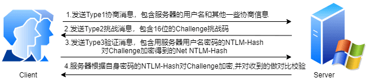

**详细过程**

- type 1 协商

    这个过程是客户端向服务器发送 type 1(协商)消息,它主要包含客户端支持和服务器请求的功能列表。

    主要包含以下结构

    

    

- type 2 质询

    这个过程是服务器用 type 2 消息(质询)进行响应，这包含服务器支持和同意的功能列表。但是，最重要的是，它包含服务器产生的 Challenge。

    主要包含以下结构

    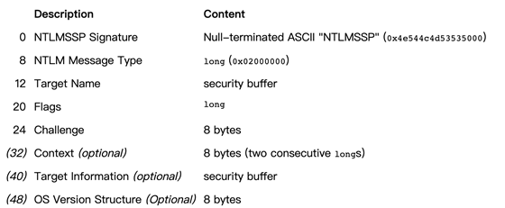

    其中最主要的信息是 challenge。后面加密验证依赖于 challenge

    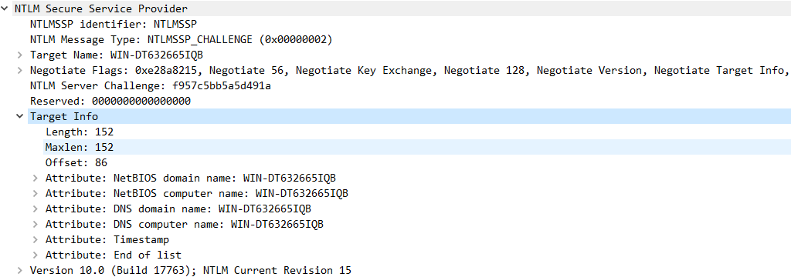

- type 3 身份验证

    这个过程客户端接收到 challenge 之后，使用用户 hash 与 challenge 进行加密运算得到 response，将 response,username,challenge 发给服务器。消息中的 response 是最关键的部分，因为它向服务器证明客户端用户已经知道帐户密码。

    主要包含以下结构

    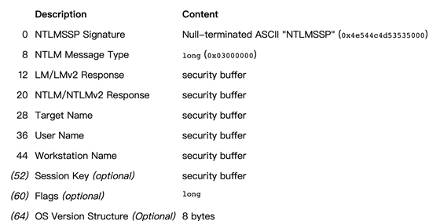

    这里的 Challeng 不同于 type2 的 Challenge，这里的 Challenge 是一个随机的客户端 nonce。

    MIC 是校验和，设计 MIC 主要是为了防止这个包中途被修改

    sessionkey 是在要求进行签名的时候用的，用来进行协商加密密钥，可能有些文章会说 sessionkey 就是加密密钥，需要拥有用户 hash 才能计算出来，因此攻击者算不出来，就无法加解密包。但是想想就不可能，这个 session_key 已经在流量里面明文传输，那攻击者拿到之后不就可以直接加解密包了。

    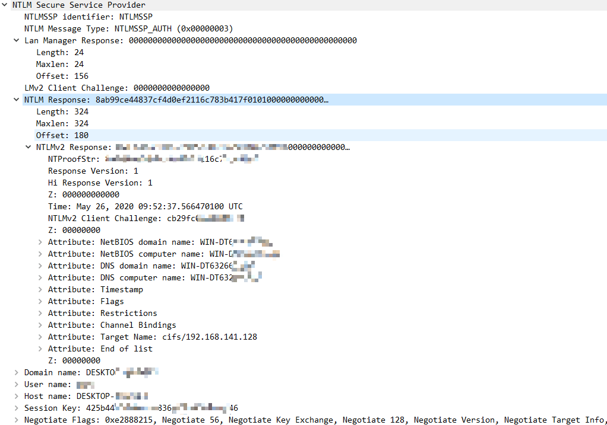


**注意**

1. Chanllenge 是 Server 产生的一个 16 字节的随机数，每次认证都不同
2. Response 的表现形式是 Net-NTLM Hash，它是由客户端提供的密码 Hash 加密 Server 返回的 Chanllenge 产生的结果。

---

### NTLMv2

NTLMv1 和 NTLMv2 的加密因素都是 NTLM Hash，而最显著的区别就是 Challenge 和加密算法不同,共同点就是加密的原料都是 NTLM Hash。
- Challage： NTLMv1 的 Challenge 有 8 位，NTLMv2 的 Challenge 为 16 位。
- Net-NTLM Hash：NTLMv1 的主要加密算法是 DES，NTLMv2 的主要加密算法是 HMAC-MD5。

设置系统使用 LM 还是 NTLM 还是 NTLMv2，需要修改 Local Security Policy 中的 LmCompatibilityLevel 选项


---

### Net-NTLM hash

在 type3 中的响应，有六种类型的响应
1. LM(LAN Manager)响应 – 由大多数较早的客户端发送，这是“原始”响应类型。
2. NTLM v1 响应 – 这是由基于 NT 的客户端发送的，包括 Windows 2000 和 XP。
3. NTLMv2 响应 – 在 Windows NT Service Pack 4 中引入的一种较新的响应类型。它替换启用了 NTLM 版本 2 的系统上的 NTLM 响应。
4. LMv2 响应 – 替代 NTLM 版本 2 系统上的 LM 响应。
5. NTLM2 会话响应 – 用于在没有 NTLMv2 身份验证的情况下协商 NTLM2 会话安全性时，此方案会更改 LM NTLM 响应的语义。
6. 匿名响应 – 当匿名上下文正在建立时使用; 没有提供实际的证书，也没有真正的身份验证。“存 根”字段显示在类型 3 消息中。

这六种使用的加密流程一样，都是 Challenge/Response 验证机制,区别在 Challenge 和加密算法不同。

在以上流程中，登录用户的密码 hash 即 NTLM hash，其中，经过 NTLM Hash 加密 Challenge 的结果在网络协议中称之为 Net NTLM Hash，response 中包含 Net-NTLM hash.

在 NTLM 认证中，NTLM 响应分为 NTLM v1，NTLMv2，NTLM session v2 三种协议，不同协议使用不同格式的 Challenge 和加密算法.所以也就存在不同协议的 Net-NTLM hash，即 Net-NTLM v1 hash，Net-NTLM v2 hash

---

**Net-NTLM v1 hash**

v1 是将 16字节的 NTLM hash 空填充为 21 个字节，然后分成三组，每组7比特，作为 3DES 加密算法的三组密钥，加密 Server 发来的 Challenge。 将这三个密文值连接起来得到 response。

**Net-NTLM v2 hash**

v2 将 Unicode 后的大写用户名与 Unicode 后的身份验证目标（在 Type 3 消息的”TargetName”字段中指定的域或服务器名称）拼在一起。请注意，用户名将转换为大写，而身份验证目标区分大小写，并且必须与“TargetName”字段中显示的大小写匹配。使用 16 字节 NTLM 哈希作为密钥，得到一个值。

建一个 blob 信息

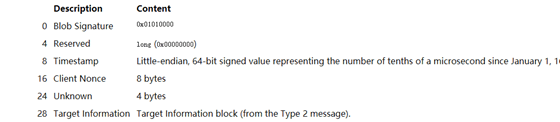

使用 16 字节 NTLMv2 哈希作为密钥，将 HMAC-MD5 消息认证代码算法加密一个值(来自 type 2 的 Challenge 与 Blob 拼接在一起)。得到一个 16 字节的 NTProofStr。

将 NTProofStr 与 Blob 拼接起来形成得到 response。至于选择哪个版本的响应由 LmCompatibilityLevel 决定。

Challenge/Response 验证机制里面 type3 response 里面包含 Net-ntlm hash，NTLM v1 响应和 NTLMv2 响应对应的就是 Net-ntlm hash 分为 Net-ntlm hash v1 和 Net-ntlm hash v2。

Net-ntlm hash v1 的格式为：
> username::hostname:LM response:NTLM response:challenge

Net-ntlm hash v2 的格式为：
> username::domain:challenge:HMAC-MD5:blob

下面演示从 response 里面提取 NTLMv2


这里的 challenge 是 type2 服务器返回的 challenge 不是 type3 流量包里面的 client Challenge


就是 18f77b6fe9f8d876

HMAC-MD5 对应数据包中的 NTProofSt : 0ecfccd87d3bdb81713dc8c07e6705b6

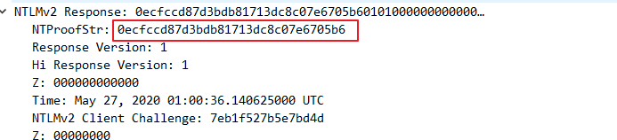

blob 就是 response 减去 NTProofStr。(因为在计算 response 的时候，response 就是由 NTProofStr 加上 blob)

- username（要访问服务器的用户名）：Administrator
- domain（访问者主机名或者 ip）：DESKTOP-QKM4NK7
- challenge（数据包 2 中服务器返回的 challenge 值）：18f77b6fe9f8d876
- HMAC-MD5（数据包 3 中的 NTProofStr）: 0ecfccd87d3bdb81713dc8c07e6705b6
- blob（blob 对应数据为 NTLMv2 Response 开头去掉 NTProofStr 的后半部分）：01010000000000002a470d3bc233d6017eb1f527b5e7bd4d0000000002001e00570049004e002d0041003500470050004400430050004a0037004f00540001001e00570049004e002d0041003500470050004400430050004a0037004f00540004001e00570049004e002d0041003500470050004400430050004a0037004f00540003001e00570049004e002d0041003500470050004400430050004a0037004f005400070008002a470d3bc233d601060004000200000008003000300000000000000001000000002000003737fbe7dbcbd2c8e5d7a030f44586c91423d9c5202f827f3f6cf26f69adbfe80a001000000000000000000000000000000000000900280063006900660073002f003100390032002e003100360038002e003100340031002e003100330039000000000000000000

所以最后，Net-NTLM v2 Hash 值为：
```
Administrator::DESKTOP-QKM4NK7:18f77b6fe9f8d876:0ecfccd87d3bdb81713dc8c07e6705b6:01010000000000002a470d3bc233d6017eb1f527b5e7bd4d0000000002001e00570049004e002d0041003500470050004400430050004a0037004f00540001001e00570049004e002d0041003500470050004400430050004a0037004f00540004001e00570049004e002d0041003500470050004400430050004a0037004f00540003001e00570049004e002d0041003500470050004400430050004a0037004f005400070008002a470d3bc233d601060004000200000008003000300000000000000001000000002000003737fbe7dbcbd2c8e5d7a030f44586c91423d9c5202f827f3f6cf26f69adbfe80a001000000000000000000000000000000000000900280063006900660073002f003100390032002e003100360038002e003100340031002e003100330039000000000000000000
```

上面的 Net-NTLM v2 Hash 值若使用 hashcat 爆破应为 Abcd1234

抓包过程见 [Wireshark笔记](../../../安全/工具/Wireshark.md#ntlmv2) 案例中 NTLMv2 部分

---

## 域环境中NTLM认证方式

1. 用户通过输入 Windows 帐号和密码登录客户端主机，客户端会缓存密码的哈希值 NTLM-Hash。成功登录客户端的用户如果试图访问服务器资源，需要向对方发送一个请求，该请求利用 NTLM SSP 生成 NTLM_NEGOTIATE 消息 （被称为 TYPE 1 消息，Negotiate 协商消息），并将 TYPE 1 消息发送给服务端中，该 TYPE 1 消息中包含一个以明文表示的用户名以及其他的一些协商信息(认证的主体，机器以及需要使用的安全服务等等信息)

2. 服务端接收到客户端发送过来的 TYPE 1 消息，会读取其中的内容，并从中选择出自己所能接受的服务内容，加密等级，安全服务等等。然后传入 NTLM SSP，得到 NTLM_CHALLENGE 消息（被称为 TYPE 2 消息，Challenge 挑战消息），并将此 TYPE 2 消息发回给客户端。此 TYPE 2 消息中包含了一个由服务端生成的16位随机值，此随机值被称为 Challenge，服务器将该 Challenge 保存起来。

3. 客户端收到服务端返回的 TYPE 2 消息， 读取出服务端所支持的内容，并取出其中的随机值 Challenge，用缓存的密码的哈希值 NTLM-Hash 对其进行加密，得到 Net NTLM-Hash(加密后的 Challenge)，并且将 Net NTLM-Hash 封装到 NTLM_AUTH 消息中（被称为 TYPE 3 消息， Authenticate认证消息），发往服务端。

4. 服务器接收到客户端发送来的 NTLM_AUTH 的 TYPE 3 消息后，取出其中的 Net NTLM-Hash 值，并向 DC 域控（Domain Control）发送针对客户端的验证请求。该请求主要包含以下三方面的内容：客户端用户名、原始的 Challenge 和 加密后的 Challenge(也就是 Net NTLM-Hash)。

5. DC 根据用户名获取该帐号的密码哈希值 NTLM-Hash，用密码哈希值 NTLM-Hash 对原始的 Challenge 进行加密得到 Net NTLM-Hash。如果加密后的 Challenge 和服务器发送的一致，则意味着用户拥有正确的密码，验证通过，否则验证失败。DC 将验证结果发给服务器。

6. 服务器根据 DC 返回的结果，对客户端进行回复。

    

抓包过程见 [Wireshark笔记](../../../安全/工具/Wireshark.md#域环境中ntlm认证方式) 案例中 域环境中NTLM认证方式 部分

---

## SSP & SSPI

**SSPI(Security Support Provider Interface)**

这是 Windows 定义的一套接口，此接口定义了与安全有关的功能函数，用来获得验证、信息完整性、信息隐私等安全功能，就是定义了一套接口函数用来身份验证，签名等，但是没有具体的实现。

**SSP(Security Support Provider)**

SSPI 的实现者，对 SSPI 相关功能函数的具体实现。微软自己实现了如下的 SSP，用于提供安全功能：
- NTLM SSP
- Kerberos
- Cred SSP
- Digest SSP
- Negotiate SSP
- Schannel SSP
- Negotiate Extensions SSP
- PKU2U SSP

在系统层面，SSP 就是一个 dll，来实现身份验证等安全功能.不同的 SSP，实现的身份验证机制是不一样的。比如 NTLM SSP 实现的就是一种 Challenge/Response 验证机制。而 Kerberos 实现的就是基于 ticket 的身份验证机制。我们可以编写自己的 SSP，然后注册到操作系统中，让操作系统支持更多的自定义的身份验证方法。

我们抓包分析 ntlm 的时候，就会看到 ntlm 是放在 GSS-API 里面

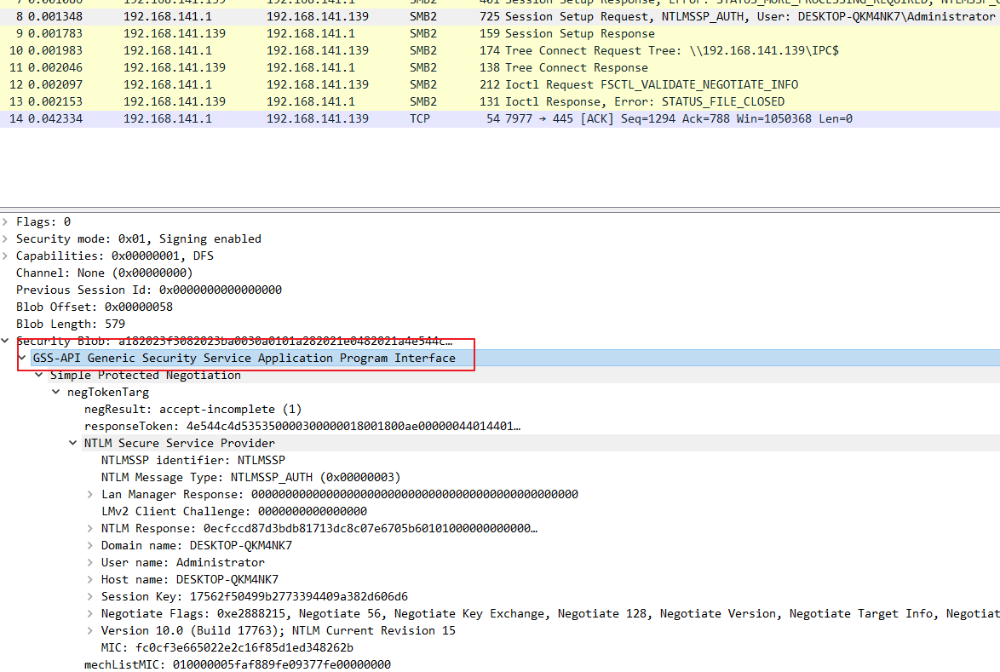

为啥这里会出现 GSSAPI 呢，SSPI 是 GSSAPI 的一个专有变体，进行了扩展并具有许多特定于 Windows 的数据类型。SSPI 生成和接受的令牌大多与 GSS-API 兼容。所以这里出现 GSSAPI 只是为了兼容，我们可以不必理会。可以直接从 NTLM SSP 开始看起。注册为 SSP 的一个好处就是，SSP 实现了了与安全有关的功能函数，那上层协议(比如 SMB)在进行身份认证等功能的时候，就可以不用考虑协议细节，只需要调用相关的函数即可。而认证过程中的流量嵌入在上层协议里面。不像 kerbreos，既可以镶嵌在上层协议里面，也可以作为独立的应用层协议。ntlm 是只能镶嵌在上层协议里面，消息的传输依赖于使用 ntlm 的上层协议。比如镶嵌在 SMB 协议里,或镶嵌在 HTTP 协议。

---

# 域认证

域认证部分内容来自 <sup>[[浅学Windows认证](https://b404.xyz/2019/07/23/Study-Windows-Authentication/)]</sup><sup>、</sup><sup>[[彻底理解Windows认证 - 议题解读](https://payloads.online/archivers/2018-11-30/1)]</sup>

---

## Kerberos

**Kerberos 协议**

Kerberos 是一种计算机网络授权协议，用来在非安全网络中，对个人通信以安全的手段进行身份认证。软件设计上采用客户端/服务器结构，并且能够进行相互认证，即客户端和服务器端均可对对方进行身份认证。可以用于防止窃听、防止重放攻击、保护数据完整性等场合，是一种应用对称密钥体制进行密钥管理的系统。支持 SSO。Kerberos 的扩展产品也使用公开密钥加密方法进行认证。

当有 N 个人使用该系统时，为确保在任意两个人之间进行秘密对话，系统至少保存有它与每个人的共享密钥，所需的最少会话密钥数为 N 个。

Kerberos 协议基于对称密码学，并需要一个值得信赖的第三方。Kerberos 协议的扩展可以为认证的某些阶段提供公钥密码学支持。

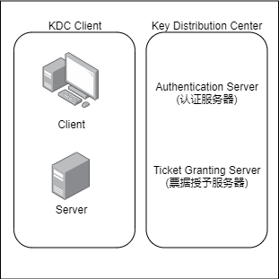

---

### 简要概括认证过程

Kerberos 认证用于域环境中，它是一种基于票据（Ticket）的认证方式。该认证过程的实现不依赖于主机操作系统的认证，无需基于主机地址的信任，不要求网络上所有主机的物理安全，并假定网络上传送的数据包可以被任意地读取、修改和插入数据。在以上情况下， Kerberos 作为一种可信任的第三方认证服务，是通过传统的密码技术(如:共享密钥)执行认证服务的。

客户端要访问服务器的资源，需要首先购买服务端认可的 ST 服务票据。也就是说，客户端在访问服务器之前需要预先买好票，等待服务验票之后才能入场。但是这张票不能直接购买，需要一张 TGT 认购权证(Ticket Granting Ticket)。也就是说，客户端在买票之前必须先获得一张 TGT 认购权证。这张 TGT 认购权证和 ST 服务票据均由 KDC 发售。

他的整个认证过程涉及到三方：客户端、服务端和 KDC（Key Distribution Center）。在 Windows 域环境中，由 DC(域控)来作为 KDC。

Kerberos 认证过程如下:

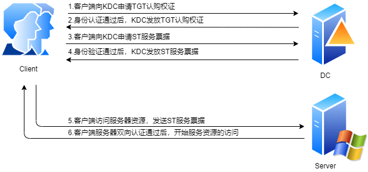

1. client 向 kerberos 服务请求，希望获取访问 server 的权限。 kerberos 得到了这个消息，首先得判断 client 是否是可信赖的，也就是白名单黑名单的说法。这就是 AS 服务完成的工作，通过在 AD 中存储黑名单和白名单来区分 client。成功后，返回 AS 返回 TGT 给 client。

2. client 得到了 TGT 后，继续向 kerberos 请求，希望获取访问 server 的权限。kerberos 又得到了这个消息，这时候通过 client 消息中的 TGT，判断出了 client 拥有了这个权限，给了 client 访问 server 的权限 ticket。

3. client 得到 ticket 后，终于可以成功访问 server。这个 ticket 只是针对这个 server，其他 server 需要向 TGS 申请。

**Kerberos 认证所参与的角色**
- 访问服务的 Client
- 提供服务的 Server
- KDC(Key Distribution Center,密钥分发中心) = DC(Domain Controller)

其中 KDC 服务默认安装在一个域的域控中，而 Client 和 Server 为域内的用户或者是服务，如 HTTP 服务、SQL 服务。在 Kerberos 中 Client 是否有权限访问 Server 端的服务由 KDC 发放的票据来决定

**认证中涉及到的部分词汇**
- Authentication Server : 为 Client 生成 TGT 的服务。 AS 的作用是验证 Client 端的身份，验证通过就会给一个 TGT 票据给 Client
- AD(Account Database) : 活动目录,存储所有 Client 白名单，只有存在于白名单的 Client 才能申请到 AS 给的 TGT，类似于本机 SAM,在 DC 上
- DC(Domain Controller) : 域控
- KDC(Key Distribution Center) : 密钥分发中心，由域控担任
- KAS(Kerberos Authentication Service) : Kerberos 认证服务
- TGT(Ticket Granting Ticket) : 入场券，通过入场券能够获得票据，是一种临时凭证的存在
- TGS(Ticket Granting Server) : 为 client 生成某个服务的 ticket。 TGS 的作用是通过 AS 发送给 Client 的 TGT 换取访问 Server 端的 ST 票据。ST 也有资料称为 TGS Ticket，为了和 TGS 区分，此处使用 ST
- ST(Ticket) : 票据,是网络对象互相访问的凭证。
- Session Key : 会话密钥，只有 Client 和 TGS 知道
- krbtgt 账户：每个域控制器都有一个 krbtgt 的用户，是 KDC 的服务账户，用来创建票据授予服务（TGS）加密的密钥。

**获得认购权证**

首先，我们来看看客户端如何获得 `TGT 认购权证`。TGT 是 KDC 的 KAS 认证服务（Kerberos Authentication Service）发放的。

1. 当某个用户通过输入域帐号和密码试图登录某台主机的时候，本机的 Kerberos 服务会向 KDC 的 KAS 认证服务发送一个认证请求。该请求主要包括两部分内容，明文形式的用户名和用用户秘钥加密原始 `Authenticator` 后得到的加密后 `Authenticator`(Authenticator 是客户端和服务端可以用于验证对方身份的一个东西)。

2. 当 KDC 接收到请求之后，通过 AD 查询该用户名得到该用户的信息。通过查询得到的密码信息对 `Authenticator` 进行解密得到原始的 `Authenticator`。如果解密后的 `Authenticator` 和已知的 `Authenticator` 一致，则证明请求者提供的密码正确，即确定了登录者的真实身份。KAS 成功认证对方的身份之后，会先生成一个用用户密码加密后的用于确保该用户和 KDC 之间通信安全的 `Logon Session Key` 会话秘钥。KAS 接着为该用户创建 `TGT 认购权证`。`TGT` 主要包含两方面的内容：用户相关信息和原始 `Logon Session Key`，而整个 `TGT` 则通过 KDC 自己的密钥进行加密。最终，被不同密钥加密的 `Logon Session Key` 和 `TGT` 返回给客户端。

    

**获得 ST 服务票据**

经过上面的步骤，客户端获取了进入同域中其他主机入场券的 TGT 认购权证和 Logon Session Key，然后用自己的密钥解密 Logon Session Key 得到原始的 Logon Session Key。然后它会在本地缓存此 TGT 和原始 Logon Session Key。如果现在它需要访问某台服务器的资源，它就需要凭借这张 TGT 认购凭证向 KDC 购买相应的入场券。这里的入场券也有一个专有的名称——ST 服务票据（Service Ticket）。具体来说，ST 是通过 KDC 的另一个服务 TGS（Ticket Granting Service）出售的。

1. 客户端先向 TGS 发送一个 `ST 购买请求`，该请求主要包含如下的内容：客户端用户名、通过 `Logon Session Key` 加密的 `Authenticator`、`TGT` 和访问的服务器名(其实是服务)。

2. TGS 接收到请求之后，通过自己的秘钥解密 `TGT` 并得到原始 `Logon Session Key`，然后通过 `Logon Session Key` 解密 `Authenticator`，进而验证了对方的真实身份。TGS 完成对客户端的认证之后，会生成一个用 `Logon Session Key` 加密后的用于确保客户端-服务器之间通信安全的 `Service Session Key` 会话秘钥。然后为该客户端生成 `ST 服务票据`。`ST 服务票据`主要包含两方面的内容：客户端用户信息和原始 `Service Session Key`，整个 `ST` 通过服务器密码派生的秘钥进行加密。最终两个被加密的 `Service Session Key` 和 `ST` 回复给客户端。

    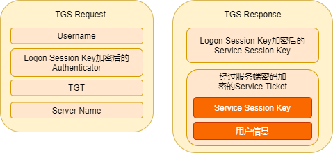

**用 ST 服务票据双向认证**

1. 客户端接收到 TGS 回复后，通过缓存的 `Logon Session Key` 解密得到原始 `Service Session Key`，同时它也得到了进入服务器 `ST 服务票据`。该 `Serivce Session Key` 和 `ST 服务票据` 会被客户端缓存。客户端访问某服务器资源，将 `ST 服务票据` 和 `Service Session Key` 加密的 `Authenticator` 发送给服务端。

2. 服务器收到客户端发来的 `ST 服务票据`。但是，服务端如何确保客户端发来的 `ST 服务票据` 是通过 `TGS` 购买，而不是自己伪造的呢？这很好办，不要忘了 ST 是通过服务器自己密码派生的秘钥进行加密的。具体的操作过程是这样的，服务器在接收到请求之后，先通过自己密码派生的秘钥解密 `ST`，并从中提取 `Service Session Key`。然后通过提取出来的 `Service Session Key` 解密 `Authenticator`，进而验证了客户端的真实身份。实际上，到目前为止，服务端已经完成了对客户端的验证，但是，整个认证过程还没有结束。谈到认证，很多人都认为只是服务器对客户端的认证，实际上在大部分场合，我们需要的是双向验证（Mutual Authentication），即访问者和被访问者互相验证对方的身份。现在服务器已经可以确保客户端是它所声称的那么用户，客户端还没有确认它所访问的不是一个钓鱼服务呢。为了解决客户端对服务器的验证，服务端需要将解密后的 `Authenticator` 再次用 `Service Session Key` 进行加密，并发挥给客户端。客户端再用缓存的 `Service Session Key` 进行解密，如果和之前的内容完全一样，则可以证明自己正在访问的服务器和自己拥有相同的 `Service Session Key`。双向认证过后，开始了服务资源的访问。

    

---

### 详细概括认证过程

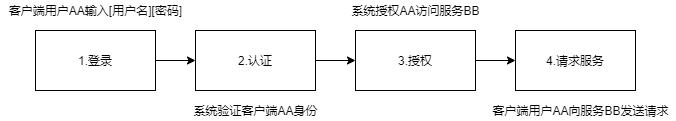

当 Client 想要访问 Server 上的某个服务时，需要先向 AS 证明自己的身份，然后通过 AS 发放的 TGT 向 Server 发起认证请求，这个过程分为三块：

- The Authentication Service Exchange： Client 与 AS 的交互
    - AS_REQ
    - AS_REP
- The Ticket-Granting Service (TGS) Exchange： Client 与 TGS 的交互
    - TGS_REQ
    - TGS_REP
- The Client/Server Authentication Exchange： Client 与 Server 的交互
    - AP_REQ
    - AP_REP

整体过程如图


- **用户登录**

    用户登录阶段，通常由用户(AA)输入[用户名][密码]信息，在客户端侧，用户输入的密码信息被一个单向 Hash 函数生成 Client 密钥，即 AA 的 NTLM Hash：

    

- **请求身份认证**

    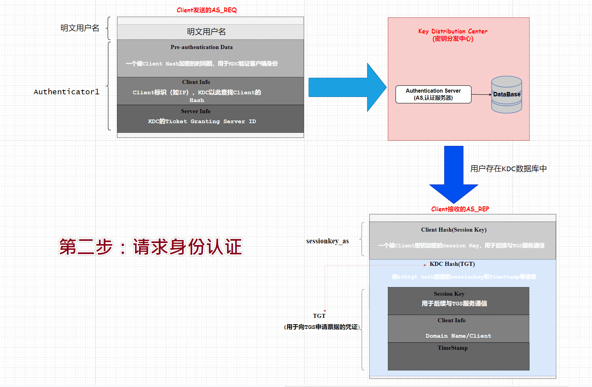

    - **客户端向 AS 发送请求认证**

        KRB-AS-REQ：Client 发送明文 `用户名 AA` 和 `Authenticator1` 信息到 KDC （Key Distribution Center）。Authenticator1 的内容为使用 Client 密码哈希加密的时间戳、Client ID、网络类型、加密类型等。

    - **AS 确认客户端登陆者身份**

        KRB-AS-REP：AS 收到用户认证请求后，AS 根据请求中的 `用户名 AA` 信息，从数据库中查找用户名是否存在。如果 `用户名 AA` 存在，则从 KDC 中可以获取 `用户 AA` 的密码，使用单向函数为该密码生成一个 `Client 密钥`（即NTLM Hash）。

        AS 生成随机字符串 `Client/TGS Session Key`，使用 `Client 密钥`(用户 AA 的密码 NTLM Hash)对 `Client/TGS Session Key` 加密得到 `sessionkey_as`；

        再使用 TGS 密钥(krbtgt 用户的 NTLM Hash)对 `Client/TGS Session Key` 、 `Client Info` 和 `Timestamp` 加密,得到 `TGT`（TGT票据）。

        将 `sessionkey_as` 和 `TGT` 一起返回给 Client。

        Client 收到 AS 的响应消息后，利用自身的 `Client 密钥`（AA 的 NTLM Hash）对 `sessionkey_as` 解密，这样就获取到 `Client/TGS Session Key`。

        - AS 的响应消息中有一条是属于 Client 的，有一条是 TGS 的。
        - TGT 的到期时间为 8 小时，如果超过了 8 小时，还需要重新申请 TGT，不能之间进入下一步获取 Ticket。
        - KDC 返回的 TGT 客户端是无法解密的，因为它没有 KDC Hash，如果有，我们就可以伪造黄金票据

- **请求授权访问服务**

    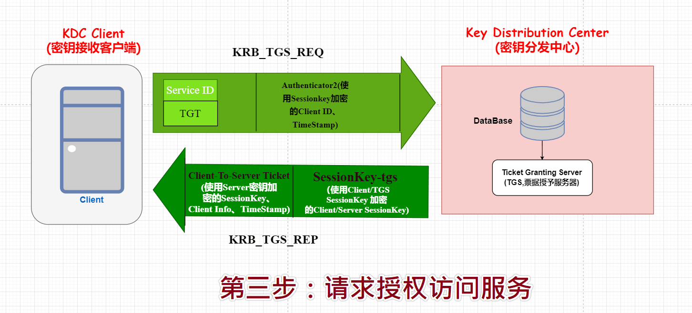

    - **客户端向 TGS 发送请求服务授权请求**

        KRB-TGS-REQ：Client 收到 `sessionkey_as` 和 `TGT` 后，使用 `Client 密钥`（AA 的 NTLM Hash）对 `sessionkey_as` 解密就能得到 `Client/TGS Session Key`，然后使用 `Client/TGS Session Key` 对 Client Info 和 timestamp 加密得到 `Authenticator2`。

        将 `Authenticator2`、`TGT`、`Service ID`（要请求的服务 ID）发送给 KDC 中的 TGS。

        - 由于 TGT 是使用 `TGS 密钥`(krbtgt 的 NTLM Hash)加密的，Client 无法对 TGT 解密。
        - 如果假设这个数据被中间人窃取到，也无法在短时间内破解，因为 KDC 会校验时间戳。

    - **TGS 为 Client 响应服务授权票据**

        TGS-REP：TGS 收到请求后，检查 KDC 数据库中是否存在所请求的服务(`Service ID`)。如果存在，TGS 使用 `TGS 密钥`(krbtgt 的 NTLM Hash)解密 TGT，得到 `Client/TGS Session Key`、timestamp、Client info；同时使用从 TGT 中解密得到的 `Client/TGS Session Key` 去解密 `Authenticator2`，得到 Client info 和 timestamp。 比对 `Authenticator2` 和 `TGT` 的解密内容以验证通过。

        - TGS 比对 `Authenticator2` 包含的 `Client ID` 和 `TGT` 中的 `Client ID`
        - 比较时间戳（误差范围在2分钟）
        - 通过生命周期字段检查 TGT 是否过期
        - 检查 `Authenticator2` 已经不再 TGS 的缓存中
        - 若原始请求中的网络地址不为 NULL，比较 TGT 中的 IP 和请求的 IP

        验证成功后，随机生成 Client 所请求服务的会话密钥 `Client/Server Session Key`；

        使用 Server 密钥（即服务器计算机的NTLM Hash）对 `Client/Server Session Key`、`Client Info`（包含 Client ID）、`TimeStamp` 加密得到 `Client-To-Server Ticket`（也称为 ST 票据）；

        使用 `Client/TGS Session Key` 对 `Client/Server Session Key` 加密得到 `sessionkey_tgs`

        最终将 `Client-To-Server Ticket`、`sessionkey_tgs` 返回给 Client。

- **请求服务**

    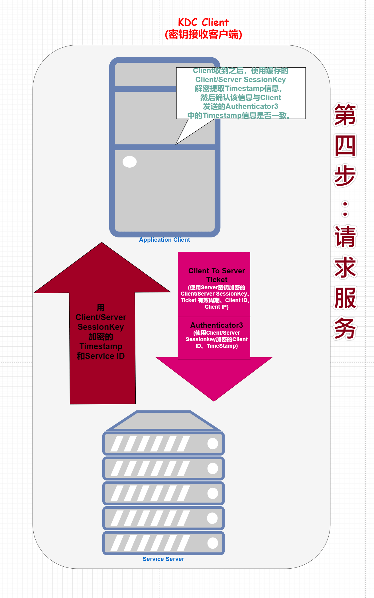

    - **Client 向 SS(Service Server)发送服务请求**

        AP-REQ：Client 收到 `Client-To-Server Ticket`、`sessionkey_tgs` 之后，使用 `Client/TGS Session Key` 对 `sessionkey_tgs` 解密得到 `Client/Server Session Key`,然后使用 `Client/Server Session Key` 对 Client Info 和 timestamp 加密得到 `Authenticator3`

        将 `Authenticator3` 和 `Client-To-Server Ticket` 发送给所请求服务的服务器(`Service Server`)。

        - Ticket 客户端无法解密

    - **Service Server 响应 Client**

        AP-REP：Service Server 收到客户端的服务访问请求之后，利用 Server 密钥(Server 的 ntlm Hash)对 `Client-To-Server Ticket` 解密，提取出 `Client/Server SessionKey`、Client ID 等信息。

        Service Server 使用 `Client/Server SessionKey` 对 `Authenticator3` 解密得到 Client ID 和 TimeStamp。

        类似于 TGS，Service Server 也要做如下校验：
        - Client ID;
        - 时间戳；
        - ticket 是否过期；
        - 避免重放攻击，查看 Service Server 的 cache 是否包含 authenticator3；
        - 网络地址比较

        Service Server 发送最后的验证消息——用 `Client/Server SessionKey` 加密的 Timestamp 和 `Service ID` 数据包给 Client。

        Client 收到之后，使用缓存的 `Client/Server SessionKey` 解密提取 Timestamp 信息，然后确认该信息与 Client 发送的 Authenticator3 中的 Timestamp 信息是否一致。验证通过后，在定义的通讯周期内，Client 可以使用票据请求 Service。

        由此完成了 Client 和 Service Server 的双向认证。

        - Kerberos 协议设计的思路就是用来在不受信的环境下进行认证的协议。
        - krbtgt 账号的 NTLM Hash 理论上只存在于 KDC 中。这意味着 TGT 只能由 KDC 来解密。如果 krbtgt 账号的 NTLM Hash 泄露了，那么 TGT 就能被解密甚至伪造。伪造的 TGT 叫做黄金票据。
        - Ticket 是由服务器计算机本身的 NTLM Hash 加密的，Client 不能解密。如果该 Hash 泄露，那么就可以解密甚至伪造 Ticket。伪造的 Ticket 叫做白银票据。
        - 在上述的流程中，涉及到时间戳 timestamp，由于它的存在，才使得被第三方获取了加密信息 Authenticator1 、Authenticator2、TGT 不会在短时间内被暴力破解。timestamp 一般时间为8小时。
        - Kerberos 协议和 NTLM 协议都会使用 NTLM Hash 对生成的任意随机数加密，然后比对结果。 Kerberos 的主要区别在于添加了第三方——-KDC 参与到认证过程中。
        - Client info 中包含网络地址、Client ID 等信息

---

- 每次交互 Client 可以收到两条消息，一条是可以解密的，一条是无法解密的
- Client 期望访问的服务或者主机从不直接与 KDC 通信
- KDC 存储了其数据库下所有主机和服务的密钥
- 密钥由密码加上一组随机数的哈希值，哈希算法由 Kerberos 的具体实现选择。对于服务和主机而言，其本身是没有密码的。
- 所有密钥存储于 KDC 数据库
- KDC 本身由主密钥加密
- 已经存在 Kerberos 的配置和实现采用公钥加密

---

## PAC

上述为 RFC 规定的 Kerberos 认证授权流程(其中 NTLM Hash 是针对 Windows 举例的)，而微软所实现的 Kerberos 工作流程与之则有所不同，其区别的关键就在于，KDC 所返回的 `KRB_AS_REP` 中将包含一组 PAC 的信息。

PAC 的全称是 Privilege Attribute Certificate(特权属性证书)。其中所包含的是各种授权信息，例如用户所属的用户组、用户所具有的权限等。（User SID 和 Groups SID）

为了防止被伪造和串改，在 PAC 中包含有两个数字签名 `PAC_SERVER_CHECKSUM` 和 `PAC_PRIVSVR_CHECKSUM` ，这两个数字签名分别由 Server 端密码 HASH 和 KDC 的密码 HASH 加密。


正如上文所述，当用户与 KDC 之间完成了认证过程之后， 用户需要访问服务器所提供的某项服务时， 服务器为了判断用户是否具有合法的权限必须通过将用户的用户名传递给 KDC， KDC 通过得到的用户名查询用户的用户组信息，用户权限等，进而返回给服务器，服务器再将此信息与用户所索取的资源的 ACL 进行比较， 最后决定是否给用户提供相应的服务。

在 Windows 的 Kerberos 实现中， 默认情况下，`KRB_AS_REP` 信息中将包含一组 PAC 信息，也就是说，用户所得到的 TGT（TicketGranting Ticket）会包含用户的授权信息。用户再用包含有授权信息的 TGT 去申请相应的 Service Ticket，KDC 在收到这个 `KBR_AP_REQ` 请求的时候， 将 TGT 里的 PAC 信息解析出来， 加入到 Service Ticket 里返回。接下来， 当用户向服务器程序提交 `KRB_AP_REQ` 消息时， 服务器程序则将其中所包含的 PAC 信息传送给操作系统得到一个访问令牌， 并且同时将这个 PAC 的数字签名以 `KRB_VERIFY_PAC` 的消息传输给 KDC， KDC 再将验证这个 PAC 的数字签名的结果以 RPC 返回码的形式告诉服务器， 服务器就可以根据这个结果判断 PAC 数据的真实性和完整性，并做出最后对 `KRB_AP_REQ` 的判断。

- 优点：
    - 以后对资源的访问中，服务端再接收到客户的请求的时候不再需要借助 KDC 的帮助提供完整的授权信息来完成对用户权限的判断， 而只需要根据请求中所包含的 PAC 信息直接与本地资源的 ACL 相比较做出裁决。
    - 解决 PAC 欺骗，防止攻击者利用篡改的 PAC 信息实现未授权访问
- 缺点：
    - PAC 在用户的认证阶段引入会导致认证耗时过长。（Windows Kerberos 客户端会通过 RPC 调用 KDC 上的函数来验证 PAC 信息，这时候用户会观察到在服务器端与 KDC 之间的 RPC 包流量的增加。）
    - 由于 PAC 是微软特有的一个特性，所以启用了 PAC 的域中将不支持装有其他操作系统的服务器，制约了域配置的灵活性

---

## SPN

服务主体名称（SPN：Service Principal Names）是服务实例（可以理解为一个服务，比如HTTP、MSSQL）的唯一标识符（即服务器上所运行服务的唯一标识）。Kerberos使用SPN将服务实例与服务登录帐户相关联。如果在整个域 或 域林中的计算机上安装多个服务实例，则每个实例都必须具有自己的SPN。如果客户端使用多个名称进行身份验证，则给定的服务实例具有多个SPN。SPN始终包含运行服务实例的主机名称，因此服务实例可以为其主机的每个名称或别名注册SPN。

> 使用 Kerberos 的域认证认证服务，需要正确配置 SPN

SPN 在其注册的域林中必须是唯一的，若不唯一，则身份验证就会失败。

SPN 的格式：
```
<service type>/<host>:<port>/<DistinguishedName>

// <service type>：服务类型，如LDAP、TERMSRV、SMTP、MSSQL、HTTP
// <host>：服务所在主机名称，可以是FQDN(如data.test.lab、server.test.lab)和NetBIOS名(如data、server)

// <port>：服务端口，若服务运行在默认端口上，则端口号可以省略
// <Distinguished Name>：专有名称
```

通用服务类型 ,可参考 https://adsecurity.org/?page_id=183

---

## 委派

委派(Delegation)：是一种让用户可以委托服务器代表自己与其他服务进行验证的功能，它允许服务账户在活动目录中模拟其他域用户身份，主要用于当服务需要以某个用户的身份来请求访问其他服务资源的场景。比如，在域内，用户 Jack 经过 Kerberos 身份验证访问服务 Web（服务 web 处于域），Web 服务再以 Jack 的身份去请求域中的服务 MSSQL，若 Jack 有权限访问就能访问成功，这种过程就是委派的一个过程。

域委派的4种主要方式：
- 无约束委派
    - 表示您授予该帐户权限以委派任何服务，前提是满足启动委派所需的所有其他步骤。
    - 从 IT 安全角度来看，此选项最容易配置但安全性最低。
- 约束委派 - 仅限 Kerberos
    - 更安全，它将委派任务限制到指定列表，不像无约束委派允许委派给任何服务。
    - 与无约束委派相比，需要额外配置。
    - 必须确保在帐户上设置 SPN 并添加允许帐户委派的服务。
- 协议转换
- 基于资源的约束委派

用户在 Kerberos 认证中访问服务 A 和服务 B 的过程图：


后改进了这种同一用户访问多服务的过程，实现了 A 服务模拟用户访问 B 服务的过程。

在用户发送一个 ST(图中为 TGS)访问服务时，连同其TGT一起发送，服务 A 使用用户的 TGT 向服务B进行 ST(图中为 TGS)，进而简化了用户请求服务 B 资源时验证访问的认证过程。这种就是无约束委派（TrustedForDelegation）的过程：


无约束委派过程中，如果攻击者截获了 Service A 验证的 ST 和 TGT，就可以用它们访问服务 B，进而模拟管理员访问任意服务，漫游内网。

### 约束委派

为了解决无约束委派的隐患，微软发布了约束委派（S4U2Proxy）。

若服务 A 允许委派给服务B，则 A 能使用 S4U2Proxy 协议将用户发送的 TS(图中的 TGS，TGS 必须是可转发的) 再转发给域控制器认证，为用户请求访问服务 B 的 TS(图中的 TGS)。接着，服务 A 就能使用新获得的 TS(图中的 TGS）模拟用户访问服务 B:


上图中用户是通过 Kerberos 协议与服务 A 进行认证的，而当用户以其他方式(如 NTLM 认证，基于表单的认证等方式)与 Web 服务器进行认证后，用户是无法向 Web 服务器提供请求该服务的 TS(图中的 TGS)，因而服务器 A 也无法进一步使用 S4U2Proxy 协议请求访问服务 B。S4U2Self 协议便是解决该问题的方案，被设置为 `TrustedToAuthForDelegation` 的服务能够调用 S4U2Self 向认证服务器为任意用户请求访问自身的可转发的服务票据，此后，便可通过 S4U2Proxy 使用这张 TGS 向域控制器请求访问 B 的票据。这就是协议转换委派(S4U2Self/TrustedToAuthForDelegation)：


---

### 基于资源的约束委派

传统的约束委派中仍然存在一些缺点，如无法进行跨域委派。微软在 Windows Server 2012 中引入了基于资源的约束委派，相对于传统的约束委派，主要有三处改进:
- 委派的权限授予给了拥有资源的后端(B)而不再是前端(A)
- 不再需要域管理员权限设置委派，只需拥有在计算机对象上编辑 `msDS-AllowedToActOnBehalfOfOtherIdentity` 属性的权限
- 委派功能现在可以跨域和林


基于资源的约束委派(Resource-Based Constrained Delegation)是一种允许资源自己去设置哪些账户委派给自己的约束委派。

传统的约束委派是“正向的”，通过修改服务 A 属性 `msDS-AllowedToDelegateTo`，添加服务 B 的 SPN（Service Principle Name），设置约束委派对象（服务 B），服务 A 便可以模拟用户向域控制器请求访问服务B以获得服务票据（TGS）来使用服务 B 的资源。

而基于资源的约束委派则是相反的，通过修改服务 B 属性 `msDS-AllowedToActOnBehalfOfOtherIdentity`，添加服务 A 的 SPN，达到让服务 A 模拟用户访问 B 资源的目的。

---

**Source & Reference**
- [深刻理解windows安全认证机制](https://klionsec.github.io/2016/08/10/ntlm-kerberos/)
- [Windows用户密码的加密方法与破解](https://www.sqlsec.com/2019/11/winhash.html#toc-heading-2)
- [Windows下的密码hash——NTLM hash和Net-NTLM hash介绍](https://3gstudent.github.io/3gstudent.github.io/Windows%E4%B8%8B%E7%9A%84%E5%AF%86%E7%A0%81hash-NTLM-hash%E5%92%8CNet-NTLM-hash%E4%BB%8B%E7%BB%8D/)
- [浅学Windows认证](https://b404.xyz/2019/07/23/Study-Windows-Authentication/)
- [技术干货 | Windows认证体系解读](https://mp.weixin.qq.com/s/MhxGey_xVqv12CUJ7P8UjA)
- [彻底理解Windows认证 - 议题解读](https://payloads.online/archivers/2018-11-30/1)
- [NT LAN Manager - Wikipedia](https://en.wikipedia.org/wiki/NT_LAN_Manager)
- [LAN Manager - Wikipedia](https://en.wikipedia.org/wiki/LAN_Manager)
- [Windows内网协议学习NTLM篇之NTLM基础介绍](https://www.anquanke.com/post/id/193149)
