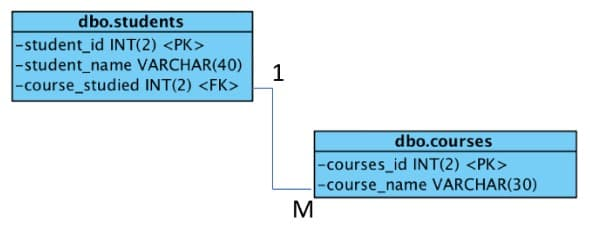

# MySQL快速入门

---

在本教程中，我将构建一个使用如下实体关系图（ERD）中显示的简单架构的数据库。数据库列出了学生和正在学习的课程。为了保持简单，我使用了两个实体（即表），只有一种关系和依赖。这两个实体称为 `dbo_students` 和 `dbo_courses`。



数据库的多样性是一对多的，因为每门课程可以包含很多学生，但每个学生只能学习一门课程。

关于术语的快速说明：
- 一张表称为一个实体。
- 一个字段称为一个属性。
- 一条记录称为一个元组。
- 用于构建数据库的脚本称为架构。

# 构建架构

要构建数据库，使用 `CREATE TABLE <表名>`  命令，然后定义每个字段的名称和数据类型。数据库使用 `VARCHAR(n)` （字符串）和 `INT(n)` （整数），其中 n 表示可以存储的值的长度。例如 `INT(2)` 可以是 01。

这是用于创建两个表的代码：
```sql
CREATE TABLE dbo_students
(
  student_id INT(2) AUTO_INCREMENT NOT NULL,
  student_name VARCHAR(50),
  course_studied INT(2),
  PRIMARY KEY (student_id)
);

CREATE TABLE dbo_courses
(
  course_id INT(2) AUTO_INCREMENT NOT NULL,
  course_name VARCHAR(30),
  PRIMARY KEY (course_id)
);
```

`NOT NULL` 意味着字段不能为空，`AUTO_INCREMENT` 意味着当一个新的元组被添加时，ID 号将自动生成，是对先前存储的 ID 号加 1，以强化各实体之间的完整参照性。 `PRIMARY KEY` 是每个表的惟一标识符属性。这意味着每个元组都有自己的不同的标识。

# 关系作为一种约束

就目前来看，这两张表格是独立存在的，没有任何联系或关系。要连接它们，必须标识一个外键。

在 `dbo_students` 中，外键是 `course_studied`，其来源在 `dbo_courses` 中，意味着该字段被引用。

SQL 中的特定命令为 `CONSTRAINT`，并且将使用另一个名为 `ALTER TABLE` 的命令添加这种关系，这样即使在架构构建完毕后，也可以编辑表。


以下代码将关系添加到数据库构造脚本中：
```sql
ALTER TABLE dbo_students
ADD CONSTRAINT FK_course_studied
FOREIGN KEY (course_studied) REFERENCES dbo_courses(course_id);
```

使用 `CONSTRAINT` 命令实际上并不是必要的，但这是一个好习惯，因为它意味着约束可以被命名并且使维护更容易。现在数据库已经完成了，是时候添加一些数据了。

# 将数据添加到数据库

`INSERT INTO <表名>`  是用于直接选择要添加哪些属性（即字段）数据的命令。

首先声明实体名称，然后声明属性，下边是添加到实体的数据，从而创建一个元组。

如果指定了 `NOT NULL`，这表示该属性不能留空。以下代码将展示如何向表中添加记录：
```sql
INSERT INTO dbo_courses(course_id,course_name)
VALUES(001,'Software Engineering');
INSERT INTO dbo_courses(course_id,course_name)
VALUES(002,'Computer Science');
INSERT INTO dbo_courses(course_id,course_name)
VALUES(003,'Computing');

INSERT INTO dbo_students(student_id,student_name,course_studied)
VALUES(001,'student1',001);
INSERT INTO dbo_students(student_id,student_name,course_studied)
VALUES(002,'student2',002);
INSERT INTO dbo_students(student_id,student_name,course_studied)
VALUES(003,'student3',002);
INSERT INTO dbo_students(student_id,student_name,course_studied)
VALUES(004,'student4',003);
```

现在数据库架构已经完成并添加了数据，现在是时候在数据库上运行查询了。

# 查询

查询遵循使用以下命令的集合结构：
```sql
SELECT <attributes>
FROM <entity>
WHERE <condition>
```

要显示 `dbo_courses` 实体内的所有记录并显示课程代码和课程名称，请使用 `*` 。 这是一个通配符，它消除了键入所有属性名称的需要。（在生产数据库中不建议使用它。）此处查询的代码是：
```sql
SELECT * FROM dbo_courses
```

此处查询的输出显示表中的所有元组，因此可显示所有可用课程：
```sql
| course_id |          course_name |
|-----------|----------------------|
|         1 | Software Engineering |
|         2 |     Computer Science |
|         3 |            Computing |
```

查询学生表以及相应课程
```
SELECT a.*,b.course_name FROM dbo_students a , dbo_courses b WHERE a.course_studied = b.course_id ;
```

**Source & Reference**
- [SQL 入门](https://linux.cn/article-9537-1.html)
