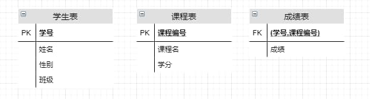

# 主键和外键

---

**SQL 的主键和外键的作用**

简而言之，SQL 的主键和外键就是起约束作用。

关系型数据库中一条记录中有若干个属性，若其中某一个属性组（注意是组）能唯一标识一条记录，该属性就可以成为一个主键。例如：



```
学生表(学号，姓名，性别，班级)
```
其中每个学生的学号是唯一的，学号就是一个主键；

```
课程表(课程编号，课程名，学分)
```
其中课程编号是唯一的，课程编号就是一个主键；

```
成绩表(学号，课程号，成绩)
```
成绩表中单一一个属性无法唯一标识一条记录，学号和课程编号的组合才可以唯一标识一条记录，所以学号和课程编号的属性组是一个主键。

成绩表中的学号不是成绩表中的主键，但它和学生表中的学号相对应，并且学生表中的学号是学生表的主键，则称成绩表中的学号是学生表的外键；同理，成绩表中的课程号是课程表的外键。

定义主键和外键主要是为了维护关系数据库的完整性，总结一下：

1. 主键是能确定一条记录的唯一标识。比如，一条记录包括身份证号码，姓名，年龄。身份证号码是唯一确认你这个人的，其他的都可能有重复，所以身份证号码是主键。
2. 外键用于与另一张表相关联。是能确认另一张表记录的字段，用于保持数据的一致性。比如，A 表中的一个字段，是 B 表的主键，那它就可以是 A 表的外键。

外键取值规则：空值或参照的主键值
1. 插入非空值时，如果主键值中没有这个值，则不能插入。
2. 更新时，不能改为主键表中没有的值。
3. 删除主键表记录时，可以在建外键时选定外键记录一起联删除还是拒绝删除。
4. 更新主键记录时，同样有级联更新和拒绝执行的选择。

**主键、外键和索引的区别**

定义：
- 主键：唯一标识一条记录，不能有重复，不允许为空。
- 外键：表的外键是另一表的主键，外键是可以有重复的，可以是空值。
- 索引：该字段没有重复值，但可以有一个空值。

作用：
- 主键：用来保证数据完整性
- 外键：用来和其他表建立联系用
- 索引：用来提高查询排序的速度

个数：
- 主键：主键只能有一个。
- 外键：一个表可以有多个外键。
- 索引：一个表可以有多个唯一索引。

**创建 SQL 的主键和外键约束的方法**

如果在表创建好了以后再加约束，则格式分别为
```sql
--主键
ALTER TABLE 表名
--"PK"为主键的缩写，字段名为要在其上创建主键的字段名，"PK_字段名"就为约束名
ADD CONSTRAINT PK_字段名
--同上
PRIMARY KEY(字段名)
```
```sql
--唯一约束
ALTER TABLE 表名
ADD CONSTRAINT UQ_字段名
UNIQUE(字段名)
```
```sql
--外键约束
ALTER TABLE 表名
--"FK"为外键的缩写
ADD CONSTRAINT FK_字段名
FOREIGN KEY(字段名) REFERENCES 关联的表名(关联的字段名)

--举个例子
ALTER TABLE 表A
ADD CONSTRAINT FK_B
FOREIGN KEY(TicketNo) REFERENCES 表B(TicketNo)
```
```sql
--级联更新，级联删除，这样在删除主表Student时，成绩表中该学生的所有成绩都会删除
ALTER TABLE 成绩表
ADD CONSTRAINT FK_StudentNo
FOREIGN KEY(StudentNo) REFERENCES Student(StudentNo)
ON UPDATE CASCADE ON DELETE CASCADE
```
```sql
--检查约束
ALTER TABLE 表名
ADD CONSTRAINT CK_字段名
--括号中的"CK_字段名>0"为条件表达式，用关系运算符连接
CHECK(字段名>0)

--默认值约束
ALTER TABLE 表名
ADD CONSTRAINT DF_字段名
--其中的'默认值'为想要设置的默认值，注意'FOR'
DEFAULT '默认值' FOR 字段名

--删除创建的约束
ALTER TABLE 表名
--约束名为前面创建的如：FK_字段名这样的约束名
DROP CONSTRAINT 约束名
--注意：如果约束是在创建表的时候创建的，则不能用命令删除
--只能在'企业管理器'里面删除
```

获取 SqlServer 中的表结构
```sql
SELECT syscolumns.name,systypes.name,syscolumns.isnullable,syscolumns.length
FROM syscolumns,systypes
WHERE syscolumns.xusertype = systypes.xusertype
AND syscolumns.id = OBJECT_ID('Student')
```

单独查询表递增字段
```sql
SELECT [NAME] FROM syscolumns
WHERE
id = OBJECT_ID(N'Student') AND COLUMNPROPERTY(id,name,'IsIdentity')=1
```

获取表主外键约束
```sql
EXEC sp_helpconstraint 'Student'
```

查询表主键外键信息
```sql
SELECT
sysobjects.id AS objectId,
OBJECT_NAME(sysobjects.parent_obj) AS TableName,
sysobjects.name AS constraintName,
sysobjects.xtype AS constraintType,
syscolumns.name AS columnName
FROM sysobjects INNER JOIN sysconstraints
ON sysobjects.xtype IN('C','F','PK','UQ','D')
AND sysobjects.id = sysconstraints.constid
LEFT OUTER JOIN syscolumns ON sysconstraints.id = syscolumns.id
WHERE OBJECT_NAME(sysobjects.parent_obj) = 'Student'
```

**Source & Reference**
- [SQL的主键和外键的作用](https://www.jianshu.com/p/394f8aa724f4)
