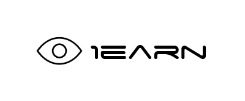

    

    
    
    
    

> 万事开头难,然后一直开头一直难...

    

**简介:** 本项目的初衷是分享知识资源,让更多人接触和了解安全、运维领域,但受限于本人能力有限,难免会有错误和借鉴的地方,对于内容中有疑问或建议请提交 issue 或通过微信与我联系,回应时间在 12 小时内 (工作日请放过我🙏).

**定位:** 个人维护的安全知识框架

**更新时间:** 不定期

**项目地址** https://github.com/No-Github/1earn

该仓库采用 **[CC BY-NC-SA 4.0](https://creativecommons.org/licenses/by-nc-sa/4.0/deed.zh)** 协议.

---

## 项目文件一览

* <h4>安全</h4>

    * [Power-PenTest](./1earn/安全/Power-PenTest.md) - 安全知识的框架  `注: 该文档是连接其下各个目录子文件的树`
    - **笔记**
        - BlueTeam
            * [加固](./1earn/安全/笔记/BlueTeam/加固.md) - 系统、应用加固的方法和工具资源
            * [监察](./1earn/安全/笔记/BlueTeam/监察.md) - 有关查杀、监控、蜜罐的资源
            * [取证](./1earn/安全/笔记/BlueTeam/取证.md) - 内容涉及操作系统的取证、web 的取证、文件的取证
            * [应急溯源](./1earn/安全/笔记/BlueTeam/应急溯源.md) - 应急资源、溯源案例
        - Crypto
            * [Crypto](./1earn/安全/笔记/Crypto/Crypto.md) - 介绍各种编码和加密算法及相关的工具
        - CTF
            * [CTF](./1earn/安全/笔记/CTF/CTF.md) - 记录 CTF 相关的工具和 writeup 资源
        - ICS
            * [工控协议](./1earn/安全/笔记/ICS/工控协议.md) - 总结各类工控协议的知识点
            * [PLC攻击](./1earn/安全/笔记/ICS/PLC攻击.md) - 总结 PLC攻击的相关知识点
            * [S7comm相关](./1earn/安全/笔记/ICS/S7comm相关.md) - 记录S7comm相关错误类型、功能码和相关参数
        - IOT
            * [硬件设备安全](./1earn/安全/笔记/IOT/硬件设备安全.md) - 嵌入式设备相关漏洞利用,不太熟悉这一块,内容不多
        - MobileSec
            * [Android安全](./1earn/安全/笔记/MobileSec/Android安全.md) - 记录一些安卓安全相关的内容,这块掌握较少,有空在学
        - RedTeam
            - 后渗透
                * [后渗透](./1earn/安全/笔记/RedTeam/后渗透/后渗透.md) - 后渗透知识点的大纲
                * [权限提升](./1earn/安全/笔记/RedTeam/后渗透/权限提升.md) - 操作系统和数据库的提权方法
                * [权限维持](./1earn/安全/笔记/RedTeam/后渗透/权限维持.md) - 权限维持的各种方法和资源
            - 信息收集
                * [端口安全](./1earn/安全/笔记/RedTeam/信息收集/端口安全.md) - 记录一些端口渗透时的方法和思路
                * [搜索引擎Hacking](./1earn/安全/笔记/RedTeam/信息收集/搜索引擎Hacking.md) - 收集搜索引擎语法资源
                * [信息收集](./1earn/安全/笔记/RedTeam/信息收集/信息收集.md) - 记录信息收集方面各类技术，如漏扫、IP 扫描、端口扫描、DNS 枚举、目录枚举、指纹等
            - Web 安全
                * [逻辑类漏洞](./1earn/安全/笔记/RedTeam/Web安全/逻辑类漏洞.md) - 整个部分结构大部分基于乌云的几篇密码找回、逻辑漏洞类文章,在其基础上记录和归纳
                * [SQLi](./1earn/安全/笔记/RedTeam/Web安全/SQLi.md) - SQL 注入知识点记录
                * [Web_CVE漏洞记录](./1earn/安全/笔记/RedTeam/Web安全/Web_CVE漏洞记录.md) - 全面收集 web 漏洞 POC | Payload | exp
                * [Web常见漏洞](./1earn/安全/笔记/RedTeam/Web安全/Web常见漏洞.md) - 常见 web 漏洞介绍,案例收集
                * [XSS](./1earn/安全/笔记/RedTeam/Web安全/xss.md) - XSS 相关内容,目前较少,后续会更新
                * [XXE](./1earn/安全/笔记/RedTeam/Web安全/xxe.md) - XXE 相关内容,目前较少,后续会更新
            * [安防设备总结](./1earn/安全/笔记/RedTeam/安防设备总结.md) - 记录一些常见的安全设备的漏洞利用方法和绕过手段
            * [软件服务安全](./1earn/安全/笔记/RedTeam/软件服务安全.md) - 记录软件、业务应用服务漏洞的渗透手段和 cve 漏洞
            * [协议安全](./1earn/安全/笔记/RedTeam/协议安全.md) - 按照协议归类各种漏洞、攻击手段
            * [Linux渗透](./1earn/安全/笔记/RedTeam/Linux渗透.md) - 包含 Linux 口令破解，远程漏洞利用、本地提权的笔记
            * [Windows渗透](./1earn/安全/笔记/RedTeam/windows渗透.md) - 包含 windows pth、ptt，远程漏洞利用、提权等内容的笔记
    - **工具**
        * [Aircrack](./1earn/安全/工具/Aircrack.md)
        * [BurpSuite](./1earn/安全/工具/BurpSuite.md)
        * [CobaltStrike](./1earn/安全/工具/CobaltStrike.md)
        * [Hashcat](./1earn/安全/工具/Hashcat.md)
        * [Kali](./1earn/安全/工具/Kali.md)
        * [Metasploit](./1earn/安全/工具/Metasploit.md)
        * [Mimikatz](./1earn/安全/工具/Mimikatz.md)
        * [Nmap](./1earn/安全/工具/Nmap.md)
        * [SET](./1earn/安全/工具/SET.md)
        * [Sqlmap](./1earn/安全/工具/Sqlmap.md)
        * [Sysmon](./1earn/安全/工具/Sysmon.md)
        * [Wfuzz](./1earn/安全/工具/Wfuzz.md)
        * [Wireshark](./1earn/安全/工具/Wireshark.md)
    - **实验**
        - 靶机
            - HTB
            - VulnHub
                * [DC Serial](./1earn/安全/实验/靶机/VulnHub/DC) - DC 系列靶场,难度简单至中等,可以学习各种提权和CMS漏洞利用,推荐初学者挑战
                * [It’s_October](./1earn/安全/实验/靶机/VulnHub/It’s_October)
                * [Kioptrix Serial](./1earn/安全/实验/靶机/VulnHub/Kioptrix) - Kioptrix 系列靶场,难度简单至中等,推荐初学者挑战
                * [Mission-Pumpkin](./1earn/安全/实验/靶机/VulnHub/Mission-Pumpkin) - 难度适中,偏向于加解密比较多,漏洞利用内容较少
                * [symfonos Serial](./1earn/安全/实验/靶机/VulnHub/symfonos) - 挺有难度的靶场,内容丰富,难度中等,漏洞利用内容很多,推荐有一定经验者挑战
        - BlueTeam
            * [安防设施搭建使用](./1earn/安全/实验/BlueTeam/安防设施搭建使用.md) - 记录蜜罐、IDS、IPS 的搭建过程与使用方法
            * [流量分析](./1earn/安全/实验/BlueTeam/流量分析.md) - 记录 NTLM 认证、S7Comm 协议等 pcap 包分析
        - ICS
            * [S7-300启停实验](./1earn/安全/实验/ICS/S7-300启停实验.md) - 利用 ISF 框架和 snap7 模拟的西门子 S7-300 PLC 启停实验
            * [siemens仿真搭建实验](./1earn/安全/实验/ICS/siemens仿真搭建实验.md) - 利用 STEP7+plcsim 搭建西门子仿真环境的实验
        - Misc
            * [HID-Digispark](./1earn/安全/实验/Misc/HID-Digispark.md) - 基于 ATTINY85 开发板的 Digispark 实验
        - Reverse
            * [SLMail溢出案例](./1earn/安全/实验/Reverse/SLMail溢出案例.md) - SLMail 5.5.0 的缓冲区溢出利用实验
        - Web
            - 靶场
                * [DVWA-WalkThrough](./1earn/安全/实验/Web/靶场/DVWA-WalkThrough.md) - 大名鼎鼎的 DVWA 靶场,新手入门培训必做实验项目
                * [pikachu-WalkThrough](./1earn/安全/实验/Web/靶场/pikachu-WalkThrough.md) - 非常优秀的 web 基础靶场,与 dvwa 相比 dvwa 更适合教学,pikachu 漏洞种类更多,建议通关顺序 dvwa --> pikachu
                * [sqli-labs-WalkThrough](./1earn/安全/实验/Web/靶场/sqli-labs-WalkThrough.md)
                * [upload-labs-WalkThrough](./1earn/安全/实验/Web/靶场/upload-labs-WalkThrough.md) - 一个总结了各种类型文件上传漏洞的靶场
                * [XSS挑战-WalkThrough](./1earn/安全/实验/Web/靶场/XSS挑战-WalkThrough.md)
            - 代码审计
            - 漏洞复现

* <h4>开发</h4>

    * **版本控制**
        * [Git学习笔记](./1earn/开发/版本控制/Git学习笔记.md) - 记录 git 的用法和平时使用 github 遇到的问题

    * **硬件**
        * [硬件知识](./1earn/开发/硬件/硬件知识.md) - 一些硬件相关的小知识

    * **字符编码**
        * [字符编码](./1earn/开发/字符编码/字符编码.md) - 字符编码相关的内容总结

* <h4>运维</h4>

    * **Linux**

        * [God-Linux](./1earn/运维/Linux/God-Linux.md) - 记录 Linux 下的骚操作,收集的较少,后面会慢慢添加
        * [Power-Linux](./1earn/运维/Linux/Power-Linux.md) - 配置指南,记录各种服务搭建与配置过程
        * [Secure-Linux](./1earn/运维/Linux/Secure-Linux.md) - Linux 加固+维护+应急响应参考
        * [Speed-Linux](./1earn/运维/Linux/Speed-Linux.md) - 命令速查手册,记录各种基本命令操作
        * 笔记
            * [包管理](./1earn/运维/Linux/笔记/包管理.md) - Linux 各种包管理工具的知识点
            * [发行版](./1earn/运维/Linux/笔记/发行版.md) - Linux 各个发行版本之间的知识
            * [工具](./1earn/运维/Linux/笔记/工具.md) - 收集有趣有用的 Linux 工具
            * [进程](./1earn/运维/Linux/笔记/进程.md) - 科普 Linux 进程的知识
            * [启动过程](./1earn/运维/Linux/笔记/启动过程.md) - 了解 Linux 的启动到底发生了什么
            * [认证](./1earn/运维/Linux/笔记/认证.md) - 了解 Linux 下的认证体系
            * [日志](./1earn/运维/Linux/笔记/日志.md) - 系统日志类型,日志工具
            * [文件](./1earn/运维/Linux/笔记/文件.md) - 概括各文件夹的作用,属性
            * [信息](./1earn/运维/Linux/笔记/信息.md) - 记录收集 Linux 系统软硬件信息的命令
            * [shell编程](./1earn/运维/Linux/笔记/shell编程.md) - shell 编程的知识
        * 实验
            * 各种 linux 服务的搭建过程和案例

    * **Network**

        `目前实际工作基本饱和,无法抽出时间把这部分填坑,尽量在今年再补充内容`

        * [不同厂商](./1earn/运维/Network/不同厂商.md) - 记录不同厂商配置服务命令的区别
        * [方向实验](./1earn/运维/Network/方向实验.md) - 按方向分类记录配置
        * [速查](./1earn/运维/Network/速查.md) - 速查各类帧、报文格式、掩码等
        * [SDN笔记](./1earn/运维/Network/SDN笔记.md) - 记录以前比赛时 SDN 的题目和命令
        * [TCP-IP](./1earn/运维/Network/TCP-IP.md) - 记录 TCP/IP 协议栈的协议
        * [VPN-Security](./1earn/运维/Network/VPN-Security.md) - 记录 VPN 领域的协议

    * **Windows**

        * [Secure-Win](./1earn/运维/Windows/Secure-Win.md) - Windows 加固+维护+应急响应参考
        * [Speed-Win](./1earn/运维/Windows/Speed-Win.md) - 记录 windows 下 CMD 常用命令
        * 笔记
            * [工作组](./1earn/运维/Windows/笔记/工作组.md) - 关于 Windows 工作组的概念、相关操作
            * [角色权限](./1earn/运维/Windows/笔记/角色权限.md) - Windows 角色内容和 Windows Access Token 的相关知识
            * [认证](./1earn/运维/Windows/笔记/认证.md) - 总结 Windows 本地认证、网络认证和域认证的知识点
            * [日志](./1earn/运维/Windows/笔记/日志.md) - 总结 Windows 事件日志的相关内容
            * [信息](./1earn/运维/Windows/笔记/信息.md) - 记录收集 Windows 系统软硬件信息的命令
            * [域](./1earn/运维/Windows/笔记/域.md) - 记录 Windows 域原理、域结构的知识点
            * [组策略](./1earn/运维/Windows/笔记/组策略.md) - 总结 Windows 组策略的相关知识点
        * 实验
            * [Windows故障转移集群](./1earn/运维/Windows/实验/Windows故障转移集群.md) - 记录群集节点的操作
            * [Windows基础服务搭建](./1earn/运维/Windows/实验/Windows基础服务搭建.md) - 记录 Windows 搭建基础服务的步骤
            * [Windows域搭建](./1earn/运维/Windows/实验/Windows域搭建.md) - 记录 Windows 搭建域环境的步骤和知识点
        * Powershell
            * [PowerShell笔记](./1earn/运维/Windows/PowerShell/PowerShell笔记.md) - 记录一些 powershell 常用命令

* <h4>Plan</h4>

    * [Misc-Plan](./1earn/Plan/Misc-Plan.md) - 各种小技巧
    * [Team-Plan](./1earn/Plan/Team-Plan.md) - 团队协作解决方案
    * [Thinking-Plan](./1earn/Plan/Thinking-Plan.md) - 问题解决方式的记录和学习
    * [VM-Plan](./1earn/Plan/VM-Plan.md) - VMWare 常见问题记录
    * [Web-Tools](./1earn/Plan/Web-Tools.md) - 在线 web 工具集合

---

## 三板斧

`收集、归纳、分享` 我认为这是知识学习的"三板斧"

收集,很好理解,比如收集各种学习的资源,看过的论文、文章,和各种工具

归纳,或者说是总结与分类,将自己学习过程中的心得体会记载下来,写成各种笔记,文章,将收集的资源整理归类

分享,在博客上传一篇文章也好,在 qq 群帮助群友解决一个问题也好,都是分享

没有收集和归纳的能力,整个学习的过程就像是在用一个菜篮子接水,留不住的,同样,如果不愿意分享,就像是在闭门造车,无法接触到不同的观点,没人指正你的问题,久而久之有可能想法变得偏执,并且固步自封

---

## 阅读建议

`本项目所有文档均在 VScode 编辑器中编写,故只兼容 VScode 侧边预览的 markdown 语法,暂不考虑兼容其他编辑器的 md 语法`

~~由于 github 的 markdown 引擎 kramdown 不支持 [TOC] 链接,以及各种不兼容的排版问题, 导致阅读体验极不友好, 因此~~ 建议还是下载/clone到本地阅读,项目整体约 30M,当然,排版也有以下几种解决方案,不过还是感觉很麻烦,就此作罢
* [mzlogin/vim-markdown-toc](https://github.com/mzlogin/vim-markdown-toc)
* [ekalinin/github-markdown-toc.go](https://github.com/ekalinin/github-markdown-toc.go)
* [ekalinin/github-markdown-toc](https://github.com/ekalinin/github-markdown-toc)

建议的阅读体验
* [VScode](https://code.visualstudio.com/)+[FiraCode](https://github.com/tonsky/FiraCode) (推荐,整个项目在vscode环境下编写,基本不会出现排版问题)
* [Typora](https://www.typora.io/)

> 如果 clone 速度太慢,可以先导入码云中(选择从 URL 中导入),再进行 clone ： https://blog.gitee.com/2018/06/05/github_to_gitee/?from=homepage

> 提高 release 速度,可以参考这篇文章 https://jinfeijie.cn/post-805.html

---

以下是该项目的灵感来源

* [Micro8-渗透沉思录](https://www.secpulse.com/archives/98814.html)
* [Teach Yourself Programming in Ten Years](http://norvig.com/21-days.html)
* [To Find a Better Solution, Ask a Better Question – Member Feature Stories – Medium](https://medium.com/s/story/to-find-a-better-solution-ask-a-better-question-3be7fee5af65)
* [The Magpie Developer](https://blog.codinghorror.com/the-magpie-developer/)

---

## 贡献&感谢

- [CONTRIBUTORS](./assets/CONTRIBUTORS.md)

---

## 联系我

    

---

## 免责声明

`本人撰写的手册,仅供学习和研究使用,请勿使用项目中的技术源码用于非法用途,任何人造成的任何负面影响,与本人无关.`
