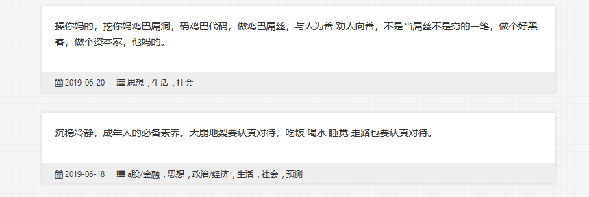
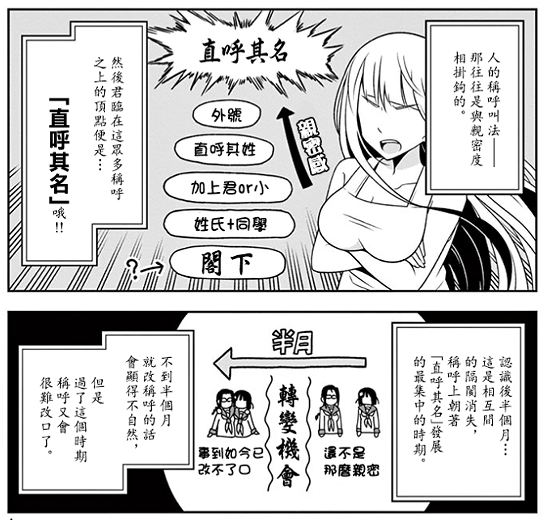
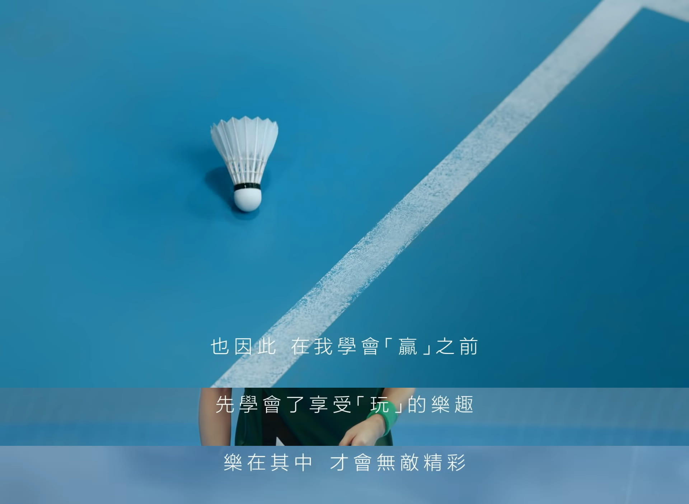
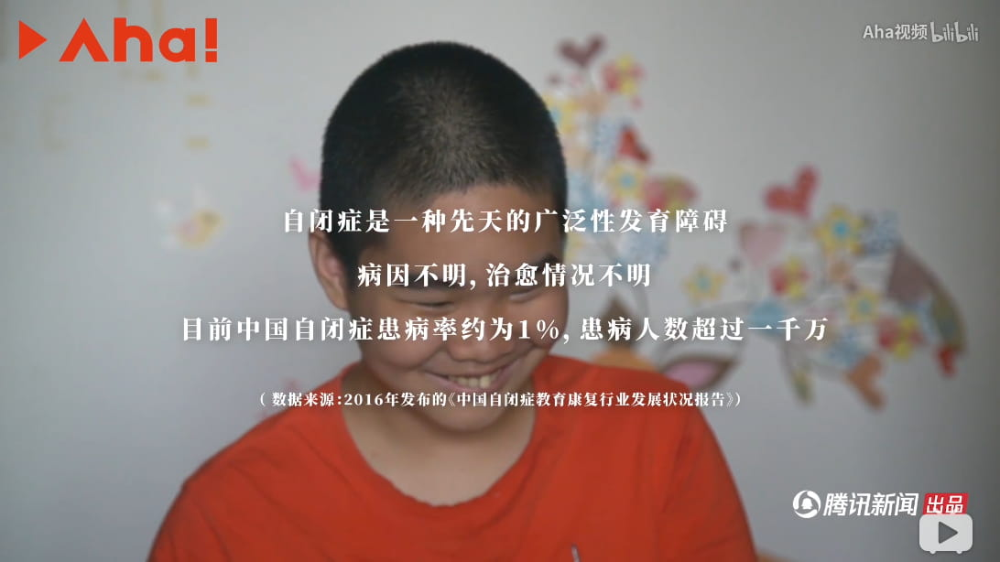

```
-- https://www.zhihu.com/question/322174289/answer/677425469
那真的牛批，啊，那真的牛批。sql注入被拦截，xss被拦截，你是不是王凯伦啊这种人？sql注入拦截，xss拦截，是不是要对着你妈的遗像一直fuzz你才觉得有效果嘛？Bypass了你妈棺材了，那个单引号放进去请求结果是攻击吗？alert(1)是攻击吗？渗透测试那么严肃的时候，每个工程师都在被骂毎个功能都在接受测试的时候，我要被拦截吗？对着你妈的**拦截吧，惹NM的，回去参加 加速乐 的灵堂吧，像 安全狗 一样。请求已被拦截，请求死了，对了吧，我是你父亲，我们俩个都占一主机，shutdown了，好吧？你妈的批哦，弱智一样的，请求被拦截，我拦截你打手冲，请求非法被拦截，要怎么 Bypass吗？是不是要弄一大堆 #/./#，老子也学我们社区那个 404 大黑客一样的那种随随便便绕云锁吗？不会写正则就不要写，什么是攻击吗？网站活了我就全速扫后台，是不是攻击嘛？你妈的创宇盾，弱智一样天天说疑似黑客攻击，我要怎么样嘛？/.git/也是攻击，and 1=1也是攻击，那要写什么报告给你吗？你要我向电话吹个口哨就能发射核弹才不是攻击吗？对不起，做不到，你要我一直 开着扫描器 吗，对不起，我也做不到，所以说很正常，我就这技术啊，请求已被拦截，拦截你妈个哈皮。

不要fuzz，啊不要在这fuzz， 你们要fuzz去云盾fuzz，我们这不fuzz的，文明挖洞，fu锤子zz。端口堵着了，很鸡儿难受。对，安全狗死了，我在参加安全狗的灵堂所以说一直请求被拦截，而你创宇盾却在旁边喝酒庆祝安全狗死了，行了吧。

妈的批，像些弱智，不会写正则拦截你妈批的 post啊，真的是，说我攻击，求求你们不要说我是带黑客了，我觉得你们才是带黑客，你们这些 r00t,H4cker，你们是黑客教父，你们是爱国黑客，你们才是黑客，我是个锤子黑客，我天天漏洞被忽略我还黑客，你们有看过黑客一个月300条 “漏洞被忽略” 吗？有吗？有这种黑客吗？有个鸡儿有。不要在这爆破，啊，滚出去，爆破，爆锤子破，回去爆你妈的gov去。我是带黑客，我他妈 Burp Suite Professiobal 都要买不起我还带黑客，VPS续费都成问题，你见过 VPS 续费成问题的带黑客吗？人家SRC来找我，我连一个低危都挖不出，说起来还真有点扎心，别人SRC千里迢迢的为安全会议赶过来，结果挖不到漏洞，因为没技术。带黑客，我大个 PHP，我巴不得我是大 PHP，我黑客。老子把你妈的服务器D烂，老子要把 net user 揍到你妈的服里去，给你妈 rm -rf * 成你妈琥珀服务器，是不是肉鸡，本来其实我这个请求是非常儒雅随和的一个请求，我不喜欢老换IP，但是你们是经常在瞎拦截对不对，（灰鸽子提示音：点击左侧黑色按钮即可一键清空所有肉鸡）这个有一讲一，我觉得我们是一个很和谐的关系，我们不会说什么的，但你们这些人经常乱拦截，瞎鸡巴拦截，不可取，有失公正，妈只知道拦截我，你们也去拦截其他人吧。送个弱口令可以给shell吗？不可以，送十个sql注入 吧，我私底下是很儒雅呀，你以为这么多flag是因为什么呀，你以为这破技术吗？我自己心里没点b数吗？当什么呀，还不是因为我儒雅——你把你上传点给我交了，这 waf 必死。（脱裤命令还有三十秒到达战场）谢谢7kb，哦，谢谢7kbstorm 送得，哎呀 7kb师傅，你终于回来了，好久没看到你啦，谢谢 7kb，送得 20 个 漏洞，谢谢，啊谢谢，很久没看到过 7kb 了，很久没看到了——你在在那那个说你妈没有授权的滚出去啊，我都说了你权限死了，你还在这看直播，不回去看看你妈exp摆没摆好？妈的批了，真的是。（吸鼻子）“说中痛处就气急败坏，其实还是一条菜狗”，哎，好好好，你觉得是那就是，不狡辩——哎什么意思啊？什么意思啊这队友？现在这种局都是不帮收集信息的是吧？（开始部署 msf
```

<p align="center">
    
</p>

> 欧吉车技腐乳句句然到雾入饭卡死了  - adnmb

> 我特么地牛您热提哦儿咯MP5金额突击了   - https://adnmb2.com/t/17881475

----

----

----

> 生的随意，死的随机

```
许多友人问，走出荒原是什么感觉？
事实上，走出荒原没有想象的幸福感，或是什么成就感，甚至是一种轻度的抑郁和迷茫。巨大的幸福并未如期而至，偶尔的幸福也是短暂。生命是一条贯通的河流，一切皆是没有开始的复始。我们所期望的终点并不存在。
如果我拥有足够的热情，如果这片荒原对我有足够的诱惑，那我就继续往前。如果激情退却，诱惑不再，我就哪来哪回。如果激情与诱惑从未真实存在，所有问题也就不是问题了。暮色中，面对荒原，我必须做出抉择，明日之路是前行，还是后退。这个抉择其实从未存在，只是一个矫情的过程，从心底深处再次认识到自己究竟在做些什么。
http://www.ruanyifeng.com/blog/2017/12/qiang-tang.html —— 北方的空地
```

> 复制粘贴，那叫废人；粘贴复制改一改，那叫野人；把他人的东西吸收创新，那叫人。

> 语言功能可能是进化繁衍的指标  - https://www.guokr.com/article/442766/

> 花代价所换来的一点才智，抵过别人传授的数倍不止。 -《格言篇》富兰克林

> 人世间的罪恶几乎总是由愚昧无知造成，如果缺乏理解，好心能造成和恶意同样大的危害。（阿尔贝・加缪《鼠疫》

```
你如果没有从信息中提取出知识，天天看朋友圈，也只能在互联网滚滚大潮中做个看客。有了知识，然后利用这些知识去应用于实战，有的人会做得非常好，这个东西叫做智慧intelligence。有知识并不一定有智慧，例如好多学者很有知识，已经发生的事情可以从各个角度分析的头头是道，但一到实干就歇菜，并不能转化成为智慧。 http://blog.jobbole.com/114005/ ——  终于有人把云计算、大数据和人工智能讲明白了
```

> 决定我们是否富有的，不是我们拥有的东西，而是我们没有也行的东西。（By 康德）

```
“假如一间铁屋子，是绝无窗户而万难破毁的，里面有许多熟睡的人们，不久都要闷死了，然而是从昏睡入死灭，并不感到就死的悲哀。现在你大嚷起来，惊起了较为清醒的几个人，使这不幸的少数者来受无可挽救的临终的苦楚，你倒以为对得起他们么？”

“然而几个人既然起来，你不能说决没有毁坏这铁屋的希望。”

——————《呐喊》自序
```

> 如果你给我的，和你给别人的是一样的，那我就不要了。  ――三毛

> 即使找对了正确的方向，若没有傻子一般在崎岖中执著的坚持，最终也难以踏上成功的坦途。 - https://songshuhui.net/archives/101413

> 周日的时间流逝速度是周六的两倍。

> 放的下多重的东西，就拿得起多重的东西。

```
中国中流的家庭，教孩子大抵只有两种法。其一是任其跋扈，一点也不管，骂人固可，打人亦无不可，在门内或门前是暴主，是霸王，但到外面便如失了网的蜘蛛一般，立刻毫无能力。其二，是终日给以冷遇或呵斥，甚于打扑，使他畏葸退缩，彷佛一个奴才，一个傀儡，然而父母却美其名曰“听话”，自以为是教育的成功，待到他们外面来，则如暂出樊笼的小禽，他决不会飞鸣，也不会跳跃。――鲁迅
```

> 以小博大的关键在于，做到大所不及的方面，以至于无所不用其极

> 有些人为什么喜欢开挂 : 因为他们只在乎结果不在乎过程

> 我最讨厌输给一心只想着赢的人 - 高分少女

```
【托克维尔眼中的查理十世】“我们在历史中见过不少领导人，他的知识结构、文化水平、政治判断力和价值选择，会停留在青少年时期的某一个阶段。然后不管他活多久，也不管世界上发生多少变化，他都表现为某一时刻的僵尸。如果某个机缘，让他上了大位，他一定会从他智力、知识发展过程中停止的那个时刻，寻找资源，构造他的政治理念、价值选择和治国方略。这种人的性格一般都执拗、偏执，并且愚蠢地自信，而且愚而自用，以为他捍卫了某种价值，能开辟国家民族发展的新方向。其实，他们往往穿着古代的戏装，却在现代社会舞台上表演，像坟墓中的幽灵突然出现在光天化日之下，人人都知道他是幽灵，他却以为自己是真神。但是，他选择的理念，推行的政策，无一不是发霉的旧货。” ——托克维尔眼中的阿图瓦伯爵（即查理十世）
```

> 假如森林里有一棵树倒下了，但没有被人听到，那么它算是发出了声音吗？

> 别人的人生是在不断做加法，他却在做减法。人的每一种身份都是一种自我绑架，唯有失去是通向自由之途。 ——被梦想俘虏的人生

> 要冷静耐心。你尽量让坏事发生好了。你不要躲避。相反，你要认真观看。你要用主动的理解代替被动的接受刺激。这样你就会应付这些事情。人只有经历自己的渺小，才能到达高尚。（卡夫卡《箴言》）

> 一个人越有思想，发现有个性的人就越多。普通人是看不出人与人之间的差别的——布莱兹·帕斯卡尔

```
如果是故事的主人公会怎么做呢？
我想看到主人公面对并突破困难的结果
所以，现在要自己翻过书页
在这世上肯定不会再有风儿吹过帮你把书页翻过这种事情发生了
不靠自己的双手把书页翻过去我的故事就会停滞不前
——图书馆的大魔法师
```

> 不够真诚是危险的，太真诚则绝对是致命的。——王尔德

```
性格的作用比智力大得多，头脑的作用不如心情，天资不如由判断力所节制着的自制、耐心和规律。开始在内心生活得更严肃的人，也会在外表上开始生活得更朴素。悔恨自己的错误，而且力求不再重蹈覆辙，这才是真正的悔悟。优于别人，并不高贵，真正的高贵应该是优于过去的自己。——海明威
```

```
在数学中，有时候最常见最丰富的东西反而是最难发现的，这就像是进入干草堆却找不到干草.
以数轴为例，数轴上有正数、负数，有理数和无理数。无理数占据了数轴上的绝大部分空间，它是如此之多以至于你随机选一个几乎肯定是无理数。然而在我们的日常生活中，我们几乎不会碰到无理数。我们碰到的基本上是整数和小数。我们最熟知的数字实际上是干草堆里的针。有理数能写下来，而无理数有着无限的小数，即使有无限的时间你也写不完。这种无法写下来的性质让它们对我们基本上是隐形。我们就像是透过磁铁看待事物，你用磁铁在干草堆里是找不到干草的，你只能找到针。
https://www.quantamagazine.org/why-mathematicians-cant-find-the-hay-in-a-haystack-20180917/
```

```
人生有两大悲剧：一个是没有得到你心爱的东西；另一个是得到了你心爱的东西。人生有两大快乐：一个是没有得到你心爱的东西，于是可以寻求和创造；另一个是得到了你心爱的东西，于是可以去品味和体验。――弗洛伊德
```

```
我在想这个火箭有两万个零件，每一个都是由最低价的投标者制造的。
-- 约翰·格伦，第一个进入地球轨道的美国宇航员。有人问，坐在火箭里面等待发射时，他在想什么？他说了上面的回答。
```

```
在过了某个特定年龄之后，我们生命中已不会再遇到任何新的人，新的动物，新的面孔，或是新的事件：一切全都曾在过去发生，过去的一切全都是过往的回音与复诵。甚至所有的哀伤，也全是许久以前一段伤痛过往的记忆重现。（多丽丝•莱辛《特别的猫》）
```

> 恶享有某种特权。它吸引着我们的注意力。坏蛋身上有一种引人遐想的力量，而这是任何一位美德的使者都望尘莫及的。——弗朗茨•M•乌克提茨《恶为什么这么吸引我们？》

> 一个人的痛苦，无非来自两个方面，一是没有个性，另一个是个性太强。——罗曼·罗兰

> 如果你渴望得到某样东西，你得让它自由，如果它回到你身边，它就是属于你的，如果它不会回来，你就从未拥有过它。（大仲马《基督山伯爵》）

> 近年很多时候大家说话都要在前面加一句「不管妳喜不喜欢」，显然这是因为她知道读者不喜欢。而我认为她自己也不喜欢。—— 一分世界

> 我翻開歷史一查，這歷史沒有年代，歪歪斜斜的每葉上都寫着「仁義道德」幾個字。我橫豎睡不着，仔細看了半夜，纔從字縫裏看出字來，滿本都寫着兩個字是「喫人」！ ——魯迅《狂人日記》

> 因为万籁之中人声最令人分心，如果那人声竟是在辩论，甚或指责，那就更令人不安了。  ——余光中《开你个大头会》

```
人与人交谈分三个层面，随着两个人的亲近程度而逐渐加深。
第一层是谈论事实
第二层是谈论想法
第三层是谈论感情
刚见面时，为了消除尴尬，开场白基本都是"天气真好"、“天气预报说下午有雨”、“周立波被抓了你知道吗”，讨论无关痛痒的事实。
稍微熟悉一点，就会谈论起自己的想法，包括兴趣，比如“我支持北京国安”、“彩虹小马超棒的”、“我想报考动画系”、“我想成为鉴黄师”、“我想和初音未来结婚”
更加心无芥蒂的话，才会和你分享感情，比如“我忘不了前女友”、“我忘不了前男友”、“我忘不了前女友和前男友”
—— 废铁行者《欺负仇人的女儿难道有错吗》    我TM就想死之前看到这本书更新完
```

> 世间事有难易乎，为之，则难者亦易矣，不为则易者亦难矣。知其可为而为者，智者也，不知其为而为者，愚者也，知其不可为而为者,贤者也。

> 精致的下流

> 当人被迫陷入和自己的志趣相冲突的庸碌无为的生活中，作为一种姿态或是一种象征，必然会借助于一种恶习 ，因为与之相比恹恹生病更显得消极。

```
我感到现在要如实描述我当时的真情实感十分困难，因为我现在和那时是那么不同的两个人。记忆中的事实很清楚。毋须置疑。但如今支配我行为的价值观使我对这记忆产生深刻的抵触。强烈感到这记忆中的行为不合理、荒谬，因而似乎并不真实。我习惯于从逻辑上贬斥与我所奉准则不同的人，藐视一切非我族笑都的蹊跷存在，总认为他们是不健全、堕入乖戾的人。如此这般，当我面对我自己原先那个貌合神离的形象运笔时，我感到一种强制性的性扭曲，需要付出极大令人不快的毅力才能保持住真实，就像骑着一匹劣马踩着铁道线上的枕木行走。

我站在五米跳台上，看着一碧如洗的晴空，真想与它融为一体，在它的无垠中消逝，让任何人都无处去觅我的形踪，就像我从来没来过这个世界。会有人为我伤心么？我伤心地想。我闭着眼睛往前一跃，两脚猛地悬空，身体无可挽回地坠向水平“呼”的一声便失踪了，在一片雅雀无声和万念俱寂中我“砰”地浅落在水面。水浪以有力的冲击扑打着我，在我全身一朵朵炸开，一股股刀子般锋利的水柱刺入我的鼻腔，耳廓和柔软的腹部，如遭凌迟，顷刻彻底吞没了我，用刺骨的冰凉和无边柔情接纳了我，拥抱了我。我在清澈透明的池底翻滚、爬行，惊恐地挥臂蹬腿，想摸着、踩着什么紧硬结实的东西，可手足所到之处，毕业是一片温 情脉脉的空虚。能感到它们沉甸甸、柔韧的存在，可聚散无形，一把抓去，又眼睁睁地看着它们从指缝中泻出、溜走。
陽光投在水底的光环，明晃晃地耀人眼目

——《动物凶猛》
```

> 即使以为自己的感情已经干涸得无法给予，也总会有一个时刻一样东西能拨动心灵深处的弦；我们毕竟不是生来就享受孤独的。——加西亚·马尔克斯《百年孤独》

> “Ideas are more powerful than guns. We would not let our enemies have guns, why should we let them have ideas.” — Joseph Stalin

> 把「收集」当成了「记录」

> 在这样的年龄，生活还没有撞疼我们，责任感和悔恨也还都不敢损伤我们，那时我们还敢于看，敢于听，敢于笑，敢于惊讶，也敢于做梦。（托马斯•曼《布登勃洛克一家》

> 极端的行为来源于虚荣，平庸的行为来源于习惯，狭隘的行为来源于恐惧。这样来寻找原因一般不会出错。（尼采《人性的、太人性的》）

> 人间的事往往如此，当时提起痛不欲生，几年之后，也不过是一场回忆而已。（勒•克莱齐奥《燃烧的心》）

> “人人都有免于匮乏的自由”（罗斯福语）

> 欲望不会被消失，只可以被压制

> 有许多能干的朋友，少女时就像少妇，幸亏到了少妇阶段仍似少妇，没有调过头来做少女，虽无失常，但肯定有损失。她们没有真正年轻过。

```
老话有云,是非之地,不可久留,环境差的时候被踢出不良环境这算是一个机会,要看如何把握.
如果要顾虑良禽择木而栖的话,学外语比上大学重要得多.
当形势有变,对各类技术的权重考量也要跟上时代才是.
```

> 人不能两次踏进同一条河流"  赫拉克利特

> 大道无形，小道消息

> 你要克服的是你的虚荣心，是你的炫耀欲，你要对付的是你时刻想要冲出来出风头的小聪明。—— 毛姆《月亮与六便士》

> 富人靠科技，穷人靠变异，古人诚不欺我

```
把硬盘维修说成是“学术”有自我夸大之嫌。这顶多只能算“技术”。学术一般专指理论方面的开创性研究工作。而维修，无论怎样界定，都离不开分析别人已有产品的范畴。换句话说，就是再加工，反工程 ，而这些都是技术。之所以搞维修还需要研究，是因为厂家人为设立的保密壁垒。这不光是防止产品被任意处置，破坏厂家期待的产品周期这么简单，对于这些技术内幕的保密以及密码学加固，都是现代信息安全对信息产品提出的新要求。在有些需求中，这甚至是个硬指标。所以第三方维修才需要对这些产品进行逆向工程分析。姑且抛开合法性不说，这种逆向分析的成果无论多少，高低，充其量都只能算作是对别人技术成果的再挖掘，再学习，所以不是开创性的，也就不是学术。另外，这种针对具体产品，而非一般性理论，一般性概念的研究，也只是技术，不是学术。
关于混淆这些概念，恐怕不是维修行业独有的现象。中国历来分不清“科学”和“技术”。在中国有个特有的词，叫“科技”。其实对于主导现在科学技术发展的西方世界来说是没有这个词的。他们非常谨慎地区分这两个概念，绝不会混用。
因此作为一个严谨的技术专家，还是要注意概念及用词。如果在这么大跨度的范围出现概念错误，会严重拉低整篇文章的形象，降低读者对作者和内容的预期。
——http://bbs.intohard.com/thread-356013-1-1.html
```

> 世界上什么事都可以发生，就是不会发生不劳而获的事，那些随波逐流、墨守成规的人，我不屑一顾。——《洛克菲勒留给儿子的三十八封信》

> 与人沟通、精细运动以及表达自我需求方面的能力

> 教育的价值在于训练思维，而不在于传授事实。	——爱因斯坦

> 未经反思自省的人生不值得去过。	——苏格拉底

> 关于时间管理，以今天而言，我觉得「不必秒回」四字足矣。而这包含两个意思：不必秒回别人信息，以及不要期待别人秒回你的信息。后者更重要。 - 好像出自一天世界，我不记得了

```
我过二十一岁生日那天，正在河边放牛。下午我躺在草地上睡着了。我睡去时，身上盖了几片芭蕉叶子，醒来时身上已经一无所有（叶子可能被牛吃了）。亚热带旱季的阳光把我晒得浑身赤红，痛痒难当，我的小和尚直翘翘地指向天空，尺寸空前。这就是我过生日时的情形。
我醒来时觉得阳光耀眼，天蓝得吓人，身上落了一层细细的尘土，好像一层爽身粉。我一生经历的无数次勃起，都不及那一次雄浑有力，大概是因为在极荒僻的地方，四野无人。
我爬起来看牛，发现它们都卧在远处的河岔里静静地嚼草。那时节万籁无声，田野上刮着白色的风。河岸上有几对寨子里的牛在斗架，斗得眼珠通红，口角流涎。这种牛阴囊紧缩，阳具挺直。我们的牛不干这种事。任凭别人上门挑衅，我们的牛依旧安卧不动。为了防止斗架伤身，影响春耕，我们把它们都阉了。
每次阉牛我都在场。对于一般的公牛，只用刀割去即可。但是对于格外生性者，就须采取锤骟术，也就是割开阴囊，掏出睾丸，一木锤砸个稀烂。从此后受术者只知道吃草干活，别的什么都不知道，连杀都不用捆。掌锤的队长毫不怀疑这种手术施之于人类也能得到同等的效力，每回他都对我们呐喊：你们这些生牛蛋子，就欠砸上一锤才能老实！按他的逻辑，我身上这个通红通红，直不愣登，长约一尺的东西就是罪恶的化身。当然，我对此有不同的意见，在我看来，这东西无比重要，就如我之存在本身。
天色微微向晚，天上飘着懒洋洋的云彩。下半截沉在黑暗里，上半截仍浮在阳光中。那一天我二十一岁，在我一生的黄金时代。我有好多奢望。我想爱，想吃，还想在一瞬间变成天上半明半暗的云。后来我才知道，生活就是个缓慢受锤的过程，人一天天老下去，奢望也一天天消失，最后变得像挨了锤的牛一样。可是我过二十一岁生日时没有预见到这一点。我觉得自己会永远生猛下去，什么也锤不了我。 （王小波《黄金时代》）
```

> 人往往不知道一生当中真正重要的时刻——直到为时已晚。- 阿加莎·克里斯蒂《长夜》

```
告密与举报
所谓告密，是把关系亲近者之间的私人事情（包括特殊的信任关系，如律师与顾客、医生与病人）不当地变成公共信息。告密所告之“密”是私人之间的事情，如果不得到当事人的允许就加以泄漏，那是法治国家不允许、至少不鼓励的侵犯隐私行为。但专制国家鼓励告密，所告的秘密不仅是隐私的，而且是政治化的个人“思想秘密”，是拿来给人定“思想罪”的。这样的秘密只要是当局需要的就行，是否真实则无需核实，当事人也绝无自我辩解或寻求法律保护的可能。因此，专制制度下的告密是一种让人“细思恐极”的事情。人对被告密有一种本能的害怕，几乎所有人都会感到不寒而栗，这不难理解。告密是一个暗地里的攻击行为，被告密人往往不知道谁告的密，就像不知道谁在暗地里给他捅了一刀。人害怕被告密，就像害怕黑暗一样，黑暗里有一种隐藏的、看不见的危险。而害怕不可知的危险，这是一种深深印刻在人类基因里的本能。

告密的伤害不仅在于“密”可以被用作罪证，给人带来灾祸，还在于告密本身造成的伤害。就算被告密者确实犯下什么罪行，受惩罚是罪有应得，也不能证明他就应该受到被出卖和背叛所造成的伤害；就算所告之密属实，出卖和背叛也是不道德的。对这样的告密和告密者，人们有理由感到恐惧，这种恐惧既是本能情绪，也是道德情感，因为它包含的厌恶和鄙夷是一种植根人性的是非和善恶判断，在中国、美国或其他任何地方都是如此。告密之恶，恶在出卖和背叛，告密之毒，毒在于摧毁人际的信任关系。在但丁的《神曲》里，背叛是人类最严重的罪孽，地狱最深处的第九层就是背叛者最后的去处。
```

> 不要失望，甚至对你并不感到失望这一点也不要失望，恰恰在似乎一切都完了的时候，新的力量来临，给你以支柱，而这正表明你是活着的。 - 卡夫卡《城堡》

```
"大多数人都好像一片落叶，在空中飘舞、翻卷，摇摇摆摆地落到地面上。可是也有一些人，为数不多的一些人，却像沿着一条固定轨道运行的星星，没有风吹到它们，它们有自身的规律和轨道。"——赫尔曼·黑塞
```

> 大多数人都高估了他们一天能做的事情，但低估了他们一年能做的事情。

> 知识的三板斧"，更像是：学习，归纳，分享 ——micro8

> 无论心灵的距离有多小，无论年龄的差距有多大，都要时刻保持礼仪 - 图书馆的大魔法师

> 所有的“无用之书”，终究都会是有用的

> 你听说过谁在大便之前拼命造纸吗？你见过这样的疯子吗？  ——https://www.lulinux.com/archives/291

```
《聊斋志异》这部著名小说的作者蒲松龄就是数次乡试不中、最终连举人都没考取的文人，他嘲笑参加乡试的举子有七次形态上的变化。
     最初进考场时，提着巨大的行李，气喘吁吁地挪着步子，像乞丐一样；接下来一个一个接受搜身时，被负责人员呵斥、被兵卒怒骂，像囚犯一样；等到坐进号舍的座位后，每个人都伸长脖子看外面，像蜂类的幼虫一样；终于考试结束朝外走，此刻神情恍惚、步履蹒跚，像被从笼子里取出的病鸟一样；在等待何时公布中试者，不知成功与否之时，草木皆兵、坐立不安，像被拴起来的猿猴一样；最终公布成绩，已然确定落榜后，气力全无、形同死尸，横着躺倒，身体一动不动，像中了毒的苍蝇一样；而重新提起精神时，无论是看到的还是听到的都令自己生气，不管碰到什么东西都拿来摔了，发脾气谩骂考官的无知，等情绪稳定下来，发现屋内的器物全毁了，此时就像好不容易从生下的蛋中破壳而出的雏鸟一样。以上便是举子的七种形态变化。
```

```
 学习文史知识目的在于“温故”，有文史修养的人生活在从过去到现代一个漫长的时间段里。学习科学知识目的在于“知新”，有科学知识的人可以预见将来，他生活在从现在到广阔无垠的未来。假如你什么都不学习，那就只能生活在现时现世的一个小圈子里，狭窄得很。
—— 王小波
```

> 你以为很多事是可以重复的，还有下一次，但你错了。包括你儿时的万花筒或纸飞机，抄作业或买糖果，早就是此生的最后一次。（韩少功 《日夜书》）

> 如果一听到一种与你相左的意见就发怒，这表明，你已经下意识地感觉到你那种看法没有充分理由。如果某个人硬要说二加二等于五，你只会感到怜悯而不是愤怒。—— 罗素

> 不在任何东西面前失去自我，哪怕是教条，哪怕是别人的目光，哪怕是爱情。——《成为简·奥斯汀》

```
“朋友的疏远大致分为两种。天各一方的两个人，慢慢的失掉了联系，彼此不再知道近况，多年之后再聚首往往就只是相对无言了。另一种就令人唏嘘的多了，两个朝夕得见的人，彼此的境遇竟因着造化相去渐远，这时心里也许会慢慢生出一种无力感来，因为无论怎么说怎么做也只能感觉心的距离越来越远了。（吴念真《这些人，那些事》）
```

> “自己”这个东西是看不见的，撞上一些别的什么，反弹回来，才会了解“自己”。所以，跟很强的东西、可怕的东西、水准很高的东西相碰撞，然后才知道“自己”是什么，这才是自我。—— 山本耀司

> 别和意志坚定的人争辩，因为他们可以改变事实 —— 莎士比亚

> 一个人可以被毁灭，但不能被打败。——欧内斯特·米勒·海明威

```
为了自己想过的生活，勇于放弃一些东西。这个世界没有公正之处，你也永远得不到两全之计。若要自由，就得牺牲安全。若要闲散，就不能获得别人评价中的成就。若要愉悦，就无需计较身边人给予的态度。若要前行，就得离开你现在停留的地方。——《托斯卡纳艳阳下》
```

> 真正的人，真正的事，往往不及心中所想的那么好。（金庸《倚天屠龙记》）

> 日后我们知道，真正的人生道路是由内心决定的。不论我们的道路看上去如此曲折、如此荒谬地背离我们的愿望，它终归还是把我们引到我们看不见的目的地。（茨威格《昨日世界》）

> 请你相信我，等你到了一定年纪，你就很讨厌那种回到家却没一个人在等你的感觉。(路伊吉·皮兰德娄《已故的帕斯卡尔》)

> 做人只能过一天算一天，只有当天才能作数。只要天还没黑，就还是今天，到了明天，就又是一个今天。这辈子他懂得的道理，就数这一条最重要了。（海明威《乞力马扎罗的雪》）

> 进入友谊不是采纳一种信条，而是拥有一种特殊的品格：向他人敞开自己，同时不会失去自己。 ——朱迪丝·N.施克莱《平常的恶》

> 如果运气不行，那就试试勇气。    ——《猎场》

> 如果我能享受一年四季带给我的陪伴，那么生命就不会成为我的负担。 ——梭罗《瓦尔登湖》

```
思考某事和讲述某事是不同的事情。我们思考事物的方式很复杂，有时甚至是不连贯的，而且经常是矛盾的。但是讲述时，我们必须把某事表达得很清晰，可以在很短的时间内说得出来。
-- 《马尔科姆·格拉德威尔的写作课》
```

> 要么拥抱，要么远离

> 人无我有，人有我精。我有人有，我有人精

```
理想与现实，自由与枷锁，人生的大难题啊！
　　你认为这一切的根由在于“你没有这样一口让你不挑水喝的井”。
　　虽然我认为恐怕还有更深层次的原因，但是不能否认你的看法也很有道理！
　　可是问题在于，并不是每个人生来都有“一口让你不挑水喝的井”，因为不是每个人都能含着金钥匙出生。其次，即使有了这样的一口井，也不一定就能让你“快乐的做自己想做的事情，并把它当做事业来做”，因为除了生计以外，人生的枷锁还有不计其数。
　　当然没必要上升到这样的哲学高度，就事论事的来说，所谓的“一口让你不挑水喝的井”说白了就是“资本”，所谓“挖一口这样的井”说白了就是“资本积累”，再往下说呼之欲出的就是“资本主义”，当然这句是笑谈。
　　问题在于，我们如何理解资本？当我们的技术日趋精湛的时候，这叫不叫资本？这叫资本，这叫“人力资本”。当我们通过工作攒了一大笔钱的时候，这叫不叫资本？这叫“货币资本”。当我们结识了一帮朋友，守望相助的时候，这叫不叫资本？这叫“人脉资本”。当我们有一套房，有一个知识产权，有一间商铺，有一家公司，甚至于当我们有一个好身体的时候，这都叫资本。
所以当我们想着要挖井的时候，首先得知道什么地方有地下水，什么地方好打井，也许井水就在我们脚下，而我们却舍近求远。
　　但是，并不是每一种资本都能让我们不再劳作，最典型的：“人力资本”，就必须与自己的劳动相结合才能发挥作用。当我们有一家公司的时候，难道不需要励精图治的去经营他吗？当我们有一大笔存款的时候，难道不需要花心思去投资理财并且承担风险吗？当然这是另一个问题。
- https://www.cnblogs.com/kerrycode/p/4377013.html 熬夜与烟
```

```
每当你想要批评别人时，你要记住，这个世界上所有的人，并不是个个都有过你拥有的那些优越条件
- 《了不起的盖茨比》
不去评判别人就是对别人怀有无限的希望。我父亲那句话好像有点瞧不起人,我的转述也显得很势利,但其实他想说的是,基本的道德观念并非与生俱来、人人皆有的东西 。
- 《了不起的盖茨比》
```

> 真实的、永恒的、最高级的快乐，只能从三样东西中取得：工作、自我克制和爱。 - 罗曼·罗兰《托尔斯泰传》

> 若能避开猛烈的欢喜，自然也不会有悲痛的来袭。若能当什么都不奢望的时候，一切才可能如期而至。 ——《人间失格》

> 世界上有两种密码：一种是防止你的小妹妹偷看你的文件；另一种是防止当局阅读你的文件。
—— Bruce Schneier《应用密码学》

> 只有当你长大成人，也许只有当你有了自己的孩子，你才能完全明白你的父母在你出生以前也是充实而复杂的个体。—— 伊恩·麦克尤恩《时间中的孩子》

> 我们有责任持续努力让自己变得更好，但我的确相信我们各有各的命运。（巴勃罗·卡萨尔斯 《白鸟之歌》）

> 年轻时，我没受过多少系统教育，但什么书都读。读得最多的是诗，包括烂诗，我坚信烂诗早晚会让我邂逅好诗。 -- [哥伦比亚] 加西亚·马尔克斯，诺贝尔文学奖得主

> 老天爷！你下屌吧，操死我吧！” ——余华《在细雨中呼喊》

> 不新鲜 毋宁死 不原创 毋宁吃屎   - http://www.netnoease.com logo

```
    “营收1000万美元，还是发展1000万用户，你们更喜欢哪个目标？”
    “我听不懂你在讲什么。”
    “对Keyhole团队来讲，一年之后，你希望我们把营收做到1000万美元，还是发展出1000万用户？”
    “我想，你们这帮家伙应该考虑比这大得多的问题。”
https://mp.weixin.qq.com/s/UCsoJLzdIfT-DaZ622dWOQ  Google Maps的故事【精华版】
```

> 学习是对你旁边的同学智慧的不信任。 -- 西班牙谚语

> 永恒的爱大约持续三个月。-- 西班牙谚语

> 要节约用水，尽量和女友一起洗澡  - 来源网络

> 我听到了太多对你的溢美之词，以至于我一直认为你已经死了。 -- 西班牙谚语

```
衡量一个人的标准是：在多长的时间里，以及在怎样的层次上，他能够甘于寂寞，无需得到他人的理解。能够毕生忍受孤独的人，能够在孤独中决定永恒之意义的人，距离孩提时代以及代表人类动物性的社会最远。（克尔凯郭尔《克尔凯郭尔日记》）
```

> 一个人最难做到的事，是意识到自己並不是生活的中心，而只是在边缘。 --（毛姆《作家笔记》）

> 按自己希望的方式生活不叫自私，要求別人按照自己希望的方式生活才叫自私。 —— 鲁斯·伦德尔

> 人生本来如此：喜欢的事自然可以坚持，不喜欢的怎么也长久不了。 --（村上春树《人生马拉松》）

> 乐趣不论平凡还是不平凡，只属于感觉到的人   —— 米兰·昆德拉

```
许多人相信，没有注定的人生，所有的事基本上是一连串的巧合。然而，即使抱持如是信念的人也会有这样的结论：在生命中的某一段时期，当他们回头审视，发现多年来被视为巧合的事，其实是不可避免的。（奥尔罕·帕慕克《白色城堡》）
```

> 我们很少信任比我们好的人，宁肯避免与他们来往。相反，我们常对与我们相似、和我们有着共同弱点的人吐露心迹。我们并不希望改掉弱点，只希望受到怜悯与鼓励。——《局外人》

> 只有在我们并不是真的爱自己所做的事情时，我们才会以成功或失败的观点来考虑事情。 - 克里希那穆提《人生中不可不想的事》

> 上一代如果摀住了這一代的嘴巴，那麼這一代就會摀住下一代的眼睛。—The Three Generations 三代 西班牙著名的街頭藝術家Borondo的作品

> 不要用满腔的愤怒和眼泪结束，要凝视真实直到最后，重要的是永远记住真实，这才是拯救希望的稳固的根基。 - 《熔炉》

> 很多文章看上去都不错，直到他们写到了你懂的领域。 - 来源网络

```
以下摘自爱因斯坦文集《我的世界观》。

历史上，人们总是倾向于，将宗教和科学视为不可调和的对立物。原因很简单。如果相信因果律，那么就不存在能够干预事件进程的上帝，那是完全不可能的。

对这样的人而言，一个有赏有罚的上帝是难以想象的，因为在他看来，人的行为取决于外在和内在的必然。如果上帝存在，人类就不需要对自己的行为负责。由此就很容易理解，教会为何一直反对科学，并迫害科学的跟随者。

另一方面，我认定，宗教情怀是科学研究最强烈和最高尚的推动力，尤其是科学家的献身精神。要是没有这种献身精神，就不能取得理论科学的开创性成就。

唯有献身精神，才能驱动科学家，做出那些远离现实生活的工作。为了弄清楚天体力学，开普勒和牛顿投入了多年孤独的研究。他们身处同时代人的怀疑中，却为遍布世界各地、身处各个世纪的志同道合者指明道路。只有那些也献身于相同目标的人，才能深切领会到，究竟是什么在激励着这些人，给予他们力量，使他们无论遭受多少失败，都会选择矢志不渝地忠于自己的目标。

给人以这种献身力量的正是宗教情怀。有人说的不无道理：在我们这个物欲横流的时代，只有严肃的科学研究者才是唯一具有深厚宗教信仰的人。
```

> 开发软件是一件很棒的事情，但绝不会像写一本能存活几个世纪的著作那样伟大，最终总是会有新的软件取代它。所以，有时我相信，我所做的一切最终都是徒劳的。 -- antirez，Redis 的发明者

> 我在这个开源项目上投入多年，非常辛苦，但是我是做自己真正喜欢的事情，这给我带来了朋友、认可、金钱，所以我不想说这是一个糟糕的交易。 -- antirez，Redis 的发明者

> 疼痛是一个了不起的老师，但前提是它必须很尖锐。慢性疼痛会劫持你的反应、你的想法、你的人际关系以及你的生产力，并让它们都变得畸形。慢性疼痛的可怕之处是，你会变得习惯它们。 -- 《关于疼痛》(https://charity.wtf/2019/04/30/on-pain-careers-and-doing-things-the-hard-way/)

> 时间太快，人生太短，不要在犹豫和观望中度过。  - 来源网络

```
很多运维口中所谓的极度强调「稳定性」的「企业级」应用本质上都属于狐假虎威，实际情况却是技术陈旧导致项目臃肿或者缺乏自动化，最后走到丧失可维护性的绝境，只能留在旧版本苟且偷生，混一天算一天。这样的普通运维一般不具备互联网企业常见的 DevOps 这类深刻理解开发与运维的复合型人才可以直接往应用和系统社区上游回馈修复代码甚至贡献新工具链的技能，以至于 CentOS 之类的虚假的「企业版」系统让他们可以获得心理安慰，有借口回避自己本质上的成长问题。而这一类的运维也往往是和开发人员矛盾最深的那批人。
https://feng.si/posts/2019/07/centos-the-last-linux-distro-you-should-ever-consider/
```

> 听了那么多道理，却还是过不好这一生。因为这些道理都是你听的，没花一分钱。 - (http://www.langzi.fun/%E5%AD%A6%E4%B9%A0%E6%96%B9%E6%B3%95%E4%B8%8E%E7%94%9F%E6%B4%BB%E7%BB%8F%E9%AA%8C.html)

> 人难免天生有自怜的情绪，唯有时刻保持清醒，才能看清真正的价值在哪里。 ———By于宙.《我们这一代人的困惑》

```
通常當人們說「我很好」的時候其實根本就「不好」。

所以由好到壞應該是：
超讚
不錯
還可以
不太好
幹你娘
我很好—      - 来源网络
```

> 你不停的做两件事，一是自下而上的改良，二是无序的反复尝试。 - 来源网络

> 知识使人自由，或者起码渴望自由。
-- [南非] 特雷弗·诺亚《天生有罪》

> 有些书只需尝一口，有些书可以吞下去，有些书要咀嚼和消化。
-- 弗朗西斯·培根

```
“没有必要把你懂的所有东西都说出来
人们不喜欢他们身边有人比他们懂得更多
那会让他们很恼火
你说得再正确 也改变不了这些人
除非他们自己想学 否则一点办法也没有
你要么闭上嘴巴 要么就使用他们的语言”

——《杀死一只知更鸟》
```

> 炽烈的的恨意可以给空虚的生活带来意义和目的。
—— 《狂热分子》

> 人是会思想的芦苇 ——帕斯卡尔

```
“每个人的内心都像是一座庞大的迷宫，而且这座迷宫还会不停地扭曲变化，就算再亲近的人也无法获取准确的迷宫图纸——我就是这么跟我老婆离婚的。”
—— 废铁行者《欺负仇人的女儿难道有错吗》
```

> 别让批评抹去了你内心的声音 - 来源网络

> 因为只有那些疯狂到以为自己能够改变世界的人，才能真正地改变世界。 - 苹果1997年"非同凡响"广告

<p align="center">
    
</p>

- 雏的气氛攻略

---

> 说不出来的好才让人魂牵梦绕，说不出来的喜欢才能叫人牵肠挂肚。结结巴巴，欲言又止，词穷尽。 - 来源网络

```
可以对「邓巴数」进行一个更完善的诠释，用三个数字定义一个人的社交关系上限：15；150；1500。

15 个（真正的）朋友。你们理想和价值取向的大方向相同，互相理解，且在规划未来时考虑到对方的存在；共享过一段足够长的经历，熟悉彼此的个性和偏好，共享一些内部的趣味。愿意为对方无条件付出些什么，帮到对方，即使程度有限。

150 个熟人。你们可能是同学、同事或泛泛之交。互相有一定的了解，特别是在专业领域。能熟练地在社会框架下进行利益交换（例如完成工作，获得报酬），且在必要时能抱成利益共同体一起合作；能互相满足一些精神上的社交需要，结成如「饭搭子」、「陪聊」这样的关系。

1500 条关系。你们可能并不直接认识，只是经由某个人彼此知道对方的存在，或以某种形式隔空相望。但在这个规则和程序还不够完美的时代，我们仍需要通过「人」来进行社会需求和利益的组织交换，这些人际关系就是能够增加沟通效率的存在。有很多人试图通过「程序」解决这件事，但目前并不十分有效。
—— https://twitter.com/Jesoooor
```

> “有钱人家的小孩连衣服都没有褶皱。”“钱就是熨斗，把一切都熨平了。 - 《寄生虫》

```
本周有两条新闻，大家可能没注意。

第一条是丹麦发放全世界第一笔负利率贷款，利率是-0.5%。银行借你一万元，一年后你还9950元。

据说原因是，银行没有足够的贷款业务，为了减少存款，已经向企业存款收费了。既然存款可以收费，那么贷款负利率也能赚钱。

第二条是德国政府正在出售负利率的债券。你买一万元国债，若干年后，政府还你9000多元。还真的有人买，据说动机是，以后的负利率会更大，所以这种债券还有升值可能。

这两条新闻说明了什么？就是一点，欧洲的钱非常多，但是投资机会很少，钱没有去处。所以，移民到欧洲好不好？生活环境是很好，但可能也很苦闷，因为看不到发展机会。

目前，全世界都是资本过剩。国内的利率已经在下跌，肯定还会不断下跌，投资机会也会越来越稀缺。

这告诉我们两点启示。一是钱存在银行，长期肯定不会增值；二是融资将会越来越容易，创业项目根本不担心融不到钱。

https://www.ruanyifeng.com/blog/2019/08/weekly-issue-70.html - 科技爱好者周刊：第 70 期
```

```
这个世上，既美丽又真实的东西，往往都不善。比如狂乱的青春~
既美丽又良善的东西，往往都不真。比如不变的爱情~
既真实又良善的东西，往往都不美。比如母亲的叮咛~
万事万物皆如此，太过追求无暇的话，反而非常危险~
- 山河社稷图 220话 13/14
```

> 我觉得最糟糕的是，我们的习惯一天天把我们的生活冻结在一个固定的模式里，而我们的感情则变得很麻木。越来越顺从于四平八稳，没有激情的时间洪流。 （托尔斯泰《哥萨克》）

> 人一到群体中，智商就易严重降低，为了获得认同，个体愿意抛弃是非，用智商去换取那份让人备感安全的归属感。——《乌合之众》

> 不要虚掷你的黄金时代，不要去倾听枯燥乏味的东西，不要设法挽留无望的失败，不要把你的生命献给无知、平庸和低俗。（奥斯卡·王尔德《道林格雷的画像》）

```
1987年9月14日21时07分，中国第一封电子邮件发出。
内容为：Across the Great Wall we can reach every corner in the world.
越过长城，走向世界。
发件人叫钱天白，我们需要记住这个名字，中国互联网之父。
```

```
「一次，跟几个救助黑熊的朋友聊天。他们说起常听到的一个质疑：你们为什么花那么大力气去救助黑熊？你们为什么不去救助失学儿童——人更重要还是熊更重要？听到这样的质问，朋友们有点儿困惑——是啊，为什么？难道儿童失学不比黑熊受苦更要紧吗？救助黑熊是不是有点儿中产阶级的矫情？事实上，我不止一次听人这样评论动物保护人士、四合院保护人士。

我不是特别肯定，救助失学儿童一定比救助黑熊重要，但我这种看法说来话长，放过不表。就算救助失学儿童更重要，似乎还有些事情比儿童失学更更重要。艾滋病村里的孩子不仅失学，还面临生命危险。那里的成年人也在等待救助。流浪汉无家可归缺衣少食，被拐卖的孩子沿街乞讨还受到帮主虐待，为自己的最低权利抗争的百姓被投入牢房。如果可以问救助黑熊的人士为什么不去救助失学儿童，能不能问救助失学儿童的人士为什么不去救助艾滋病患者呢？

当然，如果连救助失学儿童的人士都该受质问，天下人谁还不该受质问？索马里的孩子在受难，这个法国人却跑到北京来为四合院奔忙；艾滋病人在受苦、在死去，有人却还在书房里写研究海德格尔的论文，有人在反复训练以把百米成绩提高0.01秒，甚至还有人在花前柳下谈恋爱，在音乐厅听歌剧，在饭馆里嘻嘻哈哈喝酒。环境保护、动物救助、失学儿童资助，这些活动，我自己东一点儿西一点儿参与过，可我大半时候在写论文、带孩子，时不时到饭馆里跟朋友喝酒。
我们问救助黑熊的人士而不问在饭馆喝酒的人为什么不去救助失学儿童，也许是因为救助动物和救助失学儿童这两件事离得比较近，这两种人都在做好事，有可比性，在饭馆喝酒的人已经无可救药了，懒得去质问他。可是，问题还是摆在那儿：音乐厅里的听众为什么不去救助失学儿童？我在饭馆喝酒的时候，可曾想到艾滋病人在受苦、在死去？我写论文的时候可曾考虑过，世上有比写论文更重要的事情？」

--陈嘉映 «价值的理由»
```

```
天文学中，暗物质是一种未知的物质，据说宇宙的大部分是暗物质。它既不发光也不反射光，因此望远镜不能直接看到。

你看不到暗物质，但我们很确定它在那里。我们知道它，但无法看到它。它永远不会露面。

有些开发者不是我们经常遇到的那种开发者，就像暗物质一样，可以称之为暗物质开发者。他们不会大量阅读网上的文章，也从不写文章，不去讨论区发言，也不发推文，很少在大型会议上露面。

他们依然在使用老旧的技术，解决各种问题。比如，在小公司的办公室里使用着 ASP，或者在墨西哥写着 VB6，或者在大型芯片制造商内部编写 PHP 日历应用程序。

他们使用众所周知的、经过充分测试并且易于理解的成熟产品。他们不追逐最新的测试版，也不太感兴趣，他们只是让软件可以工作。
- https://www.hanselman.com/blog/DarkMatterDevelopersTheUnseen99.aspx
- 科技爱好者周刊：第 74 期 https://www.ruanyifeng.com/blog/2019/09/weekly-issue-74.html
```

<p align="center">
    
</p>
- https://www.ixiqin.com/2019/09/enjoy-it-will-be-invincible-highlights-a-review-of-the-taiwan-open-source-of-mental-outlook/

```
“遭受挫折，并不是坏事。因为，人生的最终结果是一个极大值函数（由所有尝试中最成功的一次决定），而不是一个平均值函数。即使现在，我每天在生活中，还是会遭到拒绝。朋友想安慰我，但是我却要告诉他：之所以会这样，只是因为我在不停尝试。如果你不是每天被人拒绝，那就说明你的人生目标不够远大。”

- https://survivor.ruanyifeng.com/startup/why-startup.html
```

`不要害怕被拒绝，这其实是你对你自己的肯定和褒扬。`

```
冷观世界而不需要找理由满足自我膨胀的欲望。

- 《黑天鹅》
```

```
人一旦知道得不到自己想要的东西,就会试图去抢，只是有人放弃了，本质都是一样的。
```

<p align="center">
    
</p>
- https://www.bilibili.com/video/av54036805

`在知识的海洋里溺水`

你始终被锁定在你的基础架构中。一旦达到一定规模，人们就不会轻易改变基础架构。

