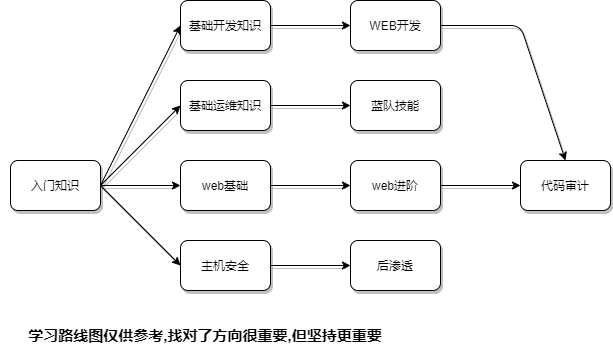

# roadmap

---

`文档偶尔更新,如果发现链接失效或内容错误,欢迎通过 issue 告诉我`

---

## 前言

安全知识点非常多也非常杂,要想掌握必须花费大量时间,如果仅仅看了文章、复制粘贴记个笔记、收藏了某个POC就认为自己会了,懂了,这种浅尝辄止到头来还是坑自己,一定要动手实践。

美团的这篇技术文章写的非常好 [工作中如何做好技术积累](https://tech.meituan.com/2018/04/16/study-vs-work.html) 下面这段是其中的一部分,分享给大家

---

古人云：“纸上得来终觉浅，绝知此事要躬行。” 学习领域有所谓721模型：个人的成长70%来自于岗位实践，20%来自向他人学习，10%来自于培训。虽然这种理论存在争议，但对于工程师们来说，按照实践、学习和培训的方式进行重要性排序，大致是不错的。所以重视实践，在实践中成长是最重要的学习原则。

人类的认知有两种：感性认知和理性认知。这两种认知互相不可替代性。实践很大程度来自于感性学习，看书更像是理性学习。以学开汽车做例子，很难想象什么人能够仅仅通过学习书本知识就会开汽车。

书本知识主要是传道——讲述抽象原型，而对其具体应用场景的讲述往往含糊其辞，对抽象原型之间的关系也是浅尝辄止。采用同样精确的语言去描述应用场景和关联关系将会失去重点，让人摸不着头脑。所以，仅仅通过看书来获得成长就像是用一条腿走路。

重视实践，充分运用感性认知潜能，在项目中磨炼自己，才是正确的学习之道。在实践中，在某些关键动作上刻意练习，也会取得事半功倍的效果。

---

下面我将以安全工程师的角度来构建一个基本的学习路线图,由于我个人偏 web+misc 所以不包含逆向内容,请见谅

如果您擅长 逆向、pwn、mobile安全 或其他安全相关技能 且提供了相关教程或博客、笔记等，欢迎提交 pr 一起构建 roadmap

## 入门知识

基本功很重要

- 虚拟机使用 - 学会安装、使用虚拟机,明白VMware几种网络连接的区别
    - 略

- 如何科学上网 - 懂得都懂
    - 略

- Markdown 语法 - 学会记笔记也很重要
    - 略

---

## 基础开发知识

- 字符编码 - 没啥好说的,基本功
    - 略

- git 及 github 的使用 - 多参与开源项目可以快速提高开发水平
    - [Git学习笔记](./1earn/Develop/版本控制/Git学习笔记.md)

- 数据类型的处理
    - xml
    - json

- 正则 - 了解正则语法
    - [regex](./1earn/Develop/正则/regex.md)

- python - 掌握语法,能够编写POC,能够按需求修改exp
    - 略

---

## WEB开发

- dotnet
    - 暂时还没学完 : )

- java
    - 暂时还没学完 : )

- php
    - 暂时还没学完 : )

---

## 基础运维知识

### Linux运维

- Linux 是啥
    - [发行版](./1earn/Integrated/Linux/笔记/发行版.md)
    - [进程](./1earn/Integrated/Linux/笔记/进程.md)

- Linux 基础命令
    - [Speed-Linux](./1earn/Integrated/Linux/Speed-Linux.md)

- Linux 服务搭建 - 起码要学会怎么搭建 httpd、nginx
    - [Power-Linux](./1earn/Integrated/Linux/Power-Linux.md)

- Docker 使用 - 必须要掌握的,可以节约你大量时间
    - [Speed-Docker](./1earn/Integrated/虚拟化/Docker/Speed-Docker.md)

### 网络知识

- TCP/IP 模型 - 需要明白什么是IP、MAC，各层的常见协议有哪些分别什么作用
    - 略

### Windows服务器

- Windows 下常用命令
    - [Speed-Win](./1earn/Integrated/Windows/Speed-Win.md)

- Windows 服务器能干啥
    - [Windows基础服务搭建](./1earn/Integrated/Windows/实验/Windows基础服务搭建.md)

---

## web基础

- HTTP 协议
    - 略

- html+js
    - 略

- web 基础漏洞
    - [Web_Generic](./1earn/Security/RedTeam/Web安全/Web_Generic/Web_Generic.md)

- web 逻辑漏洞
    - [IDOR](./1earn/Security/RedTeam/Web安全/IDOR.md)

- 靶场 - 如果有空闲时间可以打打靶场练习
    - [靶场](https://github.com/No-Github/1earn/tree/master/1earn/Security/RedTeam/Web%E5%AE%89%E5%85%A8/%E9%9D%B6%E5%9C%BA)

## web进阶

- 各类通用漏洞利用
    - [BS-Exploits](./1earn/Security/RedTeam/Web安全/BS-Exploits.md)

- OOB
    - [OOB](./1earn/Security/RedTeam/Web安全/Web_Tricks/OOB.md)

- JWT
    - [JWT安全](./1earn/Security/RedTeam/Web安全/Web_Tricks/JWT安全.md)

## 代码审计

- 暂时还没学完 : )

---

## 主机安全

### linux

- linux 权限、文件
    - [认证](./1earn/Integrated/Linux/笔记/认证.md)
    - [文件](./1earn/Integrated/Linux/笔记/文件.md)

- linux 提权、漏洞利用
    - [OS-Exploits](./1earn/Security/RedTeam/OS安全/OS-Exploits.md#linux)

- linux lol
    - [Linux安全](./1earn/Security/RedTeam/OS安全/Linux安全.md#lol)

### windows

- windows 认证体系
    - [认证](./1earn/Integrated/Windows/笔记/认证.md)

- windows 提权、漏洞利用
    - [OS-Exploits](./1earn/Security/RedTeam/OS安全/OS-Exploits.md#windows)

- windows lol
    - [Windows-LOL](./1earn/Security/RedTeam/OS安全/实验/Windows-LOL.md)

- windows rdp 利用
    - [Windows安全](./1earn/Security/RedTeam/OS安全/Windows安全.md#rdp)

- windows 凭证抓取
    - [Windows安全](./1earn/Security/RedTeam/OS安全/Windows安全.md#认证)

---

## 后渗透

### 权限提升

- linux 提权
    - [OS-Exploits](./1earn/Security/RedTeam/OS安全/OS-Exploits.md#linux)

- windows 提权
    - [OS-Exploits](./1earn/Security/RedTeam/OS安全/OS-Exploits.md#windows)

- 第三方软件提权
    - [权限提升](./1earn/Security/RedTeam/后渗透/权限提升.md)

### 权限维持

- 各种 webshell
    - [权限维持](./1earn/Security/RedTeam/后渗透/权限维持.md#web)

- windows 权限维持
    - [权限维持](./1earn/Security/RedTeam/后渗透/权限维持.md#win)

- linux 权限维持
    - [权限维持](./1earn/Security/RedTeam/后渗透/权限维持.md#linux)

- 各类 C2、免杀
    - [权限维持](./1earn/Security/RedTeam/后渗透/权限维持.md#c2-rat)

### windows 域

- 工作组、域是什么、如何搭建域环境
    - [工作组](./1earn/Integrated/Windows/笔记/工作组.md)
    - [域](./1earn/Integrated/Windows/笔记/域.md)
    - [Windows 域搭建](./1earn/Integrated/Windows/实验/Windows域搭建.md)

- Kerberos
    - [认证](./1earn/Integrated/Windows/笔记/认证.md#域认证)

- 域凭证抓取
    - [Windows安全](./1earn/Security/RedTeam/OS安全/Windows安全.md#域)

- 域控提权
    - [OS-Exploits](./1earn/Security/RedTeam/OS安全/OS-Exploits.md#域)

- pth/k/t
    - [PTH](./1earn/Security/RedTeam/OS安全/Windows安全.md#pth)
    - [PTT](./1earn/Security/RedTeam/OS安全/Windows安全.md#ptt)

- Exchange
    - [Exchange 搭建](./1earn/Integrated/Windows/实验/Exchange搭建.md)
    - [Exchange](./1earn/Security/RedTeam/后渗透/实验/Exchange.md)

---

## 蓝队技能

### 蓝队服务搭建

### 分析技术

- linux 日志、信息
    - [日志](./1earn/Integrated/Linux/笔记/日志.md)
    - [信息](./1earn/Integrated/Linux/笔记/信息.md)

- windows 日志、信息
    - [日志](./1earn/Integrated/Windows/笔记/日志.md)
    - [信息](./1earn/Integrated/Windows/笔记/信息.md)

- 恶意文件分析
    - [分析](./1earn/Security/BlueTeam/分析.md)

### 取证技术

- 文件取证
    - [取证](./1earn/Security/BlueTeam/取证.md#文件取证)

- 内存取证
    - [内存取证](./1earn/Security/BlueTeam/笔记/内存取证.md)

- 流量分析
    - [流量分析](./1earn/Security/BlueTeam/实验/流量分析.md)

- 应用程序、WEB、数据库取证
    - [取证](./1earn/Security/BlueTeam/取证.md#应用程序取证)
